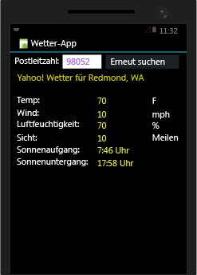
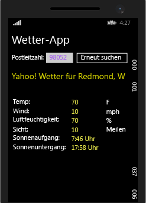

# Erstellen von Apps mit systemeigener Benutzeroberfl&#228;che &#252;ber Xamarin in Visual Studio
[!INCLUDE[vs2017banner](../code-quality/includes/vs2017banner.md)]

Nachdem Sie die Schritte in [Setup und Installation](../cross-platform/setup-and-install.md) und [Überprüfen Ihrer Xamarin\-Umgebung](../cross-platform/verify-your-xamarin-environment.md) ausgeführt haben, hilft Ihnen diese exemplarische Vorgehensweise beim Erstellen einer einfachen Xamarin\-App mit systemeigenen Benutzeroberflächenschichten unter Android und Windows Phone:  
  
   
  
 Zum Erstellen müssen Sie die folgenden Schritte ausführen:  
  
-   [Richten Sie zuerst eine Projektmappe ein.](#solution)  
  
-   [Ausführen beider Apps, um deren Funktionieren sicherzustellen](#run)  
  
-   [Schreiben von Code, der in beiden Apps verwendet werden kann](#shared)  
  
-   [Entwickeln für Android](#Android)  
  
-   [Entwickeln für Windows Phone](#Windows)  
  
-   [Nächste Schritte](#next)  
  
> [!NOTE]
>  Die Xamarin\-Entwicklerdokumentation bietet außerdem, wie nachstehend aufgelistet, eine Reihe von exemplarischen Vorgehensweisen mit Schnellstart\- und vertiefenden Abschnitten. Achten Sie für jede dieser Seiten darauf, dass „Visual Studio“ oben rechts auf der Seite ausgewählt ist, damit Visual Studio\-spezifische exemplarische Vorgehensweisen angezeigt werden.  
>   
>  -   Xamarin\-Apps mit systemeigener Benutzeroberfläche:  
>   
>      -   [Hello, Android](https://developer.xamarin.com/guides/android/getting_started/hello,android/) \(einfache App mit einem Bildschirm\)  
>     -   [Hello, Android multiscreen](https://developer.xamarin.com/guides/android/getting_started/hello,android_multiscreen/) \(App mit Navigation zwischen Bildschirmen\)  
>     -   [Android Fragments Walkthrough](http://developer.xamarin.com/guides/android/platform_features/fragments/fragments_walkthrough/) \(u. a. für die Demonstration von Haupt\-\/Detailbildschirmen verwendet\)  
>     -   [Hello, iOS](https://developer.xamarin.com/guides/ios/getting_started/hello,_iOS/)  
>     -   [Hello, iOS Multiscreen](https://developer.xamarin.com/guides/ios/getting_started/hello,_iOS_multiscreen/)  
> -   Xamarin\-Apps mit Xamarin.Forms \(gemeinsame Benutzeroberfläche\)  
>   
>      -   [Hello, Xamarin.Forms](https://developer.xamarin.com/guides/cross-platform/xamarin-forms/getting-started/hello-xamarin-forms/quickstart/)  
>     -   [Hello, Xamarin.Forms Multiscreen](https://developer.xamarin.com/guides/cross-platform/xamarin-forms/getting-started/hello-xamarin-forms-multiscreen/)  
  
##  <a name="solution"></a> Richten Sie zuerst eine Projektmappe ein.  
 Erstellen Sie ein Android\-, Windows Phone\- und ein freigegebenes Projekt. Nehmen Sie dann einige Anpassungen an der Projektmappe vor.  
  
#### Erstellen eines Android\-Projekts  
  
1.  Erstellen Sie in Visual Studio ein neues Projekt **Leere App \(Android\)** , und benennen Sie es **WeatherApp**.  
  
     Sie finden diese Vorlage unter **Visual C\#** \> **Android** im Dialogfeld **Neues Projekt**.  
  
     Wenn Sie sie dort nicht finden, müssen Sie möglicherweise Xamarin installieren oder das Visual Studio 2015\-Feature aktivieren, wie unter [Setup und Installation](../cross-platform/setup-and-install.md) beschrieben.  
  
2.  Benennen Sie das Projekt in **WeatherApp \(Android\)** um.  
  
#### Hinzufügen eines Windows Phone\-Projekts  
  
1.  Fügen Sie der Projektmappe ein Projekt auf Basis der Vorlage **Leere App \(Windows Phone\)** hinzu, und nennen Sie es **WeatherAppWindows**.  
  
     Diese Vorlage finden Sie unter **Visual C\#** \> **Windows** \> **Windows 8** \> **Windows Phone** im Dialogfeld **Neues Projekt**.  
  
     Wenn sie dort nicht vorhanden ist, müssen Sie möglicherweise die Tools für das Entwickeln von Windows 8.1\-Apps installieren. Sie können dies vornehmen, indem Sie **Programme und Features** öffnen und Ihre Visual Studio\-Einrichtung ändern.  
  
#### Erstellen eines freigegebenen Projekts  
  
1.  Fügen Sie der Projektmappe ein **Freigegebenes Projekt** hinzu, und nennen Sie es **Shared**.  
  
     Sie finden diese Vorlage unter **Visual C\#** \> **Windows** im Dialogfeld **Neues Projekt**.  
  
2.  Öffnen Sie das Kontextmenü für das Projekt **WeatherApp \(Android\)**, und wählen Sie dann **Hinzufügen** \> **Verweis** aus.  
  
3.  Wählen Sie im angezeigten Dialogfeld das Projekt **Shared** aus, und wählen Sie dann die Schaltfläche **OK**.  
  
       
  
4.  Wiederholen Sie diesen Vorgang für das Windows Phone\-Projekt.  
  
#### Vornehmen einiger kleiner Anpassungen an der Projektmappe  
  
1.  Wählen Sie **Extras** \> **NuGet\-Paket\-Manager** \> **NuGet\-Pakete für Projektmappe verwalten** aus, und fügen Sie Ihrer Projektmappe das **Newtonsoft.Json**\-NuGet\-Paket hinzu.  
  
       
  
     In diesem Paket verwenden Sie Klassen, um Informationen zu verarbeiten, die aus einem Wetterdienst gewonnen werden.  
  
2.  Öffnen Sie das Kontextmenü für das Projekt **WeatherApp \(Android\)**, und wählen Sie dann **Hinzufügen** \> **Verweis** aus.  
  
3.  Fügen Sie im Dialogfeld **Verweis\-Manager** eine Referenz zur **Microsoft.CSharp**\-Assembly hinzu.  
  
##  <a name="run"></a> Ausführen beider Apps, um deren Funktionieren sicherzustellen  
 Sie haben die Projektmappe konfiguriert. Jetzt können Sie die Apps ausführen, um zu testen, ob sie funktionieren.  
  
### Ausführen der Android\-App  
  
1.  Wählen Sie in Visual Studio den Befehl **Debuggen** \> **Debugging starten** aus.  
  
     Der Visual Studio\-Emulator für Android wird gestartet.  
  
    > [!TIP]
    >  Als Alternative zum Visual Studio Emulator für Android können Sie auch versuchen, den [Xamarin Android Player](http://xamarin.com/android-player) zu verwenden.  
  
     Die App wird im Android\-Emulator angezeigt. Die App zeigt eine Schaltfläche mit dem Text **Hello World, Click Me\!** an. Das bedeutet, die App funktioniert.  
  
2.  Beenden Sie den Debugger.  
  
### Ausführen der Windows Phone\-App  
  
1.  Öffnen Sie das Kontextmenü für das Projekt **WeatherAppWindows \(Windows Phone 8.1\)**, und wählen Sie dann **Als Startprojekt festlegen** aus.  
  
2.  Wählen Sie in der Symbolleiste **Standard** eine der Emulatoroptionen aus.  
  
       
  
3.  Drücken Sie die Taste "F5" auf der Tastatur, um die App im Windows Phone\-Emulator auszuführen.  
  
     Ihre App wird im Emulator ausgeführt, es werden jedoch keine Steuerelemente angezeigt, da die Vorlage **Leere App \(Windows Phone\)** standardmäßig über keine Benutzeroberfläche verfügt.  
  
4.  Beenden Sie den Debugger.  
  
##  <a name="shared"></a> Schreiben von Code, der in beiden Apps verwendet werden kann  
 Fügen Sie zum Projekt **Shared** Code hinzu, der für beide Apps verwendet werden soll.  Ein freigegebenes Projekt ist im Prinzip ein Container für Code, der auf beiden Plattformen ausgeführt wird. Alles, was Sie diesem Projekt hinzufügen, wird automatisch in das Android\- und das Windows Phone\-Projekt integriert.  
  
1.  Fügen Sie zum Projekt **Shared** eine Klasse hinzu, und nennen Sie diese **Weather**.  
  
     Klicken Sie im Kontextmenü für das Projekt **Shared** auf **Hinzufügen** \> **Neues Element**. Wählen Sie anschließend im Dialogfeld **Neues Element hinzufügen** das Element **Class** aus, und nennen Sie es **Weather**.  
  
2.  Öffnen Sie die Datei **Weather.cs**, und ersetzen Sie die Klassendeklaration durch den folgenden Code:  
  
    ```c#  
    public class Weather  
    {  
        public string Title { get; set; }  
        public string Temperature { get; set; }  
        public string Wind { get; set; }  
        public string Humidity { get; set; }  
        public string Visibility { get; set; }  
        public string Sunrise { get; set; }  
        public string Sunset { get; set; }  
  
    }  
    ```  
  
     Sie nutzen diese Klasse später, um Daten aus einem Wetterdienst zu speichern.  
  
3.  Fügen Sie zum Projekt **Shared** eine weitere Klasse hinzu, und nennen Sie die Datei **DataService**.  
  
4.  Öffnen Sie die Datei **DataService.cs**, und fügen Sie oben folgende Anweisungen hinzu:  
  
    ```c#  
    using System.Threading.Tasks;  
    using System.Net;  
    using System.IO;  
    using Newtonsoft.Json;  
    ```  
  
5.  Ersetzen Sie die Klassendeklaration durch den folgenden Code:  
  
    ```c#  
    public class DataService  
    {  
        public static async Task<dynamic> getDataFromService(string queryString)  
        {  
            HttpWebRequest request = (HttpWebRequest)WebRequest.Create(queryString);  
  
            var response = await request.GetResponseAsync().ConfigureAwait(false);  
            var stream = response.GetResponseStream();  
  
            var streamReader = new StreamReader(stream);  
            string responseText = streamReader.ReadToEnd();  
  
            dynamic data = JsonConvert.DeserializeObject(responseText);  
  
            return data;  
         }  
    }  
    ```  
  
     Dieser Code ist ein Möglichkeit, JSON\-Daten aus einem Dienst zu verarbeiten.  
  
6.  Fügen Sie zum Projekt **Shared** eine weitere Klasse hinzu, und nennen Sie diese **Core**.  
  
     Der Name **Core** ist willkürlich. Diese Klasse dient nur als Ort, an dem freigegebene Geschäftslogik abgelegt wird. In diesem Fall ruft eine Logik, die unter Verwendung einer Postleitzahl eine Abfragezeichenfolge erstellt, den Wetterdienst auf und füllt dann eine Instanz der Klasse **Weather** auf.  
  
7.  Öffnen Sie **Core.cs**, und fügen Sie oben die folgende Anweisung hinzu:  
  
    ```c#  
    using System.Threading.Tasks;  
    ```  
  
8.  Ersetzen Sie die Klassendeklaration durch den folgenden Code:  
  
    ```c#  
    public class Core  
    {  
        public static async Task<Weather> GetWeather(string zipCode)  
        {  
            string queryString =   
                "https://query.yahooapis.com/v1/public/yql?q=select+*+from+weather.forecast+where+location=" +  
                 zipCode + "&format=json";  
  
            dynamic results = await DataService.getDataFromService(queryString).ConfigureAwait(false);  
  
            dynamic weatherOverview = results["query"]["results"]["channel"];  
  
            if ((string)weatherOverview["description"] != "Yahoo! Weather Error")  
            {  
                Weather weather = new Weather();  
  
                weather.Title = (string)weatherOverview["description"];  
  
                dynamic wind = weatherOverview["wind"];  
                weather.Temperature = (string)wind["chill"];  
                weather.Wind = (string)wind["speed"];  
  
                dynamic atmosphere = weatherOverview["atmosphere"];  
                weather.Humidity = (string)atmosphere["humidity"];  
                weather.Visibility = (string)atmosphere["visibility"];  
  
                dynamic astronomy = weatherOverview["astronomy"];  
                weather.Sunrise = (string)astronomy["sunrise"];  
                weather.Sunset = (string)astronomy["sunset"];  
  
                return weather;  
            }  
            else  
            {  
                return null;  
            }  
        }  
    }  
    ```  
  
##  <a name="Android"></a> Entwickeln für Android  
 Wir entwickeln nun die Benutzeroberfläche, verbinden diese mit dem freigegebenen Code und führen dann die App aus.  
  
### Entwickeln des Erscheinungsbilds und Verhaltens der App  
  
1.  Erweitern Sie im **Projektmappen\-Explorer** den Ordner **WeatherApp \(Android\)** \> **Ressourcen** \> **Layout**, wählen Sie die Datei **Main.axml** aus, und drücken Sie dann die EINGABETASTE.  
  
     **Main.axml** wird im visuellen Designer geöffnet. Wenn ein Java\-bezogener Fehler angezeigt wird, lesen Sie diesen [Blogbeitrag](http://forums.xamarin.com/discussion/32365/connection-to-the-layout-renderer-failed-in-xs-5-7-and-xamarinvs-3-9).  
  
    > [!TIP]
    >  Es sind viele weitere Dateien in diesem Projekt vorhanden. Sie alle zu besprechen, würde den Rahmen dieses Themas sprengen. Wenn Sie jedoch mehr über die Struktur eines Android\-Projekts erfahren möchten, finden Sie Informationen unter [Part 2 Deep Dive \(Detailinformationen, Teil 2, in englischer Sprache\)](http://developer.xamarin.com/guides/android/getting_started/hello,android/hello,android_deepdive/).  
  
2.  Löschen Sie die Standardschaltfläche, die im Designer angezeigt wird.  
  
3.  Ziehen Sie aus dem **Werkzeugkasten** ein **RelativeLayout**\-Steuerelement in den Designer.  
  
     Sie können dieses Steuerelement als übergeordneten Container für andere Steuerelemente verwenden.  
  
4.  Ziehen Sie aus dem **Werkzeugkasten** ein **TextView**\-Steuerelement auf das **RelativeLayout**\-Steuerelement.  
  
5.  Legen Sie im **Eigenschaftsfenster** diese Eigenschaften fest:  
  
    |Eigenschaft|Wert|  
    |-----------------|----------|  
    |**Text**|**Zip Code:**|  
    |**ID**|**@\+id\/ZipCodeLabel**|  
    |**layout\_centerVertical**|**true**|  
    |**layout\_marginLeft**|**10dp**|  
    |**textSize**|**20sp**|  
  
    > [!TIP]
    >  Beachten Sie, dass viele Eigenschaften nicht über eine Dropdownliste mit Werten verfügen, die Sie auswählen können.  Es kann schwierig sein, zu raten, welcher Zeichenfolgenwert für eine bestimmte Eigenschaft verwendet werden soll. Vorschläge können Sie möglicherweise erhalten, indem Sie auf der Seite der Klasse [R.attr](http://developer.android.com/reference/android/R.attr.html) nach dem Namen einer Eigenschaft suchen.  
    >   
    >  Eine schnelle Websuche führt Sie außerdem meist zu einer Seite auf [http:\/\/stackoverflow.com\/](http://stackoverflow.com/), wo Sie sich mit anderen austauschen können, die bereits die gleiche Eigenschaft verwendet haben.  
  
6.  Ziehen Sie aus dem **Werkzeugkasten** ein **Number**\-Steuerelement auf **RelativeLayout**, und positionieren Sie es neben der Beschriftung **Zip Code**.  
  
       
  
7.  Legen Sie im **Eigenschaftsfenster** diese Eigenschaften fest:  
  
    |Eigenschaft|Wert|  
    |-----------------|----------|  
    |**ID**|**@\+id\/ZipCodeEdit**|  
    |**layout\_centerVertical**|**true**|  
    |**layout\_marginLeft**|**10dp**|  
    |**textSize**|**20sp**|  
    |**layout\_width**|**100sp**|  
    |**textColor**|**\#9933FF**|  
  
8.  Wählen Sie die Schaltfläche neben der Eigenschaft **Hintergrund** aus.  
  
9. Wählen Sie auf der Registerkarte **Framework\-Ressourcen** die **background\_light**\-Farbe aus, und wählen Sie dann die Schaltfläche **OK**.  
  
10. Ziehen Sie aus dem **Werkzeugkasten** eine **Schaltfläche** auf das **RelativeLayout**\-Steuerelement, und positionieren Sie es neben dem Bearbeitungsfeld für die Postleitzahl.  
  
11. Legen Sie im **Eigenschaftsfenster** diese Eigenschaften fest:  
  
    |Eigenschaft|Wert|  
    |-----------------|----------|  
    |**ID**|**@\+id\/GetWeatherButton**|  
    |**Text**|**Get Weather**|  
    |**layout\_marginLeft**|**10dp**|  
    |**textSize**|**20sp**|  
  
12. Wählen Sie das Bearbeitungsfeld für die Postleitzahl aus.  Passen Sie die Größe so an, dass sie der Höhe der Schaltfläche **Get Weather** entspricht, indem Sie den kleinen Kreis auswählen und ziehen, der unterhalb des Bearbeitungsfelds für die Postleitzahl angezeigt wird.  
  
       
  
     Sie verfügen jetzt über ausreichend Erfahrung, um eine einfache Benutzeroberfläche mit dem Android\-Designer zu erstellen. Sie können allerdings auch eine Benutzeroberfläche erstellen, indem Sie Tags direkt der .asxml\-Datei auf der Seite hinzufügen. Erstellen Sie die übrigen Teile der Benutzeroberfläche auf diese Weise.  
  
13. Wählen Sie am unteren Rand des Designers die Registerkarte **Quelle** aus.  
  
       
  
14. Fügen Sie in der Ansicht **Quelle** das folgende Markup unterhalb des `</RelativeLayout>`\-Tags ein.  
  
    ```xml  
    <TextView  
        android:text="Current Weather"  
        android:textAppearance="?android:attr/textAppearanceLarge"  
        android:layout_width="match_parent"  
        android:layout_height="wrap_content"  
        android:id="@+id/ResultsTitle"  
        android:textColor="#FFFF4D"  
        android:visibility="visible"  
        android:layout_marginLeft="25px" />  
    <TableLayout  
        android:minWidth="25px"  
        android:minHeight="25px"  
        android:layout_width="match_parent"  
        android:layout_height="wrap_content"  
        android:id="@+id/ResultsTable"  
        android:padding="10dp"  
        android:visibility="visible">  
        <TableRow  
            android:id="@+id/tableRow1">  
            <TextView  
                android:text="Temp:"  
                android:textAppearance="?android:attr/textAppearanceMedium"  
                android:layout_column="0"  
                android:id="@+id/textView21" />  
            <TextView  
                android:textAppearance="?android:attr/textAppearanceMedium"  
                android:layout_column="1"  
                android:id="@+id/TempText"  
                android:text="70"  
                android:textColor="#FFFF4D"  
                android:layout_height="wrap_content" />  
            <TextView  
                android:text="F"  
                android:textAppearance="?android:attr/textAppearanceMedium"  
                android:layout_column="2"  
                android:id="@+id/textView26" />  
        </TableRow>  
        <TableRow  
            android:id="@+id/tableRow2">  
            <TextView  
                android:text="Wind:"  
                android:textAppearance="?android:attr/textAppearanceMedium"  
                android:layout_column="0"  
                android:id="@+id/textView22" />  
            <TextView  
                android:textAppearance="?android:attr/textAppearanceMedium"  
                android:layout_column="1"  
                android:id="@+id/WindText"  
                android:text="10"  
                android:textColor="#FFFF4D" />  
            <TextView  
                android:text="mph"  
                android:textAppearance="?android:attr/textAppearanceMedium"  
                android:layout_column="2"  
                android:id="@+id/textView27"  
                android:layout_height="wrap_content" />  
        </TableRow>  
        <TableRow  
            android:id="@+id/tableRow3">  
            <TextView  
                android:text="Humidity:"  
                android:textAppearance="?android:attr/textAppearanceMedium"  
                android:layout_column="0"  
                android:id="@+id/textView23"  
                android:layout_width="107.0dp" />  
            <TextView  
                android:textAppearance="?android:attr/textAppearanceMedium"  
                android:layout_column="1"  
                android:id="@+id/HumidityText"  
                android:text="70"  
                android:textColor="#FFFF4D"  
                android:layout_height="wrap_content" />  
            <TextView  
                android:text="%"  
                android:textAppearance="?android:attr/textAppearanceMedium"  
                android:layout_column="2"  
                android:id="@+id/textView28" />  
        </TableRow>  
        <TableRow  
            android:id="@+id/tableRow4">  
            <TextView  
                android:text="Visibility:"  
                android:textAppearance="?android:attr/textAppearanceMedium"  
                android:layout_column="0"  
                android:id="@+id/textView34" />  
            <TextView  
                android:textAppearance="?android:attr/textAppearanceMedium"  
                android:layout_column="1"  
                android:id="@+id/VisibilityText"  
                android:text="10"  
                android:textColor="#FFFF4D"  
                android:layout_height="wrap_content" />  
            <TextView  
                android:text="miles"  
                android:textAppearance="?android:attr/textAppearanceMedium"  
                android:layout_column="2"  
                android:id="@+id/textView50" />  
        </TableRow>  
        <TableRow  
            android:id="@+id/tableRow5">  
            <TextView  
                android:text="Sunrise:"  
                android:textAppearance="?android:attr/textAppearanceMedium"  
                android:layout_column="0"  
                android:id="@+id/textView40" />  
            <TextView  
                android:textAppearance="?android:attr/textAppearanceMedium"  
                android:layout_column="1"  
                android:id="@+id/SunriseText"  
                android:text="7:46 am"  
                android:textColor="#FFFF4D" />  
        </TableRow>  
        <TableRow  
            android:id="@+id/tableRow6">  
            <TextView  
                android:text="Sunset:"  
                android:textAppearance="?android:attr/textAppearanceMedium"  
                android:layout_column="0"  
                android:id="@+id/textView46" />  
            <TextView  
                android:textAppearance="?android:attr/textAppearanceMedium"  
                android:layout_column="1"  
                android:id="@+id/SunsetText"  
                android:text="5:58 PM"  
                android:textColor="#FFFF4D" />  
        </TableRow>  
    </TableLayout>  
  
    ```  
  
15. Öffnen Sie erneut die Ansicht **Entwurf**.  
  
     Die Benutzeroberfläche sollte folgendermaßen aussehen:  
  
       
  
16. Erstellen Sie die Projektmappe.  
  
     Dadurch werden der Datei **Resource.Designer.cs** Steuerelement\-IDs hinzugefügt, sodass Sie im Code mit Namen auf die Steuerelemente verweisen können.  
  
### Verwenden des freigegebenen Codes  
  
1.  Öffnen Sie die Datei **MainActivity.cs** des Projekts **WeatherApp** im Code\-Editor.  
  
2.  Fügen Sie am Anfang der Datei die folgende Anweisung hinzu.  
  
    ```c#  
  
    using Shared;  
    ```  
  
3.  Ersetzen Sie die `OnCreate`\-Methode durch diesen Code.  
  
    ```c#  
    protected override void OnCreate(Bundle bundle)  
    {  
        base.OnCreate(bundle);  
  
        SetContentView(Resource.Layout.Main);  
  
        Button button = FindViewById<Button>(Resource.Id.GetWeatherButton);  
  
        button.Click += delegate  
        {  
            EditText ZipCodeEditText = FindViewById<EditText>(Resource.Id.ZipCodeEdit);  
  
            Weather weather = Core.GetWeather(ZipCodeEditText.Text).Result;  
  
            if (weather != null)  
            {  
                FindViewById<TextView>(Resource.Id.ResultsTitle).Text = weather.Title;  
                FindViewById<TextView>(Resource.Id.TempText).Text = weather.Temperature;  
                FindViewById<TextView>(Resource.Id.WindText).Text = weather.Wind;  
                FindViewById<TextView>(Resource.Id.VisibilityText).Text = weather.Visibility;  
                FindViewById<TextView>(Resource.Id.HumidityText).Text = weather.Humidity;  
                FindViewById<TextView>(Resource.Id.SunriseText).Text = weather.Sunrise;  
                FindViewById<TextView>(Resource.Id.SunsetText).Text = weather.Sunset;  
  
                button.Text = "Search Again";  
            }  
            else  
            {  
                FindViewById<TextView>(Resource.Id.ResultsTitle).Text = "Couldn't find any results";  
            }  
  
        };  
    }  
    ```  
  
     Dieser Code ruft die `GetWeather`\-Methode auf, die Sie im freigegebenen Code definiert haben. Dann werden auf der Benutzeroberfläche der App die Daten angezeigt, die durch diese Methode abgerufen werden.  
  
### Ausführen der App und Prüfen der Anzeige  
  
1.  Legen Sie im **Projektmappen\-Explorer** das Projekt **WeatherApp** als Startprojekt fest.  
  
2.  Starten Sie die App durch Drücken der Taste "F5".  
  
3.  Geben Sie im Android\-Emulator eine gültige Postleitzahl für die USA in das Bearbeitungsfeld ein \(zum Beispiel: 98052\), und drücken Sie dann die Schaltfläche **Get Weather**.  
  
     In den Steuerelementen werden Wetterdaten für diese Region angezeigt.  
  
       
  
##  <a name="Windows"></a> Entwickeln für Windows Phone  
 Wir entwickeln nun die Benutzeroberfläche, verbinden diese mit dem freigegebenen Code und führen dann die App aus.  
  
### Entwickeln des Erscheinungsbilds und Verhaltens der App  
  
1.  Wählen Sie im **Projektmappen\-Explorer** die Datei **MainPage.xaml** aus dem Projekt **WeatherAppWindows \(WinPhone\)** aus, und drücken Sie die EINGABETASTE.  
  
     Die Datei "MainPage.xaml" wird im Designer geöffnet.  
  
2.  Ziehen Sie aus dem **Werkzeugkasten** einen **TextBlock** in den Designer, und positionieren Sie dieses Objekt nahe des oberen Bereichs der Seite.  
  
3.  Erweitern Sie im **Eigenschaftsfenster** den Abschnitt **Allgemein** der Eigenschaften, und legen Sie für die Eigenschaft **Text** den Wert **Weather App** fest.  
  
       
  
4.  Erweitern Sie den Abschnitt **Text**, und legen Sie für die Schriftgröße **30 pt.** fest.  
  
5.  Ziehen Sie aus dem **Werkzeugkasten** einen **TextBlock** in den Designer, und positionieren Sie dieses Objekt unter dem Titel **Weather App**.  
  
6.  Legen Sie für die Eigenschaft **Text** den Wert **Zip Code** und für die Schriftgröße **15 pt** fest.  
  
7.  Ziehen Sie aus dem **Werkzeugkasten** einen **TextBlock** in den Designer, und positionieren Sie dieses Objekt neben der Beschriftung **Zip Code**.  
  
8.  Legen Sie für die Eigenschaft **Name** den Wert **ZipCodeEdit** fest.  
  
9. Löschen Sie die **Text**\-Eigenschaft, sodass im Textfeld kein Text angezeigt wird.  
  
10. Ziehen Sie im Designer am Rand des Textfelds, um es zu vergrößern.  
  
     Es muss groß genug sein, um fünf Zahlen anzeigen zu können.  
  
11. Erweitern Sie im **Eigenschaftsfenster** den Abschnitt **Pinsel**, und wählen Sie dann die **Vordergrund**\-Eigenschaft. Wählen Sie eine außergewöhnliche Farbe, zum Beispiel Lila.  
  
       
  
     Wenn Benutzer eine Postleitzahl eingeben, wird der Text in dieser Farbe angezeigt.  
  
12. Ziehen Sie aus dem **Werkzeugkasten** eine Schaltfläche in den Designer, und positionieren Sie dieses Objekt neben dem Textfeld.  
  
13. Erweitern Sie im **Eigenschaftsfenster** den Abschnitt **Allgemein**, und legen Sie für die Eigenschaft **Inhalt** den Wert **Get Weather** fest.  
  
14. Legen Sie für die **Name**\-Eigenschaft den Wert **GetWeatherButton** fest.  
  
       
  
15. Sie verfügen jetzt über ausreichend Erfahrung, um eine einfache Benutzeroberfläche mit dem Windows\-Designer zu erstellen. Sie können allerdings auch eine Benutzeroberfläche erstellen, indem Sie Tags direkt der xaml\-Datei auf der Seite hinzufügen. Erstellen Sie den Rest der Benutzeroberfläche auf diese Weise.  
  
16. Fügen Sie in der XAML\-Ansicht das folgende Markup unterhalb der Schaltfläche ein.  
  
    ```xaml  
  
    <TextBlock x:Name="ResultsTitle" HorizontalAlignment="Left" Margin="13,130,0,0" TextWrapping="Wrap" Text="Current Weather" VerticalAlignment="Top" FontSize="25" Foreground="#FFFBF400"/>  
    <StackPanel x:Name="ResultsStackPanel" HorizontalAlignment="Left" Height="198" Margin="13,223,0,0" VerticalAlignment="Top" Width="335" Orientation="Horizontal">  
        <StackPanel Width="100">  
            <TextBlock TextWrapping="Wrap" Text="Temp:" FontSize="20" Padding="0,0,0,5"/>  
            <TextBlock TextWrapping="Wrap" Text="Wind:" FontSize="20" Padding="0,0,0,5"/>  
            <TextBlock TextWrapping="Wrap" Text="Humidity:" FontSize="20" Padding="0,0,0,5"/>  
            <TextBlock TextWrapping="Wrap" Text="Visibility:" FontSize="20" Padding="0,0,0,5"/>  
            <TextBlock TextWrapping="Wrap" Text="Sunrise:" FontSize="20" Padding="0,0,0,5"/>  
             <TextBlock TextWrapping="Wrap" Text="Sunset:" FontSize="20" Padding="0,0,0,5"/>  
        </StackPanel>  
        <StackPanel Width="100">  
            <TextBlock x:Name="TempText" TextWrapping="Wrap" Text="70" FontSize="20" Margin="0,0,-17,5" HorizontalAlignment="Right" Width="117" Foreground="#FFF2FF00"/>  
            <TextBlock x:Name="WindText" TextWrapping="Wrap" Text="10" FontSize="20" Margin="0,0,-17,5" Foreground="#FFEEFB00"/>  
            <TextBlock x:Name="HumidityText" TextWrapping="Wrap" Text="70" FontSize="20" Margin="0,0,-17,5" Foreground="#FFF0FD00"/>  
            <TextBlock x:Name="VisibilityText" TextWrapping="Wrap" Text="10" FontSize="20" Margin="0,0,-17,5" Foreground="#FFE8F400"/>  
            <TextBlock x:Name="SunriseText" TextWrapping="Wrap" Text="7:46 AM" FontSize="20" Margin="0,0,-17,5" Foreground="#FFF0FD00"/>  
            <TextBlock x:Name="SunsetText" TextWrapping="Wrap" Text="5:58 PM" FontSize="20" Margin="0,0,-17,5" Foreground="#FFEDF900"/>  
        </StackPanel>  
        <StackPanel Width="100">  
            <TextBlock TextWrapping="Wrap" Text="F" FontSize="20" Padding="0,0,0,5"/>  
            <TextBlock TextWrapping="Wrap" Text="mph" FontSize="20" Padding="0,0,0,5"/>  
            <TextBlock TextWrapping="Wrap" Text="%" FontSize="20" Padding="0,0,0,5"/>  
            <TextBlock TextWrapping="Wrap" Text="miles" FontSize="20" Padding="0,0,0,5"/>  
        </StackPanel>  
    </StackPanel>  
    ```  
  
     Die Benutzeroberfläche sollte in der Entwurfsansicht folgendermaßen aussehen:  
  
       
  
### Verwenden des freigegebenen Codes  
  
1.  Wählen Sie im Designer die Schaltfläche **Get Weather**.  
  
2.  Wählen Sie im **Eigenschaftsfenster** die Ereignishandler\-Schaltfläche \(\).  
  
     Dieses Symbol wird in der oberen Ecke des **Eigenschaftsfensters** angezeigt.  
  
3.  Geben Sie neben dem **Click**\-Ereignis **GetWeatherButton\_Click** ein, und drücken Sie dann die Eingabetaste.  
  
     Dadurch wird ein Ereignishandler mit dem Namen `GetWeatherButton_Click` erstellt. Der Code\-Editor öffnet sich, und der Mauszeiger wird innerhalb des Codeblocks des Ereignishandlers platziert.  
  
4.  Ersetzen Sie diesen Ereignishandler durch den folgenden Code.  
  
    ```c#  
    private void GetWeatherButton_Click(object sender, RoutedEventArgs e)  
    {  
        Weather weather = Core.GetWeather(ZipCodeEdit.Text).Result;  
        if (weather != null)  
        {  
            ResultsTitle.Text = weather.Title;  
            TempText.Text = weather.Temperature;  
            WindText.Text = weather.Wind;  
            VisibilityText.Text = weather.Visibility;  
            HumidityText.Text = weather.Humidity;  
            SunriseText.Text = weather.Sunrise;  
            SunsetText.Text = weather.Sunset;  
  
            GetWeatherButton.Content = "Search Again";  
  
            }  
            else  
            {  
                ResultsTitle.Text = "Couldn't find any results";  
            }  
        }  
    }  
    ```  
  
     Dieser Code ruft die `GetWeather`\-Methode auf, die Sie im freigegebenen Code definiert haben. Es handelt sich um die gleiche Methode, die Sie in der Android\-App aufgerufen haben. Dieser Code zeigt ebenfalls Daten, die mit dieser Methode aus den Steuerelementen der Benutzeroberfläche der App gewonnen wurden.  
  
5.  Fügen Sie am Anfang der Datei die folgende Anweisung hinzu.  
  
    ```c#  
  
    using Shared;  
    ```  
  
### Ausführen der App und Prüfen der Anzeige  
  
1.  Legen Sie im **Projektmappen\-Explorer** das Projekt **WeatherAppWindows \(WinPhone\)** als Startprojekt fest.  
  
2.  Starten Sie die App durch Drücken der Taste "F5".  
  
3.  Geben Sie im Windows Phone\-Emulator eine gültige Postleitzahl für die USA in das Bearbeitungsfeld ein \(zum Beispiel: 98052\), und drücken Sie dann die Schaltfläche **Get Weather**.  
  
     In den Steuerelementen werden Wetterdaten für diese Region angezeigt.  
  
       
  
##  <a name="next"></a> Nächste Schritte  
 Herzlichen Glückwunsch, Sie haben Ihre erste plattformübergreifende mobile App erstellt. Dieses Thema ist der Einstieg. Es gibt noch viel mehr zu erfahren.  
  
 Im Folgenden finden Sie einige Ideen zur Erstellung ansprechender systemeigener mobiler Apps mit C\# und Visual Studio.  
  
 **Fügen Sie ein iOS\-Projekt zur Projektmappe hinzu.**  
  
 Erweitern Sie dieses Beispiel, indem Sie ein Projekt für iOS hinzufügen. Um diese App zu erstellen und auszuführen, müssen Sie über Ihr lokales Netzwerk eine Verbindung zu einem Mac herstellen, auf dem Xcode und Xamarin installiert sind.  
  
 Weitere Informationen finden Sie unter [Hello, iOS](http://developer.xamarin.com/guides/ios/getting_started/hello,_iOS/hello,iOS_quickstart/) \(xamarin.com\). Hinweis: Achten Sie darauf, dass „Visual Studio“ in der oberen rechten Ecke von jeder Seite auf xamarin.com ausgewählt ist, damit der richtige Satz von Anweisungen angezeigt wird.  
  
 **Fügen Sie dem gemeinsamen Projekt plattformspezifischen Code hinzu.**  
  
 Nicht der gesamte freigegebene Code muss auf beiden Plattformen ausgeführt werden. Nutzen Sie Konstanten für die bedingte Kompilierung, um plattformspezifischen Code zu isolieren. Sie können die Anzahl der Konstanten in einer Datei verringern, indem Sie partielle Klassen erstellen. Verlagern Sie plattformspezifischen Code in eine separate Datei, und wenden Sie dann eine Kompilierungskonstante auf diese Datei an.  
  
 Weitere Informationen finden Sie unter [Erstellen universeller Windows\-Apps für die Zielplattformen Windows und Windows Phone](http://msdn.microsoft.com/library/windows/apps/xaml/dn609832.aspx) \(MSDN\). Blättern Sie auf der Seite ganz nach unten. Dort finden Sie ein Beispiel zur Anwendung von Konstanten.  
  
 **Erwägen Sie andere Verfahren zur gemeinsamen Verwendung von Code**  
  
 Sie können Code auch mit einer portablen Klassenbibliothek freigeben. Lernen Sie die Unterschiede zwischen einer portablen Klassenbibliothek und einem freigegebenen Projekt kennen, und wählen Sie einen Ansatz, der am besten zu Ihrem Projekt passt.  
  
 Weitere Optionen finden Sie unter [Code Sharing Options](http://developer.xamarin.com/guides/cross-platform/application_fundamentals/building_cross_platform_applications/sharing_code_options/) \(xamarin.com\).  
  
 **Entwickeln Sie eine Benutzeroberfläche, die auf allen Plattformen ausgeführt werden kann.**  
  
 Wenn Sie für die Benutzeroberfläche allgemeine Muster wie Listen und Detailansichten verwenden, können Sie zur Implementierung Xamarin.Forms verwenden. Xamarin.Forms nutzt XAML. So können Sie deklarativ Eigenschaften und Methoden an die Benutzeroberfläche binden. Dies kann große Vorteile bringen, wenn es Ihr Ziel ist, die Codemenge in der Benutzeroberflächenebene zu verringern.  
  
 Siehe dazu [Xamarin.Forms](http://developer.xamarin.com/guides/cross-platform/xamarin-forms/) \(xamarin.com\).  
  
## Siehe auch  
 [Xamarin\-Entwicklerwebsite](http://developer.xamarin.com/)   
 [Windows Dev Center](https://dev.windows.com/en-us)   
 [Schnellreferenzposter zu Swift und C\#](http://aka.ms/scposter)