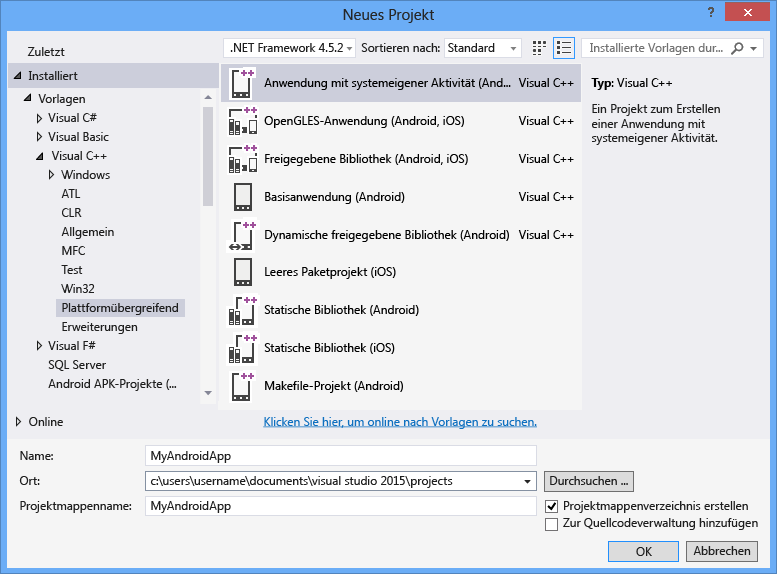

# Erstellen einer Android Native Activity-App

Nach Installation der Workload **Plattformübergreifende mobile Entwicklung mit C++** kann Visual Studio verwendet werden, um voll funktionsfähige Android-Apps mit nativer Aktivität zu erstellen. Das Android Native Development Kit (NDK) ist ein Toolset, mit dem Sie die überwiegende Anzahl von Android-Apps mit reinem C/C++-Code implementieren können. Mancher Java-JNI-Code fungiert als Verbindungscode, der dem C/C++-Code die Interaktion mit Android ermöglicht. Mit dem Android NDK wurde die Fähigkeit zum Erstellen von Native Activity-Apps mit Android-API Level 9 eingeführt. Native Activity-Code wird häufig zum Erstellen von Spielen und grafikintensiven Apps verwendet, die auf Unreal Engine oder OpenGL basieren. Dieses Thema führt Sie durch Erstellung einer einfachen Native Activity-App, die OpenGL verwendet. Zusätzliche Themen führen Sie durch den Entwicklerlebenszyklus bestehend aus dem Bearbeiten, Erstellen, Debuggen und Bereitstellen von Native Activity-Code.

## Requirements (Anforderungen)

Vor der Erstellung einer Android-Anwendung mit nativer Aktivität müssen Sie sicherstellen, dass Sie alle Systemvoraussetzungen erfüllen und die Workload **Mobile Entwicklung mit C++** in Visual Studio installiert haben. Weitere Informationen finden Sie unter [Installieren der plattformübergreifenden mobilen Entwicklung mit C++](../cross-platform/install-visual-cpp-for-cross-platform-mobile-development.md). Stellen Sie sicher, dass die erforderlichen Drittanbietertools und SDKs in der Installation enthalten sind und dass ein Android-Emulator installiert ist.

## Erstellen eines neuen Native Activity-Projekts

In diesem Tutorial erstellen Sie zunächst ein neues Android-Projekt mit nativer Aktivität. Anschließend erstellen Sie die Standard-App in einem Android-Emulator und führen sie in diesem aus.

::: moniker range="vs-2017"

1. Klicken Sie in Visual Studio auf **Datei**>**Neu**>**Projekt**.

1. Wählen Sie im Dialogfeld **Neues Projekt** unter **Vorlagen** die Option **Visual C++** > **Plattformübergreifend** und dann die Vorlage **Anwendung mit nativer Aktivität (Android)** aus.

1. Geben Sie der App einen Namen wie etwa *MyAndroidApp*, und klicken Sie dann auf **OK**.

   

   Visual Studio erstellt die neue Projektmappe und öffnet den Projektmappen-Explorer.

   

::: moniker-end

::: moniker range=">=vs-2019"

1. Klicken Sie in Visual Studio auf **Datei**>**Neu**>**Projekt**.

1. Wählen Sie im Dialogfeld **Neues Projekt erstellen** die Vorlage **Anwendung mit nativer Aktivität (Android)** aus, und klicken Sie dann auf **Weiter**.

1. Geben Sie im Dialogfeld **Neues Projekt konfigurieren** einen Namen wie *MyAndroidApp* in **Projektname** ein, und klicken Sie dann auf **Erstellen**.

   Visual Studio erstellt die neue Projektmappe und öffnet den Projektmappen-Explorer.

::: moniker-end

Die neue Android Native Activity-App-Projektmappe enthält zwei Projekte:

- `MyAndroidApp.NativeActivity` enthält die Verweise und den Verbindungscode, damit Ihre App als eine systemeigene Aktivität auf Android ausgeführt werden kann. Die Implementierung der Einstiegspunkte aus dem Verbindungscode befindet sich in *main.cpp*. Vorkompilierte Header befinden sich in *pch.h*. Das Native Activity-App-Projekt wird in eine freigegebene Bibliotheksdatei *SO* kompiliert, die durch das Paketprojekt ausgewählt wird.

- `MyAndroidApp.Packaging` erstellt die *APK*-Datei für die Entwicklung auf einem Android-Gerät oder -Emulator. Dieses enthält die Ressourcen und die Datei *AndroidManifest.xml*, wo Sie Manifesteigenschaften festlegen. Es enthält zudem die Datei *build.xml*, die den Ant-Buildprozess steuert. Es ist standardmäßig als Startprojekt festgelegt, sodass es bereitgestellt und direkt in Visual Studio ausgeführt werden kann.

## Generieren und Ausführen der standardmäßigen Android Native Activity-App

Erstellen und führen Sie die App aus, die durch die Vorlage generiert wurde, um Ihre Installation und Einrichtung zu überprüfen. Führen Sie für diesen ersten Test die App in einem der Geräteprofile aus, die vom Android-Emulator installiert werden. Wenn Sie Ihre App auf einem anderen Ziel testen möchten, können Sie den Zielemulator laden oder das Gerät mit Ihrem Computer verbinden.

## So erstellen Sie die standardmäßige Native Activity-App und führen diese aus

1. Falls die Plattform noch nicht ausgewählt ist, wählen Sie **x86** aus der Dropdownliste **Projektmappenplattformen** aus.

     

     Wenn die Liste **Projektmappenplattformen** nicht angezeigt wird, wählen Sie **Projektmappenplattformen** aus der Liste **Schaltflächen hinzufügen/entfernen** aus, und wählen Sie dann Ihre Plattform.

1. Wählen Sie auf der Menüleiste **Erstellen** > **Projektmappe erstellen** aus.

     Das Fenster "Ausgabe" zeigt die Ausgabe des Buildprozesses für die zwei Projekte in der Projektmappe an.

1. Wählen Sie als Bereitstellungsziel eines der Android-Emulatorprofile aus.

     Wenn Sie andere Emulatoren installiert oder mit einem Android-Gerät verbunden haben, können Sie sie aus der Bereitstellungsziel-Dropdownliste auswählen.

1. Drücken Sie **F5**, um mit dem Debuggen zu beginnen, oder **UMSCHALT**+**F5**, um ohne Debuggen zu beginnen.

   Die Standard-App sieht in einem Android-Emulator folgendermaßen aus.

   

   Visual Studio startet den Emulator, wobei das Laden und Bereitstellen Ihres Codes einige Sekunden in Anspruch nimmt. Nachdem Ihre App gestartet wurde, können Sie Haltepunkte festlegen und den Debugger verwenden, um den Code schrittweise zu durchlaufen, lokale Variablen zu prüfen und Werte anzuzeigen.

1. Drücken Sie **UMSCHALT**+**F5**, um den Debugvorgang zu beenden.

   Der Emulator ist ein separater Prozess, der weiterhin ausgeführt wird. Sie können Ihren Code mehrfach auf demselben Emulator bearbeiten, kompilieren und bereitstellen.
