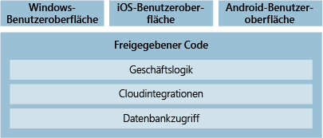
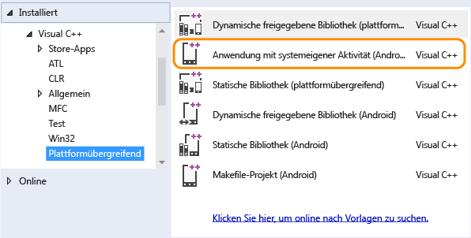
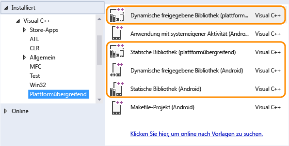

# Plattformübergreifende Mobile-Entwicklung in Visual Studio

Sie können Apps für Android-, iOS- oder Windows-Geräte mithilfe von Visual Studio erstellen.  Außerdem lassen sich Tools in Visual Studio verwenden, um verbundene Dienste wie Microsoft 365, Azure App Service oder Application Insights unkompliziert hinzufügen.

Sie können die Apps mithilfe von C#, mit .NET Framework oder mithilfe von HTML, JavaScript oder C++ erstellen. Auch Code, Zeichenfolgen, Bilder und in einigen Fällen sogar die Benutzeroberfläche selbst können freigeben werden.

Wenn Sie ein Spiel oder eine immersive grafische App erstellen möchten, installieren Sie die Visual Studio-Tools für Unity. Profitieren Sie von den leistungsstarken Produktivitätsfunktionen von Visual Studio-Tools für Unity, der beliebten plattformübergreifenden Spiele- und Grafik-Engine und Entwicklungsumgebung für Apps, die unter iOS, Android, Windows und auf anderen Plattformen ausgeführt wird.

## Erstellen einer App für Android, iOS und Windows(.NET Framework)

Mithilfe von Visual Studio-Tools für Xamarin können Sie Android, iOS und Windows in derselben Projektmappe anzielen und Code oder sogar die Benutzeroberfläche freigeben.

|**Weitere Informationen**|
|--------------------|
|[Installieren von Visual Studio](https://visualstudio.microsoft.com/vs/community/) (VisualStudio.com)|
|[Informationen zu Xamarin in Visual Studio](https://visualstudio.microsoft.com/xamarin/) (VisualStudio.com)|
|[Xamarin mobile app development documentation (Dokumentation zur Entwicklung mobiler Apps mit Xamarin)](/xamarin/) |
|[DevOps mit Xamarin-Apps](/xamarin/tools/ci/devops/) |
|[Informationen zu universellen Windows-Apps in Visual Studio](https://visualstudio.microsoft.com/vs/universal-windows-platform/) (VisualStudio.com)|
|[Informationen zu den Ähnlichkeiten zwischen Swift und C#](https://aka.ms/scposter) (download.microsoft.com)|

###  Android-, iOS und Windows-Zielgeräte aus einer einzigen Codebasis

 Sie können mit C#- oder F# native Apps für Android, iOS und Windows erstellen (Visual Basic wird derzeit nicht unterstützt).  Installieren Sie zunächst Visual Studio, und wählen Sie im Installer die Workload **Mobile Entwicklung mit .NET** aus.

 Wenn Sie Visual Studio bereits installiert haben, führen Sie den **Visual Studio-Installer** erneut aus, und wählen Sie (wie weiter oben) die Workload **Mobile Entwicklung mit .NET** für Xamarin aus.

 Wenn Sie fertig sind, werden im Dialogfeld **Neues Projekt** Projektvorlagen angezeigt. Suchen Sie einfach auf „Xamarin“, wenn Sie Xamarin-Vorlagen benötigen.

 Xamarin bietet die native Funktionalität von Android, iOS und Windows als .NET-Klassen und -Methoden. Das bedeutet, dass die Apps über vollen Zugriff auf native APIs und native Steuerelemente verfügen. Sie sind damit ebenso reaktionsfähig wie Apps, die in den Sprachen der nativen Plattform geschrieben werden.

 Nachdem Sie ein Projekt erstellt haben, nutzen Sie alle Produktivitätsfeatures von Visual Studio. Verwenden Sie beispielsweise einen Designer zum Erstellen von Seiten, oder nutzen Sie IntelliSense, um die nativen APIs der mobilen Plattformen zu untersuchen. Wenn Sie soweit sind, dass Sie die Anwendung ausführen und die Anzeige prüfen möchten, können Sie den Android SDK-Emulator verwenden und Windows-Apps nativ ausführen. Sie können auch direkt angeschlossene Android- und Windows-Geräte nutzen. Bei iOS-Projekten stellen Sie eine Verbindung zu einem Mac-Computer in einem Netzwerk her und starten den iOS-Emulator in Visual Studio, oder Sie verwenden ein angeschlossenes Gerät.

#### Entwerfen Sie einen Satz von Seiten, die auf allen Geräten mithilfe von Xamarin.Forms gerendert werden.

 Je nach Komplexität des App-Entwurfs könnten Sie überlegen, sie mithilfe von *Xamarin.Forms* -Vorlagen in der Gruppe **Mobile Apps** der Projektvorlagen zu erstellen. Xamarin.Forms ist ein Benutzeroberflächen-Toolkit, mit dem Sie eine zentrale Benutzeroberfläche erstellen können, die Sie dann für Android und iOS sowie für Windows freigeben.  Beim Kompilieren einer Xamarin.Forms-Projektmappe erhalten Sie eine Android-App, eine iOS-App und eine Windows-App. Weitere Informationen finden Sie unter [Erfahren Sie mehr über die Entwicklung für mobile Plattformen mit Xamarin](/xamarin/cross-platform/get-started/introduction-to-mobile-development/) und in der [Dokumentation zu Xamarin.Forms](/xamarin/xamarin-forms/).

####  Gemeinsames Verwenden von Code für Android-, iOS- und Windows-Apps

 Wenn Sie nicht Xamarin.Forms verwenden und stattdessen für jede Plattform einzeln entwickeln möchten, können Sie den größten Teil Ihres nicht für die Benutzeroberfläche selbst entwickelten Codes für alle Plattformprojekte (Android, iOS und Windows) verwenden. Dies umfasst beliebige Geschäftslogiken, Cloud-Integrationen, Datenbankzugriffe oder weitere Codes, die auf .NET Framework abzielen. Der einzige Code, den Sie nicht freigeben können, ist jener Code, der auf eine bestimmte Plattform abzielt.

 

 Sie können Ihren Code mithilfe eines freigegebenen Projekts, eines Portable Class Library-Projekts oder mithilfe von beidem freigeben. Sie stellen unter Umständen fest, dass ein bestimmter Code sich am besten für ein freigegebenes Projekt eignet, während es bei einem anderen Code sinnvoller ist, diesen innerhalb eines Portable Class Library-Projekts anzuwenden.

|**Weitere Informationen**|
|--------------------|
|[Sharing Code Options (Optionen für die Codefreigabe)](/xamarin/cross-platform/app-fundamentals/code-sharing/) (Xamarin) |
|[Optionen für die Codefreigabe mit .NET](/dotnet/standard/cross-platform/) |

### Windows 10-Zielgeräte

 

 Wenn Sie eine App erstellen möchten, die für alle Windows 10-Geräte ausgelegt ist, erstellen Sie eine universelle Windows-App. Sie müssen die App mit einem einzelnen Projekt entwerfen. Ihre Seiten werden dann ordnungsgemäß gerendert, unabhängig davon, welches Gerät für die Anzeige verwendet wird.

 Beginnen Sie mit einer Projektvorlage für eine UWP-App (Universelle Windows-Plattform). Entwerfen Sie Ihre Seiten visuell, und öffnen Sie sie in einem Vorschaufenster, um ihre Darstellung auf den verschiedenen Arten von Geräten zu prüfen. Wenn Ihnen die Darstellung einer Seite auf einem Gerät nicht zusagt, können Sie die Seite an die Größe des Bildschirms, die Auflösung oder die verschiedenen Ausrichtungen wie Quer- oder Hochformat anpassen. All dies erfolgt mithilfe der intuitiven Toolfenster und der leicht zugänglichen Menüoptionen in Visual Studio. Wenn Sie bereit sind, Ihre App auszuführen und den Code zu durchlaufen, stehen Ihnen alle Geräteemulatoren und Simulatoren für die verschiedenen Arten von Geräten in einer Dropdownliste auf der Symbolleiste **Standard** zur Verfügung.

|**Weitere Informationen**|
|--------------------|
|[Einführung in die universelle Windows-Plattform](/windows/uwp/get-started/universal-application-platform-guide)|
|[Erstellen der ersten App](/windows/uwp/get-started/your-first-app)|
|[Entwickeln von Apps für die universelle Windows-Plattform (UWP)](../cross-platform/develop-apps-for-the-universal-windows-platform-uwp.md)|
|[Migrieren von Apps auf die universelle Windows-Plattform (UWP)](https://msdn.microsoft.com/library/mt148501.aspx)|

::: moniker range="vs-2017"

## Erstellen einer App für Android, iOS und Windows (HTML/JavaScript)

 

 Wenn Sie als Webentwickler mit HTML und JavaScript vertraut sind, können Sie mithilfe von Visual Studio-Tools für Apache Cordova eine Nutzung unter Windows, Android und iOS ermöglichen. Diese Apps können auf allen drei Plattformen ausgeführt werden. Sie erstellen sie mithilfe Ihrer Kenntnisse und der Vorgehensweisen, mit denen Sie vertraut sind.

 Apache Cordova ist ein Framework, das ein Plug-In-Modell enthält. Dieses Plug-In-Modell bietet eine zentrale JavaScript-API, mit der Sie auf native Gerätefunktionen aller drei Plattformen (iOS, Android und Windows) zugreifen können.

 Da diese APIs plattformübergreifend sind, können Sie den größten Teil Ihres Code für alle drei Plattformen verwenden. Dies trägt zu geringeren Entwicklungs- und Wartungskosten bei. Darüber hinaus müssen Sie nicht jedes Mal von Grund auf neu anfangen. Wenn Sie andere Arten von Webanwendungen erstellt haben, können Sie diese Dateien für Ihre Cordova-App verwenden, ohne sie ändern oder umgestalten zu müssen.

 

 Installieren Sie zunächst Visual Studio, und wählen Sie während des Setups die Workload **Mobile-Entwicklung mit JavaScript**. Die Cordova-Tools installieren automatisch sämtliche Drittanbietersoftware, die zum Erstellen der plattformübergreifenden App erforderlich ist.

 Nachdem Sie die Erweiterung installiert haben, öffnen Sie Visual Studio, und erstellen Sie ein Projekt für eine **Leere App (Apache Cordova)** . Anschließend können Sie die App mit JavaScript oder TypeScript entwickeln. Sie können darüber hinaus Plug-Ins zum Erweitern der App-Funktionen hinzufügen. Beim Schreiben von Code werden APIs aus Plug-Ins in IntelliSense angezeigt.

 Wenn Sie Ihre App ausführen und den Code durchlaufen möchten, wählen Sie einen Emulator (z.B. Apache Ripple-Emulator oder Android-Emulator) und einen Browser oder ein Gerät aus, das Sie direkt an den Computer angeschlossen haben. Starten Sie dann Ihre App. Wenn Sie Ihre App auf einem Windows-Computer entwickeln, können Sie sie auch auf diesem ausführen. Alle diese Optionen werden in Visual Studio als Teil der Visual Studio-Tools für Apache Cordova integriert.

 Projektvorlagen für das Erstellen von UWP-Apps (Universelle Windows-Plattform) sind weiterhin in Visual Studio verfügbar. Sie können diese also verwenden, wenn Sie nur Windows-Geräte anzielen möchten. Wenn Sie zu einem späteren Zeitpunkt Anwendungen für Android- und iOS-Geräte erstellen möchten, können Sie den Code immer noch in ein Cordova-Projekt portieren.

|**Weitere Informationen**|
|--------------------|
|[Installieren von Visual Studio](https://visualstudio.microsoft.com/vs/community/) (VisualStudio.com)|
|[Get started with Visual Studio Tools for Apache Cordova (Erste Schritte mit Visual Studio-Tools für Apache Cordova)](/visualstudio/cross-platform/tools-for-cordova/)|
|[Informationen zum Visual Studio Emulator für Android](https://visualstudio.microsoft.com/vs/msft-android-emulator/) (VisualStudio.com)|

::: moniker-end

## Erstellen einer App für Android, iOS und Windows (C++)

 Installieren Sie zunächst Visual Studio und die Workload **Mobile Entwicklung mit C++** . Anschließend können Sie eine Anwendung mit nativer Aktivität für Android oder eine App für Windows oder iOS erstellen. Sie können für Android, iOS und Windows mit der gleichen Projektmappe arbeiten und anschließend den Code mithilfe einer plattformübergreifenden statischen oder dynamischen freigegebenen Bibliothek für diese freigeben.

 Wenn Sie eine App für Android erstellen müssen, die eine erweiterte Grafikbearbeitung erfordert, z.B. ein Spiel, können Sie C++ dazu verwenden. Beginnen Sie mit dem Projekt **Anwendung mit nativer Aktivität (Android)** . Dieses Projekt bietet vollständige Unterstützung für die Clang-Toolkette.

 

 Wenn Sie so weit sind, dass Sie die Anwendung ausführen und überprüfen möchten, verwenden Sie den Android-Emulator. Er ist schnell, zuverlässig und leicht zu installieren und konfigurieren.

 Sie können auch eine App für sämtliche Typen von Windows 10-Geräten mithilfe von C++ und der Projektvorlage für UWP-Apps (Universelle Windows-Plattform) erstellen. Weitere Informationen hierzu finden Sie im Abschnitt [Windows 10-Zielgeräte](#WindowsHTML) weiter oben in diesem Thema.

 Sie können C++-Code für Android, iOS und Windows freigeben, indem Sie eine statische oder dynamische freigegebene Bibliothek erstellen.

 

 Sie können diese Bibliothek, wie weiter oben in diesem Abschnitt beschrieben, in einem Windows-, iOS- oder Android-Projekt nutzen. Sie können sie auch in einer App verwenden, die Sie mithilfe von Xamarin, Java oder einer anderen Sprache erstellen, mit der Funktionen in einer nicht verwalteten DLL aufgerufen werden können.

 Beim Schreiben von Code in diesen Bibliotheken können Sie IntelliSense verwenden, um die systemeigenen APIs der Android- und Windows-Plattformen zu untersuchen. Diese Bibliotheksprojekte sind vollständig in den Visual Studio-Debugger integriert, sodass Sie mithilfe der erweiterten Funktionen des Debuggers Haltepunkte festlegen, Code durchlaufen und Probleme suchen und beheben können.

|**Weitere Informationen**|
|--------------------|
|[Herunterladen von Visual Studio](https://visualstudio.microsoft.com/downloads/) (VisualStudio.com)|
|[Installieren der plattformübergreifenden mobilen Entwicklung mit C++](/cpp/cross-platform/install-visual-cpp-for-cross-platform-mobile-development)|
|[Weitere Informationen zum Verwenden von C++ für mehrere Plattformen](https://visualstudio.microsoft.com/vs/cplusplus-mdd/) (VisualStudio.com)|
|[Installieren der erforderlichen Tools und anschließendes Erstellen einer C++-Anwendung mit nativer Aktivität für Android](/cpp/cross-platform/create-an-android-native-activity-app)|
|[Weitere Informationen zum Freigeben von C++-Code mit Android- und Windows-Apps](https://visualstudio.microsoft.com/vs/cplusplus-mdd/) (VisualStudio.com)|
|[Beispiele für die plattformübergreifende mobile Entwicklung für C++](/cpp/cross-platform/cross-platform-mobile-development-examples)|

## Erstellen eines plattformübergreifenden Spiels für Android, iOS und Windows mithilfe von Visual Studio-Tools für Unity

 Visual Studio-Tools für Unity ist eine kostenlose Erweiterung für Visual Studio, mit der die leistungsfähigen Codebearbeitungs-, Produktivitäts- und Debugging-Tools von Visual Studio in *Unity* integriert werden. Unity ist die beliebte plattformübergreifende Spiel- und Grafik-Engine und Entwicklungsumgebung für immersive Apps unter Windows, iOS, Android und anderen Plattformen.

 

 Mithilfe der Visual Studio-Tools für Unity (VSTU) können Sie Visual Studio zum Schreiben von Spiel- und Editorskripts in C# verwenden und dann den leistungsfähigen Debugger zum Suchen und Beheben von Fehlern nutzen. Das neueste Release von VSTU unterstützt Unity 2018.1 und bietet Syntaxfarben für die Shadersprache „ShaderLab“ von Unity, eine optimierte Synchronisierung mit Unity, umfangreichere Debugfunktionen und eine verbesserte Codegenerierung für den MonoBehavior-Assistenten. Mit VSTU werden außerdem die Unity-Projektdateien, Konsolenmeldungen und die Möglichkeit zum Starten des Spiels in Visual Studio eingebunden, sodass beim Schreiben von Code weniger Zeit zum Umschalten in und aus dem Unity-Editor benötigt wird.

|**Weitere Informationen**|
|--------------------|
|[Weitere Informationen über das Erstellen von Unity-Spielen mit Visual Studio](https://visualstudio.microsoft.com/vs/features/game-development/#tab-4b0d0be8de5f65564ad)|
|[Weitere Informationen zu Visual Studio Tools für Unity](../cross-platform/visual-studio-tools-for-unity.md) |
|[Erste Schritte mit Visual Studio-Tools für Unity](../cross-platform/getting-started-with-visual-studio-tools-for-unity.md) |
|[Informationen zu den neusten Verbesserungen von Visual Studio Tools für Unity 2.0 Preview](https://devblogs.microsoft.com/visualstudio/visual-studio-tools-for-unity-2-0-preview/) (Visual Studio-Blog)|
|[Videoeinführung in Visual Studio Tools für Unity 2.0 Preview](https://www.bing.com/videos/search?q=visual+studio+tools+for+unity&qs=n&form=QBVLPG&pq=visual+studio+tools+for+unity&sc=6-29&sp=-1&sk=#view=detail&mid=0A13177F0BC7463A24080A13177F0BC7463A2408) (Video)|
|[Informationen zu Unity](https://unity.com/) (Unity-Website)|

## Siehe auch

- [Hinzufügen von Microsoft 365-APIs zu einem Visual Studio-Projekt](/office/developer-program/office-365-developer-program)
- [Azure App Services - Mobile Apps](https://azure.microsoft.com/services/app-service/mobile/)
- [Visual Studio App Center](/appcenter)
