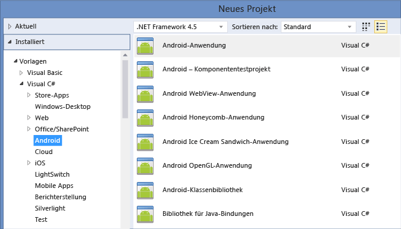

# Plattform&#252;bergreifende Entwicklung in Visual Studio
[!INCLUDE[vs2017banner](../code-quality/includes/vs2017banner.md)]

Sie können Apps für Android\-, iOS\- oder Windows\-Geräte mithilfe von Visual Studio erstellen.  Außerdem können Sie verbundene Dienste wie Office 365, Azure Mobile Services oder Application Insights problemlos den Apps hinzufügen.  
  
 Sie können die Apps mithilfe von C\#, mit .NET Framework oder mithilfe von HTML, JavaScript oder C\+\+ erstellen. Sie können Code, Zeichenfolgen, Bilder und in einigen Fällen sogar die Benutzeroberfläche selbst freigeben.  
  
 Wenn Sie ein Spiel erstellen möchten, installieren Sie die Visual Studio\-Tools für Unity, und genießen Sie all die leistungsstarken Produktivitätsfeatures von Visual Studio mit Unity, der beliebten plattformübergreifenden Games Engine für Spiele, die unter iOS, Android, Windows und auf anderen Plattformen ausgeführt werden.  
  
 **In diesem Artikel:**  
  
-   [Erstellen einer App für Android-, iOS- und Windows-Geräte (.NET Framework)](#NET)  
  
    -   [Android- und iOS-Zielgeräte](../cross-platform/cross-platform-mobile-development-in-visual-studio.md#AndroidHTML)  
  
    -   [Windows-Zielgeräte](../cross-platform/cross-platform-mobile-development-in-visual-studio.md#WindowsHTML)  
  
    -   [Gemeinsames Verwenden von Code für Android-, iOS- und Windows-Apps](../cross-platform/cross-platform-mobile-development-in-visual-studio.md#ShareHTML)  
  
-   [Erstellen einer App für Android-, iOS- und Windows-Geräte (HTML/JavaScript)](#HTML)  
  
-   [Erstellen einer App für Android- und Windows-Geräte (C++)](#CPP)  
  
-   [Erstellen eines plattformübergreifenden Spiels für Android-, iOS- und Windows-Geräte mithilfe von Visual Studio-Tools für Unity](#Unity)  
  
##   Erstellen einer App für Android\-, iOS\- und Windows\-Geräte \(.NET Framework\)  
   
  
 Installieren Sie Xamarin zum Erstellen einer App für Android oder iOS. Erstellen Sie anschließend ein Android\- oder iOS\-Projekt. Wählen Sie zum Erstellen einer App für Windows\-Geräte eine universelle Windows\- oder Windows Phone\-Projektvorlage aus. Sie können gegebenenfalls auf Android\-, iOS\- und Windows\-Geräte in der gleichen Projektmappe abzielen und den Code dann mithilfe eines freigegebenen Projekts oder eines Portable Class Library\-Projekts für alle Geräteprojekte freigeben.  
  
|**Weitere Informationen**|  
|-------------------------------|  
|[Installieren von Visual Studio](http://www.visualstudio.com/products/visual-studio-community-vs) \(VisualStudio.com\)|  
|[Informationen zu Xamarin in Visual Studio](http://www.visualstudio.com/explore/xamarin-vs) \(VisualStudio.com\)|  
|[Visual Studio und Xamarin](../cross-platform/visual-studio-and-xamarin.md) \(MSDN Library\)|  
|[Application Lifecycle Management \(ALM\) mit Xamarin\-Apps](../cross-platform/application-lifecycle-management-alm-with-xamarin-apps.md) \(MSDN Library\)|  
|[Informationen zu universellen Windows\-Apps in Visual Studio](http://www.visualstudio.com/explore/universal-apps-vs) \(VisualStudio.com\)|  
|[Informationen zu den Ähnlichkeiten zwischen Swift und C\#](http://aka.ms/scposter) \(download.microsoft.com\)|  
  
###   Android\- und iOS\-Zielgeräte  
 Sie können systemeigene Apps für Android und iOS mit C\# erstellen.  Erwerben Sie zunächst eine Xamarin\-Lizenz. Dann installieren Sie Xamarin, wodurch die Xamarin\-Erweiterung für Visual Studio installiert wird. Anschließend werden Android\- und iOS\-Projektvorlagen im Dialogfeld **Neues Projekt** entsprechend der folgenden Abbildung angezeigt.  
  
   
  
 Diese Vorlagen stellen die systemeigenen Funktionen von Android\- und iOS\-Geräten als C\#\-Objekte heraus. Die Apps verfügen über vollen Zugriff auf systemeigene APIs und systemeigene Benutzersteuerelemente. Sie sind damit ebenso reaktionsfähig wie Android\- oder iOS\-Apps, die in Objective\-C, Swift oder Java geschrieben sind.  
  
 Nachdem Sie ein Projekt erstellen haben, nutzen Sie alle Produktivitätsfeatures von Visual Studio. Sie verwenden beispielsweise einen Designer zum Erstellen von Seiten und nutzen IntelliSense, um die systemeigenen APIs der Android\- und iOS\-Plattform zu untersuchen. Wenn Sie so weit sind, dass Sie die Anwendung ausführen und die Anzeige prüfen möchten, können Sie den Visual Studio\-Emulator für Android oder einen Android\-Emulator Ihrer Wahl verwenden. Bei iOS\-Projekten stellen Sie eine Verbindung zu einem MAC in einem Netzwerk her und starten den Mac\-Emulator in Visual Studio.  
  
#### Entwerfen Sie einen Satz von Seiten, die auf allen Geräten mithilfe von Xamarin.Forms gerendert werden.  
 Je nach Komplexität des App\-Entwurfs könnten Sie überlegen, sie mithilfe von *Xamarin.Forms*\-Vorlagen in der Gruppe **Mobile Apps** der Projektvorlagen zu erstellen. Xamarin.Forms ist ein Toolkit, mit dem Sie Benutzeroberflächen erstellen können, die Sie dann für Android und iOS sowie für Windows Phone freigeben können.  Beim Kompilieren einer Xamarin.Forms\-Projektmappe erhalten Sie eine Android\-App, eine iOS\-App und eine Windows Phone\-App. Bei Verwendung von [Xamarin.Forms für Windows Preview](http://developer.xamarin.com/guides/cross-platform/xamarin-forms/windows/) können Sie auch Windows\-Tablets als Zielgerät verwenden.  
  
 Überprüfen Sie beim Erstellen einer Benutzeroberfläche, die auf allen drei Plattformen ansprechend gerendert werden soll, die Stärken und Schwächen dieser Herangehensweise vor einer möglichen Investition. Wenn Sie am Ende das Framework um viele benutzerdefinierte Steuerelement\-Renderer erweitern müssen, um eine kompliziertere und angepasste Benutzeroberfläche zu erzielen, ist es eventuell sinnvoller, separate Benutzeroberflächen für die einzelnen Plattformen zu gestalten. Sie genießen dann trotzdem alle Vorteile der Verwendung einer einzelnen Sprache \(C\#\), können große Mengen des Codes zwischen Ihren Geräten gemeinsam verwenden und erhalten als Bonus alle leistungsfähigen Entwicklungstools, die speziell für die jeweilige Plattform zugeschnitten sind, wie z. B. einen visuellen Designer für iOS\-Storyboard\-Dateien und Blend für das visuelle Entwerfen universeller Windows\-Apps.  
  
|**Weitere Informationen**|  
|-------------------------------|  
|[Informationen zu Xamarin](http://xamarin.com/platform) \(Xamarin\-Website\)|  
|[Evaluieren von Xamarin\-Lizenzen](https://store.xamarin.com/) \(Xamarin\-Website\)|  
|[Installieren von Xamarin](http://xamarin.com/download) \(Xamarin\-Website\)|  
|[Informationen zu Xamarin.Forms](http://developer.xamarin.com/guides/cross-platform/xamarin-forms/) \(Xamarin\-Website\)|  
|[Verbinden einer Android\- oder IOS\-App mit einem Microsoft\-Cloud\-Back\-End](http://azure.microsoft.com/en-us/develop/mobile/xamarin/) \(Azure.com\)|  
|[Informationen zum Visual Studio Emulator für Android](http://www.visualstudio.com/explore/msft-android-emulator-vs) \(VisualStudio.com\)|  
  
###   Windows\-Zielgeräte  
   
  
 Wenn Sie eine App erstellen möchten, die für alle Windows 10\-Geräte ausgelegt ist, erstellen Sie eine universelle Windows\-App. Sie müssen die App mit einem einzelnen Projekt entwerfen. Ihre Seiten werden dann ordnungsgemäß gerendert, unabhängig davon, welches Gerät für die Anzeige verwendet wird.  
  
 Beginnen Sie mit einer universellen Windows\-App\-Projektvorlage. Entwerfen Sie Ihre Seiten visuell, und öffnen Sie sie in einem Vorschaufenster, um ihre Darstellung auf den verschiedenen Arten von Geräten zu prüfen. Wenn Ihnen die Darstellung einer Seite auf einem Gerät nicht zusagt, können Sie die Seite an die Größe des Bildschirms, die Auflösung oder die verschiedenen Ausrichtungen wie Quer\- oder Hochformat anpassen. All dies erfolgt mithilfe der intuitiven Toolfenster und der leicht zugänglichen Menüoptionen in Visual Studio. Wenn Sie bereit sind, Ihre App auszuführen und den Code zu durchlaufen, stehen Ihnen alle Geräteemulatoren und Simulatoren für die verschiedenen Arten von Geräten in einer Dropdownliste auf der Symbolleiste **Standard** zur Verfügung.  
  
 Windows 10 ist noch recht neu, sodass Sie auch Projektvorlagen für Windows 8.1 vorfinden. Sie können diese Projektvorlagen für Apps verwenden, die auf Telefonen, Tablets und Computern unter Windows 10 ausgeführt werden sollen. Alle Geräte unter Windows 8.1 erhalten jedoch ein automatisches Upgrade auf Windows 10. Wenn Sie also über keine besonderen Gründe für Windows 8.1 als Ziel verfügen, ist es empfehlenswert, eine Projektvorlage mit Windows 10 als Ziel zu verwenden.  
  
|**Weitere Informationen**|  
|-------------------------------|  
|[Informationen zu universellen Windows\-Apps](https://msdn.microsoft.com/library/windows/apps/dn894631.aspx) \(Windows Dev Center\)|  
|[Erstellen der ersten App](http://msdn.microsoft.com/library/windows/apps/dn609832.aspx) \(Windows Dev Center\)|  
|[Entwickeln von Apps für die universelle Windows\-Plattform \(UWP\)](../cross-platform/develop-apps-for-the-universal-windows-platform-uwp.md)|  
|[Migrieren von Apps in die universelle Windows\-Plattform \(UWP\)](../misc/migrate-apps-to-the-universal-windows-platform-uwp.md)|  
  
###   Gemeinsames Verwenden von Code für Android\-, iOS\- und Windows\-Apps  
 Wenn Sie nicht Xamarin.Forms verwenden und stattdessen für jede Plattform einzeln entwickeln möchten, können Sie den größten Teil Ihres nicht für die Benutzeroberfläche selbst entwickelten Codes für alle Plattformprojekte \(Android, iOS und Windows\) verwenden. Dies umfasst beliebige Geschäftslogiken, Cloud\-Integrationen, Datenbankzugriffe oder weitere Codes, die auf .NET Framework abzielen. Der einzige Code, den Sie nicht freigeben können, ist jener Code, der auf eine bestimmte Plattform abzielt.  
  
   
  
 Sie können Ihren Code mithilfe eines freigegebenen Projekts, eines Portable Class Library\-Projekts oder mithilfe von beidem freigeben. Sie stellen unter Umständen fest, dass ein bestimmter Code sich am besten für ein freigegebenes Projekt eignet, während es bei einem anderen Code sinnvoller ist, diesen innerhalb eines Portable Class Library\-Projekts anzuwenden.  
  
|**Weitere Informationen**|  
|-------------------------------|  
|Sie können wählen, ob Sie den Code freigeben möchten, indem Sie gemeinsam genutzte Projekte, Portable Class Library\-Projekte oder sowohl als auch verwenden.   [Plattformübergreifendes Freigeben von Code](http://blogs.msdn.com/b/dotnet/archive/2014/04/21/sharing-code-across-platforms.aspx) \(.NET Framework\-Blog\)   [Optionen für die Codefreigabe](http://developer.xamarin.com/guides/cross-platform/application_fundamentals/building_cross_platform_applications/sharing_code_options/) \(Xamarin\-Website\)   [Optionen für die Codefreigabe mit .NET Framework](http://msdn.microsoft.com/library/dn720832.aspx) \(MSDN Library\)|  
  
##   Erstellen einer App für Android\-, iOS\- und Windows\-Geräte \(HTML\/JavaScript\)  
   
  
 Wenn Sie als Webentwickler vertraut sind mit HTML und JavaScript, können Sie mithilfe von Visual Studio\-Tools für Apache Cordova auf Windows\-, Android\- und iOS\-Geräte abzielen. Diese Apps können auf allen drei Plattformen ausgeführt werden. Sie erstellen sie mithilfe Ihrer Kenntnisse und der Vorgehensweisen, mit denen Sie vertraut sind.  
  
 Was ist Cordova? Kurz gesagt: ein Framework. Dieses Framework umfasst ein Plug\-In\-Modell. Dieses Plug\-In\-Modell bietet eine einzelne JavaScript\-API, mit der Sie auf systemeigene Gerätefunktionen aller drei Plattformen \(iOS, Android und Windows\) zugreifen können.  
  
 Da diese APIs plattformübergreifend sind, können Sie den größten Teil Ihres Code für alle drei Plattformen verwenden. Dies trägt zu geringeren Entwicklungs\- und Wartungskosten bei. Darüber hinaus müssen Sie nicht jedes Mal von Grund auf neu anfangen. Wenn Sie andere Arten von Webanwendungen erstellt haben, können Sie diese Dateien für Ihre Cordova\-App verwenden, ohne sie ändern oder umgestalten zu müssen.  
  
   
  
 Installieren Sie zum Einstieg Visual Studio 2015, und wählen Sie während des Setups das **HTML\/JavaScript \(Apache Cordova\)**\-Feature. Wenn Sie noch Visual Studio 2013 verwenden, installieren Sie die Visual Studio\-Tools für Apache Cordova\-Erweiterung. Über diese Erweiterung wird automatisch sämtliche Drittanbieter\-Software installiert, die zum Erstellen der Multi\-Plattform\-App erforderlich ist.  
  
 Nachdem Sie die Erweiterung installiert haben, öffnen Sie Visual Studio, und erstellen Sie ein Projekt für eine **Leere App \(Apache Cordova\)**. Anschließend können Sie die App mit JavaScript oder TypeScript entwickeln. Sie können darüber hinaus Plug\-Ins zum Erweitern der App\-Funktionen hinzufügen. Beim Schreiben von Code werden APIs aus Plug\-Ins in IntelliSense angezeigt.  
  
 Wenn Sie Ihre App ausführen und den Code durchlaufen möchten, wählen Sie einen Emulator \(z. B. Apache Ripple\-Emulator oder Visual Studio\-Emulator für Android\) und einen Browser oder ein Gerät aus, das Sie direkt an den Computer angeschlossen haben. Starten Sie dann Ihre App. Wenn Sie Ihre App auf einem Windows\-Computer entwickeln, können Sie sie auch auf diesem ausführen. Alle diese Optionen werden in Visual Studio als Teil der Erweiterung Visual Studio\-Tools für Apache Cordova integriert.  
  
 Projektvorlagen für das Erstellen universeller Windows\-Apps sind weiterhin in Visual Studio verfügbar, Sie können Sie also gerne zum Erstellen von Anwendungen für Windows\-Geräte verwenden. Wenn Sie zu einem späteren Zeitpunkt Anwendungen für Android\- und iOS\-Geräte erstellen möchten, können Sie den Code in ein Cordova\-Projekt portieren. Es stehen Open\-Source\-Versionen der WinJS\-APIs zur Verfügung. Sie können somit jeden beliebigen Code wiederverwenden, welcher diese APIs nutzt. Dies bedeutet, wenn Sie in Zukunft Anwendungen für andere Plattformen entwickeln möchten, wird empfohlen, mit Visual Studio\-Tools für Apache Cordova zu starten.  
  
|**Weitere Informationen**|  
|-------------------------------|  
|[Installieren von Visual Studio](http://www.visualstudio.com/products/visual-studio-community-vs) \(VisualStudio.com\)|  
|[Erste Schritte mit Visual Studio\-Tools für Apache Cordova](http://taco.visualstudio.com/en-us/docs/get-started-vs-tools-apache-cordova/) \(taco.visualstudio.com\)|  
|[Informationen zum Visual Studio Emulator für Android](http://www.visualstudio.com/explore/msft-android-emulator-vs) \(VisualStudio.com\)|  
  
##   Erstellen einer App für Android\- und Windows\-Geräte \(C\+\+\)  
   
  
 Installieren Sie zuerst Visual Studio und die Tools von Visual C\+\+ für die plattformübergreifende Mobilgeräteentwicklung. Dann können Sie eine Native Activity\-App für Android oder eine App erstellen, die auf Windows\-Geräte abzielt. C\+\+\-Vorlagen, die auf iOS\-Geräte abzielen, sind noch nicht verfügbar. Sie können auf Wunsch in der gleichen Projektmappe auf Android\- und Windows\-Geräte abzielen und anschließend den Code mithilfe einer plattformübergreifenden statischen oder dynamischen freigegebenen Bibliothek für beide freigeben.  
  
 Wenn Sie eine App für Android erstellen müssen, die eine erweiterte Grafikbearbeitung erfordert, z. B. ein Spiel, können Sie nun C\+\+ dazu verwenden. Beginnen Sie mit dem Projekt **Native\-Activity Application \(Android\)**. Dieses Projekt bietet vollständige Unterstützung für die Clang\-Toolkette.  
  
   
  
 Wenn Sie soweit sind, dass Sie die Anwendung ausführen und die Anzeige prüfen möchten, verwenden Sie den Visual Studio\-Emulator für Android. Er ist schnell, zuverlässig und leicht zu installieren und konfigurieren.  
  
 Sie können auch eine App für sämtliche Typen von Windows 10\-Geräten mithilfe von C\+\+ und der Projektvorlage für universelle Windows\-Apps erstellen. Weitere Informationen hierzu finden Sie im Abschnitt [Windows-Zielgeräte](#WindowsHTML) weiter oben in diesem Thema.  
  
 Sie können C\+\+\-Code für Android\- und Windows\-Geräte freigeben, indem Sie eine statische oder dynamische freigegebene Bibliothek erstellen.  
  
   
  
 Sie können diese Bibliothek in einem Windows\- oder Android\-Projekt nutzen, wie sie weiter oben in diesem Abschnitt beschriebenen sind. Sie können sie auch in einer App verwenden, die Sie mithilfe von Xamarin, Java oder einer anderen Sprache erstellen, mit der Funktionen in einer nicht verwalteten DLL aufgerufen werden können.  
  
 Beim Schreiben von Code in diesen Bibliotheken können Sie IntelliSense verwenden, um die systemeigenen APIs der Android\- und Windows\-Plattformen zu untersuchen. Diese Bibliotheksprojekte sind vollständig in den Visual Studio\-Debugger integriert, sodass Sie mithilfe der erweiterten Funktionen des Debuggers Haltepunkte festlegen, Code durchlaufen und Probleme suchen und beheben können.  
  
|**Weitere Informationen**|  
|-------------------------------|  
|[Visual Studio herunterladen](http://www.visualstudio.com/products/visual-studio-community-vs) \(VisualStudio.com\)|  
|[Tools für Visual C\+\+ für die plattformübergreifende Entwicklung installieren](https://msdn.microsoft.com/library/dn872463\(v=vs.140\).aspx) \(MSDN Library\)|  
|[Visual Studio C\+\+ – Plattformübergreifende mobile Entwicklung](http://www.visualstudio.com/explore/cplusplus-mdd-vs.aspx) \(VisualStudio.com\)|  
|[Installieren der erforderlichen Tools und anschließendes Erstellen einer App mit systemeigener Aktivität für Android](https://msdn.microsoft.com/library/dn872463\(v=vs.140\).aspx) \(MSDN Library\)|  
|[Informationen zum Visual Studio Emulator für Android](http://www.visualstudio.com/explore/msft-android-emulator-vs) \(VisualStudio.com\)|  
|[Weitere Informationen zum Freigeben von C\+\+\-Code mit Android\- und Windows\-Apps](http://www.visualstudio.com/explore/cplusplus-mdd-vs.aspx) \(VisualStudio.com\)|  
  
##   Erstellen eines plattformübergreifenden Spiels für Android\-, iOS\- und Windows\-Geräte mithilfe von Visual Studio\-Tools für Unity  
 Visual Studio\-Tools für Unity ist eine kostenlose Erweiterung für Visual Studio, mit der die leistungsfähigen Codebearbeitungs\-, Produktivitäts\- und Debugging\-Tools von Visual Studio in *Unity* integriert werden. Unity ist die beliebte plattformübergreifende Spiel\-Engine und Entwicklungsumgebung für Spiele, die auf Windows\-Geräte, iOS, Android und andere Plattformen abzielen.  
  
   
  
 Mithilfe der Visual Studio\-Tools für Unity \(VSTU\) können Sie Visual Studio zum Schreiben von Spiel\- und Editorskripts in C\# verwenden und dann den leistungsfähigen Debugger zum Suchen und Beheben von Fehlern nutzen. Die neueste Version von VSTU unterstützt Unity 5 und bietet Syntaxfarben für die Shadersprache ShaderLab von Unity, eine optimierte Synchronisierung mit Unity, umfangreichere Debugfunktionen und verbesserte Codegenerierung für den MonoBehavior\-Assistenten. Mit VSTU werden außerdem die Unity\-Projektdateien, Konsolenmeldungen und die Möglichkeit zum Starten des Spiels in Visual Studio eingebunden, sodass beim Schreiben von Code weniger Zeit zum Umschalten in und aus dem Unity\-Editor benötigt wird.  
  
 Beginnen Sie noch heute damit, ein Spiel mit Unity und Visual Studio\-Tools für Unity zu erstellen.  
  
|**Weitere Informationen**|  
|-------------------------------|  
|[Weitere Informationen über das Erstellen von Unity\-Spielen mit Visual Studio](https://www.visualstudio.com/en-us/features/unitytools-vs.aspx)|  
|[Weitere Informationen zu Visual Studio\-Tools für Unity](../cross-platform/visual-studio-tools-for-unity.md) \(MSDN Library\)|  
|[Einstieg in Visual Studio\-Tools für Unity](../cross-platform/getting-started-with-visual-studio-tools-for-unity.md) \(MSDN Library\)|  
|[Informationen zu den neusten Verbesserungen von Visual Studio Tools für Unity 2.0 Preview](http://blogs.msdn.com/b/visualstudio/archive/2014/12/03/visual-studio-tools-for-unity-2-0-preview.aspx) \(Visual Studio\-Blog\)|  
|[Videoeinführung in Visual Studio Tools für Unity 2.0 Preview](http://www.bing.com/videos/search?q=visual+studio+tools+for+unity&qs=n&form=QBVLPG&pq=visual+studio+tools+for+unity&sc=6-29&sp=-1&sk=#view=detail&mid=0A13177F0BC7463A24080A13177F0BC7463A2408) \(Video\)|  
|[Informationen zu Unity](http://unity3d.com/) \(Unity\-Website\)|  
  
## Siehe auch  
 [Hinzufügen von Office 365\-APIs zu einem Visual Studio\-Projekt](http://msdn.microsoft.com/library/office/dn605899\(v=office.15\).aspx)   
 [Azure\-Mobile Services](http://msdn.microsoft.com/library/dn720832\(v=vs.110\).aspx)   
 [Application Insights](../misc/application-insights-for-visual-studio-online.md)