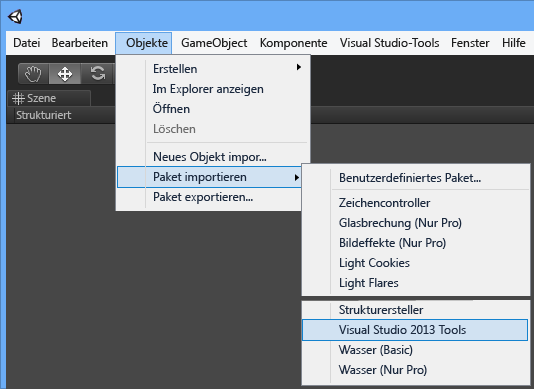
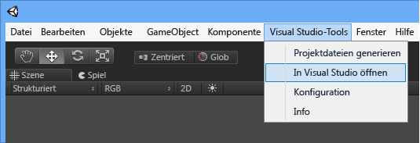

# Erste Schritte mit Visual Studio-Tools für Unity
In diesem Abschnitt erfahren Sie, wie Sie Visual Studio-Tools für Unity installieren und Ihr Unity-Projekt für die Zusammenarbeit mit Visual Studio konfigurieren.  

> [!IMPORTANT]
>  In Unity 5.2 ist die Unterstützung von Visual Studio-Tools für Unity 2.1 bereits integriert, wodurch die Projekterstellung vereinfacht wird. Um diesen Vorteil zu nutzen, benötigen Sie Unity 5.2.0 oder höher unter Windows sowie Visual Studio-Tools für Unity 2.1 oder höher.  

## Erforderliche Komponenten  
 Sie benötigen die folgenden Komponenten, um Visual Studio-Tools für Unity nutzen zu können:  

-   Eine Version von **Visual Studio** , die Erweiterungen unterstützt (z. B. Visual Studio Community, Professional, Premium oder Enterprise). Visual Studio Community können Sie kostenlos herunterladen.  

     [Visual Studio Community herunterladen](http://www.visualstudio.com/downloads/download-visual-studio-vs)  

-   **Unity** Version 4.0.0 oder höher; **Unity** Version 5.2.0 oder höher mit integrierter Unterstützung für Visual Studio-Tools für Unity Version 2.1 oder höher.  

     [Unity herunterladen](https://unity3d.com/get-unity/download)  

## Installieren von Visual Studio-Tools für Unity  
 Laden Sie Visual Studio-Tools für Unity aus dem Visual Studio-Katalog herunter, und installieren Sie sie. Sie müssen das richtige Paket für Ihre Version von Visual Studio installieren. Stellen Sie sicher, dass Visual Studio-Tools für Unity 2.1 oder höher installiert ist, damit Sie die integrierte Unterstützung für VSTU in Unity 5.2 oder höher nutzen können.  

-   Für Visual Studio 2015 Community, Visual Studio 2015 Professional oder Visual Studio 2015 Enterprise:  

     [Visual Studio 2015-Tools für Unity herunterladen](https://visualstudiogallery.msdn.microsoft.com/8d26236e-4a64-4d64-8486-7df95156aba9)  

-   Für Visual Studio 2013 Community, Visual Studio 2013 Professional oder Visual Studio 2013 Premium:  

     [Visual Studio 2013-Tools für Unity herunterladen](https://visualstudiogallery.msdn.microsoft.com/20b80b8c-659b-45ef-96c1-437828fe7cf2)  

-   Für Visual Studio 2012 Professional oder Visual Studio 2012 Premium:  

     [Visual Studio 2012-Tools für Unity herunterladen](https://visualstudiogallery.msdn.microsoft.com/7ab11d2a-f413-4ed6-b3de-ff1d05157714)  

-   Für Visual Studio 2010 Professional oder Visual Studio 2010 Premium:  

     [Visual Studio 2010-Tools für Unity herunterladen](https://visualstudiogallery.msdn.microsoft.com/6e536faa-ce73-494a-a746-6a14753015f1)  

> [!NOTE]
>  Express-Editionen von Visual Studio unterstützen keine Erweiterungen wie z. B. Visual Studio-Tools für Unity. Visual Studio Community ist eine kostenlose Version von Visual Studio, die Visual Studio-Tools für Unity und andere Erweiterungen unterstützt. Für die meisten Benutzer ist Visual Studio Community besser geeignet als Express.  

> [!NOTE]
>  Für Visual Studio 2017 enthält VSTU 3 die Unity-Arbeitsauslastung, die Sie aus dem Installer auswählen können.  

## Ihr erstes Unity-Projekt mit Visual Studio-Tools für Unity  
 Nun, da Sie alles haben, was Sie brauchen, können Sie Ihr erstes Unity-Projekt mit Visual Studio in Angriff nehmen. Die Einrichtung Ihres Unity-Projekts hängt von der installierten Unity-Version und der Version von Visual Studio-Tools für Unity ab. Führen Sie nachfolgend die Schritte für die jeweils installierte Version von Unity und Visual Studio-Tools für Unity aus.  

### Unity 5.2 und höher (VSTU 2.1 oder höher erforderlich)  
 Ab Unity Version 5.2 müssen Sie nicht mehr das VSTU-Paket in Ihre Projekte importieren. Wird dieses Unity-Paket in Ihr Projekt importiert, wird es von Unity 5.2 ignoriert, und Visual Studio-Tools für Unity wird direkt aus dem Installationsverzeichnis geladen.  

#### 1. Erstellen eines Unity-Projekts  
 Wenn Sie bereits Erfahrung mit Unity haben, können Sie ein neues Projekt erstellen oder ein eigenes Projekt laden. Wenn Sie ein Projekt laden, das Visual Studio-Tools für Unity verwendet und zu diesem Zweck ein VSTU-Paket mit einer früheren Version von Unity importiert, empfehlen wir, dieses Paket zu entfernen, indem Sie das Verzeichnis "UnityVS" löschen.  

 Wenn Unity für Sie neu ist, beginnen Sie mit einem einfachen Lernprogramm. Auf der Seite zum Erlernen von Unity finden Sie Lernprogramme zu Beispielprojekten, mit denen Sie starten können, und Lektionen, die Sie durch das Entwickeln Ihres eigenen Spiels mit Unity begleiten. Die Seite zum Erlernen von Unity bietet leicht verständliche Lernprogramme für verschiedene Spiele.  

 [Tutorials – Seite zum Erlernen von Unity](http://unity3d.com/learn/tutorials/modules)  

#### 2. Konfigurieren des Unity-Editors für das Verwenden von Visual Studio-Tools für Unity  
 Um die Verwendung von Visual Studio Tools für Unity für Ihr Projekt zu aktivieren, brauchen Sie nur Visual Studio als externen Skript-Editor festzulegen. Wählen Sie im Unity-Editor im Hauptmenü **Edit, Preferences**aus; wählen Sie dann im Dialogfeld **Unity Preferences** die Option **External Tools**aus. Stellen Sie als Nächstes die Eigenschaft **External Script Editor** auf die Version von Visual Studio ein, die Sie verwenden möchten (Visual Studio-Tools für Unity muss für diese Version von Visual Studio installiert sein), und stellen Sie sicher, dass die Eigenschaft **Editor Attaching** aktiviert ist.  

 Zeigen Sie das Dialogfeld **About Unity** an, um sich zu vergewissern, dass die integrierte Unterstützung für Visual Studio-Tools für Unity aktiviert ist. In the Unity editor, on the main menu, choose **Help, About Unity** aus. Wenn Visual Studio-Tools für Unity installiert und ordnungsgemäß konfiguriert ist, wird unten links im Dialogfeld **About Unity** an, um sich zu vergewissern, dass die integrierte Unterstützung für Visual Studio-Tools für Unity aktiviert ist.  

 Stellen Sie abschließend sicher, dass Sie auf der Seite **Build Settings** ein Buildziel festgelegt und **Script Debugging** aktiviert haben.  

 .  

#### 3. Starten von Visual Studio im Unity-Editor  
 Ab Unity 5.2 ist das Erweiterungsmenü **Visual Studio-Tools** zum Starten von Visual Studio oder zum Konfigurieren der Visual Studio-Tools für Unity nicht mehr erforderlich. Sobald Visual Studio als externer Skript-Editor konfiguriert ist, brauchen Sie nur im Unity-Editor die Skriptdatei auszuwählen, und der Code wird in Visual Studio geöffnet.  

### Frühere Versionen von Unity (vor 5.2)  
 Vor Unity 5.2 gab es keine integrierte Unterstützung für Visual Studio-Tools für Unity. In jedes Projekt musste das VSTU-Paket importiert werden, und zum Verwenden von Visual Studio-Tools für Unity mussten auch andere Projekteinstellungen konfiguriert werden.  

#### 1. Erstellen eines Unity-Projekts  
 Wenn Sie bereits Erfahrung mit Unity haben, können Sie ein neues Projekt erstellen oder ein eigenes Projekt laden. Wenn Sie ein neues Projekt beginnen, importieren Sie während der Erstellung das VSTU-Paket.  

 Wenn Unity für Sie neu ist, beginnen Sie mit einem einfachen Lernprogramm. Auf der Seite zum Erlernen von Unity finden Sie Lernprogramme zu Beispielprojekten, mit denen Sie starten können, und Lektionen, die Sie durch das Entwickeln Ihres eigenen Spiels mit Unity begleiten. Die Seite zum Erlernen von Unity bietet leicht verständliche Lernprogramme für verschiedene Spiele.  

 [Tutorials – Seite zum Erlernen von Unity](http://unity3d.com/learn/tutorials/modules)  

#### 2. Konfigurieren des Unity-Editors für das Verwenden von Visual Studio-Tools für Unity  
 Wenn Sie mit einem vorhandenen Unity-Projekt beginnen oder das VSTU-Paket beim Erstellen Ihres Projekts nicht importiert haben, müssen Sie es jetzt importieren. Klicken Sie im Unity-Editor im Hauptmenü auf **Assets, Import Package, Visual Studio 2015 Tools** (Sie sollten eine Option für die Version von Visual Studio finden, die Sie installiert haben).  

   

 Stellen Sie abschließend sicher, dass Sie auf der Seite **Build Settings** ein Buildziel festgelegt und **Script Debugging** aktiviert haben.  

 .  

#### 3. Starten von Visual Studio im Unity-Editor  
 Der letzte Schritt ist das Starten von Visual Studio in Unity. Hierdurch wird eine Visual Studio-Projektmappe für das Projekt erstellt, das anschließend in Visual Studio geöffnet wird.  

 Wählen Sie im Unity-Editor im Hauptmenü **Visual Studio Tools, Open in Visual Studio**aus.  

   

## Nächste Schritte  

 Informationen zum Arbeiten mit und Debuggen von Unity-Projekten in Visual Studio finden Sie unter [Verwenden von Visual Studio Tools für Unity](../cross-platform/using-visual-studio-tools-for-unity.md).  

## Siehe auch  
 [Unity-Homepage](http://unity3d.com)
