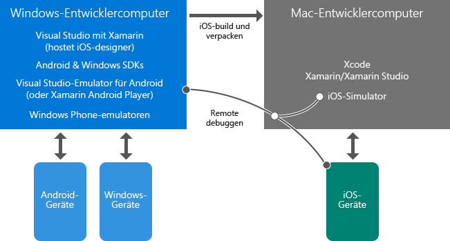

# Erfahren Sie mehr über die Entwicklung für mobile Plattformen mit Xamarin

Dieser Artikel enthält mehrere Übersichten, die Sie bei der Entwicklung plattformübergreifender mobiler Apps mit Xamarin unterstützen. Wenn Sie Visual Studio und Xamarin noch nicht installiert haben, starten Sie zuerst den [Setup und Installation](../cross-platform/setup-and-install.md) -Prozess, und kehren Sie dann hierher zurück, um sich durch diese Ressourcen zu arbeiten, während die Installationsprogramme ausgeführt werden.  
  
> [!NOTE]
> Falls nicht anders beschrieben, möchten Sie sich anfangs möglicherweise auf die hier direkt verlinkten Seiten beschränken und Unterseiten zunächst zu ignorieren. Wenn der Installationsvorgang nach dem Durcharbeiten dieser Liste immer noch ausgeführt wird, können Sie hierher zurückkehren und weitere Themen erforschen.  
>   
> Außerdem kann es sinnvoll sein, die mit „Grundlagen“ überschriebenen Themen zu lesen und später zu den „Vertiefung“-Themen zurückzukehren.  
  
## Grundlagen: Einführung in Xamarin  

*10–20 Minuten*  
  
1.  [Mobile Apps in Visual Studio mit Xamarin](https://www.visualstudio.com/xamarin/) (visualstudio.com) bietet eine kurze Zusammenfassung der Hauptmerkmale von Xamarin.  
  
2.  [Erstellen von plattformübergreifenden mobilen Apps mithilfe von C# und Visual Studio](https://channel9.msdn.com/Events/Visual-Studio/Visual-Studio-2015-Final-Release-Event/Building-cross-platform-mobile-apps-using-C-and-Visual-Studio-2015) (Channel9, 15 m 16 s) mit Xamarin-Evangelist James Montemagno. Die ersten drei Minuten geben einen Überblick zu Xamarin, gefolgt von Codedemonstrationen.  
  
## Grundlagen: Übersicht der Visual Studio- und Xamarin-Umgebung  

*5–15 Minuten*  
  
-   Den größten Teil Ihrer Arbeit verrichten Sie am Windows-Computer, auf dem Visual Studio und Xamarin installiert sind. Auf diesem Computer erstellen Sie Windows- und Android-Apps direkt und führen sie auf dem Desktop, einem Gerät oder einem Emulator aus, auf dem auch das Debuggen erfolgt. Ferner können Sie auf einem Mac iOS-Apps remote erstellen, ausführen und debuggen. Visual Studio auf einem Windows-Computer kann darüber hinaus eine Verbindung mit dem iOS Storyboard-Designer und dem iOS-Simulator herstellen.  
  
-   Der Mac, auf dem Xcode und Visual Studio für Mac installiert sind, dient als Build- und Signaturhost sowie als Runtimeumgebung für iOS-Apps. Der Windows-Computer delegiert iOS-Builds auf diesen Mac. Das Programm läuft auf einem iOS-Simulator auf dem Mac oder direkt auf einem mit dem Mac verbundenen Gerät. Sie können mit der App auf dem Mac interagieren, aber das Debugging in Visual Studio ausführen.
  
Diese Beziehungen werden im Folgenden dargestellt.  
  
  

> [!NOTE]
> Das Windows Phone ist in diesem Diagramm der Vollständigkeit halber enthalten. Bei Verwendung der Xamarin-Plattform ist die empfohlene Codefreigabeoption eine .NET Standard 2.0-Bibliothek, die mit Windows Phone- oder Windows 10 Mobile-Geräten nicht kompatibel ist. 

Weitere Informationen zur Arbeit mit iOS-Apps finden Sie unter [Einführung in Xamarin.iOS für Visual Studio](/xamarin/ios/get-started/installation/windows/introduction-to-xamarin-ios-for-visual-studio/).
  
## Grundlagen: Strukturieren von Projekten  

*10–30 Minuten*  
  
1.  [Optionen für die Codefreigabe](/xamarin/cross-platform/app-fundamentals/code-sharing/). Für neue Anwendungen sollten Sie eine .NET Standard-Bibliothek verwenden, um Code freizugeben. Die meisten Geschäftslogikcodes befinden sich in der .NET Standard-Bibliothek, einschließlich des Zugriffs auf Datenbanken, der Aufrufe von REST-APIs und der Aufrufe von portablen Xamarin-Komponenten. (Siehe [Vertiefung: Xamarin-Komponenten](#components) am Ende dieses Artikels.) Gemeinsamer Code der Benutzeroberfläche, der mit Xamarin.Forms erstellt wurde, befindet sich ebenfalls in einer .NET Standard-Bibliothek.  
  
2.  (Optional) In [Case Study: Tasky](/xamarin/cross-platform/app-fundamentals/building-cross-platform-applications/case-study-tasky/) (Fallstudie: Tasky) sind einige bewährte Methoden zum Entwerfen und Strukturieren einer vollständigen App beschrieben, etwa das Strukturieren des Projekts mit freigegebenem Code, in dem Daten, Datenzugriff und Geschäftsschichten voneinander getrennt sind.  
  
## Grundlagen: Xamarin Native- und Xamarin.Forms-Benutzeroberflächenebenen  

*10-40 Minuten*  
  
Xamarin bietet zwei Möglichkeiten, großartige Apps zu erstellen: Xamarin Native und Xamarin.Forms.  
  
Mit Xamarin Native schreiben Sie getrennten Benutzeroberflächencode für jede Zielplattform: iOS, Android und Windows.  Mit diesem Ansatz haben Sie direkten Zugriff auf plattformspezifische APIs, um eine angepasste Benutzeroberfläche pro Plattform zu entwerfen.  Außerdem haben Sie vollständigen Zugriff auf den systemeigenen Designer und die systemeigenen Steuerelemente für jede Plattform als Unterstützung beim Erstellen der entsprechenden Benutzeroberfläche.  
  
Xamarin.Forms stellt einen allgemeinen Satz von APIs bereit, mit denen Sie eine gemeinsam genutzte Benutzeroberflächenebene für alle Plattformen in einer .NET Standard-Bibliothek schreiben können.  Xamarin.Forms rendert in native Steuerelemente für jede Zielplattform, um ein natives Aussehen und Verhalten zu erzielen.  Sie arbeiten nicht mit einem Designer, sondern Sie erstellen Ihre Benutzeroberfläche mit C# und XAML.  

Die meisten Entwickler verwenden Xamarin.Forms. Dies ist der empfohlene Weg für Entwickler, die noch nicht mit Xamarin vertraut sind. Der Xamarin Native-Ansatz ist schwieriger und erfordert detailliertere Kenntnisse der Zielplattformen.
  
Sie müssen nicht im Voraus entscheiden, welchen Ansatz Sie wählen. Apps können mit einer Kombination aus Xamarin Native und Xamarin.Forms implementiert werden:  
  
-   Verwenden Sie Xamarin.Forms, um allgemeine Anzeigen zu erstellen. Diese bieten ähnliche Benutzeroberflächen und Funktionen für alle Plattformen, wie z.B. Anmeldungen, Kontaktformulare und Suchergebnisse.  
  
-   Verwenden Sie eine Vielzahl von Anpassungsfunktionen in Xamarin.Forms, um die Benutzeroberfläche plattformspezifisch anzupassen. Die einfachste Anpassungsoption ist die `OnPlatform`-API. Sie können auch benutzerdefinierte Ansichten erstellen, vorhandene Renderer erweitern und benutzerdefinierte Renderer erstellen.  
  
-   Falls erforderlich, verwenden Sie Xamarin Native zum Erstellen von Anzeigen, die einzigartige Benutzeroberflächenfunktionen jeder Plattform verwenden. Ein Beispiel ist eine Anzeige mit nativer Kameraaufnahme und Bildmanipulation.  
  
Sie sollten in der Regel mit einer Xamarin.Forms-Projektmappe beginnen, um eine plattformübergreifende Freigabe für Benutzeroberflächencode einzurichten. Nutzen Sie die Anpassungsmöglichkeiten, um dann plattformspezifische Anpassungen vorzunehmen. Sofern Sie vollständig plattformspezifische Bildschirme benötigen, können Sie diese einzeln mit Xamarin Native hinzufügen.  
  
Weitere Informationen:  
  
1.  [Xamarin.Forms](/xamarin/xamarin-forms/) stellt die Vor- und Nachteile von Xamarin.Forms im Vergleich zu nativen Benutzeroberflächenschichten (d.h., Xamarin.iOS und Xamarin.Android) in einer kurzen Übersicht vor.  
  
2.  Die ersten drei Minuten von James Montemagnos Video [Xamarin.Forms: Native iOS, Android & Windows apps with C# & XAML (Xamarin.Forms: Native iOS, Android-& Windows-Apps mit C# & XAML) (Channel9, 13 Min. 3 Sek.)](https://channel9.msdn.com/events/Visual-Studio/Connect-event-2015/704) enthalten ebenfalls eine Übersicht, und wenn Sie das restliche Video ansehen, erhalten Sie Beispiele in den Demos.  
  
3.  (Optional) [Einführung in Xamarin.Forms](/xamarin/xamarin-forms/get-started/introduction-to-xamarin-forms/)  
  
4.  (Optional) Beispiele, wie Sie mit `OnPlatform` Anpassungen vornehmen können, finden Sie in der Dokumentation [Geräteklasse](/xamarin/xamarin-forms/platform/device/).
  
5.  (Optional) In [Gemeinsames Verwenden von Benutzeroberflächencode auf mobilen Plattformen mit Xamarin.Forms](https://msdn.microsoft.com/magazine/dn904669.aspx) von Jason Smith (MSDN Magazin) sind die verschiedenen Anpassungsoptionen skizziert, die es in Xamarin.Forms gibt. Ausführlichere Informationen zu diesen Optionen finden Sie unter [Custom Renderers](/xamarin/xamarin-forms/app-fundamentals/custom-renderer/) (Benutzerdefinierte Renderer).  
  
## Vertiefung: Debuggen mit Emulatoren  

*10–15 Minuten*  
  
Wenn Sie plattformübergreifende Apps debuggen möchten, ohne ein physisches Gerät zu verwenden, müssen Sie die hier erläuterten Emulatoren verwenden:  
  
### Android-Emulator von Microsoft 

Es wird empfohlen, [Visual Studio-Emulator für Android](~/cross-platform/visual-studio-emulator-for-android.md) von Microsoft zu verwenden, der mit Visual Studio installiert wurde.  Das Video zum [Visual Studio-Emulator für Android](https://channel9.msdn.com/events/Visual-Studio/Connect-event-2015/711) (Channel9, 5 m 55 s) enthält eine Übersicht und eine Demonstration.  
  
### iOS-Simulator von Apple

Weitere Informationen hierzu finden Sie unter [Getting Started in Simulator](https://developer.apple.com/library/prerelease/content/documentation/IDEs/Conceptual/iOS_Simulator_Guide/GettingStartedwithiOSSimulator/GettingStartedwithiOSSimulator.html#//apple_ref/doc/uid/TP40012848-CH5-SW1) (apple.com).  
  
### Windows Phone-Emulator von Microsoft

Weitere Informationen finden Sie unter [Test with the Microsoft Emulator for Windows 10 Mobile](/windows-uwp/windows-apps-src/debug-test-perf/test-with-the-emulator/) (Testen mit dem Microsoft-Emulator für Windows 10 Mobile).  
  
<a name="components" /> 

## Deeper Dive: Xamarin Components  

*10 Minuten*  
  
Viele erweiterte Leistungsmerkmale stehen Xamarin-Apps über Xamarin-Komponenten zur Verfügung. Den Gesamtkatalog, der Komponenten für zusätzliche Steuerelemente der Benutzeroberfläche, Authentifizierung, eine Vielzahl von Clouddiensten wie Microsoft Azure uvm. enthält, können Sie unter [http://components.xamarin.com/](http://components.xamarin.com/) herunterladen.