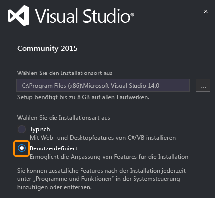
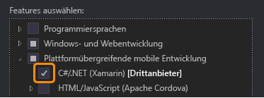

# Setup und Installation
[!INCLUDE[vs2017banner](../code-quality/includes/vs2017banner.md)]

Zum Erstellen von systemeigenen iOS\- Android\- und Windows\-Apps aus einer gemeinsamen C\#\/.NET\-Codebasis mithilfe von Xamarin benötigen Sie die folgenden Komponenten:  
  
-   Für das Arbeiten mit Windows\- und Android\-Apps: einen Windows\-Entwicklungscomputer mit installiertem Visual Studio 2015 und Xamarin 4.  
  
-   Für das Arbeiten mit iOS\-Apps: einen Mac mit OSX Yosemite \(10.10.5\) oder höher, mit installiertem XCode und Xamarin.  
  
-   Eine Xamarin\-Lizenz \(eine 30 Tage lang gültige Testversion ist verfügbar\).  
  
 Sie können die Windows\- und Mac\-Computer gleichzeitig einrichten, und während die Installationsprogramme ausgeführt werden, können Sie eine Xamarin\-Lizenz erwerben und dann [Erfahren Sie mehr über die Entwicklung für mobile Plattformen mit Xamarin](../cross-platform/learn-about-mobile-development-with-xamarin.md) durcharbeiten, um das erforderliche Hintergrundmaterial durchzulesen und anzusehen.  
  
 **In diesem Thema:**  
  
-   [Voraussetzungen](#prereq)  
  
-   [Windows-Setup (Visual Studio und Xamarin)](#windows)  
  
-   [Mac-Setup (Apple ID, Xcode und Xamarin)](#mac)  
  
-   [Xamarin-Lizenz](#license)  
  
##   Voraussetzungen  
  
1.  Für Windows und Android:  
  
    1.  Empfohlen: ein physischer Windows\-Computer \(keine VM\), auf dem Windows 8 oder höher ausgeführt wird, was die Nutzung des schnellen Visual Studio\-Emulators für Android auf Hyper\-V\-Basis ermöglicht. \(Haben wir erwähnt, dass Sie einen physischen Computer benötigen anstelle einer VM?\)  
  
    2.  Sie können einen Computer mit Windows 7 oder früher verwenden, in diesem Fall müssen Sie jedoch den Xamarin Player für Android als Emulator verwenden.  
  
2.  Für iOS:  
  
    1.  Mac oder Mac mini mit OSX Yosemite unter OS X 10.10.5 oder höher \(für Xcode 7.1 erforderlich\).  
  
    2.  Ein Mac ist lediglich zum Entwickeln und Debuggen von iOS\-Apps, zum Anschließen des iOS\-Simulators oder verbundener Geräte sowie zum Verwenden des Storyboard\-Designers zum Entwickeln der Benutzeroberfläche erforderlich. Ältere Modelle sind für diese sekundäre Rolle völlig ausreichend.  
  
##   Windows\-Setup \(Visual Studio und Xamarin\)  
  
1.  [Laden Sie das Installationsprogramm für eine beliebige Edition von Visual Studio 2015 herunter, und führen Sie es aus](https://www.visualstudio.com/en-us/downloads/download-visual-studio-vs.aspx) \(Community, Professional oder Enterprise\). Visual Studio 2015 Community ist die kostenlose Edition; die Editionen Professional und Enterprise können als Testversion für 30 Tage verwendet werden.  
  
    1.  Wenn Visual Studio auf Ihrem System bereits installiert ist, öffnen Sie **Systemsteuerung \> Programme und Features**, wählen Sie das Element **Visual Studio 2015** aus, klicken Sie auf **Ändern**, und fahren Sie mit Schritt 3 unten fort.  
  
2.  Wählen Sie im Installationsprogramm eine **Benutzerdefinierte** Installation aus:  
  
       
  
3.  Aktivieren Sie die folgenden Felder:  
  
    1.  **Plattformübergreifende mobile Entwicklung \> C\#\/.NET \(Xamarin\)**. Dadurch werden unter „Häufig verwendete Tools und Software Development Kits“ auch automatisch verschiedene Android\-Tools ausgewählt.  
  
           
  
    2.  Für Windows 8\+: **Plattformübergreifende mobile Entwicklung \> Microsoft Visual Studio\-Emulator für Android**. Hinweis: Wenn Sie einen Computer mit Windows 7 oder früher verwenden, oder Sie Windows auf einem Mac ausführen, achten Sie darauf, dass es *nicht markiert* ist. Weitere Informationen finden Sie unter „Hinweis zu Emulatoren auf Windows\-Computern“ nach Schritt 5.  
  
    3.  \(Optional\) wenn Sie Windows\-Geräte als Zielplattform vorgesehen haben, aktivieren Sie außerdem **Windows\- und Webentwicklung \> Entwicklungstools für universelle Windows\-Apps** und\/oder **Windows 8.1 und Windows Phone 8.0\/8.1 Tools**. Diese umfassen Optionen zum Installieren von Emulatorimages, deren Download längere Zeit beansprucht; Sie können auch später jederzeit zum Visual Studio\-Installationsprogramm zurückkehren, um sie hinzuzufügen.  
  
4.  Klicken Sie auf die Schaltfläche „Installieren“, und führen Sie den Vorgang aus. Das wird ebenfalls eine Zeit lang dauern; währenddessen können Sie mit den Anweisungen zum Mac\-Setup fortfahren, in diesem Thema eine Xamarin\-Lizenz erwerben und [Erfahren Sie mehr über die Entwicklung für mobile Plattformen mit Xamarin](../cross-platform/learn-about-mobile-development-with-xamarin.md) durcharbeiten.  
  
5.  Starten Sie Visual Studio nach dem Abschluss der Installation, und melden Sie sich mit Ihrem Microsoft\-Konto an, wenn Sie dazu aufgefordert werden \(es handelt sich um das gleiche Konto, das Sie für Windows verwenden\). Suchen Sie anschließend mithilfe von  **Extras \> Optionen \> Xamarin** oder **Extras \> Optionen \> Xamarin \> Sonstige** nach Xamarin\-Updates; dazu dient der Link **Jetzt überprüfen**:  
  
       
  
6.  Laden Sie für Windows 7 und frühere Versionen oder für das Ausführen von Windows auf einem Mac den [Xamarin Android Player für Windows](https://xamarin.com/android-player) herunter, und installieren Sie ihn. Das ist der bevorzugte Android\-Emulator für solche Konfigurationen. Siehe den Hinweis unten.  
  
 **Hinweis zu Emulatoren auf Windows\-Computern:** Da die CPUs jeweils nur eine Virtualisierungstechnologie unterstützen, sollte auf einem Entwicklungscomputer jeweils nur eine eingesetzt werden. Die drei wichtigsten Virtualisierungstechnologien sind Hyper\-V \(das vom Visual Studio Emulator für Android und dem Windows Phone\-Emulator verwendet wird\), Virtual Box \(das vom Xamarin Player für Android und Genymotion verwendet wird\) und Intel HAXM \(das vom Android SDK\-Emulator verwendet wird\). Aufgrund von verschiedenen Problemen zwischen Hyper\-V und Virtual Box sollten auf einem Computer jeweils nur Emulatoren eines dieser Typen verwendet werden; darauf beziehen sich auch die oben genannten Empfehlungen für den Einsatz von Hyper\-V auf Computern mit Windows 8 und höher und Virtual Box\-Emulatoren auf Windows 7 und früher.  
  
##   Mac\-Setup \(Apple ID, Xcode und Xamarin\)  
  
1.  Erstellen Sie eine kostenlose Apple ID unter [https:\/\/appleid.apple.com](https://appleid.apple.com/), wenn Sie noch keine besitzen. Dies ist für die Installation von und die Anmeldung bei Xcode erforderlich.  
  
2.  Laden Sie Xcode von [https:\/\/developer.apple.com\/xcode\/](https://developer.apple.com/xcode/) herunter, installieren Sie Xcode, und fügen Sie Ihre Apple ID so hinzu, wie dies unter [Adding Your Account to Xcode](https://developer.apple.com/library/ios/documentation/IDEs/Conceptual/AppStoreDistributionTutorial/AddingYourAccounttoXcode/AddingYourAccounttoXcode.html) \(apple.com\) beschrieben ist.  
  
3.  Laden Sie Xamarin herunter, und installieren Sie es, indem Sie die Anweisungen unter [Installing and Configuring Xamarin.iOS](http://developer.xamarin.com/guides/ios/getting_started/installation/mac/) \(xamarin.com\) befolgen.  
  
4.  Sobald Sie die Installation von Xamarin auf dem Windows\- und dem Mac\-Computer abgeschlossen haben, folgen Sie den Anweisungen unter [Connecting to the Mac](http://developer.xamarin.com/guides/ios/getting_started/installation/windows/xamarin-mac-agent/) \(xamarin.com\), sodass Sie mit iOS und dem Mac in Visual Studio auf dem Windows\-Computer arbeiten können.  
  
     Beide Computer müssen sich im selben lokalen Netzwerk befinden.  
  
##   Xamarin\-Lizenz  
 Für die Xamarin\-Entwicklung sind ein gültiges Xamarin\-Konto und eine Lizenz erforderlich. Sie werden in Visual Studio beim Erstellen oder Laden von Xamarin\-Projektmappen zur Anmeldung mit dem Xamarin\-Konto aufgefordert.  
  
 Wir empfehlen Ihnen, sich für ein [Xamarin Business Edition Trial](http://developer.xamarin.com/guides/cross-platform/getting_started/beginning_a_xamarin_trial/#Activating_a_Trial_in_Visual_Studio) zu registrieren, durch das Sie 30 Tage lang uneingeschränkten Zugriff auf die Xamarin\-Funktionen erhalten. Für die Auswertung sollten Sie kein Starter\-Konto verwenden, weil dessen Einschränkungen verhindern, dass Ihnen die vollständige Xamarin\-Funktionalität zur Verfügung steht.