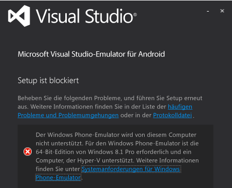
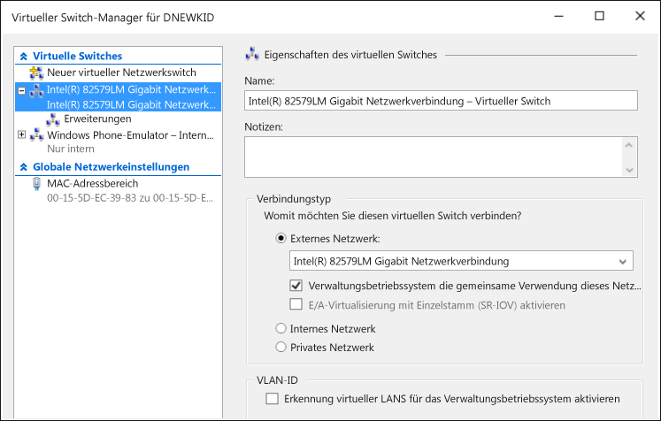

# Problembehandlung beim Visual Studio-Emulator für Android
Dieses Thema enthält Informationen, die Ihnen bei der Lösung von Problemen helfen, die bei der Verwendung des Visual Studio-Emulators für Android auftreten können.

> [!WARNING]
> Wenn der Emulator installiert ist, überprüft das Setup-Programm die Voraussetzungen für die Ausführung der Software. Es zeigt Warnungen an, wenn die erforderlichen Komponenten nicht vorhanden sind, es benötigt sie jedoch nicht für die Installation.

 Dieses Thema enthält folgende Abschnitte:

- [Vor der Installation](#BeforeYouStart)

- [Fehler bei der Installation des Emulators](#NoInstall)

- [Keine Verbindung zu Netzwerk-Zielen in einer Domäne oder im Unternehmensnetzwerk](#DomainNetwork)

- [Keine Verbindung zu Netzwerk-Zielen möglich, wenn die Netzwerkeinstellungen eine manuelle Konfiguration erfordern](#ManualNetworkConfig)

- [Der Emulator startet langsam, kann wegen einer Zeitüberschreitung nicht gestartet werden oder bei der App-Bereitstellung ist ein Fehler aufgetreten](#SlowStart)

- [Fehler beim Starten des Emulators](#NoStart2)

- [Emulator fails to start (first use)](#NoStart)

- [Der Computer kann nach der Installation des Emulators nicht mehr gestartet werden](#NoBoot)

- [Visual Studio hängt bei dem Versuch, die App auf dem Emulator bereitzustellen, oder der Emulator wird in anderen IDEs nicht als Debugziel angezeigt](#ADB)

- [Der Emulator hängt, da er den UDP-Port nicht einrichten konnte](#XamarinPlayer)

- [Der Debugger kann nicht an ein Xamarin-Projekt angefügt werden](#Skylake)

- [Fehler beim Ausführen einer App, die Google Play-Dienste benötigt, durch den Emulator](#GooglePlay)

- [Es ist jedoch nicht möglich, eine Datei, ein APK oder eine flashbare ZIP-Datei per Drag-and-Drop zu verschieben.](#DragAndDrop)

- [Auflösung des Screenshots ist falsch](#Resolution)

- [Beim Rendern der OpenGL-Inhalte durch den Emulator ist ein Fehler aufgetreten](#OpenGL)

- [Der Emulator reagiert nicht auf Multitouch-Gesten](#Multitouch)

- [Supportressourcen](#Support)

##  Vor der Installation
 Bevor Sie mit der Problembehandlung beginnen, kann es sinnvoll sein, folgende Themen zu überprüfen:

- [Systemanforderungen für den Visual Studio-Emulator für Android](../cross-platform/system-requirements-for-the-visual-studio-emulator-for-android.md)

##  Fehler bei der Installation des Emulators
 Wenn Hyper-V auf Ihrem System nicht installiert ist, wird bei dem Versuch, den Emulator zu installieren, die folgende Meldung angezeigt: Sie müssen einen Computer verwenden, der HyperV unterstützt, und HyperV muss aktiviert sein.

 

> [!NOTE]
> Diese Meldung betrifft sowohl den Visual Studio Emulator für Android als auch den Windows Phone-Emulator. Windows 8.1 und Windows 10 unterstützen den Emulator

 Wenn diese Meldung angezeigt wird, überprüfen Sie die [Systemanforderungen für den Visual Studio-Emulator für Android](../cross-platform/system-requirements-for-the-visual-studio-emulator-for-android.md), um zu prüfen, ob Sie den Emulator ausführen können.

##  Keine Verbindung zu Netzwerk-Zielen in einer Domäne oder im Unternehmensnetzwerk
 Der Visual Studio-Emulator für Android wird im Netzwerk als separates Gerät mit eigener IP-Adresse angezeigt. Es ist mit keiner Windows-Domäne verknüpft und das Gerät gibt keine Domänen- oder Arbeitsgruppen-Anmeldeinformationen auf dem Hostcomputer frei.

 Wenn Ihr Netzwerk eine Domänen- oder Arbeitsgruppen-Autorisierung für die grundlegende Netzwerk- und Internetkonnektivität erfordert, wenden Sie sich wegen einer Ausnahme an Ihren IT-Administrator. Mithilfe dieser Ausnahme kann Ihr Entwicklungscomputer als Grenzcomputer dienen und zum Akzeptieren von nicht der Domäne beigetretenen Netzwerkgeräten verwendet werden.

 Der Visual Studio-Emulator für Android verwendet einen eigenen Satz von MAC-Adressen. Wenn Sie über den Emulator nicht auf Netzwerk- oder Internetressourcen zugreifen können, wenden Sie sich an Ihren IT-Administrator, um sicherzustellen, dass die MAC-Adressen des Emulators in Ihrem Netzwerk autorisiert wurden.

#### So zeigen Sie die MAC-Adressen des Emulators an

1. Ausführen des Emulators

2. Klicken Sie in der Symbolleiste des Emulators auf die Chevronschaltfläche (>>), um das Fenster „zusätzliche Tools“ zu öffnen.

3. Klicken Sie im Fenster „zusätzliche Tools“ auf die Registerkarte „Netzwerk“.

4. Suchen Sie auf der Seite „Netzwerk“ die physische Adresseinträge aus.

##  Keine Verbindung zu Netzwerk-Zielen möglich, wenn die Netzwerkeinstellungen eine manuelle Konfiguration erfordern
 Zum Herstellen einer Verbindung zu Netzwerk-Zielen über den Emulator muss Ihr Netzwerk folgende Anforderungen erfüllen:

- DHCP. Emulator erfordert DHCP, da er sich selbst als separates Gerät im Netzwerk mit eigener IP-Adresse konfiguriert.

- Automatisch konfigurierte DNS- und Gateway-Einstellungen. Es ist nicht möglich, DNS- und Gateway-Einstellungen für den Emulator manuell zu konfigurieren.

  Wenn Ihr Netzwerk manuell konfigurierte Einstellungen erfordert, wenden Sie sich an Ihren IT-Administrator, um zu bestimmen, wie Sie die Netzwerkkonnektivität für den Emulator aktivieren können.

##  Der Emulator startet langsam, kann wegen einer Zeitüberschreitung nicht gestartet werden oder bei der App-Bereitstellung ist ein Fehler aufgetreten
 Unter bestimmten Bedingungen dauert der Start des Emulators einige Minuten oder beim Starten ist aufgrund einer Zeitüberschreitung ein Fehler aufgetreten. Wenn der Emulator nicht gestartet werden kann, wird folgende Meldung angezeigt: `App deployment failed. Please try again`. Folgende Bedingungen können zu diesem Fehler führen.

- Das Ausführen des Visual Studio-Emulators für Android über eine startfähige, virtuelle Festplatte. Diese Konfiguration wird nicht unterstützt.

- Eine fehlerhafte Festplatte. Erwägen Sie, das CHKDSK-Programm auszuführen.

- Eine Festplatte, die defragmentiert werden muss. Erwägen Sie, das Laufwerk zu defragmentieren.

- Eine Festplatte, die fast voll ist. Überprüfen Sie den auf dem Laufwerk verfügbaren Speicherplatz.

- Aufgrund von anderen ausgeführten Anwendungen ist nicht genügend Arbeitsspeicher verfügbar. Reduzieren Sie die Anzahl der Anwendungen, die Arbeitsspeicher verbrauchen, oder erhöhen die Größe des Arbeitsspeichers.

- In der Regel alle Faktoren, die zu einer Leistungsschwächung des Systems beitragen. Beginnen Sie die Problembehandlung mit der Komponente, die die niedrigste Bewertung im Windows-Leistungsindex besitzt, diesen finden Sie auf der Seite "Leistungsinformationen und Tools" der Systemsteuerung.

##  Fehler beim Starten des Emulators
 Wenn der Emulator zuvor funktioniert hat, aber jetzt nicht funktioniert, arbeiten Sie die folgenden Aufgaben durch. Wenn Sie den Emulator zum ersten Mal verwenden, lesen Sie [Emulator fails to start (first use)](#NoStart) , bevor Sie die nächsten Schritte ausführen.

- Entfernen Sie alle anderen Hyper-V-Instanzen des Emulators.

    1. Schließen Sie Visual Studio.

    2. Öffnen Sie den Hyper-V-Manager, und beenden Sie alle Hyper-V-Instanzen des Emulators (virtuelle Computer), die bereits ausgeführt werden und möglicherweise beschädigt sind.

    3. Löschen Sie im Hyper-V-Manager alle anderen Emulator-VMs.

    4. Starten Sie den Computer neu.

- Stellen Sie sicher, dass Sie über mindestens 4 GB Systemspeicher verfügen und dass diese nicht von anderen ressourcenintensiven Programmen und Prozessen in Anspruch genommen werden (versuchen Sie z.B. alle Browserfenster zu schließen).

- Öffnen Sie im Hyper-V-Manager den Manager für virtuelle Switches, und überprüfen Sie, ob zwei Netzwerkswitches vorhanden sind; überprüfen Sie, ob der erste der interne Switch und der zweite der externe Switch ist.

     

     Wenn das Setup fehlerhaft ist und Sie Windows 10 verwenden, können Sie versuchen, [Netzwerkgeräte mit dem Befehl netcfg –d erneut zu installieren](http://windows.microsoft.com/windows-10/fix-network-connection-issues) (Abschnitt 6).

- Wenn sich das Problem mit diesen Schritten nicht beheben lässt, finden Sie unter [Emulator fails to start (first use)](#NoStart) Informationen zur Software von Drittanbietern, die möglicherweise zu Konflikten mit dem Emulator führen.

##  Emulator fails to start (first use)
 Wenn der Emulator nicht gestartet wird, gehen Sie die folgenden Aufgaben durch, um das Problem zu ermitteln und zu beheben.

- Stellen Sie sicher, dass die Mindesthardwareanforderungen erfüllt sind und die BIOS-Einstellungen korrekt sind.

   Der Emulator und Windows 8-Hyper-V benötigen einen 64-Bit-Prozessor mit Second Level Address Translation (SLAT). Für Intel benötigen Sie im Wesentlichen einen Prozessor des Typs Core i3, i5 oder i7 (oder einer der Prozessoren der Xeons-Reihe). Eine Liste der AMD-Chips finden Sie [hier](http://support.amd.com/en-us).

  1. Stellen Sie sicher, dass Ihr Computer die [Systemanforderungen](../cross-platform/system-requirements-for-the-visual-studio-emulator-for-android.md)erfüllt.

  2. Überprüfen Sie, ob das [SLAT-Tool](https://slatstatuscheck.codeplex.com/) meldet, dass Ihr Computer SLAT-fähig ist.

  3. Vergewissern Sie sich in den BIOS-Einstellungen Ihres Computers, dass alle Virtualisierungstechnologien aktiviert sind. Die genauen BIOS-Beschreibungen können je nach Hardwarehersteller variieren. Aktivieren Sie folgende Funktionen:

     - SLAT (Second Level Address Translation)

     - EPT (Extended Page Tables) (Intel)

     - NPT (Nested Page Tables) (AMD)

     - RVI (Rapid Virtualization Indexing) (AMD)

     - VMX (ein Intel-Akronym für die Angabe hardwaregestützter Virtualisierungsunterstützung)

     - SMX (ein AMD-Akronym für die Angabe hardwaregestützter Virtualisierungsunterstützung)

     - XD (Execute Disable) (Intel); Diese Funktion muss aktiviert sein

     - NX (No Execute)(AMD); Diese Funktion muss aktiviert sein.

  4. Wenn Sie die folgenden Optionen im BIOS aktiviert sind, deaktivieren Sie sie.

     - Deaktivieren von Intel VT-d

     - Deaktivieren der vertrauenswürdigen Ausführung

       Weitere Informationen finden Sie in diesem Artikel: TechNet: Hyper-V: How to Fix BIOS Errors Enabling Hyper-V (Beheben von BIOS-Fehlern beim Aktivieren von Hyper-V)

  5. Stellen Sie sicher, dass Sie über mindestens 4 GB Systemspeicher verfügen und, dass sie nicht von anderen ressourcenintensiven Programmen und Prozessen in Anspruch genommen werden.

  6. Stellen Sie sicher, dass Sie Windows 8 Professional oder höher einsetzen (Windows Server 2008 wird nicht unterstützt). Windows Server 2012 wird unterstützt, Sie müssen jedoch die Desktopdarstellung aktivieren.

     Sie können die Ereignisanzeige prüfen, um festzustellen, ob Hypervisor-Fehler vorliegen. Öffnen Sie dazu die Ereignisanzeige (drücken Sie **START**+**R**, und geben Sie anschließend `eventvwr` ein), klicken Sie auf **Windows-Protokolle** > **System**. Filtern Sie das Protokoll anschließend nach Ereignisquelle, indem Sie die Quelle auf **Hyper-V-Hypervisor**setzen. Führen Sie eine Fehlerprüfung durch, um die Ursache zu ermitteln.

     Wenn Ihr Prozessor die Mindestanforderungen erfüllt, der Hypervisor jedoch weiterhin einen Fehler erzeugt, bringen Sie in Erfahrung, ob ein BIOS-Upgrade für Ihren Computer verfügbar ist. Sofern vorhanden, und Sie sich für eine Aktualisierung entscheiden, vergewissern Sie sich, dass Sie dabei alle Vorsichtsmaßnahmen des Herstellers beachten (z. B. indem Sie dafür sorgen, dass die BIOS-Firmware-Aktualisierung nicht durch einen Stromausfall unterbrochen wird, der dauerhaft zur Beschädigung des BIOS führen kann).

- Stellen Sie sicher, dass Sie über mindestens 4 GB Systemspeicher verfügen und, dass sie nicht von anderen ressourcenintensiven Programmen und Prozessen in Anspruch genommen werden.

- Entfernen oder deaktivieren Sie Drittanbieter-Treiber oder Software, die virtuelle Netzwerke beeinträchtigen kann.

   Es gibt einige bekannte Probleme mit einigen unter Windows 8 installierten Produkten von Drittanbietern, wie z. B. Netzwerktreiber/-protokolle, die mit dem Hyper-V-Netzwerkstapel vollständig kompatibel sind.

   Im Allgemeinen ist es an den Entwicklern der Produkte, die Software zu aktualisieren, damit sie mit Windows 8 und Hyper-V kompatibel ist.

   Für folgende Produkte müssen Sie möglicherweise Upgrades durchführen, damit sie mit Windows 8 kompatibel sind: VirtualBox, Virtual PC 7, VMWare, einige VPN-Clients, Softwarefirewalls, einige Versionen von Cisco-VPN-Clients und andere Virtualisierungssysteme. Arbeiten Sie mit dem Entwickler der verdächtigen Virtualisierungssoftware zusammen, um sie dazu zu bewegen, die Software zu aktualisieren, damit sie mit Windows 8 und Hyper-V kompatibel ist.

   Als *Problemumgehung* können Sie alle Treiber und Anwendungen von Drittanbietern deaktivieren, die zu einer Störung des vom Emulator für die Kommunikation mit Visual Studio verwendeten virtuellen Netzwerks führen kann. Diese Anwendungen können Folgendes umfassen:

  - Antivirus-Anwendungen (die in den Netzwerkstapel integriert werden)

  - Tools für die Netzwerküberwachung

  - Tools für die Netzwerkprotokollierung

  - Andere Systemüberwachungssoftware

    Eine andere mögliche Problemumgehung neben der Deinstallation der fraglichen Produkte (und Anfrage beim Produkt-Entwickler wegen der Veröffentlichung einer aktualisierten Version) besteht darin, folgende Schritte ausführen.

  1. Starten Sie den Manager für Netzwerkverbindungen (Geben Sie auf dem Startbildschirm `View Network Connections` ein und wählen Sie diese Option, um die Netzwerkverbindungen anzuzeigen).

  2. Wählen Sie für den vEthernet-Adapter (Port Windows Phone Emulator – interner Switch) **Eigenschaften** aus dem Kontextmenü.

      

      Hier werden die Eigenschaften des Adapters angezeigt.

      

  3. Für diesen Adapter sollten nur die folgenden Elemente unter **diese Verbindung verwendet folgende Elemente** ausgewählt werden:

     - Client für Microsoft-Netzwerke

     - QoS-Paketplaner

     - Datei- und Druckerfreigabe für Microsoft-Netzwerke

     - Microsoft LLDP-Protokolltreiber

     - E/A-Treiber für Verbindungsschicht-Topologieerkennungszuordnung

     - Antwort für Verbindungsschicht-Topologieerkennung

     - Internetprotokoll Version 6 (TCP/IPv6)

     - Internetprotokoll Version 4 (TCP/IPv4)

  4. Deaktivieren Sie die Auswahl aller anderen Elemente.

     Der Nachteil von dieser Technik ist, dass bei der Installation nicht unterstützter Treiber durch ein Drittanbieterprodukt oder bei der Installation des Emulators diese Schritte wiederholt werden müssen.

     Nach der Deinstallation der Drittanbieterprodukte müssen Sie möglicherweise den internen Switch des Windows Phone-Emulators wiederherstellen. Vorgehensweise:

  - Öffnen Sie Hyper-V und wechseln Sie zum Manager für virtuelle Switches. Erstellen Sie einen virtuellen Switch mit dem Namen „Windows Phone-Emulator, interner Switch“, und setzen Sie den Verbindungstyp auf **internes Netzwerk**.

     

    Starten Sie jetzt den Emulator. Es sollte funktionieren.

##  Der Computer kann nach der Installation des Emulators nicht mehr gestartet werden
 Dieses Problem kann auftreten, wenn folgende Bedingungen erfüllt sind:

- Ihr Computer verfügt über ein Gigabyte-Motherboard

- USB3 ist auf dem  Motherboard aktiviert.

  Deaktivieren Sie USB3 in den BIOS-Einstellungen des Motherborads und starten Sie den Computer neu, um dieses Problem zu lösen. Prüfen Sie dann, ob Gigabyte ein Update für das BIOS Ihres Motherboards veröffentlicht hat.

  Weitere Informationen finden Sie in folgendem Artikel in der Wissensdatenbank: [Boot failure after installation of Hyper-V role on Gigabyte systems (Startfehler nach der Installation der Hyper-V-Rolle auf GIGABYTE-Systemen)](https://support.microsoft.com/en-us/kb/2693144).

##  Visual Studio hängt bei dem Versuch, die App auf dem Emulator bereitzustellen, oder der Emulator wird in anderen IDEs nicht als Debugziel angezeigt
 Wenn der Emulator ausgeführt wird, jedoch anscheinend nicht mit der ADB (Android Debug Bridge) verbunden ist oder in Android-Tools nicht angezeigt wird, die ADB verwenden (z. B. Android Studio oder Eclipse), müssen Sie möglicherweise den Ort anpassen, an dem der Emulator nach ADB sucht. Der Emulator verwendet zum Ermitteln des Speicherorts Ihres Android SDK einen Registrierungsschlüssel und sucht in dem Verzeichnis nach der \platform-tools\adb.exe-Datei. So ändern Sie den vom Emulator verwendeten Android-SDK-Pfad:

- Öffnen Sie den Registrierungs-Editor, indem Sie im Kontextmenü der Startschaltfläche **Ausführen** auswählen, im Dialogfeld `regedit` eingeben und **OK**auswählen.

- Navigieren Sie links in der Ordnerstruktur zu *HKEY_LOCAL_MACHINE\SOFTWARE\Wow6432Node\Android SDK Tools*.

- Ändern Sie die **Pfad** -Registrierungsvariable, damit Sie mit dem Pfad Ihres Android-SDK übereinstimmt.

  Starten den Emulator neu, nun sollte Ihnen angezeigt werden, dass der Emulator mit ADB und entsprechenden Android-Tools verbunden ist.

##  Der Emulator hängt, da er den UDP-Port nicht einrichten konnte
 Dieses Problem tritt möglicherweise aufgrund von Inkompatibilität mit Xamarin Player auf. Wenn der Emulator nicht zu reagieren scheint oder Sie die Fehlermeldung „The emulator is unable to connect to the device operating system: Couldn't set up the UDP port.  Einige Funktionen sind möglicherweise deaktiviert“, liegt bei Ihnen möglicherweise dieses Problem vor. Führen Sie die folgenden Schritte aus:

1. Deinstallieren Sie Xamarin

2. Vergewissern Sie sich, dass Virtual Box entfernt wurde (Xamarin Player wird in Virtual Box ausgeführt).

3. Wechseln Sie zum Geräte-Manager, wählen Sie die Option zum Anzeigen von ausgeblendeten Geräten aus, und löschen Sie alles mit Ausnahme der physischen Netzwerkkarten.

4. Nachdem Sie alle nicht physischen Netzwerkadapter entfernt haben, können Sie versuchen, Hyper-V zu deinstallieren und erneut zu installieren.

##  Debugger kann nicht an ein Xamarin-Projekt angefügt werden
 Wenn Sie Windows 10 mit Intel Skylake-Prozessoren nutzen, können Xamarin-Apps möglicherweise nicht im Emulator ausgeführt werden oder der Visual Studio-Debugger kann nicht an sie angefügt werden. Der Grund dafür ist ein Problem mit Hyper-V und Skylake-Prozessoren. Führen Sie zur Problemumgehung folgende Schritte aus.

1. Öffnen Sie den Hyper-V-Manager und wählen Sie den virtuellen Computer für das Emulatorprofil aus, das Sie verwenden.

2. Wählen Sie **Delete Saved State** (Gespeicherten Status löschen) aus (unten rechts).

3. Wählen Sie **Settings...** (Einstellungen...).

4. Erweitern Sie den Prozessorknoten und wählen Sie **Kompatibilität**.

5. Aktivieren Sie **Migrate to a physical computer with a different processor version** (Zu einem physischen Computer mit einer anderen Prozessorversion migrieren).

6. Starten Sie den Dienst neu (unter **Actions**(Aktionen)) und versuchen Sie es erneut.

##  Fehler beim Ausführen einer App, die Google Play-Dienste benötigt, durch den Emulator
 Der Emulator wird nicht mit den Bibliotheken für Google Play-Dienste bereitgestellt. Der Emulator unterstützt jedoch die Drag-and-Drop-Installation von flashbaren ZIP-Dateien.

##  Es ist jedoch nicht möglich, eine Datei, ein APK oder eine flashbare ZIP-Datei per Drag-and-Drop zu verschieben.
 Der Emulator verwendet die ADB.exe, um die Dateiübertragung beim Ausführen von Drag & Drop einer Datei auf dem Bildschirm zu vereinfachen. Wenn beim Drag & Drop einer Datei ein Fehler auftritt, liegt das wahrscheinlich daran, dass der Emulator nicht mit der ADB.exe verbunden ist. Führen Sie zum Beheben des Fehlers die Schritte unter [Visual Studio hängt bei dem Versuch, die App auf dem Emulator bereitzustellen, oder der Emulator wird in anderen IDEs nicht als Debugziel angezeigt](#ADB).

##  Auflösung des Screenshots ist falsch
 Wenn Sie mit der Registerkarte „Screenshot“ im Fenster **zusätzliche Tools** einen Screenshot ersteleln und die erzeugte Datei eine unerwartete Größe besitzt, müssen Sie möglicherweise die Zoomstufe des Bildschirms anpassen, bevor Sie auf **Aufnehmen**klicken. Der Emulator erstellt Screenshots in der Auflösung des Bildschirms auf Ihrem Host-PC-Monitor.

##  Beim Rendern der OpenGL-Inhalte durch den Emulator ist ein Fehler aufgetreten
 Der Emulator rendert OpenGL-Inhalte mithilfe des GPU des Host-Computers und verwendet das ANGLE-Projekt zum Konvertieren dieser Aufrufe in und aus DirectX. Wenn die Anwendung auf einem Gerät ordnungsgemäß, jedoch im Emulator falsch rendert, liegt das wahrscheinlich daran, dass das Gerät den falschen OpenGL-Aufruf (z. B. anhand von Shader-Variablen, die nicht übereinstimmen) mindert.

##  Der Emulator reagiert nicht auf Multitouch-Gesten
 In einigen Fällen startet der Emulator und reagiert nicht auf Multitouch-Gestern über die direkte Interaktion Ihrer berührungsgesteuerten Anzeige oder mithilfe eines Multi-Touch-Tools in der Symbolleiste des Emulators. Wenn dies der Fall ist, klicken Sie in der Emulator-Symbolleiste auf die Schaltfläche **Drehen** , und versuchen Sie die Multi-Touch-Geste erneut zu verwenden. Wenn das Problem weiterhin besteht, informieren Sie sich im Thema [Beim Rendern der OpenGL-Inhalte durch den Emulator ist ein Fehler aufgetreten](#OpenGL) .

##  Supportressourcen
 Wenn Ihr Hostcomputer die Systemanforderungen erfüllt und Sie ein Problem feststellen, das in diesem Handbuch zur Problembehandlung nicht erörtert wird, müssen Sie Folgendes vornehmen:

- Stellen Sie eine Frage zu StackOverflow unter Verwendung der Tags [android-emulator](http://stackoverflow.com/questions/tagged/android-emulator) und "visual-studio".

- Melden Sie ein Problem mithilfe des Tools „Lächeln senden“ in Visual Studio oder im Emulator-Manager.