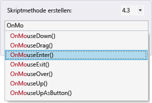
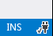
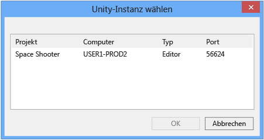

# Verwenden von Visual Studio Tools f&#252;r Unity
[!INCLUDE[vs2017banner](../code-quality/includes/vs2017banner.md)]

In diesem Abschnitt erfahren Sie, wie Sie die Integrations\- und Produktivitätsfeatures von Visual Studio\-Tools für Unity und den Visual Studio\-Debugger für die Unity\-Entwicklung einsetzen.  
  
## Unity\-Integration und Produktivität  
 Visual Studio\-Tools für Unity ist in den Unity\-Editor integriert, damit Sie produktiver arbeiten können.  Diese Features zur Steigerung der Produktivität dienen zum Automatisieren allgemeiner Skripterstellungsaufgaben und Einbinden von Informationen aus Unity in Visual Studio, damit Sie nicht zum Unity\-Editor wechseln müssen, um sie zu finden.  
  
### Zugriff auf die Unity\-Dokumentation  
 Sie können in Visual Studio schnell auf die Dokumentation zur Erstellung von Unity\-Skripts zugreifen.  Wenn Visual Studio\-Tools für Unity die API\-Dokumentation lokal nicht finden kann, wird versucht, sie online zu finden.  
  
##### So greifen Sie auf die Unity\-Dokumentation zu  
  
-   Platzieren Sie in Visual Studio den Cursor über der Unity\-API, zu der Sie Informationen wünschen, und drücken dann **STRG\+ALT\+M, STRG\+H**.  
  
### Unity MonoBehavior\-Assistent für das Erstellen von Skripts  
 In Unity werden die meisten Skripts durch Ableitung von der "MonoBehavior"\-Klasse und Überschreiben einiger ihrer Methoden implementiert.  Mithilfe des MonoBehavior\-Assistenten können Sie schnell leere Definitionen der "MonoBehavior"\-Methoden erstellen, die überladen werden sollen.  Mit diesem Assistenten können Sie aus der Liste der verfügbaren Methoden eine oder mehrere Methoden angeben, die Sie überladen möchten. Außerdem können Sie auswählen, wo sie in Ihren Code eingefügt werden, und entscheiden, ob Sie Kommentare zu ihrer Verwendung einschließen möchten.  
  
   
  
##### So erstellen Sie mit dem MonoBehavior\-Assistenten leere "MonoBehavior"\-Methodendefinitionen  
  
1.  Positionieren Sie in Visual Studio den Cursor an der Stelle, an der die Methoden eingefügt werden sollen, und drücken **STRG\+UMSCHALT\+M**, um den MonoBehavior\-Assistenten zu starten.  Oder wenn Sie die neuen Methoden hinter einer bereits implementierten Methode einfügen möchten, können Sie dies später angeben. Drücken Sie einfach **STRG\+UMSCHALT\+M**.  
  
2.  Wählen Sie die Methoden aus, die Sie überladen möchten.  Aktivieren Sie im Fenster **Skriptmethoden erstellen** unter **Zu erstellende Methoden auswählen** das Kontrollkästchen neben dem Namen der einzelnen Methoden, die überladen werden sollen.  
  
3.  Stellen Sie sicher, dass die Frameworkversion, die in der Dropdownliste **Frameworkversion** angezeigt wird, der Version entspricht, die Sie verwenden.  Falls keine Übereinstimmung vorliegt, ändern Sie den Wert in der Dropdownliste in die Version, die Sie verwenden möchten.  
  
4.  Wählen Sie aus, wo die Methoden eingefügt werden sollen.  Standardmäßig werden die Methoden an der Position des Cursors eingefügt. Wenn Sie sie an anderer Stelle einfügen möchten, können Sie sie nach jeder Methode einfügen, die bereits in Ihrer Klasse implementiert ist.  Um eine dieser Stellen auszuwählen, ändern Sie den Wert in der Dropdownliste **Einfügemarke** in die gewünschte Stelle.  
  
5.  Wenn Sie möchten, dass der Assistent Kommentare für die Methoden generiert, die Sie ausgewählt haben, markieren Sie das Kontrollkästchen **Methodenkommentare generieren**.  Diese Kommentare sollen Ihnen helfen zu verstehen, wann die Methode aufgerufen wird und was ihre allgemeinen Aufgaben sind.  
  
6.  Klicken Sie auf die Schaltfläche **OK**, um den Assistenten zu beenden und die Methoden in Ihren Code einzufügen.  
  
 Der MonoBehavior\-Assistent ist besonders hilfreich, solange Sie sich noch mit der Unity\-API vertraut machen oder wenn Sie eine Methode überladen müssen, die Sie noch nicht kennen.  Sobald Sie mehr Erfahrung mit der Unity\-API haben, empfiehlt es sich ggf., den Quick MonoBehavior\-Assistenten für das schnelle Erstellen von Methoden zu verwenden, mit denen Sie bereits vertraut sind.  
  
#### Quick MonoBehavior\-Assistent für das Erstellen von Skripts  
 Wenn Sie bereits mit der Unity\-API vertraut sind, können Sie mithilfe des Quick MonoBehavior\-Assistenten überladene Methoden sogar noch schneller implementieren.  Mit diesem Assistenten können Sie die gewünschte Methode angeben, die ohne Methodenkommentare an der Cursorposition eingefügt wird.  
  
   
  
###### So erstellen Sie mit dem Quick MonoBehavior\-Assistenten eine leere MonoBehavior\-Methodendefinition  
  
1.  Positionieren Sie in Visual Studio den Cursor an der Stelle, an der die Methode eingefügt werden soll, und drücken **STRG\+UMSCHALT\+Q**, um den QuickMonoBehavior\-Assistenten zu starten.  Im Gegensatz zu den anderen MonoBehavior\-Assistenten müssen Sie den Cursor absichtlich positionieren, wenn Sie diesen Assistenten verwenden, da die neue Methode immer an dieser Stelle eingefügt wird.  
  
2.  Stellen Sie sicher, dass die Frameworkversion, die rechts oben im Fenster **Skriptmethode erstellen** angezeigt wird, der Version entspricht, die Sie verwenden.  Falls keine Übereinstimmung vorliegt, ändern Sie den Wert in der Dropdownliste in die Version, die Sie verwenden möchten.  
  
3.  Suchen Sie die Methode, die überladen werden soll.  Beginnen Sie im Fenster "Skriptmethode erstellen" mit der Eingabe des Namens der Methode in das Textfeld.  Eine Liste der Methoden, deren Namen mit Ihrer Eingabe übereinstimmen, wird angezeigt.  
  
4.  Wählen Sie die Methode, die überladen werden soll.  Wenn Sie die gewünschte Methode in der Liste angezeigt wird, wählen Sie sie mit der Maus oder den Pfeiltasten aus, und drücken Sie dann **EINGABETASTE**.  Wenn die Liste nur eine Methode enthält, können Sie einfach die **EINGABETASTE** drücken.  Die Methode wird in Ihren Code eingefügt.  
  
### Unity\-Projekt\-Explorer  
 Im Unity\-Projekt\-Explorer können Sie innerhalb von Visual Studio zu Ihrem Unity\-Projekt navigieren.  
  
   
  
##### So zeigen Sie den Unity\-Projekt\-Explorer an  
  
-   Wählen Sie in Visual Studio im Hauptmenü **Ansicht**, **Unity\-Projekt\-Explorer**.  Tastatur: **ALT\+UMSCHALT\+E**  
  
       
  
 Im Unity\-Projekt\-Explorer werden alle Unity\-Projektdateien und \-verzeichnisse auf die gleiche Weise wie im Unity\-Editor angezeigt. Dies unterscheidet sich vom Navigieren durch Ihre Unity\-Skripts im Projektmappen\-Explorer, der nur Ihre Skriptdateien enthält und diese als die Projekte und Projektmappen so angezeigt, wie sie von Visual Studio Tools für Unity generiert und organisiert werden.  Besonders bei großen Projekten ist es oft einfacher, das zu ändernde Skript im Unity\-Projekt\-Explorer zu suchen, der auch das Ändern anderer Dateitypen in Visual Studio vereinfacht, z. B. textbasierter Konfigurationsdateien, ohne diese einem der Projekte in der Visual Studio\-Projektmappe hinzuzufügen.  
  
### Unity\-Fehlerliste  
 Sie können Meldungen in der Unity\-Konsole innerhalb von Visual Studio anzeigen, wenn eine Verbindung mit einer Unity\-Instanz besteht.  Dies schließt Fehler und Warnungen von Unity ein.  Die Meldungen werden im Visual Studio\-Fenster **Fehlerliste** angezeigt. Fehlermeldungen von Unity werden auf der Registerkarte **Fehler** angezeigt. Warnmeldungen werden auf der Registerkarte **Warnungen** angezeigt. Andere Meldungen, z. B. von der Debug.Log Unity\-API gesendete, werden auf der Registerkarte **Meldungen** angezeigt.  
  
 Zum Anzeigen der Meldungen muss Ihr Unity\-Projekt [Debuggen eines Projekts in einem Unity-Player](#debugging-your-project-in-a-unity-player),d. h. es muss das Debuggen von Skripts unterstützen und das Visual Studio\-Tools für Unity\-Paket importiert haben, das Ihrer Version von Visual Studio entspricht. Außerdem muss Visual Studio [Verbinden von Visual Studio mit Unity](#connecting-visual-studio-to-unity).  
  
 Wenn Sie keine Fehler, Warnungen und Meldungen von Unity in Visual Studio im Fenster **Fehlerliste** anzeigen möchten, deaktivieren Sie die Anzeige im Menü "Konfiguration".  
  
### Tastenkombinationen  
 Über Tastenkombinationen können Sie schnell auf die Unity\-Tools für Visual Studio\-Funktionalität zugreifen.  Hier eine Übersicht über die verfügbaren Tastenkombinationen.  
  
|Befehl|Verknüpfung|Name des Kontextmenübefehls|  
|------------|-----------------|---------------------------------|  
|Den MonoBehavior\-Assistenten öffnen|**Strg\+Umschalt\+M**|**EditorContextMenus.CodeWindow.ImplementMonoBehaviours**|  
|Den Quick MonoBehavior\-Assistenten öffnen|**Strg\+Umschalt\+Q**|**EditorContextMenus.CodeWindow.QuickMonoBehaviours**|  
|Den Unity\-Projekt\-Explorer öffnen|**ALT\+UMSCHALT\+E**|**View.UnityProjectExplorer**|  
|Auf Unity\-Dokumentation zugreifen|**STRG\+ALT\+M, STRG\+H**|**Help.UnityAPIReference**|  
|An Unity\-Debugger \(Player oder Editor\) anfügen|***Kein Standard***|**Debug.AttachUnityDebugger**|  
  
 Sie können die Tastenkombinationen ändern, wenn Ihnen die Standardeinstellung nicht gefällt.  Informationen zum Ändern finden Sie unter [Identifizieren und Anpassen von Tastenkombinationen in Visual Studio](https://msdn.microsoft.com/en-us/library/5zwses53.aspx).  
  
## Debuggen von Unity  
 Mit Visual Studio\-Tools für Unity können Sie Editor\- und Spielskripts für Ihr Unity\-Projekt mit dem leistungsfähigen Debugger von Visual Studio debuggen.  
  
###   Verbinden von Visual Studio mit Unity  
 Visual Studio\-Tools für Unity kommuniziert mit Unity über eine UDP\-Verbindung.  Dies bedeutet, dass Sie stets gleich eine Verbindung mit einer Unity\-Instanz herstellen können, die lokal oder irgendwo im Netzwerk ausgeführt werden kann.  Im Dialogfeld **Unity\-Instanz auswählen** können Sie eine Verbindung mit allen Unity\-Instanzen herstellen, die Sie in Ihrem Netzwerk sehen.  
  
##### So öffnen Sie das Dialogfeld "Unity\-Instanz auswählen"  
  
-   Wählen Sie in Visual Studio im Hauptmenü **Debuggen**, **Unity\-Debugger anfügen** aus.  
  
       
  
-   *Oder* klicken Sie in Visual Studio auf der Statusleiste rechts unten auf das Steckersymbol.  
  
       
  
> [!TIP]
>  Wenn das Steckersymbol mit einem Häkchen angezeigt wird, sind Sie bereits mit einer Unity\-Instanz verbunden.  
  
 Das Dialogfeld **Unity\-Instanz auswählen** zeigt Informationen zu jeder Unity\-Instanz, mit der Sie eine Verbindung herstellen können.  
  
   
  
 **Projekt**  
 Der Name des Unity\-Projekts, das in dieser Instanz von Unity ausgeführt wird.  
  
 **Computer**  
 Der Name des Computers oder Geräts, auf dem diese Unity\-Instanz ausgeführt wird.  
  
 **Typ**  
 **Editor**, wenn diese Instanz von Unity im Unity\-Editor ausgeführt wird, oder **Player**, wenn diese Instanz von Unity ein eigenständiger Player ist.  
  
 **Port**  
 Die Portnummer für den UDP\-Socket, über den diese Instanz von Unity kommuniziert.  
  
> [!IMPORTANT]
>  Da Visual Studio\-Tools für Unity und die Unity\-Instanz über einen UDP\-Netzwerksocket kommunizieren, werden Sie ggf. von Ihrer Firewall dazu befragt.  In diesem Fall müssen Sie die Verbindung autorisieren, damit VSTU und Unity kommunizieren können.  
  
###   Debuggen eines Projekts in einem Unity\-Player  
 Sie können Visual Studio\-Tools für Unity mit Ihrer in einem eigenständigen Player ausgeführten App verbinden, wenn Sie nicht den Unity\-Editor ausführen oder plattformspezifische Probleme beheben möchten.  
  
##### So aktivieren Sie das Skriptdebugging in einem Unity\-Player  
  
-   Stellen Sie sicher, dass Sie einen Development Build mit aktiviertem Skriptdebugging erstellen.  Aktivieren Sie in den Buildeinstellungen Ihres Unity\-Projekts die Kontrollkästchen **Development Build** und **Skriptdebugging**.  
  
   
  
 Um darüber hinaus eine Unity\-App im **Unity Web Player** zu debuggen, müssen Sie sie auch für das Verwenden des  **Development Release Channel** konfigurieren.  
  
##### So konfigurieren Sie den Development Release Channel im Unity Web Player  
  
-   Wählen Sie im Unity Web Player im Kontextmenü **Release Channel** aus, und stellen Sie sicher, dass die Option **Development** aktiviert ist.  
  
    > [!IMPORTANT]
    >  Ab Unity 4.2 ist das Kontextmenüelement **Release Channel** nur im Web Player\-Kontextmenü verfügbar, wenn beim Öffnen des Kontextmenüs die **ALT**\-Taste gedrückt wird.  Wenn der Web Player unter Mac OS X ausgeführt wird, drücken Sie stattdessen die **Optionstaste**.  
  
 Stellen Sie sicher, dass Sie mit der Unity\-Instanz verbunden sind, die Sie debuggen möchten.  Informationen hierzu finden Sie im Abschnitt [Verbinden von Visual Studio mit Unity](#connecting-visual-studio-to-unity).  
  
### Debuggen einer DLL im Unity\-Projekt  
 Viele Unity\-Entwickler schreiben Codekomponenten als externe DLLs, damit die Funktionalität, die sie entwickeln, einfach mit anderen Projekten gemeinsam genutzt werden kann.  Durch Visual Studio\-Tools für Unity wird das reibungslose Debuggen von Code in diese DLLs mit anderem Code in Ihrem Unity\-Projekt erleichtert.  
  
> [!NOTE]
>  Derzeit unterstützt Visual Studio\-Tools für Unity nur verwaltete DLLs.  Das Debuggen von DLLs mit systemeigenem Code, z. B. mit C\+\+\-Code, wird nicht unterstützt.  
  
 Beachten Sie, dass bei dem hier beschriebenen Szenario davon ausgegangen wird, dass Sie den Quellcode haben, d. h. dass Sie eigenen Code aus erster Hand entwickeln oder wiederverwenden oder über Quellcode für eine Drittanbieterbibliothek verfügen und dessen Bereitstellung in Ihrem Unity\-Projekt als DLL planen.  Dieses Szenario beschreibt nicht das Debuggen einer DLL, für die Sie nicht über den Quellcode verfügen.  
  
##### So debuggen Sie ein in Ihrem Unity\-Projekt verwendetes verwaltetes DLL\-Projekt  
  
1.  Fügen Sie Ihr vorhandenes DLL\-Projekt der Visual Studio\-Projektmappe hinzu, die von Visual Studio\-Tools für Unity generiert wurde.  Möglicherweise starten Sie auch, was weniger üblich ist, mit einem neuen verwalteten DLL\-Projekt als Container für die Codekomponenten Ihres Unity\-Projekts. Ist dies der Fall, können Sie stattdessen der Visual Studio\-Projektmappe ein neues verwaltetes DLL\-Projekt hinzufügen.  Weitere Informationen zum Hinzufügen eines neuen oder vorhandenen Projekts zu einer Projektmappe finden Sie unter [Gewusst wie: Hinzufügen von Projekten zu einer Projektmappe](https://msdn.microsoft.com/en-us/library/vstudio/ff460187.aspx).  
  
       
  
     In beiden Fällen verwaltet Visual Studio\-Tools für Unity den Projektverweis, selbst wenn die Projekt\- und Projektmappendateien neu generiert werden müssen. Daher müssen Sie diese Schritte nur einmal ausführen.  
  
2.  Verweisen Sie im DLL\-Projekt auf das richtige Unity\-Frameworkprofil.  Legen Sie in Visual Studio in den Eigenschaften des DLL\-Projekts die **Zielframework**\-Eigenschaft auf das von Ihnen verwendete Unity\-Framework fest.  Dies ist die Unity\-Basisklassenbibliothek, die der gewünschten API\-Kompatibilität Ihres Projekts entspricht, wie z. B. die Unity\-Klassenbibliothek "full", "micro" oder "web".  Dies verhindert, dass Ihre DLL Frameworkmethoden aufruft, die in anderen Frameworks oder auf anderen Kompatibilitätsstufen, aber nicht in der Unity\-Frameworkversion vorhanden sind, die Sie verwenden.  
  
       
  
3.  Kopieren Sie die DLL in den Ordner "Assets" Ihres Unity\-Projekts.  In Unity sind "Assets" Dateien, die in Paketen zusammen mit Ihrer Unity\-App so bereitgestellt werden, dass sie zur Laufzeit geladen werden können.  Da DLLs zur Laufzeit verknüpft werden, müssen die DLLs als Assets bereitgestellt werden.  Um als Asset bereitgestellt zu werden, verlangt der Unity\-Editor, dass die DLLs dem Ordner "Assets" in Ihrem Unity\-Projekt hinzugefügt werden.  Dazu stehen zwei Möglichkeiten zur Verfügung:  
  
    -   Ändern Sie die Buildeinstellungen Ihres DLL\-Projekts so, dass eine im Anschluss an den Build erfolgende Aufgabe hinzugefügt wird, die die DLL\- und PDB\-Ausgabedateien aus ihrem Ausgabeordner in den Ordner **Assets** Ihres Unity\-Projekts kopiert.  
  
    -   Ändern Sie die Buildeinstellungen Ihres DLL\-Projekts so, dass der Ausgabeordner auf den Ordner **Assets** Ihres Unity\-Projekts festgelegt wird.  Sowohl DLL\- als auch PDB\-Dateien werden im Ordner **Assets** abgelegt.  
  
     Die PDB\-Dateien sind für das Debuggen erforderlich, da sie Debugsymbole der DLL enthalten und den DLL\-Code seiner Quellcodeform zuordnen.  Visual Studio\-Tools für Unity verwendet Informationen aus der DLL\- und PDB\-Datei, um eine DLL.MDB\-Datei zu erstellen. Dies ist das Debugsymbolformat, das vom Unity\-Skriptmodul verwendet wird.  
  
4.  Debuggen Sie Ihren Code.  Sie können jetzt Ihren DLL\-Quellcode zusammen mit dem Quellcode Ihres Unity\-Projekts debuggen und alle vertrauten Debuggingfunktionen nutzen, d. h. Haltepunkte setzen und Code schrittweise durchlaufen.