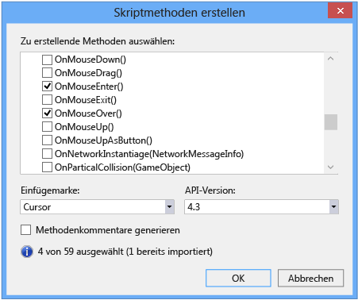
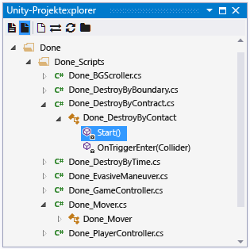
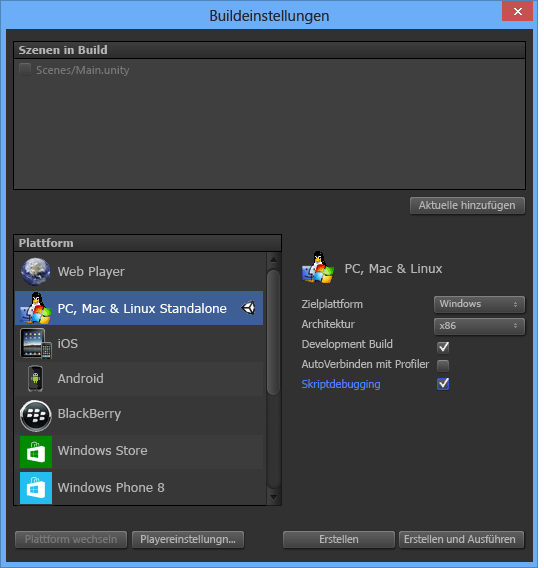
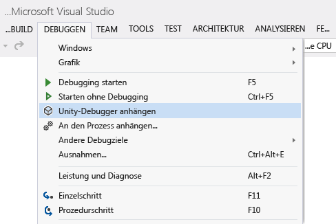
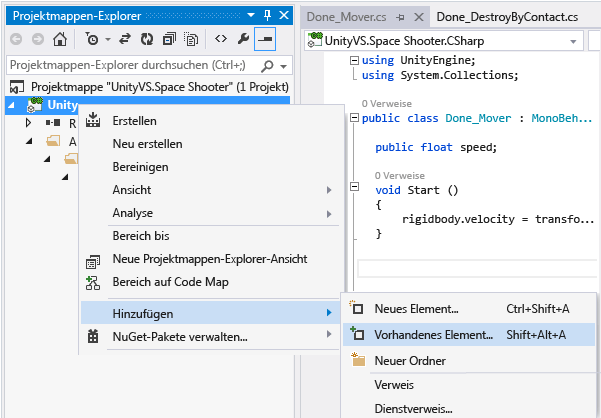
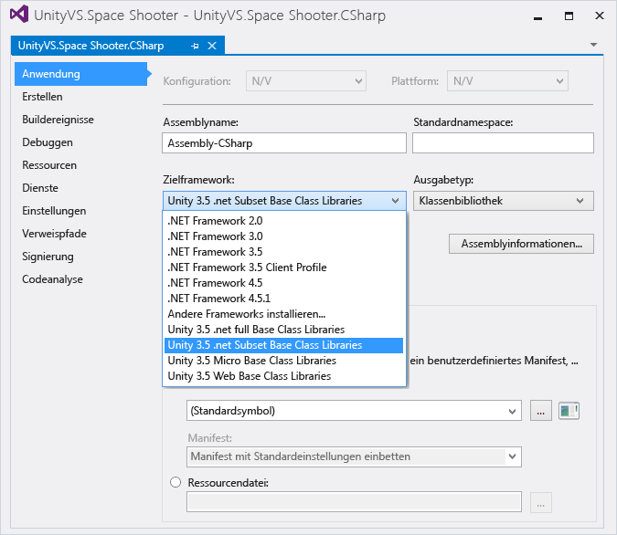

# Verwenden von Visual Studio-Tools für Unity

In diesem Abschnitt erfahren Sie, wie Sie die Integrations- und Produktivitätsfunktionen von Visual Studio-Tools für Unity und den Visual Studio-Debugger für die Unity-Entwicklung einsetzen.

## Öffnen von Unity-Skripts in Visual Studio

Nachdem Sie Visual Studio als [externen Skript-Editor für Unity](getting-started-with-visual-studio-tools-for-unity.md#configure-unity-for-use-with-visual-studio) festgelegt haben, wird durch das Öffnen eines Skripts über den Unity-Editor Visual Studio automatisch gestartet oder dahin gewechselt, während das ausgewählte Skript geöffnet ist. Doppelklicken Sie einfach auf ein Skript im Unity-Projekt.

Alternativ können Sie Visual Studio öffnen, während kein Skript im Quellcode-Editor geöffnet ist. Wählen Sie dazu im Menü **Assets** (Bestand) in Unity **Open C# Project** (C#-Projekt öffnen) aus.

## Zugriff auf die Unity-Dokumentation

Sie können in Visual Studio schnell auf die Dokumentation zur Erstellung von Unity-Skripts zugreifen. Wenn Visual Studio-Tools für Unity die API-Dokumentation lokal nicht finden kann, wird versucht, sie online zu finden.

- Platzieren Sie in Visual Studio den Cursor über der Unity-API, zu der Sie Informationen wünschen, oder markieren Sie sie, und drücken Sie dann **STRG**+**ALT**+**M** > **STRG**+**H**.

## API-Nachrichten von IntelliSense für Unity

Die Codevervollständigung von IntelliSense erleichtert das Implementieren von Unity-API-Nachrichten in MonoBehaviour-Skripts und das Erlernen des Umgangs mit der Unity-API. So verwenden Sie IntelliSense für Unity-Nachrichten:

1. Platzieren Sie den Cursor in einer neuen Zeile innerhalb des Texts einer Klasse, die von `MonoBehaviour` abgeleitet wird.

2. Geben Sie den Namens einer Unity-Nachricht ein, z.B. `OnTriggerEnter`.

3. Sobald Sie die Buchstaben **ontri** eingegeben haben, wird eine Liste von IntelliSense-Vorschlägen angezeigt.

   

4. Die Auswahl in der Liste kann auf drei verschiedene Arten geändert werden:

    - Mit den Pfeiltasten **Nach oben** und **Nach unten**

    - Indem Sie mit der Maus auf das gewünschte Element klicken

    - Indem Sie den Namen des gewünschten Elements weiter eingeben

5. IntelliSense kann die ausgewählte Unity-Nachricht einfügen, einschließlich aller erforderlichen Parameter:

    - Durch Drücken der **TAB-TASTE**

    - Durch Drücken der **EINGABETASTE**.

    - Durch Doppelklicken auf das ausgewählte Element

   

## Unity MonoBehavior-Assistent für das Erstellen von Skripts

Sie können den MonoBehavior-Assistenten verwenden, um eine Liste aller Unity-API-Methoden anzuzeigen und schnell eine leere Definition zu implementieren. Diese Funktion ist hilfreich – insbesondere, wenn die Option **Methodenkommentare generieren** aktiviert ist – wenn Sie noch lernen, was in der Unity-API verfügbar ist.

So erstellen Sie mit dem MonoBehavior-Assistenten leere MonoBehavior-Methodendefinitionen:

1. Positionieren Sie den Cursor in Visual Studio an der Stelle, an der die Methoden eingefügt werden sollen, und drücken Sie **STRG**+**UMSCHALT**+**M**, um den MonoBehavior-Assistenten zu starten.

2. Aktivieren Sie im Fenster **Create script methods** (Skriptmethoden erstellen) die Kontrollkästchen neben den Namen der einzelnen Methoden, die Sie hinzufügen möchten.

3. Wählen Sie in der Dropdownliste **Framework version** Ihre gewünschte Version aus.

4. Standardmäßig werden die Methoden an der Position des Cursors eingefügt. Alternativ können Sie sie nach jeder Methode, die bereits in Ihrer Klasse implementiert ist, durch Ändern des Werts der Dropdownliste **Insertion point** (Einfügemarke) an der gewünschten Stelle einfügen.

5. Wenn Sie möchten, dass der Assistent Kommentare für die Methoden generiert, die Sie ausgewählt haben, markieren Sie das Kontrollkästchen **Methodenkommentare generieren**. Diese Kommentare sollen Ihnen helfen zu verstehen, wann die Methode aufgerufen wird und was ihre allgemeinen Aufgaben sind.

6. Klicken Sie auf die Schaltfläche **OK**, um den Assistenten zu beenden und die Methoden in Ihren Code einzufügen.

   

## Unity-Projekt-Explorer

Der Unity-Projekt-Explorer zeigt alle Ihre Unity-Projektdateien und -Verzeichnisse in der gleichen Weise wie der Unity-Editor an. Dies unterscheidet sich vom Navigieren durch Ihre Unity-Skripts mit dem normalen Visual Studio-Projektmappen-Explorer, der sie in Projekten und einer von Visual Studio generierten Projektmappe organisiert.

- Wählen Sie in Visual Studio im Hauptmenü **Ansicht > Unity-Projektexplorer** aus. Tastenkombination: **ALT**+**UMSCHALT**+**E**

   

## Debuggen von Unity

Mit Visual Studio-Tools für Unity können Sie Editor- und Spielskripts für Ihr Unity-Projekt mit dem leistungsfähigen Debugger von Visual Studio debuggen.

### Debuggen im Unity-Editor

#### Debugging starten

1. Stellen Sie eine Verbindung von Visual Studio mit Unity her, indem Sie auf die **Wiedergabeschaltfläche** mit der Bezeichnung **An Unity anfügen** klicken, oder verwenden Sie die Taste **F5**.

   

2. Wechseln Sie zu Unity, und klicken Sie auf **Play**, um das Spiel im Editor auszuführen.

   

3. Wenn das Spiel in Unity-Editor ausgeführt wird und gleichzeitig eine Verbindung mit Visual Studio besteht, pausieren alle vorgefundenen Breakpoints die Ausführung des Spiels und bringen die Codezeile hervor, in der das Spiel den Breakpoint in Visual Studio erreicht hat.

#### Beenden des Debuggens

- Klicken Sie in Visual Studio auf die Schaltfläche **Beenden**, oder verwenden Sie die Tastenkombination **UMSCHALT + F5**.

  

Weitere Informationen zum Debuggen in Visual Studio finden Sie unter [Ein erster Blick auf die Visual Studio-Debugger](../debugger/debugger-feature-tour.md).

#### An Unity anfügen und wiedergeben

Der Einfachheit halber können Sie die Schaltfläche **An Unity anfügen** in den Modus **An Unity anfügen und wiedergeben** ändern.

1. Klicken Sie auf den kleinen **Pfeil nach unten** neben der Schaltfläche **An Unity anfügen**.

1. Wählen Sie **An Unity anfügen und wiedergeben** aus dem Dropdownmenü aus.

    

Die Wiedergabeschaltfläche erhält die Bezeichnung **An Unity anfügen und wiedergeben**. Wenn Sie auf diese Schaltfläche klicken oder die Taste **F5** verwenden, erfolgt zusätzlich zum Anfügen des Visual Studio-Debuggers automatisch der Wechsel zum Unity-Editor und wird das Spiel im Editor ausgeführt.

Wenn Sie in Visual Studio auf die Schaltfläche **Beenden** klicken oder die Tasten **UMSCHALT**+**F5** drücken, wird das Spiel im Unity-Editor automatisch beendet.

### Debuggen von Unity-Playerbuilds

Sie können Entwicklungsbuilds verschiedener Unity-Player mit Visual Studio debuggen.

#### Aktivieren des Skriptdebuggens in einem Unity-Player

1. Öffnen Sie in Unity die Buildeinstellungen durch Auswahl von **File > Build Settings (Datei > Buildeinstellungen)**.

2. Aktivieren Sie im Fenster „Build Settings“ (Buildeinstellungen) Ihres Unity-Projekts die Kontrollkästchen **Development Build** (Entwicklungsbuild) und **Script Debugging** (Skriptdebuggen).

   .

#### Auswählen einer Unity-Instanz zum Anfügen des Debuggers

- Wählen Sie in Visual Studio im Hauptmenü **Debuggen > Unity-Debugger anfügen** aus.

   

   Das Dialogfeld **Unity-Instanz auswählen** zeigt Informationen zu jeder Unity-Instanz, mit der Sie eine Verbindung herstellen können.

   

   **Projekt**

   Der Name des Unity-Projekts, das in dieser Instanz von Unity ausgeführt wird.

   **Computer** Der Name des Computers oder Geräts, auf dem diese Unity-Instanz ausgeführt wird.

   **Typ** Der Wert lautet **Editor**, wenn diese Instanz von Unity im Unity-Editor ausgeführt wird, oder **Player**, wenn diese Instanz von Unity ein eigenständiger Player ist.

   **Port** Die Portnummer für den UDP-Socket, über den diese Instanz von Unity kommuniziert.

> [!IMPORTANT]
> Da Visual Studio-Tools für Unity und die Unity-Instanz über einen UDP-Netzwerksocket kommunizieren, werden Sie ggf. von Ihrer Firewall dazu befragt. In diesem Fall müssen Sie die Verbindung autorisieren, damit VSTU und Unity kommunizieren können.

### Debuggen einer DLL im Unity-Projekt

Viele Unity-Entwickler schreiben Codekomponenten als externe DLLs, damit die Funktionalität, die sie entwickeln, einfach mit anderen Projekten gemeinsam genutzt werden kann. Durch Visual Studio-Tools für Unity wird das reibungslose Debuggen von Code in diese DLLs mit anderem Code in Ihrem Unity-Projekt erleichtert.

> [!NOTE]
> Derzeit unterstützt Visual Studio-Tools für Unity nur verwaltete DLLs. Das Debuggen von DLLs mit systemeigenem Code, z. B. mit C++-Code, wird nicht unterstützt.

Beachten Sie, dass bei dem hier beschriebenen Szenario davon ausgegangen wird, dass Sie den Quellcode haben, d. h. dass Sie eigenen Code aus erster Hand entwickeln oder wiederverwenden oder über Quellcode für eine Drittanbieterbibliothek verfügen und dessen Bereitstellung in Ihrem Unity-Projekt als DLL planen. Dieses Szenario beschreibt nicht das Debuggen einer DLL, für die Sie nicht über den Quellcode verfügen.

#### So debuggen Sie ein in Ihrem Unity-Projekt verwendetes verwaltetes DLL-Projekt

1. Fügen Sie Ihr vorhandenes DLL-Projekt der Visual Studio-Projektmappe hinzu, die von Visual Studio-Tools für Unity generiert wurde. Möglicherweise starten Sie auch, was weniger üblich ist, mit einem neuen verwalteten DLL-Projekt als Container für die Codekomponenten Ihres Unity-Projekts. Ist dies der Fall, können Sie stattdessen der Visual Studio-Projektmappe ein neues verwaltetes DLL-Projekt hinzufügen. Weitere Informationen zum Hinzufügen eines neuen oder vorhandenen Projekts zu einer Projektmappe finden Sie unter [Vorgehensweise: Hinzufügen von Projekten zu einer Projektmappe](https://msdn.microsoft.com/library/ff460187.aspx).

   

   In beiden Fällen verwaltet Visual Studio-Tools für Unity den Projektverweis, selbst wenn die Projekt- und Projektmappendateien neu generiert werden müssen. Daher müssen Sie diese Schritte nur einmal ausführen.

2. Verweisen Sie im DLL-Projekt auf das richtige Unity-Frameworkprofil. Legen Sie in Visual Studio in den Eigenschaften des DLL-Projekts die Eigenschaft **Zielframework** auf das von Ihnen verwendete Unity-Framework fest. Dies ist die Unity-Basisklassenbibliothek, die der gewünschten API-Kompatibilität Ihres Projekts entspricht, wie z. B. die Unity-Klassenbibliothek "full", "micro" oder "web". Dies verhindert, dass Ihre DLL Frameworkmethoden aufruft, die in anderen Frameworks oder auf anderen Kompatibilitätsstufen, aber nicht in der Unity-Frameworkversion vorhanden sind, die Sie verwenden.

   

3. Kopieren Sie die DLL in den Ordner "Assets" Ihres Unity-Projekts. In Unity sind "Assets" Dateien, die in Paketen zusammen mit Ihrer Unity-App so bereitgestellt werden, dass sie zur Laufzeit geladen werden können. Da DLLs zur Laufzeit verknüpft werden, müssen die DLLs als Assets bereitgestellt werden. Um als Asset bereitgestellt zu werden, verlangt der Unity-Editor, dass die DLLs dem Ordner "Assets" in Ihrem Unity-Projekt hinzugefügt werden. Dazu stehen zwei Möglichkeiten zur Verfügung:

   - Ändern Sie die Buildeinstellungen Ihres DLL-Projekts so, dass eine im Anschluss an den Build erfolgende Aufgabe hinzugefügt wird, die die DLL- und PDB-Ausgabedateien aus ihrem Ausgabeordner in den Ordner **Assets** Ihres Unity-Projekts kopiert.

   - Ändern Sie die Buildeinstellungen Ihres DLL-Projekts so, dass der Ausgabeordner auf den Ordner **Assets** Ihres Unity-Projekts festgelegt wird. Sowohl DLL- als auch PDB-Dateien werden im Ordner **Assets** abgelegt.

   Die PDB-Dateien sind für das Debuggen erforderlich, da sie Debugsymbole der DLL enthalten und den DLL-Code seiner Quellcodeform zuordnen. Visual Studio-Tools für Unity verwendet Informationen aus der DLL- und PDB-Datei, um eine DLL.MDB-Datei zu erstellen. Dies ist das Debugsymbolformat, das von der Unity-Skript-Engine verwendet wird.

4. Debuggen Sie Ihren Code. Sie können jetzt Ihren DLL-Quellcode zusammen mit dem Quellcode Ihres Unity-Projekts debuggen und alle vertrauten Debuggingfunktionen nutzen, d. h. Haltepunkte setzen und Code schrittweise durchlaufen.

## Tastenkombinationen

Über Tastenkombinationen können Sie schnell auf die Unity-Tools für Visual Studio-Funktionalität zugreifen. Hier eine Übersicht über die verfügbaren Tastenkombinationen.

|Befehl|Verknüpfung|Name des Kontextmenübefehls|
|-------------|--------------|---------------------------|
|Den MonoBehavior-Assistenten öffnen|**STRG**+**UMSCHALT**+**M**|**EditorContextMenus.CodeWindow.ImplementMonoBehaviours**|
|Den Unity-Projekt-Explorer öffnen|**ALT**+**UMSCHALT**+**E**|**View.UnityProjectExplorer**|
|Auf Unity-Dokumentation zugreifen|**STRG**+**ALT**+**M > STRG**+**H**|**Help.UnityAPIReference**|
|An Unity-Debugger (Player oder Editor) anfügen|**_Kein Standard_**|**Debug.AttachUnityDebugger**|

Sie können die Tastenkombinationen ändern, wenn Ihnen die Standardeinstellung nicht gefällt. Weitere Informationen finden Sie unter [Identifizieren und Anpassen von Tastenkombinationen in Visual Studio](../ide/identifying-and-customizing-keyboard-shortcuts-in-visual-studio.md).
