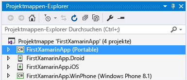
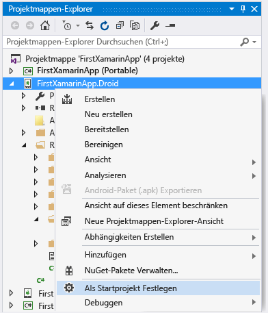
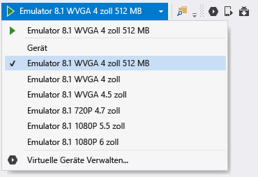
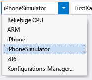
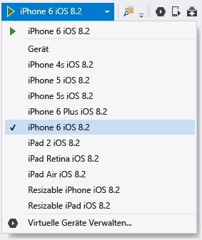
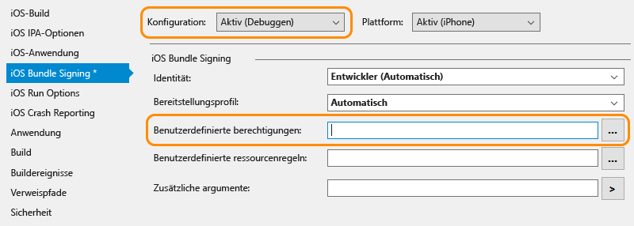

# Überprüfen Ihrer Xamarin-Umgebung
Nachdem die Installationsprogramme abgeschlossen wurden (siehe dazu [Setup and install (Setup und Installation)](../cross-platform/setup-and-install.md)), sollten Sie ein paar Minuten investieren, um zu überprüfen, ob alles für den Einstieg in die Xamarin-Entwicklung bereit ist.  
  
 Nach Abschluss dieser Überprüfung können Sie eine oder beide der folgenden exemplarischen Vorgehensweisen verwenden:  
  
-   [Grundlegendes zur Erstellung von Apps mit Xamarin.Forms in Visual Studio](../cross-platform/learn-app-building-basics-with-xamarin-forms-in-visual-studio.md)  
  
-   [Erstellen von Apps mit nativer Benutzeroberfläche über Xamarin in Visual Studio](../cross-platform/build-apps-with-native-ui-using-xamarin-in-visual-studio.md)  
  
## Alle Plattformen  
 Wählen Sie **Extras > Optionen** aus, erweitern Sie **Xamarin > Other** (Andere), und klicken Sie auf den Link **Check now** (Jetzt überprüfen). Sie müssen Xamarin 4.0.3.214 oder höher verwenden, um Probleme mit früheren Lizenzierungen zu vermeiden.  
  
 Erstellen Sie in Visual Studio eine neue Xamarin-Projektmappe mithilfe von **Datei > Neues Projekt**. Erweitern Sie im Dialogfeld **Vorlagen > Andere Sprachen > Visual C# > Plattformübergreifend**, wählen Sie **Leere App (nativ portabel)** aus, und klicken Sie auf „OK“. Dadurch wird eine Projektmappe mit einem Projekt der gemeinsamen portablen Klassenbibliothek und einzelnen Projekten für Android, iOS und Windows erstellt:  
  
   
  
> [!NOTE]
>  Wenn die Vorlagen dort nicht vorhanden sind, lesen Sie [Fehlen die Xamarin-Projektvorlagen? Versuchen Sie Folgendes](#missing) am Ende dieser Seite.  
  
## Android  
  
1. Überprüfen Sie, ob Sie die aktuellen Android SDK-Tools installiert haben. Wechseln Sie hierzu zu **Tools > Android > Android SDK-Manager**, und installieren Sie die neueste Version der Android SDK-Tools, der Android SDK Plattformtools und der Android SDK-Buildtoolskomponenten. Es ist nicht erforderlich, immer die neueste Android-API-Ebene zu installieren. Welche API erforderlich ist, hängt von der Plattformebene ab, die Sie als Ziel auswählen. Im Allgemeinen wird bei der Installation von Xamarin die erforderliche Plattformebene installiert.  

2.  Überprüfen Sie den Android-Designer: Öffnen Sie im Android-Projekt im Projektmappen-Explorer die Datei **Ressourcen > Layout > Main.axml**. (Wenn die Datei nicht direkt angezeigt wird, suchen Sie im Projektmappen-Explorer danach. Sie ist nur im Android-Projekt enthalten, im iOS-Projekt dagegen nicht.)  
  
    - Wenn die Fehlermeldung „The installed Android SDK is too old (Das installierte Android SDK ist veraltet)“ angezeigt wird, klicken Sie in dieser Meldung auf **Open Android SDK (Android SDK öffnen)**, und installieren Sie die Tools der neuesten SDK-Version, wie weiter oben in Schritt 1 beschrieben. 
  
3.  Überprüfen des Erstellens und des Debuggens im Emulator (oder Gerät):  
  
    -   Klicken Sie mit der rechten Maustaste im Projektmappen-Explorer auf das Android-Projekt, und wählen Sie **Als Startprojekt festlegen**aus.  
  
           
  
    -   Wählen Sie entsprechend der Android-Zielversion einen geeigneten Emulator aus. Ist ein Android-Entwicklungsgerät an Ihren Computer angeschlossen, wird dieses Gerät hier zusammen mit den Emulatoren aufgelistet:  
  
        -   Windows 8+: Wählen Sie in der Debug-Dropdownliste von Visual Studio wie unten dargestellt ein **VS Emulator**-Ziel aus, und starten Sie den Debugger durch Drücken von **F5**. Weitere Informationen finden Sie unter [Introducing Visual Studio’s Emulator for Android (Einführen der Emulatoren von Visual Studio für Android)](http://blogs.msdn.com/b/visualstudioalm/archive/2014/11/12/introducing-visual-studio-s-emulator-for-android.aspx) (Visual Studio ALM-Blog). Wenn bei der Inbetriebnahme des Emulators Probleme auftreten, finden Sie Hilfe unter [Troubleshooting the Visual Studio Emulator for Android](../cross-platform/troubleshooting-the-visual-studio-emulator-for-android.md). Sie können auch neue Geräteprofile für den Emulator erstellen, indem Sie **Tools > Visual Studio-Emulator for Android...** (Extras > Visual Studio Emulator für Android...) auswählen.  
  
               
  
             Hinweis: Wenn die Menüoption **Tools > Visual Studio Emulator for Android...** (Extras > Visual Studio Emulator für Android...) nicht angezeigt wird, ist der Emulator möglicherweise nicht installiert. Wechseln Sie zu **Systemsteuerung > Programme und Funktionen**, wählen Sie **Microsoft Visual Studio** aus, und klicken Sie auf **Ändern**, um das Installationsprogramm erneut auszuführen. Klicken Sie im Installationsprogramm auf **Ändern**, aktivieren Sie das Kontrollkästchen **Plattformübergreifende, mobile Entwicklung > Microsoft Visual Studio Emulator für Android**, und klicken Sie auf **Aktualisieren**.  
  
        -   Für Windows 7 und früher: wählen Sie stattdessen in der Dropdownliste den Xamarin Player für Android aus, und drücken Sie F5, um ihn auszuführen. Ausführliche Informationen über den Xamarin Player und dessen Geräte-Manager sowie Tipps zur Fehlerbehebung finden Sie unter [Xamarin Android Player](http://developer.xamarin.com/guides/android/getting_started/installation/android-player/) (xamarin.com).  
  
> [!NOTE]
>  In Visual Studio sehen Sie möglicherweise das Symbol für den Android Emulator Manager (AVD) in der Symbolleiste (siehe unten), über das der Geräte-Manager geöffnet wird, mit dem sich speziell der Google Android-Emulator konfigurieren lässt.  Dieses Symbol bedingt keine Auswirkungen auf den Visual Studio-Emulator für Android oder den Xamarin Player, die jeweils ihren eigenen Geräte-Manager zum Konfigurieren von Profilen haben.  Weitere Informationen finden Sie unter [Introducing Visual Studio’s Emulator for Android (Einführen der Emulatoren von Visual Studio für Android)](http://blogs.msdn.com/b/visualstudioalm/archive/2014/11/12/introducing-visual-studio-s-emulator-for-android.aspx) (Visual Studio ALM blog) und [Xamarin Android Player](http://developer.xamarin.com/guides/android/getting_started/installation/android-player/) (xamarin.com).  
>   
  
## Windows Phone  
  
1.  Überprüfen des Windows Phone-Designers: Öffnen Sie im Windows Phone-Projekt im Projektmappen-Explorer die Datei **MainPage.xaml** .  
  
2.  Überprüfen Sie das Erstellen und das Debuggen im Emulator oder auf einem Gerät (Hinweis: dieser Schritt erfordert, dass der Windows Phone-Emulator mithilfe von Visual Studio-Setup installiert wurde oder ein verbundenes Gerät vorhanden ist):  
  
    -   Klicken Sie mit der rechten Maustaste im Projektmappen-Explorer auf das Windows Phone-Projekt, und wählen Sie **Als Startprojekt festlegen**aus.  
  
    -   Wählen Sie in der Debug-Dropdownliste von Visual Studio wie unten dargestellt ein **Emulator 8.1**-Ziel oder ein angeschlossenes Gerät aus, und starten Sie den Debugger, indem Sie F5 drücken.  
  
           
  
    -   Wenn Sie beim Arbeiten mit dem Emulator auf Probleme stoßen, lesen Sie [Troubleshooting the Windows Phone 8 Emulator](/previous-versions/windows/apps/jj681694\(v%3dvs.105\)).  
  
## iOS  
  
1.  Überprüfen Sie, ob der Mac im Netzwerk verfügbar und mit Visual Studio gepaart ist, wie unter [Connecting to the Mac](http://developer.xamarin.com/guides/ios/getting_started/installation/windows/xamarin-mac-agent/) (xamarin.com) beschrieben.  
  
2.  Überprüfen des Storyboard-Designers: Öffnen Sie im iOS-Projekt im Projektmappen-Explorer die Datei **Main.storyboard** . Hier hostet Visual Studio den Designer, der remote auf dem Mac ausgeführt wird.  
  
3.  Überprüfen von Erstellen und Debuggen:  
  
    1.  Klicken Sie mit der rechten Maustaste im Projektmappen-Explorer auf das iOS-Projekt, und wählen Sie **Als Startprojekt festlegen**aus.  
  
    2.  Wählen Sie in der Erstellen-Dropdownliste von Visual Studio das Ziel **iPhoneSimulator** (siehe unten) oder das Ziel **iPhone** aus, wenn Sie ein verbundenes Gerät haben. Wenn keine Simulatoren aufgelistet sind, starten Sie Xcode auf dem Mac, wählen Sie **Xcode->Einstellungen** aus, und klicken Sie auf **Laden**. Unter **Komponenten** sollten die für den Download verfügbaren Simulatorversionen zu sehen sein. Weitere Debuganweisungen finden Sie auf der Seite [Debugging](https://developer.xamarin.com/guides/ios/deployment,_testing,_and_metrics/debugging_in_xamarin_ios/#Debugging_on_the_Simulator) von Xamarin (xamarin.com).  
  
           
  
    3.  Wählen Sie in der Debug-Dropdownliste von Visual Studio ein iPhone-Ziel aus, und starten Sie den Debugger, indem Sie F5 drücken. Dadurch wird der Simulator auf dem Mac gestartet, in dem Sie mit der App interagieren, während das Debuggen in Visual Studio erfolgt. Wenn Sie mit einem physischen iPhone oder iPad arbeiten, das mit dem Mac verbunden ist, wird es hier angezeigt, und Sie können es stattdessen auswählen. Wenn keine Geräte oder Simulatoren aufgelistet werden, überprüfen Sie die Verbindung zum Mac. Lesen Sie dazu das in Schritt 1 oben verknüpfte Thema durch, oder navigieren Sie zu **Extras** >**iOS** >**Xamarin Mac Agent**  
  
           
  
    4.  Gibt es Probleme beim Herstellen einer Verbindung mit dem Mac, lesen [Connection Troubleshooting](http://developer.xamarin.com/guides/ios/getting_started/installation/windows/xamarin-mac-agent/xma-troubleshooting/) (xamarin.com).  
  
    5.  Wird die Fehlermeldung „No installed provisioning profiles match the installed iOS signing keys“ angezeigt, gehen Sie wie folgt vor:  
  
        -   Vergewissern Sie sich, dass Ihr Apple ID-Konto in Xcode auf dem Mac hinzugefügt wurde, wie dies unter [Adding Your Account to Xcode](https://developer.apple.com/library/content/documentation/IDEs/Conceptual/AppStoreDistributionTutorial/AddingYourAccounttoXcode/AddingYourAccounttoXcode.html#//apple_ref/doc/uid/TP40013839-CH40-SW1) (apple.com) beschrieben ist.  Nachdem Ihr Konto hinzugefügt wurde, müssen Sie sowohl Visual Studio als auch Xcode neu starten.  
  
               
  
        -   Stellen Sie sicher, dass in den iOS-Projekteigenschaften auf der Registerkarte „iOS-Bundle-Signierung“ das Feld „Benutzerdefinierte Berechtigungen“ für die aktive Debugkonfiguration leer ist.  Hinweis: Sie sollten nur dann versuchen, diese Einstellung zu löschen, wenn die oben genannte Fehlermeldung angezeigt wurde.  
  
##   Fehlen die Xamarin-Projektvorlagen? Versuchen Sie Folgendes  
 Wenn Sie Xamarin direkt von der Xamarin-Website installieren und Visual Studio 2013 und Visual Studio 2015 parallel installiert sind, fehlen möglicherweise die Vorlagen. Das lässt sich allerdings leicht beheben: Aktivieren Sie einfach im Xamarin-Setupprogramm die Funktion **Xamarin für Visual Studio 2015**.  
  
1.  Öffnen Sie in der Systemsteuerung **Programme und Features**, wählen Sie das **Xamarin** -Element aus, und klicken Sie auf **Ändern**.  
  
2.  Klicken Sie im Setup-Assistenten von Xamarin, der dann angezeigt wird, auf **Weiter** und dann auf **Ändern**.  
  
3.  Erweitern Sie in der Liste der optional zu installierenden Features **Xamarin für Visual Studio 2015**, wählen Sie **wird auf dem lokalen Laufwerk installiert**aus, und klicken Sie auf **Weiter** , um mit dem Hinzufügen des Features fortzufahren.