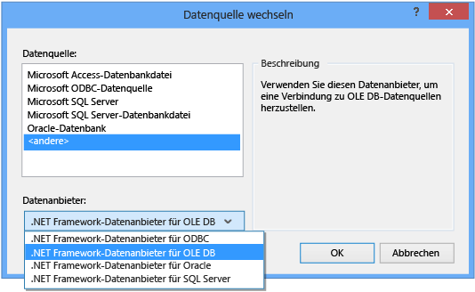

# Exemplarische Vorgehensweise: Herstellen einer Verbindung mit Daten in einer Access-Datenbank (Windows Forms)
Sie können mithilfe von Visual Studio eine Verbindung mit einer Access\-Datenbank \(entweder eine MDF\-Datei oder eine ACCDB\-Datei\) herstellen.  Nachdem Sie die Verbindung definiert haben, werden die Daten im Fenster **Datenquellen** angezeigt.  Von dort können Sie Tabellen oder Ansichten auf die Formulare ziehen.  Weitere Informationen dazu, wie das Projektsystem in Visual Studio diese lokalen Datenbankdateien verwaltet, finden Sie unter [Gewusst wie: Verwalten von lokalen Datendateien im Projekt](../data-tools/how-to-manage-local-data-files-in-your-project.md).  
  
## Vorbereitungsmaßnahmen  
 Zum Verwenden dieser Prozeduren benötigen Sie ein Windows Forms\-Anwendungsprojekt und entweder eine Access\-Datenbank \(ACCDB\-Datei\) oder eine Access 2000\-2003\-Datenbank \(MDB\-Datei\).  Führen Sie die Prozedur aus, die dem Dateityp entspricht.  
  
## Erstellen des DataSets für eine ACCDB\-Datei  
 Sie können mithilfe des folgenden Verfahrens eine Verbindung mit den Datenbanken herstellen, die mit Access 2013, Office 365, Access 2010 oder Access 2007 erstellt wurden.  
  
#### So erstellen Sie das DataSet  
  
1.  Öffnen Sie die Windows Forms\-Anwendung, an die Sie Daten anbinden möchten.  
  
2.  Wählen Sie im Menü **Ansicht** die Optionen **Weitere Fenster** \> **Datenquellen** aus.  
  
       
  
3.  Klicken Sie im **Datenquellenfenster** auf **Neue Datenquelle hinzufügen**.  
  
       
  
4.  Wählen Sie auf der Seite **Datenquellentyp auswählen** die Option **Datenbank** aus, und klicken Sie auf **Weiter**.  
  
5.  Wählen Sie auf der Seite **Datenbankmodell auswählen** die Option **DataSet** aus, und klicken Sie dann auf **Weiter**.  
  
6.  Wählen Sie auf der Seite **Wählen Sie Ihre Datenverbindung aus** die Option **Neue Verbindung** aus, um eine neue Datenverbindung zu konfigurieren.  
  
7.  Ändern Sie die **Datenquelle** in **.NET Framework\-Datenanbieter für OLE DB**.  
  
       
  
    > [!IMPORTANT]
    >  Obwohl eine Datenquelle der **Microsoft Access\-Datenbankdatei \(OLE DB\)** die richtige Wahl zu sein scheint, verwenden Sie diesen Datenquellentyp nur für MDB\-Datenbankdateien.  
  
8.  Wählen Sie im Dialogfeld **OLE DB\-Anbieter** die Option **OLE DB\-Anbieter für Microsoft Office 12.0 Access\-Datenbankmodul** aus.  
  
       
  
9. Geben Sie im Dialogfeld **Server\- oder Dateiname** den Pfad und den Namen der ACCDB\-Datei an, mit der Sie eine Verbindung herstellen möchten, und klicken Sie dann auf **OK**.  
  
    > [!NOTE]
    >  Wenn die Datenbankdatei einen Benutzernamen und ein Kennwort hat, geben Sie diese an. Klicken Sie dann auf **OK**.  
  
10. Klicken Sie auf der Seite **Wählen Sie Ihre Datenverbindung aus** auf **Weiter**.  
  
11. Klicken Sie auf der Seite **Verbindungszeichenfolge in der Programmkonfigurationsdatei speichern** auf **Weiter**.  
  
12. Erweitern Sie auf der Seite **Datenbankobjekte auswählen** den Knoten **Tabellen**.  
  
13. Wählen Sie die gewünschten Tabellen oder Ansichten aus, die Sie in Ihrem DataSet verwenden möchten, und wählen Sie dann **Fertig stellen** aus.  
  
     Das DataSet wird Ihrem Projekt hinzugefügt, und die Tabellen und Ansichten werden im Fenster **Datenquellen** angezeigt.  
  
## Erstellen des DataSets für eine MDB\-Datei  
 Das Dataset wird erstellt, indem der **Assistent zum Konfigurieren von Datenquellen** ausgeführt wird.  
  
#### So erstellen Sie das DataSet  
  
1.  Öffnen Sie die Windows Forms\-Anwendung, an die Sie Daten anbinden möchten.  
  
2.  Wählen Sie im Menü **Ansicht** die Optionen **Weitere Fenster** \> **Datenquellen** aus.  
  
       
  
3.  Klicken Sie im **Datenquellenfenster** auf **Neue Datenquelle hinzufügen**.  
  
       
  
4.  Wählen Sie auf der Seite **Datenquellentyp auswählen** die Option **Datenbank** aus, und klicken Sie auf **Weiter**.  
  
5.  Wählen Sie auf der Seite **Datenbankmodell auswählen** die Option **DataSet** aus, und klicken Sie dann auf **Weiter**.  
  
6.  Wählen Sie auf der Seite **Wählen Sie Ihre Datenverbindung aus** die Option **Neue Verbindung** aus, um eine neue Datenverbindung zu konfigurieren.  
  
7.  Wenn die **Datenquelle** keine **Microsoft Access\-Datenbankdatei \(OLE DB\)** ist, wählen Sie **Ändern** aus, um das Dialogfeld **Datenquelle wechseln** zu öffnen. Wählen Sie dort die **Microsoft Access\-Datenbankdatei** aus, und klicken Sie anschließend auf **OK**.  
  
8.  Geben Sie im Dialogfeld **Name der Datenbankdatei** den Pfad und den Namen der MDB\-Datei an, mit der Sie eine Verbindung herstellen möchten, und klicken Sie dann auf **OK**.  
  
       
  
9. Klicken Sie auf der Seite **Wählen Sie Ihre Datenverbindung aus** auf **Weiter**.  
  
10. Klicken Sie auf der Seite **Verbindungszeichenfolge in der Programmkonfigurationsdatei speichern** auf **Weiter**.  
  
11. Erweitern Sie auf der Seite **Datenbankobjekte auswählen** den Knoten **Tabellen**.  
  
12. Wählen Sie die gewünschten Tabellen oder Ansichten aus, die Sie in Ihrem DataSet verwenden möchten, und wählen Sie dann **Fertig stellen** aus.  
  
     Das DataSet wird Ihrem Projekt hinzugefügt, und die Tabellen und Ansichten werden im Fenster **Datenquellen** angezeigt.  
  
## Sicherheit  
 Das Speichern vertraulicher Informationen \(z. B. ein Kennwort\) kann sich auf die Sicherheit der Anwendung auswirken.  Der Zugriff auf eine Datenbank lässt sich mithilfe der Windows\-Authentifizierung \(wird auch als integrierte Sicherheit bezeichnet\) sicherer steuern.  Weitere Informationen hierzu finden Sie unter [Schützen von Verbindungsinformationen](../Topic/Protecting%20Connection%20Information.md).  
  
## Nächste Schritte  
 Das gerade erstellte DataSet ist jetzt im Fenster **Datenquellen** verfügbar.  Sie können nun eine der folgenden Aufgaben ausführen:  
  
-   Wählen Sie im Fenster **Datenquellen** Elemente aus, und ziehen Sie sie in Ihr Formular \(siehe [Binden von Windows Forms\-Steuerelementen an Daten in Visual Studio](../data-tools/bind-windows-forms-controls-to-data-in-visual-studio.md)\).  
  
-   Öffnen Sie die Datenquelle im [DataSet\-Designer](../data-tools/creating-and-editing-typed-datasets.md), um Objekte, aus denen das DataSet besteht, hinzuzufügen oder zu bearbeiten.  
  
-   Fügen Sie dem <xref:System.Data.DataTable.ColumnChanging>\-oder <xref:System.Data.DataTable.RowChanging>\-Ereignis der Datentabellen im DataSet eine Validierungslogik hinzu \(siehe [Überprüfen von Daten in Datasets](../data-tools/validate-data-in-datasets.md)\).  
  
## Siehe auch  
 [Herstellen von Datenverbindungen in Visual Studio](../data-tools/connecting-to-data-in-visual-studio.md)   
 [Vorbereiten der Anwendung auf den Empfang von Daten](../Topic/Preparing%20Your%20Application%20to%20Receive%20Data.md)   
 [Abrufen von Daten für die Anwendung](../data-tools/fetching-data-into-your-application.md)   
 [Binden von Steuerelementen an Daten in Visual Studio](../data-tools/bind-controls-to-data-in-visual-studio.md)   
 [Bearbeiten von Daten in der Anwendung](../data-tools/editing-data-in-your-application.md)   
 [Überprüfen von Daten](../Topic/Validating%20Data.md)   
 [Speichern von Daten](../data-tools/saving-data.md)   
 [Exemplarische Vorgehensweisen zur Arbeit mit Daten](../Topic/Data%20Walkthroughs.md)