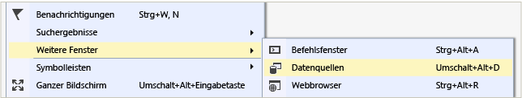

# Herstellen einer Verbindung mit Daten in einer Access-Datenbank

Mithilfe von Visual Studio können Sie eine Verbindung mit einer Access-Datenbank (entweder eine *MDB* -Datei oder eine *ACCDB* -Datei) herstellen. Nachdem Sie die Verbindung definiert haben, werden die Daten im Fenster **Datenquellen** angezeigt. Von dort aus können Sie Tabellen oder Sichten auf die Entwurfs Oberfläche ziehen.

## Voraussetzungen

Um diese Prozeduren verwenden zu können, benötigen Sie ein Windows Forms-oder WPF-Projekt und entweder eine Access-Datenbank (*. accdb* -Datei) oder eine Access 2000-2003-Datenbank (*MDB* -Datei). Führen Sie die Prozedur aus, die dem Dateityp entspricht.

## Erstellen eines Datasets für eine ACCDB-Datei

Stellen Sie mithilfe des folgenden Verfahrens eine Verbindung mit Datenbanken her, die mit Microsoft 365 erstellt wurden, auf 2013, Access 2010 oder Access 2007.

1. Öffnen Sie in Visual Studio ein Windows Forms-oder WPF-Anwendungsprojekt.

2. Um das Fenster **Datenquellen** zu öffnen, wählen Sie im Menü **Ansicht** die Option **Weitere Windows**-  >  **Datenquellen**aus.

   

3. Klicken Sie im **Datenquellenfenster** auf **Neue Datenquelle hinzufügen**.

   Der **Assistent zum Konfigurieren von Datenquellen** wird geöffnet.

4. Wählen Sie auf der Seite **Daten Quellentyp auswählen** die Option **Datenbank** aus, und klicken Sie dann auf **weiter**.

5. Wählen Sie auf der Seite **Datenbankmodell auswählen** die Option **DataSet** aus, und klicken Sie dann auf **weiter**.

6. Wählen Sie auf der Seite **Wählen Sie Ihre Datenverbindung** die Option **Neue Verbindung** aus, um eine neue Datenverbindung zu konfigurieren.

   Das Dialogfeld **Verbindung hinzufügen** wird geöffnet.

7. Wenn die **Datenquelle** nicht auf die **Microsoft Access-Datenbankdatei**festgelegt ist, wählen Sie die Schaltfläche **ändern** .

   Das Dialogfeld **Datenquelle ändern** wird geöffnet. Wählen Sie in der Liste der Datenquellen die Option **Microsoft Access-Datenbankdatei**aus. Wählen Sie in der Dropdown-Dropdown- **Datei des Datenanbieters** **.NET Framework Datenanbieter für OLE DB aus**, und klicken Sie dann auf **OK**.

8. Wählen Sie neben **Name der Datenbankdatei**die Option **Durchsuchen** aus, navigieren Sie zu Ihrer *ACCDB* -Datei, und wählen Sie **Öffnen**aus.

9. Geben Sie ggf. einen Benutzernamen und ein Kennwort ein, und klicken Sie dann auf **OK**.

10. Klicken Sie auf der Seite **Wählen Sie Ihre Datenverbindung** aus auf **weiter** .

    Möglicherweise wird ein Dialogfeld angezeigt, in dem Sie darüber informiert werden, dass sich die Datendatei nicht im aktuellen Projekt befindet Wählen Sie **Ja** oder **Nein**aus.

11. Klicken Sie auf der Seite **Verbindungs Zeichenfolge in der Anwendungs Konfigurationsdatei speichern** auf **weiter** .

12. Erweitern Sie auf der Seite **Datenbankobjekte auswählen** den Knoten **Tabellen**.

13. Wählen Sie die Tabellen oder Sichten aus, die Sie in Ihr Dataset einschließen möchten, und klicken Sie dann auf **Fertig**stellen.

    Das DataSet wird Ihrem Projekt hinzugefügt, und die Tabellen und Ansichten werden im Fenster **Datenquellen** angezeigt.

## Erstellen eines Datasets für eine MDB-Datei

Stellen Sie mithilfe des folgenden Verfahrens eine Verbindung mit mit Access 2000-2003 erstellten Datenbanken her.

1. Öffnen Sie in Visual Studio ein Windows Forms-oder WPF-Anwendungsprojekt.

2. Wählen Sie im Menü **Ansicht** die Option **Weitere Windows**-  >  **Datenquellen**aus.

   

3. Klicken Sie im **Datenquellenfenster** auf **Neue Datenquelle hinzufügen**.

    Der **Assistent zum Konfigurieren von Datenquellen** wird geöffnet.

4. Wählen Sie auf der Seite **Daten Quellentyp auswählen** die Option **Datenbank** aus, und klicken Sie dann auf **weiter**.

5. Wählen Sie auf der Seite **Datenbankmodell auswählen** die Option **DataSet** aus, und klicken Sie dann auf **weiter**.

6. Wählen Sie auf der Seite **Wählen Sie Ihre Datenverbindung** die Option **Neue Verbindung** aus, um eine neue Datenverbindung zu konfigurieren.

7. Wenn es sich bei der Datenquelle nicht um eine **Microsoft Access-Datenbankdatei (OLE DB)** handelt, wählen Sie **ändern** aus, um das Dialogfeld **Datenquelle ändern** zu öffnen, **und wählen Sie** **Microsoft Access-Datenbankdatei**aus.

8. Geben Sie unter **Name der Datenbankdatei**den Pfad und den Namen der *MDB* -Datei an, mit der Sie eine Verbindung herstellen möchten, und klicken Sie dann auf **OK**.

   

9. Klicken Sie auf der Seite **Wählen Sie Ihre Datenverbindung** aus auf **weiter** .

10. Klicken Sie auf der Seite **Verbindungs Zeichenfolge in der Anwendungs Konfigurationsdatei speichern** auf **weiter** .

11. Erweitern Sie auf der Seite **Datenbankobjekte auswählen** den Knoten **Tabellen**.

12. Wählen Sie die gewünschten Tabellen oder Sichten in Ihrem DataSet aus, und klicken Sie dann auf **Fertig**stellen.

    Das DataSet wird Ihrem Projekt hinzugefügt, und die Tabellen und Ansichten werden im Fenster **Datenquellen** angezeigt.

## Nächste Schritte

Das soeben erstellte Dataset ist im **Datenquellen** Fenster verfügbar. Sie können nun eine der folgenden Aufgaben ausführen:

- Wählen Sie im Fenster **Datenquellen** die Option Elemente aus, und ziehen Sie diese auf das Formular oder die Entwurfs Oberfläche (siehe Übersicht über das [Binden von Windows Forms Steuerelementen an Daten in Visual Studio](../data-tools/bind-windows-forms-controls-to-data-in-visual-studio.md) oder [WPF-Datenbindung](/dotnet/desktop-wpf/data/data-binding-overview)).

- Öffnen Sie die Datenquelle im **DataSet-Designer**, um die Objekte, aus denen das Dataset besteht, zu bearbeiten oder dem Dataset Objekte hinzuzufügen.

- Fügen Sie dem- <xref:System.Data.DataTable.ColumnChanging> Ereignis oder dem- <xref:System.Data.DataTable.RowChanging> Ereignis der Datentabellen im DataSet eine Validierungs Logik hinzu (siehe [Validieren von Daten in Datasets](../data-tools/validate-data-in-datasets.md)).

## Weitere Informationen

- [Hinzufügen von Verbindungen](../data-tools/add-new-connections.md)
- [Übersicht über die WPF-Datenbindung](/dotnet/framework/wpf/data/data-binding-overview)
- [Datenbindung Windows Forms](/dotnet/framework/winforms/data-binding-and-windows-forms)
