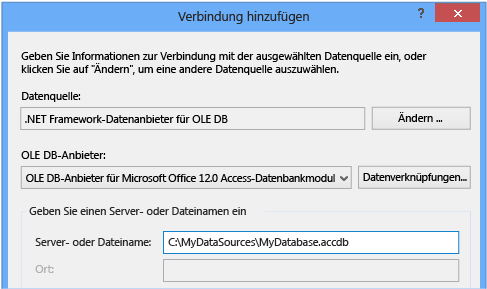
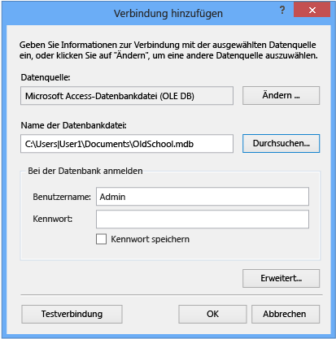

# Verbinden Sie mit Daten in einer Access-Datenbank (Windows Forms)
Sie können mit einer Access-Datenbank (entweder eine MDF-Datei oder eine ACCDB-Datei) mithilfe von Visual Studio verbinden. Nachdem Sie die Verbindung definiert, die Daten angezeigt, der **Datenquellen** Fenster. Von dort können Sie Tabellen oder Ansichten auf die Formulare ziehen.   
  
## Erforderliche Komponenten  
 Zum Verwenden dieser Prozeduren benötigen Sie ein Windows Forms-Anwendungsprojekt und entweder eine Access-Datenbank (ACCDB-Datei) oder eine Access 2000-2003-Datenbank (MDB-Datei). Führen Sie die Prozedur aus, die dem Dateityp entspricht.  
  
## Erstellen des Datasets für eine ACCDB-Datei  
 Sie können mit Datenbanken in Access 2013, Office 365, Access 2010 oder Access 2007 erstellt werden, mithilfe des folgenden Verfahrens verbinden.  
  
#### So erstellen Sie das DataSet  
  
1.  Öffnen Sie die Windows Forms-Anwendung, die Sie Daten anbinden möchten.  
  
2.  Auf der **Ansicht** klicken Sie im Menü **Weitere Fenster** > **Datenquellen**.  
  
       
  
3.  Klicken Sie im **Datenquellenfenster** auf **Neue Datenquelle hinzufügen**.  

     Die **Data Source Configuration Wizard** wird geöffnet.  
  
4.  Wählen Sie **Datenbank** auf die **wählen Sie einen Datenquellentyp** Seite, und wählen Sie dann **Weiter**.  
  
5.  Wählen Sie **Dataset** auf die **Auswählen eines Datenbankmodells** Seite, und wählen Sie dann **Weiter**.  
  
6.  Auf der **wählen Sie Ihre Datenverbindung** Seite **neue Verbindung** eine neue Datenverbindung zu konfigurieren.  

     Die **Verbindung hinzufügen** Dialogfeld wird geöffnet.  
  
7.  Wählen Sie die **Änderung** neben der **Datenquelle** Textfeld.

     Die **Datenquelle wechseln** Dialogfeld wird geöffnet.  
  
8.  Wählen Sie in der Liste der Datenquellen,  **\<andere\>**. In der **Datenanbieter** Dropdownliste, wählen **.NET Framework-Datenanbieter für OLE DB-**, wählen Sie dann **OK**.  

9. In der **Verbindung hinzufügen** wählen Sie im Dialogfeld **Microsoft Office 12.0 Access Database Engine OLE DB Provider** aus der **OLE DB-Anbieter** Dropdown-Menü.  
  
       

     > [!NOTE]
     >  Wenn Sie nicht sehen **Microsoft Office 12.0 Access Database Engine OLE DB Provider** in OLE DB-Anbieter, Dropdown-Menü, müssen Sie möglicherweise Installieren der [2007 Office System Driver: Data Connectivity Components](https://www.microsoft.com/download/confirmation.aspx?id=23734).
  
9. In der **Server- oder Dateiname** Textfeld, geben Sie den Pfad und Namen der ACCDB-Datei, die Sie herstellen möchten, und wählen Sie dann der Datei **OK**. (Wenn die Datenbankdatei einen Benutzernamen und ein Kennwort verfügt, geben Sie diese vor der Auswahl **OK**.)    
  
10. Wählen Sie **Weiter** auf die **wählen Sie Ihre Datenverbindung** Seite.  

     Möglicherweise erhalten Sie, dass ein Dialogfeld, dass die Datendatei ist nicht in Ihrem aktuellen Projekt. Wählen Sie **Ja** oder **Nein**.
  
11. Wählen Sie **Weiter** auf die **Verbindungszeichenfolge in der Programmkonfigurationsdatei speichern** Seite.  
  
12. Erweitern Sie die **Tabellen** Knoten auf die **wählen Sie Ihre Datenbankobjekte** Seite.  
  
13. Wählen Sie die Tabellen oder Sichten, die im Dataset werden soll, und wählen Sie dann **Fertig stellen**.  
  
     Das Dataset wird Ihrem Projekt hinzugefügt, und die Tabellen und Sichten angezeigt, der **Datenquellen** Fenster.  
  
## Erstellen des Datasets für eine MDB-Datei  
 Erstellen Sie das Dataset durch Ausführen der **Datenquellen Konfigurations-Assistenten**.  
  
#### So erstellen Sie das DataSet  
  
1.  Öffnen Sie die Windows Forms-Anwendung, die Sie Daten anbinden möchten.  
  
2.  Auf der **Ansicht** klicken Sie im Menü **Weitere Fenster** > **Datenquellen**.  
  
       
  
3.  Klicken Sie im **Datenquellenfenster** auf **Neue Datenquelle hinzufügen**.  

     Die **Data Source Configuration Wizard** wird geöffnet.
  
4.  Wählen Sie **Datenbank** auf die **wählen Sie einen Datenquellentyp** Seite, und wählen Sie dann **Weiter**.  
  
5.  Wählen Sie **Dataset** auf die **Auswählen eines Datenbankmodells** Seite, und wählen Sie dann **Weiter**.  
  
6.  Auf der **wählen Sie Ihre Datenverbindung** Seite **neue Verbindung** eine neue Datenverbindung zu konfigurieren.  
  
7.  Die Datenquelle ist nicht **Microsoft Access-Datenbankdatei (OLE DB)**wählen **ändern** So öffnen die **Datenquelle wechseln** (Dialogfeld), und wählen **Microsoft Zugriff auf die Datenbankdatei**, und wählen Sie dann **OK**.  
  
8.  In der **Datenbankdateiname**, geben Sie den Pfad und Namen der MDB-Datei, die Sie verwenden möchten, Herstellen einer Verbindung mit, und wählen Sie dann **OK**.  
  
       
  
9. Wählen Sie **Weiter** auf die **wählen Sie Ihre Datenverbindung** Seite.  
  
10. Wählen Sie **Weiter** auf die **Verbindungszeichenfolge in der Programmkonfigurationsdatei speichern** Seite.  
  
11. Erweitern Sie die **Tabellen** Knoten auf die **wählen Sie Ihre Datenbankobjekte** Seite.  
  
12. Wählen Sie die Tabellen oder Sichten, die im Dataset werden soll, und wählen Sie dann **Fertig stellen**.  
  
     Das Dataset wird Ihrem Projekt hinzugefügt, und die Tabellen und Sichten angezeigt, der **Datenquellen** Fenster.  
  
## Sicherheit  
 Das Speichern vertraulicher Informationen (z. B. ein Kennwort) kann sich auf die Sicherheit der Anwendung auswirken. Der Zugriff auf eine Datenbank lässt sich mithilfe der Windows-Authentifizierung (wird auch als integrierte Sicherheit bezeichnet) sicherer steuern. Weitere Informationen finden Sie unter [Protecting Connection Information (Schützen von Verbindungsinformationen)](/dotnet/framework/data/adonet/protecting-connection-information).  
  
## Nächste Schritte  
 Die neu erstellte Dataset ist jetzt verfügbar in der **Datenquellen** Fenster. Sie können nun eine der folgenden Aufgaben ausführen:  
  
-   Wählen Sie Elemente in der **Datenquellen** Fenster, und ziehen Sie sie auf das Formular (finden Sie unter [Binden von Windows Forms-Steuerelementen an Daten in Visual Studio](../data-tools/bind-windows-forms-controls-to-data-in-visual-studio.md)).  
  
-   Öffnen Sie die Datenquelle in der **Dataset-Designer** hinzufügen oder bearbeiten die Objekte, die das Dataset bilden.  
  
-   Eine Validierungslogik Hinzufügen der <xref:System.Data.DataTable.ColumnChanging> oder <xref:System.Data.DataTable.RowChanging> -Ereignis der Datentabellen im Dataset (finden Sie unter [Validieren von Daten in Datasets](../data-tools/validate-data-in-datasets.md)).  
  
## Siehe auch
[Hinzufügen von Verbindungen](../data-tools/add-new-connections.md)
