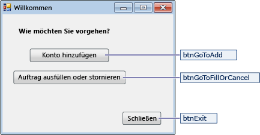
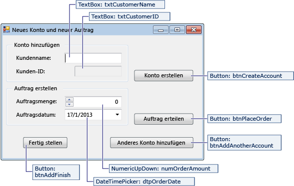
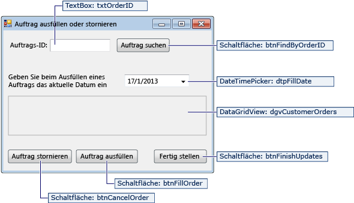

# <a name="create-a-simple-data-application-by-using-adonet"></a>Erstellen einer einfachen Datenanwendung mit ADO.NET

Wenn Sie eine Anwendung erstellen, die Daten in einer Datenbank bearbeitet, führen Sie grundlegende Aufgaben aus wie Definieren von Verbindungszeichenfolgen, Einfügen von Daten und Ausführen gespeicherter Prozeduren. In diesem Thema erfahren Sie, wie Sie über eine einfache Windows Forms "Forms over Data"-Anwendung mit einer Datenbank interagieren, indem Sie Visual C# oder Visual Basic und ADO.NET verwenden.  Alle .NET-Daten Technologien – einschließlich Datasets, LINQ to SQL und Entity Framework – führen letztendlich Schritte aus, die den in diesem Artikel gezeigten ähneln.

Dieser Artikel veranschaulicht eine einfache Methode, um Daten aus einer Datenbank schnell zu erhalten. Wenn Ihre Anwendung Daten auf nicht triviale Weise ändern und die Datenbank aktualisieren muss, sollten Sie die Verwendung von Entity Framework und die Verwendung der Datenbindung in Erwägung gezogen, um die Benutzeroberflächen-Steuerelemente automatisch mit Änderungen in den zugrunde liegenden Daten zu synchronisieren.

> [!IMPORTANT]
> Der Code enthält keine produktionsbereite Ausnahmebehandlung, um ihn einfach zu halten.

## <a name="prerequisites"></a>Erforderliche Komponenten

Zum Erstellen der Anwendung benötigen Sie:

- Visual Studio.

- SQL Server Express LocalDB. Wenn Sie nicht über SQL Server Express localdb verfügen, können Sie es über die [SQL Server Express Downloadseite](https://www.microsoft.com/sql-server/sql-server-editions-express)installieren.

In diesem Thema wird davon ausgegangen, dass Sie mit der grundlegenden Funktionalität der Visual Studio-IDE vertraut sind und eine Windows Forms Anwendung erstellen, dem Projekt Formulare hinzufügen, Schaltflächen und andere Steuerelemente in den Formularen einfügen, Eigenschaften der Steuerelemente festlegen und einfache Ereignisse programmieren können. Wenn Sie mit diesen Aufgaben nicht vertraut sind, empfehlen wir Ihnen, das Thema erste Schritte [mit C# Visual und Visual Basic](../ide/quickstart-visual-basic-console.md) abzuschließen, bevor Sie mit dieser exemplarischen Vorgehensweise beginnen.

## <a name="set-up-the-sample-database"></a>Die Beispieldatenbank einrichten

Erstellen Sie die-Beispieldatenbank, indem Sie die folgenden Schritte ausführen:

1. Öffnen Sie in Visual Studio das Fenster **Server-Explorer** .

2. Klicken Sie mit der rechten Maustaste auf **Datenverbindungen** , und wählen Sie **neue SQL Server Datenbank erstellen**aus.

3. Geben Sie im Textfeld **Server Name den Namen** **(localdb) \mssqllocaldb**ein.

4. Geben Sie im Textfeld **Neuer Datenbankname den Namen** **Sales**ein, und klicken Sie dann auf **OK**.

     Die leere **Sales** -Datenbank wird erstellt und dem Knoten Datenverbindungen in Server-Explorer hinzugefügt.

5. Klicken Sie mit der rechten Maustaste auf die **Verkaufs** Datenverbindung, und wählen Sie **neue Abfrage**aus.

     Ein Abfrage-Editor-Fenster wird geöffnet.

6. Kopieren Sie das [Sales Transact-SQL-Skript](https://github.com/MicrosoftDocs/visualstudio-docs/raw/master/docs/data-tools/samples/sales.sql) in die Zwischenablage.

7. Fügen Sie das T-SQL-Skript in den Abfrage-Editor ein, und klicken Sie dann auf die Schaltfläche **Ausführen** .

     Nach kurzer Zeit wird die Ausführung der Abfrage beendet, und die Datenbankobjekte werden erstellt. Die-Datenbank enthält zwei Tabellen: Kunde und Bestellungen. Diese Tabellen enthalten anfänglich keine Daten, aber Sie können beim Ausführen der Anwendung, die Sie erstellen, Daten hinzufügen. Die Datenbank enthält außerdem vier einfache gespeicherte Prozeduren.

## <a name="create-the-forms-and-add-controls"></a>Die Formulare erstellen und Steuerelemente hinzufügen

1. Erstellen Sie ein Projekt für eine Windows Forms-Anwendung, und nennen Sie es **SimpleDataApp**.

    Visual Studio erstellt das Projekt und mehrere Dateien, einschließlich eines leeren Windows-Formulars namens **Form1**.

2. Fügen Sie dem Projekt zwei Windows-Formulare hinzu, sodass es drei Formulare enthält, und geben Sie ihnen die folgenden Namen:

   - **Navigation**

   - **NewCustomer**

   - **FillOrCancel**

3. Fügen Sie für jedes Formular die Textfelder, Schaltflächen und anderen Steuerelementen hinzu, die in der folgenden Abbildung dargestellt werden. Legen Sie für jedes Steuerelement die Eigenschaften fest, die in den Tabellen beschrieben werden.

   > [!NOTE]
   > Das Gruppenfeld und die Bezeichnungsfelder sorgen für Klarheit, werden im Code jedoch nicht verwendet.

   **Navigationsformular**

   

|Steuerelemente für das Navigationsformular|Eigenschaften|
| - |----------------|
|Schaltfläche|Name = btnGoToAdd|
|Schaltfläche|Name = btnGoToFillOrCancel|
|Schaltfläche|Name = btnExit|

**NewCustomer-Formular**



|Steuerelemente für das NewCustomer-Formular|Eigenschaften|
| - |----------------|
|TextBox|Name = txtCustomerName|
|TextBox|Name = txtCustomerID<br /><br /> Readonly = True|
|Schaltfläche|Name = btnCreateAccount|
|NumericUpdown|DecimalPlaces = 0<br /><br /> Maximum = 5000<br /><br /> Name = numOrderAmount|
|DateTimePicker|Format = Short<br /><br /> Name = dtpOrderDate|
|Schaltfläche|Name = btnPlaceOrder|
|Schaltfläche|Name = btnAddAnotherAccount|
|Schaltfläche|Name = btnAddFinish|

**FillOrCancel-Formular**



|Steuerelemente für das FillOrCancel-Formular|Eigenschaften|
| - |----------------|
|TextBox|Name = txtOrderID|
|Schaltfläche|Name = btnFindByOrderID|
|DateTimePicker|Format = Short<br /><br /> Name = dtpFillDate|
|DataGridView|Name = dgvCustomerOrders<br /><br /> Readonly = True<br /><br /> RowHeadersVisible = False|
|Schaltfläche|Name = btnCancelOrder|
|Schaltfläche|Name = btnFillOrder|
|Schaltfläche|Name = btnFinishUpdates|

## <a name="store-the-connection-string"></a>Die Verbindungszeichenfolge speichern
Wenn die Anwendung versucht, eine Verbindung zur Datenbank zu öffnen, muss die Anwendung Zugriff auf die Verbindungszeichenfolge haben. Speichern Sie die Zeichenfolge in der Datei " *app. config* " in Ihrem Projekt, und erstellen Sie eine Methode, die die Zeichenfolge zurückgibt, wenn die Methode von einem beliebigen Formular in der Anwendung aufgerufen wird, um zu vermeiden, dass Sie die Zeichenfolge manuell eingeben.

Sie finden die Verbindungs Zeichenfolge, indem Sie in **Server-Explorer** mit der rechten Maustaste auf die **Verkaufs** Datenverbindung klicken und **Eigenschaften**auswählen. Suchen Sie die **ConnectionString** -Eigenschaft, und verwenden Sie dann **STRG**+**A**, **STRG**+**C** , um die Zeichenfolge auszuwählen und in die Zwischenablage zu kopieren.

1. C#Wenn Sie verwenden, erweitern Sie in **Projektmappen-Explorer**den Knoten **Eigenschaften** unter dem Projekt, und öffnen Sie dann die Datei **Settings. Settings** .
    Wenn Sie Visual Basic verwenden, klicken Sie in **Projektmappen-Explorer**auf **alle Dateien anzeigen**, erweitern Sie den Knoten **mein Projekt** , und öffnen Sie dann die Datei **Settings. Settings** .

2. Geben Sie `connString`in der Spalte Name den Namen ein.

3. Wählen Sie in der Liste **Typ** die Option **(Verbindungs Zeichenfolge)** aus.

4. Wählen Sie in der Liste **Bereich den Bereich** **Anwendung**aus.

5. Geben Sie in der Spalte **Wert** die Verbindungs Zeichenfolge (ohne äußere Anführungszeichen) ein, und speichern Sie die Änderungen.

> [!NOTE]
> In einer realen Anwendung sollten Sie die Verbindungs Zeichenfolge sicher speichern, wie in Verbindungs Zeichenfolgen [und Konfigurationsdateien](/dotnet/framework/data/adonet/connection-strings-and-configuration-files)beschrieben.

## <a name="write-the-code-for-the-forms"></a>Den Code für die Formulare schreiben

Dieser Abschnitt enthält eine kurze Übersicht über die Funktionsweise der einzelnen Formulare. Außerdem wird der Code bereitstellt, der die zugrunde liegende Logik definiert, wenn auf eine Schaltfläche im Formular geklickt wird.

### <a name="navigation-form"></a>Navigationsformular

Das Navigationsformular wird geöffnet, wenn Sie die Anwendung ausführen. Die Schaltfläche **Konto hinzufügen** öffnet das NewCustomer-Formular. Die Schaltfläche **Auftrag ausfüllen oder abbrechen** öffnet das FillOrCancel-Formular. Die Schaltfläche **Beenden** schließt die Anwendung.

#### <a name="make-the-navigation-form-the-startup-form"></a>Das Navigationsformular als Startformular festlegen

Wenn Sie C# verwenden, öffnen Sie **Program.cs** im **Projektmappen-Explorer** und ändern die Zeile `Application.Run` in `Application.Run(new Navigation());`.

Wenn Sie Visual Basic verwenden, öffnen Sie in **Projektmappen-Explorer**das Fenster **Eigenschaften** , wählen Sie die Registerkarte **Anwendung** aus, und wählen Sie dann **simpledataapp. Navigation** in der Liste **Start Formular** aus.

#### <a name="create-auto-generated-event-handlers"></a>Erstellen von automatisch generierten Ereignis Handlern

Doppelklicken Sie auf die drei Schaltflächen im Navigations Formular, um leere Ereignishandlermethoden zu erstellen. Durch Doppelklicken auf die Schaltflächen wird auch automatisch generierter Code in der Designer-Codedatei hinzugefügt, mit dem ein Klick auf eine Schaltfläche ausgelöst werden kann.

#### <a name="add-code-for-the-navigation-form-logic"></a>Hinzufügen von Code für die Navigations Formular Logik

Vervollständigen Sie in der Codepage für das Navigations Formular den Methoden Körper für die drei Schaltflächen-Click-Ereignishandler, wie im folgenden Code dargestellt.

[!code-csharp[Navigation#1](../data-tools/codesnippet/CSharp/SimpleDataApp/Navigation.cs#1)]
[!code-vb[Navigation#1](../data-tools/codesnippet/VisualBasic/SimpleDataApp/Navigation.vb#1)]

### <a name="newcustomer-form"></a>NewCustomer-Formular

Wenn Sie einen Kundennamen eingeben und dann auf die Schaltfläche **Konto erstellen** klicken, erstellt das NewCustomer-Formular ein Kundenkonto und SQL Server einen Identitäts Wert als neue Kunden-ID zurück. Sie können dann eine Bestellung für das neue Konto festlegen, indem Sie einen Betrag und ein Bestelldatum angeben und die Schaltfläche **Bestellung platzieren** auswählen.

#### <a name="create-auto-generated-event-handlers"></a>Erstellen von automatisch generierten Ereignis Handlern

Erstellen Sie einen leeren Click-Ereignishandler für jede Schaltfläche im newCustomer-Formular, indem Sie auf jede der vier Schaltflächen doppelklicken. Durch Doppelklicken auf die Schaltflächen wird auch automatisch generierter Code in der Designer-Codedatei hinzugefügt, mit dem ein Klick auf eine Schaltfläche ausgelöst werden kann.

#### <a name="add-code-for-the-newcustomer-form-logic"></a>Hinzufügen von Code für die newCustomer-Formular Logik

Führen Sie die folgenden Schritte aus, um die newCustomer-Formular Logik abzuschließen.

1. Bringen Sie `System.Data.SqlClient` den Namespace in den Gültigkeitsbereich, sodass Sie die Namen der Member nicht vollständig qualifizieren müssen.

     ```csharp
     using System.Data.SqlClient;
     ```

     ```vb
     Imports System.Data.SqlClient
     ```

2. Fügen Sie der-Klasse wie im folgenden Code gezeigt einige Variablen und Hilfsmethoden hinzu.

     [!code-csharp[NewCustomer#1](../data-tools/codesnippet/CSharp/SimpleDataApp/NewCustomer.cs#1)]
     [!code-vb[NewCustomer#1](../data-tools/codesnippet/VisualBasic/SimpleDataApp/NewCustomer.vb#1)]

3. Vervollständigen Sie die Methoden Körper für die vier Schaltflächen-Click-Ereignishandler, wie im folgenden Code dargestellt.

     [!code-csharp[NewCustomer#2](../data-tools/codesnippet/CSharp/SimpleDataApp/NewCustomer.cs#2)]
     [!code-vb[NewCustomer#2](../data-tools/codesnippet/VisualBasic/SimpleDataApp/NewCustomer.vb#2)]

### <a name="fillorcancel-form"></a>FillOrCancel-Formular

Das Formular "fllorcancel" führt eine Abfrage aus, um eine Bestellung zurückzugeben, wenn Sie eine Bestell -ID eingeben, und klicken Sie dann auf die Schaltfläche " Die zurückgegebene Zeile wird in einem schreibgeschützten Datenraster angezeigt. Sie können die Bestellung als abgebrochen (X) markieren, wenn Sie die Schaltfläche **Bestellung abbrechen** auswählen, oder Sie können die Bestellung als ausgefüllt markieren (F), wenn Sie die Schaltfläche Reihen **Folge ausfüllen** auswählen. Wenn Sie die Schaltfläche " **Bestellung suchen** " erneut auswählen, wird die aktualisierte Zeile angezeigt.

#### <a name="create-auto-generated-event-handlers"></a>Erstellen von automatisch generierten Ereignis Handlern

Erstellen Sie leere Click-Ereignishandler für die vier Schaltflächen im Formular "fllorcancel", indem Sie auf die Schaltflächen doppelklicken. Durch Doppelklicken auf die Schaltflächen wird auch automatisch generierter Code in der Designer-Codedatei hinzugefügt, mit dem ein Klick auf eine Schaltfläche ausgelöst werden kann.

#### <a name="add-code-for-the-fillorcancel-form-logic"></a>Hinzufügen von Code für die Formular Logik "fllorcancel"

Führen Sie die folgenden Schritte aus, um die Formular Logik von "fllorcancel" abzuschließen.

1. Bringen Sie die folgenden beiden Namespaces in den Gültigkeitsbereich, damit Sie die Namen ihrer Member nicht vollständig qualifizieren müssen.

     ```csharp
     using System.Data.SqlClient;
     using System.Text.RegularExpressions;
     ```

     ```vb
     Imports System.Data.SqlClient
     Imports System.Text.RegularExpressions
     ```

2. Fügen Sie der-Klasse wie im folgenden Code gezeigt eine Variable und eine Hilfsmethode hinzu.

     [!code-csharp[FillOrCancel#1](../data-tools/codesnippet/CSharp/SimpleDataApp/FillOrCancel.cs#1)]
     [!code-vb[FillOrCancel#1](../data-tools/codesnippet/VisualBasic/SimpleDataApp/FillOrCancel.vb#1)]

3. Vervollständigen Sie die Methoden Körper für die vier Schaltflächen-Click-Ereignishandler, wie im folgenden Code dargestellt.

     [!code-csharp[FillOrCancel#2](../data-tools/codesnippet/CSharp/SimpleDataApp/FillOrCancel.cs#2)]
     [!code-vb[FillOrCancel#2](../data-tools/codesnippet/VisualBasic/SimpleDataApp/FillOrCancel.vb#2)]

## <a name="test-your-application"></a>Die Anwendung testen

Drücken Sie die **F5**-Taste, um die Anwendung zu erstellen und zu testen, nachdem Sie die einzelnen Click-Ereignishandler programmiert und die Programmierung beendet haben.

## <a name="see-also"></a>Siehe auch

- [Visual Studio-Datentools für .NET](../data-tools/visual-studio-data-tools-for-dotnet.md)
