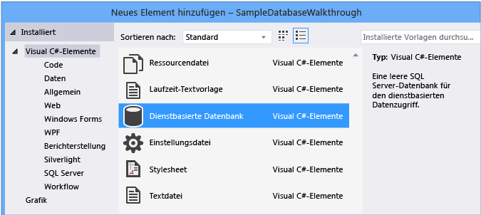
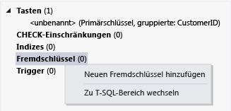

# <a name="create-a-database-and-add-tables-in-visual-studio"></a>Eine Datenbank erstellen und Hinzufügen von Tabellen in Visual Studio
Sie können Visual Studio verwenden, erstellen und Aktualisieren einer lokalen Datenbankdatei in SQL Server Express LocalDB. Sie können auch eine Datenbank erstellen, durch das Ausführen von Transact-SQL-Anweisungen in der **Objekt-Explorer von SQL Server** Toolfenster in Visual Studio. In diesem Thema wird eine MDF-Datei erstellen und Hinzufügen von Tabellen und Schlüsseln mit dem Tabellen-Designer.

## <a name="prerequisites"></a>Erforderliche Komponenten
Zum Durchführen dieser exemplarischen Vorgehensweise benötigen Sie die optionale **datenspeicherung und Verarbeitung** arbeitsauslastung, die in Visual Studio installiert. Öffnen sie zur Installation **Installer für Visual Studio** , und wählen Sie die **Arbeitsauslastungen** Registerkarte. Klicken Sie unter **Web & Cloud**, wählen Sie **datenspeicherung und Verarbeitung**. Wählen Sie die **ändern** Schaltfläche, um die arbeitsauslastung zu Visual Studio hinzufügen.

## <a name="create-a-project-and-a-local-database-file"></a>Erstellen eines Projekts und einer lokalen Datenbankdatei

### <a name="to-create-a-project-and-a-database-file"></a>So erstellen Sie ein Projekt und eine Datenbankdatei
1.  Erstellen Sie ein Windows Forms-Projekt mit dem Namen `SampleDatabaseWalkthrough`.

2.  Wählen Sie auf der Menüleiste **Projekt**, **neues Element hinzufügen**.

3.  In der Liste von Elementvorlagen, einen Bildlauf nach unten, und wählen Sie **Dienstbasierte Datenbank**.

     

4.  Nennen Sie die Datenbank **"SampleDatabase"**, und wählen Sie dann die **hinzufügen** Schaltfläche.

### <a name="to-add-a-data-source"></a>So fügen Sie eine Datenquelle hinzu
5.  Wenn die **Datenquellen** Fenster nicht geöffnet ist, öffnen Sie es durch Auswählen der **Umschalt + Alt + D** Schlüssel oder wählen Sie in der Menüleiste auswählen **Ansicht**, **Weitere Fenster**, **Datenquellen**.

6.  In der **Datenquellen** wählen die **neue Datenquelle hinzufügen** Link.

    Die **Data Source Configuration Wizard** wird geöffnet.

7. Auf der **wählen Sie einen Datenquellentyp** Seite **Datenbank** und wählen Sie dann **Weiter**.

8. Auf der **Auswählen eines Datenbankmodells** Seite **Weiter** auf den Standardwert (Dataset) zu akzeptieren.

9. Auf der **wählen Sie Ihre Datenverbindung** Seite der **"SampleDatabase.mdf"** in der Dropdown-Liste, und wählen Sie dann **Weiter**.

10. Auf der **Verbindungszeichenfolge in der Anwendungskonfigurationsdatei speichern** Seite **Weiter**.

11. Einer der **wählen Sie Ihre Datenbankobjekte** Seite sehen, da Sie eine Meldung, die besagt, die Datenbank dass keine Objekte enthalten. Klicken Sie auf **Fertig stellen**.

### <a name="to-view-properties-of-the-data-connection"></a>So zeigen Sie die Eigenschaften der Datenverbindung an
Sie können die Verbindungszeichenfolge für die Datei "SampleDatabase.mdf" anzeigen, öffnen Sie im Eigenschaftenfenster die Datenverbindung:

-   Wählen Sie in Visual Studio **Ansicht**, **Objekt-Explorer von SQL Server** , wenn das Fenster nicht bereits geöffnet ist. Öffnen Sie das Eigenschaftenfenster, indem Sie erweitern die **Datenverbindungen** Knoten, öffnen das Kontextmenü für "SampleDatabase.mdf", und wählen dann **Eigenschaften**.

-   Sie können auch auswählen **Ansicht**, **Server-Explorer**, sofern dieses Fenster nicht bereits geöffnet ist. Öffnen Sie das Eigenschaftenfenster, indem Sie erweitern die **Datenverbindungen** Knoten. Öffnen Sie das Kontextmenü für "SampleDatabase.mdf", und wählen Sie dann **Eigenschaften**.

## <a name="create-tables-and-keys-by-using-table-designer"></a>Erstellen von Tabellen und Schlüsseln mit Tabellen-Designer
In diesem Abschnitt erstellen Sie zwei Tabellen, einen Primärschlüssel in jeder Tabelle und einige Zeilen der Beispieldaten. Sie erstellen auch einen Fremdschlüssel, um anzugeben, wie Datensätze in einer Tabelle den Datensätzen in einer anderen Tabelle entsprechen.

### <a name="to-create-the-customers-table"></a>So erstellen Sie die Tabelle Customers
1.  In **Server-Explorer** oder **Objekt-Explorer von SQL Server**, erweitern Sie die **Datenverbindungen** Knoten, und erweitern Sie dann die **"SampleDatabase.mdf"** Knoten.

2.  Öffnen Sie das Kontextmenü für **Tabellen**, und wählen Sie dann **neue Tabelle hinzufügen**.

     Die **Tabellen-Designer** wird geöffnet und zeigt ein Raster mit einer standardmäßigen Zeile an, der eine einzelne Spalte in der Tabelle darstellt, die Sie erstellen. Durch Hinzufügen von Zeilen zum Raster fügen Sie zusätzliche Spalten in der Tabelle hinzu.

3.  Im Raster fügen Sie eine Zeile für jeden der folgenden Einträge hinzu:

    |Spaltenname|Datentyp|NULL zulassen|
    |-----------------|---------------|-----------------|
    |`CustomerID`|`nchar(5)`|False (gelöscht)|
    |`CompanyName`|`nvarchar(50)`|False (gelöscht)|
    |`ContactName`|`nvarchar (50)`|True (ausgewählt)|
    |`Phone`|`nvarchar (24)`|True (ausgewählt)|

4.  Öffnen Sie das Kontextmenü für die `CustomerID` Zeile, und wählen Sie dann **Primärschlüssel festlegen**.

5.  Öffnen Sie das Kontextmenü für die Standardzeile, und wählen Sie dann **löschen**.

6.  Benennen Sie die Tabelle "Customers", indem Sie die erste Zeile im Skriptbereich entsprechend dem folgenden Beispiel aktualisieren:

    ```sql
    CREATE TABLE [dbo].[Customers]
    ```

    Folgendes sollte angezeigt werden:

    

7.  In der oberen linken Ecke des der **Tabellen-Designer**, wählen die **Update** Schaltfläche.

8.  In der **Vorschau der Datenbankupdates** wählen Sie im Dialogfeld die **Update Database** Schaltfläche.

    Ihre Änderungen werden in der lokalen Datenbankdatei gespeichert.

### <a name="to-create-the-orders-table"></a>So erstellen Sie die Tabelle Orders
1.  Fügen Sie eine weitere Tabelle hinzu, und fügen Sie dann in der folgenden Tabelle eine Zeile für jeden Eintrag hinzu:

    |Spaltenname|Datentyp|NULL zulassen|
    |-----------------|---------------|-----------------|
    |`OrderID`|`int`|False (gelöscht)|
    |`CustomerID`|`nchar(5)`|False (gelöscht)|
    |`OrderDate`|`datetime`|True (ausgewählt)|
    |`OrderQuantity`|`int`|True (ausgewählt)|

2.  Legen Sie **OrderID** als Primärschlüssel aus, und löschen Sie dann die Standardzeile.

3.  Benennen Sie die Tabelle "Orders", indem Sie die erste Zeile im Skriptbereich entsprechend dem folgenden Beispiel aktualisieren:

    ```sql
    CREATE TABLE [dbo].[Orders]
    ```

4.  In der oberen linken Ecke des der **Tabellen-Designer**, wählen die **Update** Schaltfläche.

5.  In der **Vorschau der Datenbankupdates** wählen Sie im Dialogfeld die **Update Database** Schaltfläche.

    Ihre Änderungen werden in der lokalen Datenbankdatei gespeichert.

### <a name="to-create-a-foreign-key"></a>So erstellen Sie einen Fremdschlüssel
1.  Wählen Sie im Bereich "Kontext" auf der rechten Seite des Rasters öffnen Sie das Kontextmenü für **Fremdschlüssel**, und wählen Sie dann **neuen Fremdschlüssel hinzufügen**, wie in die folgende Abbildung dargestellt.

     

2.  Ersetzen Sie in das Textfeld, das angezeigt wird, **ToTable** mit `Customers`.

3.  Aktualisieren Sie im T-SQL-Bereich die letzte Zeile entsprechend der im folgende Beispiel aus:

    ```sql
    CONSTRAINT [FK_Orders_Customers] FOREIGN KEY ([CustomerID]) REFERENCES [Customers]([CustomerID])
    ```

4.  In der oberen linken Ecke des der **Tabellen-Designer**, wählen die **Update** Schaltfläche.

5.  In der **Vorschau der Datenbankupdates** wählen Sie im Dialogfeld die **Update Database** Schaltfläche.

    Ihre Änderungen werden in der lokalen Datenbankdatei gespeichert.

## <a name="populate-the-tables-with-data"></a>Füllen Sie die Tabellen mit Daten

### <a name="to-populate-the-tables-with-data"></a>So füllen Sie die Tabellen mit Daten

1.  In **Server-Explorer** oder **Objekt-Explorer von SQL Server**, erweitern Sie den Knoten für die Beispieldatenbank.

2.  Öffnen Sie das Kontextmenü für die **Tabellen** Knoten **aktualisieren**, und erweitern Sie dann die **Tabellen** Knoten.

3.  Öffnen Sie das Kontextmenü für die Customers-Tabelle, und wählen Sie dann **Tabellendaten anzeigen**.

4.  Fügen Sie die gewünschten Daten, die Sie für einige Kunden möchten.

    Sie können fünf beliebige Zeichen für die Kunden-IDs angeben, wählen Sie aber mindestens eine aus, an die Sie sich noch erinnern können, um sie später in dieser Prozedur zu verwenden.

5.  Öffnen Sie das Kontextmenü für die Orders-Tabelle, und wählen Sie dann **Tabellendaten anzeigen**.

6.  Hinzufügen von Daten für einige Aufträge.

    > [!IMPORTANT]
    > Stellen Sie sicher, dass alle Bestellnummern und-Mengen ganze Zahlen sind und jede Kunden-ID mit einem Wert entspricht, den Sie in die CustomerID-Spalte der Customers-Tabelle angegeben.

7.  Wählen Sie auf der Menüleiste **Datei**, **alle speichern**.

## <a name="see-also"></a>Siehe auch

- [Zugreifen auf Daten in Visual Studio](accessing-data-in-visual-studio.md)