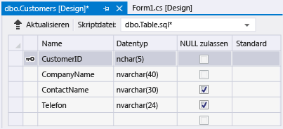

# Exemplarische Vorgehensweise: Erstellen einer lokalen Datenbankdatei in Visual&#160;Studio
Sie können sich mit grundlegenden Aufgaben wie dem Hinzufügen von Tabellen und Definieren von Spalten vertraut machen, indem Sie Visual Studio verwenden, um eine lokale Datenbankdatei in SQL Server Express LocalDB zu erstellen und zu aktualisieren, wie unter [Übersicht über lokale Daten](../data-tools/local-data-overview.md) beschrieben.  Nachdem Sie diese exemplarische Vorgehensweise abgeschlossen haben, können Sie erweiterte Funktionen ermitteln, indem Sie die lokale Datenbank als Ausgangspunkt für andere exemplarische Vorgehensweisen verwenden, in denen sie erforderlich ist.  
  
 Weitere Informationen zum Erstellen einer Datenbank mithilfe von SQL Server Management Studio oder Transact\-SQL finden Sie unter [Create a Database](http://msdn.microsoft.com/de-de/4c4beea2-6cbc-4352-9db6-49ea8130bb64).  
  
 Im Verlauf dieser exemplarischen Vorgehensweise führen Sie folgende Aufgaben aus:  
  
-   [Erstellen eines Projekts und einer lokalen Datenbankdatei](../data-tools/create-a-sql-database-by-using-a-designer.md#BKMK_CreateNewSQLDB).  
  
-   [Erstellen von Tabellen, Spalten, Primärschlüsseln und Fremdschlüsseln](../data-tools/create-a-sql-database-by-using-a-designer.md#BKMK_CreateNewTbls).  
  
-   [Auffüllen der Tabellen mit Daten](../data-tools/create-a-sql-database-by-using-a-designer.md#BKMK_Populating).  
  
## Vorbereitungsmaßnahmen  
 Zum Durchführen dieser exemplarischen Vorgehensweise installieren Sie [!INCLUDE[vs_dev12_expwin](../data-tools/includes/vs_dev12_expwin_md.md)], Visual Studio Professional 2013, Visual Studio Premium 2013 oder Visual Studio Ultimate 2013.  Diese Versionen von Visual Studio enthalten SQL Server Data Tools.  
  
##  <a name="BKMK_CreateNewSQLDB"></a> Erstellen eines Projekts und einer lokalen Datenbankdatei  
  
#### So erstellen Sie ein Projekt und eine Datenbankdatei  
  
1.  Erstellen Sie ein Windows Forms\-Projekt mit dem Namen `SampleDatabaseWalkthrough`.  
  
     Siehe [Erstellen von Projekten und Projektmappen](../ide/creating-solutions-and-projects.md).  
  
2.  Wählen Sie in der Menüleiste **Projekt**,  **Neues Element hinzufügen** aus.  
  
     Das Dialogfeld **Neues Element hinzufügen** wird angezeigt, damit Sie Elemente hinzufügen können, die für ein Windows Form\-Projekt geeignet sind.  
  
3.  Führen Sie in der Liste der Elemente einen Bildlauf bis zu **Dienstbasierte Datenbank** durch, und wählen Sie sie dann aus.  
  
       
  
4.  Nennen Sie die Datenbank "SampleDatabase", und klicken Sie dann auf die Schaltfläche **Hinzufügen**.  
  
5.  Wenn das Fenster "Datenquellen" nicht geöffnet ist, öffnen Sie es durch Drücken der Tasten UMSCHALT\-ALT\-D oder durch Auswählen von **Ansicht**, **Weitere Fenster**, **Datenquellen** in der Menüleiste.  
  
6.  Wählen Sie im Fenster "Datenquellen" den Link **Neue Datenquelle hinzufügen** aus.  
  
7.  Klicken Sie im Dialogfeld **Assistent zum Konfigurieren von Datenquellen** viermal auf die Schaltfläche **Weiter**, um die Standardeinstellungen zu übernehmen. Klicken Sie dann auf die Schaltfläche **Fertig stellen**.  
  
 Wenn Sie das Eigenschaftenfenster für die Datenbank öffnen, können Sie ihre Verbindungszeichenfolge und den Speicherort der primären MDF\-Datei anzeigen.  
  
-   Wählen Sie in Visual Studio Express die Optionen **Ansicht**, **Weitere Fenster**, **Datenbank\-Explorer**, sofern dieses Fenster nicht bereits geöffnet ist.  Um das Eigenschaftenfenster zu öffnen, erweitern Sie den Knoten **Datenverbindungen**, öffnen Sie das Kontextmenü für "SampleDatabase.mdf", und wählen Sie dann **Eigenschaften** aus.  
  
-   In anderen Versionen von Visual Studio wählen Sie die Optionen **Ansicht**, **Server\-Explorer** aus, sofern dieses Fenster nicht bereits geöffnet ist.  Um das Eigenschaftenfenster zu öffnen, erweitern Sie den Knoten **Datenverbindungen**, öffnen Sie das Kontextmenü für "SampleDatabase.mdf", und wählen Sie dann **Eigenschaften** aus.  
  
##  <a name="BKMK_CreateNewTbls"></a> Erstellen von Tabellen, Spalten, Primärschlüsseln und Fremdschlüsseln  
 In diesem Abschnitt erstellen Sie einige Tabellen, einen Primärschlüssel in jeder Tabelle und einige wenige Zeilen mit Beispieldaten.  In der folgenden exemplarischen Vorgehensweise erhalten Sie eine Vorstellung davon, wie diese Informationen möglicherweise in einer Anwendung angezeigt werden.  Sie erstellen auch einen Fremdschlüssel, um ggf. anzugeben, wie Datensätze in einer Tabelle den Datensätzen in einer anderen Tabelle entsprechen.  
  
#### So erstellen Sie die Tabelle Customers  
  
1.  Erweitern Sie im **Server\-Explorer** oder im **Datenbank\-Explorer** den Knoten **Datenverbindungen** und dann den Knoten **SampleDatabase.mdf**.  
  
     Wenn der Explorer für Ihre Version von Visual Studio nicht geöffnet ist, wählen Sie in der Menüleiste die Optionen **Ansicht** und **Server\-Explorer** oder **Ansicht**, **Weitere Fenster** und **Datenbank\-Explorer** aus.  
  
2.  Öffnen Sie das Kontextmenü für **Tabellen**, und wählen Sie dann **Neue Tabelle hinzufügen** aus.  
  
     Der **Tabellen\-Designer** wird geöffnet und zeigt ein Raster mit einer standardmäßigen Zeile an, die eine einzelne Spalte in der Tabelle darstellt, die Sie erstellen.  Durch Hinzufügen von Zeilen zum Raster fügen Sie zusätzliche Spalten in der Tabelle hinzu.  
  
3.  Im Raster fügen Sie eine Zeile für jeden der folgenden Einträge hinzu:  
  
    |Spaltenname|Datentyp|NULL zulassen|  
    |-----------------|--------------|-------------------|  
    |`CustomerID`|`nchar(5)`|False \(gelöscht\)|  
    |`CompanyName`|`nvarchar(40)`|False \(gelöscht\)|  
    |`ContactName`|`nvarchar (30)`|True \(ausgewählt\)|  
    |`Phone`|`nvarchar (24)`|True \(ausgewählt\)|  
  
4.  Öffnen Sie das Kontextmenü für die `CustomerID`\-Zeile, und wählen Sie dann **Primärschlüssel festlegen** aus.  
  
5.  Öffnen Sie das Kontextmenü für die Standardzeile, und wählen Sie dann **Löschen** aus.  
  
6.  Benennen Sie die Tabelle "Customers", indem Sie die erste Zeile im Skriptbereich entsprechend dem folgenden Beispiel aktualisieren:  
  
    ```  
    CREATE TABLE [dbo].[Customers]  
    ```  
  
7.  Wählen Sie in der oberen linken Ecke des Tabellen\-Designers die Schaltfläche **Aktualisieren** aus, wie in der folgenden Abbildung dargestellt.  
  
       
  
8.  Klicken Sie im Dialogfeld **Vorschau der Datenbankupdates** auf die Schaltfläche **Datenbank aktualisieren**.  
  
     Ihre Änderungen werden in der lokalen Datenbankdatei gespeichert.  
  
#### So erstellen Sie die Tabelle Orders  
  
1.  Fügen Sie eine weitere Tabelle hinzu, und fügen Sie dann in der folgenden Tabelle eine Zeile für jeden Eintrag hinzu:  
  
    |Spaltenname|Datentyp|NULL zulassen|  
    |-----------------|--------------|-------------------|  
    |`OrderID`|`int`|False \(gelöscht\)|  
    |`CustomerID`|`nchar(5)`|False \(gelöscht\)|  
    |`OrderDate`|`datetime`|True \(ausgewählt\)|  
    |`OrderQuantity`|`int`|True \(ausgewählt\)|  
  
2.  Legen Sie **OrderID** als Primärschlüssel fest, und löschen Sie dann die Standardzeile.  
  
3.  Benennen Sie die Tabelle "Orders", indem Sie die erste Zeile im Skriptbereich entsprechend dem folgenden Beispiel aktualisieren:  
  
    ```  
    CREATE TABLE [dbo].[Orders]  
    ```  
  
4.  Klicken Sie in der oberen linken Ecke des Tabellen\-Designers auf die Schaltfläche **Aktualisieren**.  
  
5.  Klicken Sie im Dialogfeld **Vorschau der Datenbankupdates** auf die Schaltfläche **Datenbank aktualisieren**.  
  
     Ihre Änderungen werden in der lokalen Datenbankdatei gespeichert.  
  
#### So erstellen Sie einen Fremdschlüssel  
  
1.  Im Kontextbereich auf der rechten Seite des Rasters öffnen Sie das Kontextmenü für **Fremdschlüssel** und wählen dann **Neuen Fremdschlüssel hinzufügen** aus, wie in der folgenden Abbildung dargestellt.  
  
       
  
2.  Im angezeigten Textfeld ersetzen Sie **ToTable** durch `Customers`.  
  
3.  Im Skriptbereich aktualisieren Sie die letzte Zeile entsprechend dem folgenden Beispiel:  
  
    ```  
    CONSTRAINT [FK_Orders_Customers] FOREIGN KEY ([CustomerID]) REFERENCES [Customers]([CustomerID])  
    ```  
  
4.  Klicken Sie in der oberen linken Ecke des Tabellen\-Designers auf die Schaltfläche **Aktualisieren**.  
  
5.  Klicken Sie im Dialogfeld **Vorschau der Datenbankupdates** auf die Schaltfläche **Datenbank aktualisieren**.  
  
     Ihre Änderungen werden in der lokalen Datenbankdatei gespeichert.  
  
##  <a name="BKMK_Populating"></a> Auffüllen der Tabellen mit Daten  
  
#### So füllen Sie die Tabellen mit Daten  
  
1.  Erweitern Sie im **Server Explorer** oder im **Datenbank\-Explorer** den Knoten für die Beispieldatenbank.  
  
2.  Öffnen Sie das Kontextmenü für den Knoten "Tabellen", wählen Sie **Aktualisieren** aus und erweitern Sie anschließend den Knoten "Tabellen".  
  
3.  Öffnen Sie das Kontextmenü für die Tabelle "Customers", und wählen Sie dann **Tabellendaten anzeigen** aus.  
  
4.  Fügen Sie die gewünschten Daten für mindestens drei Kunden hinzu.  
  
     Sie können fünf beliebige Zeichen für die Kunden\-IDs angeben, wählen Sie aber mindestens eine aus, an die Sie sich noch erinnern können, um sie später in dieser Prozedur zu verwenden.  
  
5.  Öffnen Sie das Kontextmenü für die Tabelle "Orders", und wählen Sie dann **Tabellendaten anzeigen** aus.  
  
6.  Fügen Sie Daten für mindestens drei Bestellungen hinzu.  
  
    > [!IMPORTANT]
    >  Überprüfen Sie, ob alle Bestellnummern und \-mengen ganze Zahlen sind und ob jede Kunden\-ID mit einem Wert übereinstimmt, den Sie in der Spalte "CustomerID" in der Tabelle "Customers" angegeben haben.  
  
7.  Wählen Sie in der Menüleiste die Option **Datei**, **Alle speichern** aus.  
  
8.  Wählen Sie in der Menüleiste **Datei**, **Projektmappe schließen** aus.  
  
    > [!NOTE]
    >  Die empfohlene Vorgehensweise besteht darin, die soeben erstellte Datenbankdatei zu sichern, indem Sie sie kopieren und dann entweder die Kopie an einem anderen Speicherort einzufügen oder der Kopie einen anderen Namen zu geben.  
  
## Nächste Schritte  
 Jetzt haben Sie eine lokale Datenbankdatei mit einigen Beispieldaten erstellt und können die unter [Exemplarische Vorgehensweise: Herstellen einer Verbindung mit Daten in einer lokalen Datenbankdatei \(Windows Forms\)](../data-tools/walkthrough-connecting-to-data-in-a-local-database-file-windows-forms.md) beschriebenen Schritte sowie weitere exemplarische Vorgehensweisen für Datenbankaufgaben ausführen.  
  
## Siehe auch  
 [Gewusst wie: Verwalten von lokalen Datendateien im Projekt](../data-tools/how-to-manage-local-data-files-in-your-project.md)   
 [Übersicht über lokale Daten](../data-tools/local-data-overview.md)   
 [Binden von Windows Forms\-Steuerelementen an Daten in Visual Studio](../data-tools/bind-windows-forms-controls-to-data-in-visual-studio.md)   
 [Übersicht über Datenanwendungen in Visual Studio](../data-tools/overview-of-data-applications-in-visual-studio.md)   
 [Herstellen von Datenverbindungen in Visual Studio](../data-tools/connecting-to-data-in-visual-studio.md)   
 [Vorbereiten der Anwendung auf den Empfang von Daten](../Topic/Preparing%20Your%20Application%20to%20Receive%20Data.md)   
 [Abrufen von Daten für die Anwendung](../data-tools/fetching-data-into-your-application.md)   
 [Binden von Steuerelementen an Daten in Visual Studio](../data-tools/bind-controls-to-data-in-visual-studio.md)   
 [Bearbeiten von Daten in der Anwendung](../data-tools/editing-data-in-your-application.md)   
 [Überprüfen von Daten](../Topic/Validating%20Data.md)   
 [Speichern von Daten](../data-tools/saving-data.md)