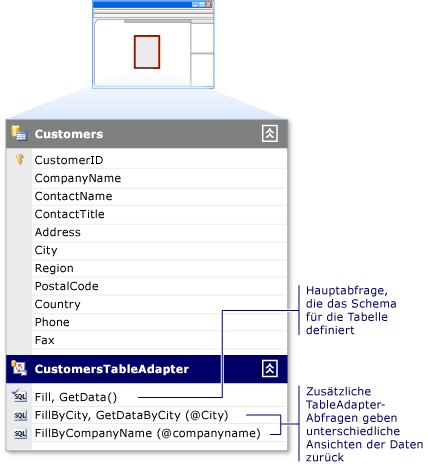

# Erstellen und Konfigurieren von TableAdapters
TableAdapters ermöglichen die Kommunikation zwischen der Anwendung und einer Datenbank. Sie Verbinden mit der Datenbank, ausgeführte Abfragen oder gespeicherte Prozeduren und entweder eine neue Daten zurückgeben Tabellen- oder füllen Sie ein vorhandenes <xref:System.Data.DataTable> mit den zurückgegebenen Daten. TableAdapters können auch aktualisierte Daten aus der Anwendung wieder in die Datenbank senden.  
  
TableAdapters werden für Sie erstellt, wenn Sie eine der folgenden Aktionen ausführen:  
  
-   Führen Sie die [Datenquellen Konfigurations-Assistenten](../data-tools/media/data-source-configuration-wizard.png) , und wählen Sie die **Datenbank** oder **Webdienst** Datenquellentyp.  
  
-   Ziehen Sie Datenbankobjekte aus **Server-Explorer** in der **Dataset-Designer**.  
  
Sie können auch einen neuen TableAdapter erstellen und konfigurieren Sie ihn mit einer Datenquelle durch Ziehen eines TableAdapters aus der Toolbox auf einen leeren Bereich in der **Dataset-Designer** Oberfläche.  
  
Eine Einführung in TableAdapters finden Sie unter [Datasets mit TableAdapters füllen](../data-tools/fill-datasets-by-using-tableadapters.md).  
  
[!INCLUDE[note_settings_general](../data-tools/includes/note_settings_general_md.md)]  
  
## Verwenden Sie den TableAdapter-Konfigurations-Assistenten  
Führen Sie die **TableAdapter-Konfigurations-Assistenten** erstellen oder Bearbeiten von TableAdapters und deren zugeordnete Datentabellen. Sie können einen vorhandenen TableAdapter konfigurieren, indem Sie mit der rechten Maustaste darauf in der **Dataset-Designer**.  
  
  
  
Wenn Sie einen neuen TableAdapter aus der Toolbox ziehen, wenn die **Dataset-Designer** befinden sich in zu konzentrieren, der Assistent wird gestartet und aufgefordert, die Sie angeben, welche Daten den TableAdapter Datenquelle müssen eine Verbindung mit. Vom Assistenten wird auf der nächsten Seite gefragt, welche Art von Befehlen für die Kommunikation mit der Datenbank, SQL-Anweisungen oder gespeicherten Prozeduren verwendet werden soll. (Sie wird nicht dies sehen, wenn Sie einen TableAdapter konfigurieren, die bereits mit einer Datenquelle zugeordnet ist.)  
  
-   Sie haben die Möglichkeit, eine neue gespeicherte Prozedur in der zugrunde liegenden Datenbank erstellen, wenn Sie die richtigen Berechtigungen für die Datenbank verfügen. Wenn Sie nicht über diese Berechtigungen verfügen, wird nicht dies eine Option sein.  
  
-   Sie könne auch vorhandene gespeicherte Prozeduren für die Ausführung der **wählen**, **einfügen**, **UPDATE**, und **löschen** Befehle von der TableAdapter. Die gespeicherte Prozedur, die zugewiesen ist die **Update** Befehl ein, z. B. wird ausgeführt, wenn die `TableAdapter.Update()` -Methode aufgerufen wird.  
  
Ordnen Sie die Parameter der ausgewählten gespeicherten Prozedur den entsprechenden Spalten in der Datentabelle zu. Z. B., wenn die gespeicherte Prozedur einen Parameter namens akzeptiert `@CompanyName` , die zum Übergeben der `CompanyName` Spaltensatz in der Tabelle der **Quellspalte** von der `@CompanyName` Parameter `CompanyName`.  
  
> [!NOTE]
>  Die gespeicherte Prozedur, die die SELECT-Befehl zugewiesen wird wird durch Aufrufen der Methode des TableAdapter von Ihnen benannten im nächsten Schritt des Assistenten ausgeführt. Die Standardmethode ist `Fill`, sodass der Code, der in der Regel, zum Ausführen der SELECT-Prozedur verwendet wird ist `TableAdapter.Fill(tableName)`. Wenn Sie den Standardnamen aus ändern `Fill`, ersetzen Sie durch `Fill` mit dem Namen zuweisen, und Ersetzen Sie "TableAdapter" durch den tatsächlichen Namen des TableAdapter (z. B. `CustomersTableAdapter`).  
  
-   Auswählen der **Methoden erstellen, um Updates direkt an die Datenbank senden** Option entspricht dem Festlegen der `GenerateDBDirectMethods` Eigenschaft auf "true". Die Option ist nicht verfügbar, wenn die ursprüngliche SQL-Anweisung nicht genügend Informationen bereitstellt oder die Abfrage keine aktualisierbare Abfrage ist. Diese Situation kann auftreten, z. B. **JOIN** Abfragen und Abfragen, die einen einzelnen (skalaren) Wert zurückgeben.  
  
Die **erweiterte Optionen** im Assistenten ermöglichen es Ihnen:  
- Generieren von INSERT-, Update- und DELETE-Anweisungen, die basierend auf der SELECT-Anweisung, die auf definiert ist die **Generieren von SQL-Anweisungen** Seite
- Optimistische Nebenläufigkeit verwenden
- Gibt an, ob nach dem Einfügen die Tabelle aktualisieren und UPDATE-Anweisungen ausgeführt werden  
  
## Konfigurieren eines TableAdapter Fill-Methode  
Möglicherweise möchten das Schema der Tabelle des TableAdapter zu ändern. Zu diesem Zweck ändern Sie den TableAdapter primären `Fill` Methode. TableAdapters werden erstellt, mit der primären `Fill` -Methode, die das Schema der zugeordneten Datentabelle definiert. Die primäre `Fill` -Methode basiert auf der Abfrage oder gespeicherte Prozedur, die Sie eingegeben haben, wenn Sie ein TableAdapter ursprünglich konfiguriert. Es ist die erste (oberste) Methode unter der Datentabelle im DataSet-Designer.  
  
  
  
Änderungen, die Sie dem TableAdapter Hauptformulars `Fill` Methode im Schema der zugeordneten Datentabelle wiedergegeben werden. Beispielsweise das Entfernen einer Spalte aus der Abfrage im Hauptbearbeitungsfenster `Fill` Methode wird auch die Spalte aus der zugeordneten Datentabelle entfernt. Entfernen Sie darüber hinaus die Spalte aus dem Hauptknoten `Fill` Methode entfernt die Spalte aus etwaigen zusätzlichen Abfragen für diesen TableAdapter.  
  
Sie können die TableAdapter-Abfragekonfigurations-Assistent zum Erstellen und Bearbeiten von zusätzlichen Abfragen für den TableAdapter verwenden. Diese zusätzlichen Abfragen müssen das Tabellenschema entsprechen, wenn sie einen skalaren Wert zurückgeben.  Jede zusätzliche Abfrage hat einen Namen, den Sie angeben.  
 
Im folgende Beispiel wird veranschaulicht, wie eine weitere Abfrage mit dem Namen aufgerufen `FillByCity`:  
 
`CustomersTableAdapter.FillByCity(NorthwindDataSet.Customers, "Seattle")`  
  
#### So starten Sie den TableAdapter-Abfragekonfigurations-Assistent mit einer neuen Abfrage  
  
1.  Öffnen Sie das Dataset in die **Dataset-Designer**.  
  
2.  Wenn Sie eine neue Abfrage erstellen, ziehen Sie eine **Abfrage** -Objekt aus der **DataSet** auf der Registerkarte die **Toolbox** auf eine <xref:System.Data.DataTable>, oder wählen Sie **Abfrage hinzufügen**im Kontextmenü des TableAdapter. Sie können auch ziehen eine **Abfrage** Objekt in einem leeren Bereich des der **Dataset-Designer**, wodurch erstellt einen TableAdapter ohne eine zugeordnete <xref:System.Data.DataTable>. Diese Abfragen können nur einzelnen (skalaren) Wert oder Ausführen von Update-, INSERT-zurückgeben bzw. Befehle für die Datenbank zu löschen.  
  
3.  Auf der **wählen Sie Ihre Datenverbindung** Bildschirm, wählen Sie aus, oder erstellen Sie die Verbindung, die die Abfrage verwendet.  
  
    > [!NOTE]
    >  Dieser Bildschirm wird nur angezeigt, wenn der Designer die richtige Verbindung verwenden, bestimmt werden kann oder wenn keine Verbindungen verfügbar sind.  
  
4.  Auf der **wählen Sie einen Befehlstyp** Bildschirm, wählen Sie aus der folgenden Methoden zum Abrufen von Daten aus der Datenbank:  
  
    -   **Verwenden Sie SQL-Anweisungen** ermöglicht es Ihnen, geben Sie eine SQL-Anweisung, um die Daten in der Datenbank auszuwählen.  
  
    -   **Erstellen Sie neue gespeicherte Prozedur** ermöglicht, die Sie den Assistenten erstellen Sie eine neue gespeicherte Prozedur (in der Datenbank), die basierend auf der angegebenen SELECT-Anweisung.  
  
    -   **Vorhandene gespeicherte Prozeduren verwenden** ermöglicht es Ihnen, eine vorhandene gespeicherte Prozedur ausführen, wenn die Abfrage ausgeführt.  
  
#### Zum Starten des TableAdapter-Abfrage-Konfigurations-Assistenten auf eine vorhandene Abfrage  
  
-   Wenn Sie eine vorhandene TableAdapter-Abfrage bearbeiten, mit der rechten Maustaste in der Abfrage, und wählen Sie dann **konfigurieren** aus dem Kontextmenü.  
  
    > [!NOTE]
    >  Mit der rechten Maustaste in der Hauptabfrage des TableAdapter wird den TableAdapter und <xref:System.Data.DataTable> Schema. Mit der rechten Maustaste auf einen TableAdapter einer weiteren Abfrage wird jedoch nur die ausgewählte Abfrage konfiguriert. Die **TableAdapter-Konfigurations-Assistenten** wird die TableAdapter-Definition, während der TableAdapter-Abfragekonfigurations-Assistent nur die ausgewählte Abfrage neu konfiguriert.  
  
#### Hinzufügen eine globale Abfrage zu einem TableAdapter  
  
-   *Globale Abfragen* sind SQL-Abfragen, die einen einzelnen (skalaren) Wert oder keinen Wert zurückgeben. Globale Funktionen führen in der Regel Datenbankvorgänge, z. B. Einfüge-, Update-, löscht. Sie aggregieren auch Informationen, z. B. die Anzahl der Kunden in einer Tabelle oder die gesamte Gebühren für alle Elemente in einer bestimmten Reihenfolge.  
  
     Hinzufügen von globalen Abfragen durch Ziehen einer **Abfrage** -Objekt aus der **DataSet** auf der Registerkarte die **Toolbox** in einem leeren Bereich von der **Dataset-Designer**.  
  
-   Geben Sie eine Abfrage, die die gewünschte Aufgabe, z. B. ausführt `SELECT COUNT(*) AS CustomerCount FROM Customers`.  
  
    > [!NOTE]
    >  Ziehen einer **Abfrage** -Objekt direkt auf die **Dataset-Designer** erstellt eine Methode, die nur einen Skalarwert (einzelnen) Wert zurückgibt. Während der Abfrage oder gespeicherte Prozedur, die Sie auswählen, mehr als einen einzelnen Wert zurückgeben kann, gibt die Methode, die vom Assistenten erstellt wird nur einen einzelnen Wert zurück. Die Abfrage kann z. B. die erste Spalte der ersten Zeile der zurückgegebenen Daten zurückgeben.

## Siehe auch
[Füllen von Datasets mit TableAdapters](../data-tools/fill-datasets-by-using-tableadapters.md)