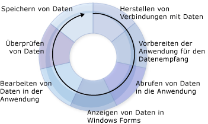

# Erstellen von Datenanwendungen
Visual Studio stellt viele Entwurfszeittools bereit, um Ihnen die Erstellung von Anwendungen für Datenzugriffe zu ermöglichen.  Diese Einführung bietet eine Übersicht über die grundlegenden Prozesse beim Erstellen solcher Datenanwendungen.  Es werden keine Details aufgeführt, da diese Übersicht lediglich als allgemeine Informationsquelle und Ausgangspunkt für die zahlreichen weiteren Themen dienen soll, die mit der Erstellung einer Datenanwendung verknüpft sind.  
  
 Wenn Sie in [!INCLUDE[vsprvs](../code-quality/includes/vsprvs_md.md)] Anwendungen entwickeln, die auf Daten zugreifen, sind verschiedene Anforderungen zu beachten.  Manchmal sollen die Daten nur auf einem Formular angezeigt werden,  manchmal müssen Sie Möglichkeiten finden, Informationen mit anderen Anwendungen oder Prozessen auszutauschen.  
  
 Unabhängig davon, wozu Sie die Daten verwenden möchten, müssen Sie bestimmte grundlegende Konzepte kennen.  Einige Details der Datenverarbeitung müssen Sie möglicherweise nie lernen. Beispielsweise müssen Sie eventuell nie eine Datenbank programmgesteuert erstellen. Dennoch ist es sehr sinnvoll, die grundlegenden Datenkonzepte sowie die Datentools \(Assistenten und Designer\) zu kennen, die in [!INCLUDE[vsprvs](../code-quality/includes/vsprvs_md.md)] zur Verfügung stehen.  
  
 Eine typische Datenanwendung verwendet die meisten der im folgenden Diagramm dargestellten Prozesse:  
  
   
Der Datenzyklus  
  
 Orientieren Sie sich beim Erstellen der Anwendung an der Aufgabe, die damit ausgeführt werden soll.  Wählen Sie mithilfe der folgenden Abschnitte die [!INCLUDE[vsprvs](../code-quality/includes/vsprvs_md.md)]\-Tools und \-Objekte aus, die Ihnen zur Verfügung stehen.  
  
> [!NOTE]
>  [!INCLUDE[vsprvs](../code-quality/includes/vsprvs_md.md)] stellt Assistenten bereit, um mehrere der im vorherigen Diagramm gezeigten Prozesse zu vereinfachen.  Wenn Sie z. B. den **Assistenten zum Konfigurieren von Datenquellen** ausführen, werden Ihrer Anwendung genügend Informationen zur Verfügung gestellt, um eine Verbindung mit Daten herzustellen, ein typisiertes Dataset zum Empfangen von Daten zu erstellen und die Daten in Ihre Anwendung einzubinden.  
  
 Einen schnellen Einstieg in die Entwicklung von Datenanwendungen in [!INCLUDE[vsprvs](../code-quality/includes/vsprvs_md.md)] finden Sie unter [Exemplarische Vorgehensweise: Erstellen einer einfachen Datenanwendung](../Topic/Walkthrough:%20Creating%20a%20Simple%20Data%20Application.md).  
  
## Herstellen von Datenverbindungen  
 Damit Daten in Ihre Anwendung eingebunden \(und Änderungen wieder an die Datenquelle übertragen\) werden können, muss eine bidirektionale Kommunikation eingerichtet werden.  Diese bidirektionale Kommunikation wird in der Regel von Objekten im Datenmodell behandelt.  
  
 Beispielsweise verbindet ein `TableAdapter` Anwendungen, die Datasets verwenden, mit einer Datenbank, und ein <xref:System.Data.Objects.ObjectContext> verbindet Entitäten im Entity Framework mit einer Datenbank.  [!INCLUDE[vsprvs](../code-quality/includes/vsprvs_md.md)] verfügt über mehrere Tools für die Erstellung von Verbindungen, die von der Anwendung verwendet werden können.  Weitere Informationen über die Verbindung Ihrer Anwendung mit Daten finden Sie unter [Herstellen von Datenverbindungen in Visual Studio](../data-tools/connecting-to-data-in-visual-studio.md).  
  
 Weitere Informationen zur Verwendung von DataSets zum Verbinden einer Anwendung mit Daten in einer Datenbank finden Sie unter [Exemplarische Vorgehensweise: Herstellen einer Verbindung mit Daten in einer Datenbank \(Windows Forms\)](../Topic/Walkthrough:%20Connecting%20to%20Data%20in%20a%20Database%20\(Windows%20Forms\).md).  
  
## Vorbereiten der Anwendung auf den Empfang von Daten  
 In Anwendungen mit einem nicht verbundenen Datenmodell müssen Sie die Daten temporär in der Anwendung speichern, solange damit gearbeitet wird.  Visual Studio verfügt über Tools, die Ihnen bei der Erstellung von Objekten helfen, mit denen Daten vorübergehend in einer Anwendung gespeichert werden können: Datasets, Entitäten und [!INCLUDE[vbtecdlinq](../data-tools/includes/vbtecdlinq_md.md)]\-Objekte.  
  
> [!NOTE]
>  Eine Anwendung, die ein nicht verbundenes Datenmodell verwendet, stellt normalerweise eine Verbindung mit einer Datenbank her, führt eine Abfrage durch, mit der Daten in die Anwendung eingebunden werden, und bearbeitet die Daten anschließend offline, bevor erneut eine Verbindung mit der Datenbank hergestellt und die Datenbank aktualisiert wird.  
  
 Weitere Informationen zum Erstellen typisierter Datasets in Ihrer Anwendung finden Sie unter [Vorbereiten der Anwendung auf den Empfang von Daten](../Topic/Preparing%20Your%20Application%20to%20Receive%20Data.md).  Weitere Informationen zum Verwenden von DataSets in N\-Tier\-Anwendungen finden Sie unter [Gewusst wie: DataSets und TableAdapters in verschiedene Projekte aufteilen](../data-tools/separate-datasets-and-tableadapters-into-different-projects.md).  
  
 Informationen zum Erstellen eines Datasets finden Sie in den Prozeduren unter [Exemplarische Vorgehensweise: Erstellen eines Datasets mit dem DataSet\-Designer](../data-tools/walkthrough-creating-a-dataset-with-the-dataset-designer.md).  
  
 Informationen zum Erstellen von [!INCLUDE[vbtecdlinq](../data-tools/includes/vbtecdlinq_md.md)]\-Objekten finden Sie in den Anleitungen in [Exemplarische Vorgehensweise: Erstellen von LINQ to SQL\-Klassen \(O\/R\-Designer\)](../Topic/Walkthrough:%20Creating%20LINQ%20to%20SQL%20Classes%20\(O-R%20Designer\).md).  
  
## Abrufen von Daten für die Anwendung  
 Unabhängig davon, ob Ihre Anwendung ein nicht verbundenes Datenmodell verwendet, müssen Sie in der Lage sein, Daten in die Anwendung einzubringen.  Dazu führen Sie in einer Datenbank Abfragen oder gespeicherte Prozeduren aus.  Anwendungen, die Daten in Datasets speichern, führen Abfragen und gespeicherte Prozeduren mit `TableAdapter`s aus, während Anwendungen, die Daten in Entitäten speichern, Abfragen ausführen, indem sie [LINQ to Entities](../Topic/LINQ%20to%20Entities.md) verwenden oder Entitäten direkt mit gespeicherten Prozeduren verbinden.  Weitere Informationen zum Erstellen und Bearbeiten von Abfragen mit TableAdapters finden Sie unter [Gewusst wie: Erstellen von TableAdapter\-Abfragen](../data-tools/how-to-create-tableadapter-queries.md) und [Gewusst wie: Bearbeiten von TableAdapter\-Abfragen](../data-tools/how-to-edit-tableadapter-queries.md).  
  
 Weitere Informationen zum Laden von Daten in Datasets sowie zum Ausführen von Abfragen und gespeicherten Prozeduren finden Sie unter [Abrufen von Daten für die Anwendung](../data-tools/fetching-data-into-your-application.md).  
  
 Informationen zum Laden von Daten in ein Dataset finden Sie in den Prozeduren unter [Exemplarische Vorgehensweise: Anzeigen von Daten in einem Windows Form](../data-tools/walkthrough-displaying-data-on-a-windows-form.md). Überprüfen Sie auch den Code im Ereignishandler zum Laden von Formularen.  
  
 Informationen zum Laden von Daten in [!INCLUDE[vbtecdlinq](../data-tools/includes/vbtecdlinq_md.md)]\-Objekte finden Sie in den Anleitungen in [Exemplarische Vorgehensweise: Erstellen von LINQ to SQL\-Klassen \(O\/R\-Designer\)](../Topic/Walkthrough:%20Creating%20LINQ%20to%20SQL%20Classes%20\(O-R%20Designer\).md).  
  
 Informationen zum Erstellen und Ausführen von SQL\-Abfragen finden Sie unter [Gewusst wie: Erstellen und Ausführen einer SQL\-Anweisung, die Zeilen zurückgibt](../Topic/How%20to:%20Create%20and%20Execute%20an%20SQL%20Statement%20that%20Returns%20Rows.md).  
  
 Informationen zum Ausführen gespeicherter Prozeduren finden Sie unter [Gewusst wie: Ausführen einer gespeicherten Prozedur, die Zeilen zurückgibt](../Topic/How%20to:%20Execute%20a%20Stored%20Procedure%20that%20Returns%20Rows.md).  
  
## Anzeigen von Daten in Formularen  
 Nach der Einbindung von Daten in die Anwendung erscheinen diese in der Regel in einem Formular, damit Benutzer sie anzeigen oder ändern können.  Im [Datenquellenfenster](../Topic/Data%20Sources%20Window.md) in [!INCLUDE[vsprvs](../code-quality/includes/vsprvs_md.md)] können Elemente in Formulare gezogen werden, um automatisch datengebundene Steuerelemente zu erstellen, die Daten anzeigen.  Weitere Informationen zu Datenbindungen und zum Anzeigen von Daten für Benutzer finden Sie unter [Binden von Steuerelementen an Daten in Visual Studio](../data-tools/bind-controls-to-data-in-visual-studio.md).  
  
 Informationen zur Präsentation von Daten für Benutzer finden Sie in den folgenden exemplarischen Vorgehensweisen \(achten Sie dabei insbesondere auf das Ziehen von Elementen aus dem Datenquellenfenster\):  
  
-   [Exemplarische Vorgehensweise: Anzeigen von Daten in einem Windows Form](../data-tools/walkthrough-displaying-data-on-a-windows-form.md).  
  
-   [Exemplarische Vorgehensweise: Binden von WPF\-Steuerelementen an einen WCF\-Datendienst](../data-tools/bind-wpf-controls-to-a-wcf-data-service.md)  
  
-   [Exemplarische Vorgehensweise: Binden von Silverlight\-Steuerelementen an einen WCF\-Datendienst](../Topic/Walkthrough:%20Binding%20Silverlight%20Controls%20to%20a%20WCF%20Data%20Service.md)  
  
## Bearbeiten von Daten in der Anwendung  
 Nachdem den Benutzern die Daten angezeigt wurden, werden diese die Daten wahrscheinlich ändern, indem sie neue Datensätze hinzufügen und Datensätze bearbeiten sowie löschen. Anschließend übertragen sie die Daten wieder zur Datenbank.  
  
 Weitere Informationen zum Arbeiten mit Daten, die in das Dataset geladen wurden, finden Sie unter [Bearbeiten von Daten in der Anwendung](../data-tools/editing-data-in-your-application.md).  
  
## Überprüfen von Daten  
 Wenn Sie Daten ändern, möchten Sie die Änderungen normalerweise überprüfen, bevor Sie die Werte wieder in das Dataset bzw. in die Datenbank übertragen lassen.  Die Überprüfung der neuen Werte hinsichtlich der Anforderungen Ihrer Anwendung wird als *Validierung* bezeichnet.  Zum Überprüfen sich ändernder Werte können Sie der Anwendung Logik hinzufügen.  Visual Studio verfügt über Tools, die Sie beim Hinzufügen von Code unterstützen, mit dessen Hilfe Daten bei Spalten\- und Zeilenänderungen überprüft werden.  Weitere Informationen finden Sie unter [Überprüfen von Daten](../Topic/Validating%20Data.md).  
  
 Informationen zum Hinzufügen der Datenvalidierung zu Ihrer Anwendung finden Sie unter [Exemplarische Vorgehensweise: Hinzufügen von Validierung zu einem DataSet](../Topic/Walkthrough:%20Adding%20Validation%20to%20a%20Dataset.md).  
  
 Informationen zum Hinzufügen von Validierung zu einem DataSet, das in einer N\-Tier\-Anwendung aufgeteilt ist, finden Sie unter [Gewusst wie: Hinzufügen von Validierungen zu einem N\-Tier\-DataSet](../data-tools/add-validation-to-an-n-tier-dataset.md).  
  
## Speichern von Daten  
 Nachdem Sie an Ihrer Anwendung Änderungen vorgenommen und diese Änderungen validiert haben, sollen die Änderungen normalerweise in die Datenbank übertragen werden.  In Anwendungen, die Daten in DataSets speichern, werden Daten in der Regel mithilfe eines TableAdapterManager gespeichert.  Weitere Informationen finden Sie unter [Übersicht über TableAdapterManager](../Topic/TableAdapterManager%20Overview.md).  Entity Framework\-Anwendungen verwenden zum Speichern von Daten die <xref:System.Data.Objects.ObjectContext.SaveChanges%2A>\-Methode.  
  
 Weitere Informationen zum Übertragen aktualisierter Daten an eine Datenbank finden Sie unter [Speichern von Daten](../data-tools/saving-data.md).  
  
 Informationen zum Senden von aktualisierten Daten aus einem Dataset an eine Datenbank finden Sie in den Prozeduren unter [Exemplarische Vorgehensweise: Speichern von Daten aus verknüpften Datentabellen \(Hierarchische Aktualisierung\)](../Topic/Walkthrough:%20Saving%20Data%20from%20Related%20Data%20Tables%20\(Hierarchical%20Update\).md).  
  
## Verwandte Themen  
 [Übersicht über Datenanwendungen in Visual Studio](../data-tools/overview-of-data-applications-in-visual-studio.md)  
 Enthält Links zu Themen, in denen erörtert wird, wie Anwendungen, die mit Daten arbeiten, erstellt werden.  
  
 [Herstellen von Datenverbindungen in Visual Studio](../data-tools/connecting-to-data-in-visual-studio.md)  
 Enthält Links zu Themen über das Verbinden der Anwendung mit Daten und das Erstellen von Datenquellen für die Anwendungen mithilfe von [!INCLUDE[vsprvs](../code-quality/includes/vsprvs_md.md)].  
  
 [Vorbereiten der Anwendung auf den Empfang von Daten](../Topic/Preparing%20Your%20Application%20to%20Receive%20Data.md)  
 Enthält Links zu Themen, in denen erläutert wird, wie mit Datenmodellen in der Anwendung gearbeitet wird, einschließlich Datasets und Entity Data Models.  
  
 [Abrufen von Daten für die Anwendung](../data-tools/fetching-data-into-your-application.md)  
 Enthält Links zu Themen, in denen beschrieben wird, wie Daten in die Anwendung geladen werden.  
  
 [Binden von Steuerelementen an Daten in Visual Studio](../data-tools/bind-controls-to-data-in-visual-studio.md)  
 Enthält Links zu Themen, in denen erläutert wird, wie Windows Forms\-Steuerelemente, WPF\-Steuerelemente und Silverlight\-Steuerelemente an Datenquellen gebunden werden.  
  
 [Bearbeiten von Daten in der Anwendung](../data-tools/editing-data-in-your-application.md)  
 Enthält Links zu Themen, in denen beschrieben wird, wie Daten in der Anwendung geändert werden.  
  
 [Überprüfen von Daten](../Topic/Validating%20Data.md)  
 Enthält Links zu Themen, in denen beschrieben wird, wie Datenänderungen eine Validierung hinzugefügt wird.  
  
 [Speichern von Daten](../data-tools/saving-data.md)  
 Enthält Links zu Themen, in denen erläutert wird, wie aktualisierte Daten von der Anwendung an eine Datenbank gesendet werden, oder wie die Daten in anderen Formaten wie z. B. XML gespeichert werden können.  
  
 [Tools zum Arbeiten mit Datenquellen in Visual Studio](../Topic/Tools%20for%20Working%20with%20Data%20Sources%20in%20Visual%20Studio.md)  
 Enthält Links zu Themen über Tools, die Sie für die Arbeit mit Datenquellen in Visual Studio verwenden können. Dazu zählen das Datenquellenfenster und der ADO.NET Entity Data Model Designer.