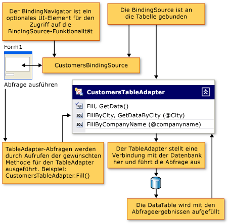

# Füllen von Datasets mit TableAdapters

Eine TableAdapter-Komponente füllt ein DataSet mit Daten aus der Datenbank auf Grundlage einer oder mehrerer von Ihnen angegebenen Abfragen oder gespeicherten Prozeduren auf. TableAdapters können auch Hinzufügungen, Updates und Löschungen in der Datenbank durchführen, um Änderungen beizubehalten, die Sie am DataSet vornehmen. Sie können auch globale Befehle ausgeben, die nicht mit einer bestimmten Tabelle verknüpft sind.

> [!NOTE]
> TableAdapters werden von Visual Studio-Designern generiert. Wenn Sie Datasets Programm gesteuert erstellen, verwenden Sie DataAdapter, bei dem es sich um eine .NET-Klasse handelt.

Ausführliche Informationen zu TableAdapter-Vorgängen finden Sie direkt in einem der folgenden Themen:

|Thema|BESCHREIBUNG|
|-----------|-----------------|
|[Erstellen und Konfigurieren eines TableAdapters](../data-tools/create-and-configure-tableadapters.md)|Verwenden der Designer zum Erstellen und Konfigurieren von TableAdapters|
|[Erstellen von parametrisierten TableAdapter-Abfragen](../data-tools/create-parameterized-tableadapter-queries.md)|So ermöglichen Sie Benutzern das Bereitstellen von Argumenten für TableAdapter-Prozeduren oder-Abfragen|
|[Direktes Zugreifen auf die Datenbank mit einem TableAdapter](../data-tools/directly-access-the-database-with-a-tableadapter.md)|Verwenden der DBDirect-Methoden von TableAdapters|
|[Deaktivieren von Einschränkungen beim Auffüllen von Datasets](../data-tools/turn-off-constraints-while-filling-a-dataset.md)|Arbeiten mit Foreign Key-Einschränkungen beim Aktualisieren von Daten|
|[Erweitern der Funktionalität eines TableAdapter](../data-tools/fill-datasets-by-using-tableadapters.md)|Hinzufügen von benutzerdefiniertem Code zu TableAdapters|
|[Laden von Daten in ein Dataset](../data-tools/read-xml-data-into-a-dataset.md)|Arbeiten mit XML|

## Übersicht über TableAdapter

TableAdapters sind vom Designer generierte Komponenten, die eine Verbindung mit einer Datenbank herstellen, Abfragen oder gespeicherte Prozeduren ausführen und Ihre Datentabelle mit den zurückgegebenen Daten ausfüllen. TableAdapters senden auch aktualisierte Daten aus Ihrer Anwendung zurück an die Datenbank. Sie können beliebig viele Abfragen auf einem TableAdapter ausführen, solange Daten zurückgegeben werden, die dem Schema der Tabelle entsprechen, der der TableAdapter zugeordnet ist. Das folgende Diagramm zeigt, wie TableAdapters mit Datenbanken und anderen Objekten im Arbeitsspeicher interagieren:

Obwohl TableAdapters mit dem **DataSet-Designer**entworfen wurden, werden die TableAdapter-Klassen nicht als geschsted Klassen von generiert <xref:System.Data.DataSet> . Sie befinden sich in separaten Namespaces, die für jedes Dataset spezifisch sind. Wenn Sie z. b. ein DataSet mit dem Namen haben `NorthwindDataSet` , befinden sich die TableAdapters, die s in zugeordnet sind, <xref:System.Data.DataTable> im- `NorthwindDataSet` `NorthwindDataSetTableAdapters` Namespace. Um programmgesteuert auf einen speziellen TableAdapter zuzugreifen, müssen Sie eine neue Instanz des TableAdapter deklarieren. Zum Beispiel:

[!code-csharp[VbRaddataTableAdapters#7](../data-tools/codesnippet/CSharp/fill-datasets-by-using-tableadapters_1.cs)]
[!code-vb[VbRaddataTableAdapters#7](../data-tools/codesnippet/VisualBasic/fill-datasets-by-using-tableadapters_1.vb)]

## Zugeordnetes DataTable-Schema

Wenn Sie einen TableAdapter erstellen, definieren Sie mit der ersten Abfrage oder gespeicherten Prozedur das Schema der zugeordneten TableAdapter <xref:System.Data.DataTable> . Sie führen diese anfängliche Abfrage oder gespeicherte Prozedur aus, indem Sie die-Methode des TableAdapter aufrufen `Fill` (die die zugeordneten TableAdapter-Daten füllt <xref:System.Data.DataTable> ). Alle Änderungen, die an der Haupt Abfrage des TableAdapters vorgenommen werden, werden im Schema der zugeordneten Datentabelle widergespiegelt. Wenn Sie z. b. eine Spalte aus der Haupt Abfrage entfernen, wird auch die Spalte aus der zugeordneten Datentabelle entfernt. Wenn zusätzliche Abfragen für den TableAdapter SQL-Anweisungen verwenden, die Spalten zurückgeben, die nicht in der Haupt Abfrage vorhanden sind, versucht der Designer, die Spalten Änderungen zwischen der Haupt Abfrage und den zusätzlichen Abfragen zu synchronisieren.

## Aktualisierungsbefehle für TableAdapter

Die Aktualisierungs Funktionalität eines TableAdapters hängt davon ab, wie viele Informationen in der Haupt Abfrage des **TableAdapter-Assistenten**verfügbar sind. Beispielsweise werden TableAdapters, die so konfiguriert sind, dass Sie Werte aus mehreren Tabellen abrufen (mit einem `JOIN` ), skalare Werte, Sichten oder die Ergebnisse von Aggregatfunktionen, nicht anfänglich mit der Möglichkeit erstellt, Aktualisierungen an die zugrunde liegende Datenbank zurückzusenden. Sie können jedoch die `INSERT` `UPDATE` -,-und- `DELETE` Befehle im **Eigenschaften** Fenster manuell konfigurieren.

## TableAdapter-Abfragen

TableAdapters können mehrere Abfragen enthalten, um die zugehörigen Datentabellen auszufüllen. Sie können so viele Abfragen für einen TableAdapter definieren, wie für die Anwendung erforderlich sind, solange jede Abfrage Daten zurückgibt, die demselben Schema entsprechen wie die zugeordnete Datentabelle. Diese Funktion ermöglicht es einem TableAdapter, basierend auf unterschiedlichen Kriterien unterschiedliche Ergebnisse zu laden.

Wenn Ihre Anwendung z. b. eine Tabelle mit Kundennamen enthält, können Sie eine Abfrage erstellen, die die Tabelle mit jedem Kundennamen füllt, der mit einem bestimmten Buchstaben beginnt, und einen anderen, der die Tabelle mit allen Kunden füllt, die sich im selben Zustand befinden. Zum Auffüllen einer `Customers` Tabelle mit Kunden in einem bestimmten Zustand können Sie eine Abfrage erstellen, `FillByState` die einen Parameter für den Statuswert wie folgt annimmt: `SELECT * FROM Customers WHERE State = @State` . Sie führen die Abfrage aus, indem Sie die `FillByState` -Methode aufrufen und den Parameterwert wie folgt übergeben: `CustomerTableAdapter.FillByState("WA")` .

Zusätzlich zum Hinzufügen von Abfragen, die Daten desselben Schemas zurückgeben wie die Datentabelle des TableAdapter, können Sie Abfragen hinzufügen, die skalare (einzelne) Werte zurückgeben. Beispielsweise ist eine Abfrage, die die Anzahl der Kunden () zurückgibt, `SELECT Count(*) From Customers` für eine gültig, `CustomersTableAdapter,` Obwohl die zurückgegebenen Daten nicht dem Schema der Tabelle entsprechen.

## ClearBeforeFill-Eigenschaft

Jedes Mal, wenn Sie eine Abfrage ausführen, um die Datentabelle eines TableAdapters auszufüllen, werden die vorhandenen Datenstandard mäßig gelöscht, und nur die Ergebnisse der Abfrage werden in die Tabelle geladen. Legen Sie die-Eigenschaft des TableAdapter `ClearBeforeFill` auf fest, `false` Wenn Sie die von einer Abfrage zurückgegebenen Daten an die vorhandenen Daten in einer Datentabelle hinzufügen oder zusammenführen möchten. Unabhängig davon, ob Sie die Daten löschen, müssen Sie Aktualisierungen explizit an die Datenbank zurücksenden, wenn Sie Sie beibehalten möchten. Denken Sie daran, Änderungen an den Daten in der Tabelle zu speichern, bevor Sie eine andere Abfrage ausführen, die die Tabelle füllt. Weitere Informationen finden Sie unter [Aktualisieren von Daten mit einem TableAdapter](../data-tools/update-data-by-using-a-tableadapter.md).

## TableAdapter-Vererbung

Mit TableAdapters wird die Funktionalität von Standarddaten Adaptern erweitert, indem eine konfigurierte Klasse gekapselt wird <xref:System.Data.Common.DataAdapter> . Standardmäßig erbt der TableAdapter von der <xref:System.ComponentModel.Component> -Klasse und kann nicht in die- <xref:System.Data.Common.DataAdapter> Klasse umgewandelt werden. Das Umwandeln eines TableAdapter in die <xref:System.Data.Common.DataAdapter> Klasse führt zu einem <xref:System.InvalidCastException> Fehler. Um die Basisklasse eines TableAdapter zu ändern, können Sie eine Klasse angeben, die von <xref:System.ComponentModel.Component> in der **Basisklassen** Eigenschaft des TableAdapter im **DataSet-Designer**abgeleitet ist.

## TableAdapter-Methoden und -Eigenschaften

Die TableAdapter-Klasse ist kein .NET-Typ. Dies bedeutet, dass Sie Sie nicht in der Dokumentation oder der **Objektkatalog**nachschlagen können. Sie wird zur Entwurfszeit erstellt, wenn Sie einen der zuvor erwähnten Assistenten verwenden. Der Name, der einem TableAdapter bei der Erstellung zugewiesen wird, basiert auf dem Namen der Tabelle, mit der Sie arbeiten. Wenn Sie z. b. einen TableAdapter auf der Grundlage einer Tabelle in einer Datenbank mit dem Namen erstellen `Orders` , wird der TableAdapter benannt `OrdersTableAdapter` . Sie können den Klassennamen für den TableAdapter ändern, indem Sie die **Name**-Eigenschaft im **DataSet-Designer** verwenden.

Im folgenden finden Sie die häufig verwendeten Methoden und Eigenschaften von TableAdapters:

|Member|Beschreibung|
|------------|-----------------|
|`TableAdapter.Fill`|Füllt die zugeordnete Datentabelle des TableAdapter mit den Ergebnissen des TableAdapter- `SELECT` Befehls auf.|
|`TableAdapter.Update`|Sendet Änderungen an die Datenbank zurück und gibt eine ganze Zahl zurück, die die Anzahl der von der Aktualisierung betroffenen Zeilen darstellt. Weitere Informationen finden Sie unter [Aktualisieren von Daten mit einem TableAdapter](../data-tools/update-data-by-using-a-tableadapter.md).|
|`TableAdapter.GetData`|Gibt einen neuen zurück <xref:System.Data.DataTable> , der mit Daten gefüllt ist.|
|`TableAdapter.Insert`|Erstellt eine neue Zeile in der Datentabelle. Weitere Informationen finden Sie unter [Einfügen neuer Datensätze in eine Datenbank](../data-tools/insert-new-records-into-a-database.md).|
|`TableAdapter.ClearBeforeFill`|Bestimmt, ob eine Datentabelle geleert wird, bevor Sie eine der `Fill`-Methoden aufrufen.|

## TableAdapter-Aktualisierungsmethode

TableAdapters verwenden zum Lesen und Schreiben in Datenbanken Datenbefehle. Verwenden Sie die anfängliche `Fill` (Main)-Abfrage des TableAdapter als Grundlage für das Erstellen des Schemas der zugeordneten Datentabelle sowie der `InsertCommand` Befehle, und, die `UpdateCommand` `DeleteCommand` der Methode zugeordnet sind `TableAdapter.Update` . Durch Aufrufen der-Methode eines TableAdapters `Update` werden die Anweisungen ausgeführt, die beim ursprünglichen Konfigurieren des TableAdapter erstellt wurden, und nicht eine der zusätzlichen Abfragen, die Sie mit dem **Konfigurations-Assistenten für TableAdapter-Abfragen**hinzugefügt haben.

Wenn Sie einen TableAdapter verwenden, führt er effektiv dieselben Vorgänge mit den Befehlen aus, die Sie normalerweise ausführen würden. Wenn Sie z. b. die-Methode des Adapters aufzurufen `Fill` , führt der Adapter den Daten Befehl in seiner `SelectCommand` -Eigenschaft aus und verwendet einen Daten Reader (z. b <xref:System.Data.SqlClient.SqlDataReader> .), um das Resultset in die Datentabelle zu laden. Wenn Sie die-Methode des Adapters aufzurufen, wird auf ähnliche Weise `Update` der entsprechende Befehl (in den `UpdateCommand` `InsertCommand` Eigenschaften, und `DeleteCommand` ) für jeden geänderten Datensatz in der Datentabelle ausgeführt.

> [!NOTE]
> Wenn die Hauptabfrage genügend Informationen enthält, werden beim Generieren des TableAdapter standardmäßig die Befehle `InsertCommand`, `UpdateCommand` und `DeleteCommand` erstellt. Wenn die Haupt Abfrage des TableAdapters mehr als eine Tabellen Anweisung ist `SELECT` , kann der Designer möglicherweise `InsertCommand` , und nicht generieren `UpdateCommand` `DeleteCommand` . Wenn diese Befehle nicht generiert werden, erhalten Sie möglicherweise einen Fehler, wenn Sie die- `TableAdapter.Update` Methode ausführen.

## TableAdapter GenerateDbDirectMethods

Zusätzlich zu `InsertCommand` , `UpdateCommand` und `DeleteCommand` werden TableAdapters mit Methoden erstellt, die Sie direkt für die Datenbank ausführen können. Sie können diese Methoden ( `TableAdapter.Insert` , `TableAdapter.Update` und `TableAdapter.Delete` ) direkt zum Bearbeiten von Daten in der Datenbank aufzurufen. Dies bedeutet, dass Sie diese einzelnen Methoden aus Ihrem Code aufrufen können und nicht aufrufen `TableAdapter.Update` , um die Einfügungen, Updates und Löschvorgänge zu behandeln, die für die zugeordnete Datentabelle ausstehen.

Wenn Sie diese direkten Methoden nicht erstellen möchten, legen Sie die **GenerateDBDirectMethods** -Eigenschaft des TableAdapter auf `false` (im **Eigenschaften** Fenster) fest. Zusätzliche Abfragen, die dem TableAdapter hinzugefügt werden, sind eigenständige Abfragen – Sie generieren diese Methoden nicht.

## TableAdapter-Unterstützung für Typen mit Nullwert

TableAdapters unterstützen Werte zulässt `Nullable(Of T)` -Typen und `T?` . Weitere Informationen zu Nullable-Typen in Visual Basic finden Sie unter [Auf NULL festlegbare Werttypen](/dotnet/visual-basic/programming-guide/language-features/data-types/nullable-value-types). Weitere Informationen zu Typen, die NULL-Werte zulassen, finden Sie unter [Verwenden von Typen](/dotnet/csharp/programming-guide/nullable-types/using-nullable-types), die NULL-Werte zulassen.

## TableAdapterManager-Referenz

Standardmäßig generiert eine TableAdapterManager-Klasse, wenn Sie ein Dataset erstellen, das verknüpfte Tabellen enthält. Um zu verhindern, dass die Klasse generiert wird, ändern Sie den Wert der- `Hierarchical Update` Eigenschaft des Datasets in false. Wenn Sie eine Tabelle, die eine Beziehung aufweist, auf die Entwurfs Oberfläche einer Windows Forms-oder WPF-Seite ziehen, deklariert Visual Studio eine Member-Variable der-Klasse. Wenn Sie DataBinding nicht verwenden, müssen Sie die Variable manuell deklarieren.

Bei der TableAdapterManager-Klasse handelt es sich nicht um einen .NET-Typ. Daher können Sie Sie nicht in der Dokumentation nachschlagen. Sie wird zur Entwurfszeit im Rahmen des dataseterstellungs Prozesses erstellt.

Im folgenden finden Sie die häufig verwendeten Methoden und Eigenschaften der- `TableAdapterManager` Klasse:

|Member|Beschreibung|
|------------|-----------------|
|`UpdateAll`-Methode|Speichert alle Daten aus allen Datentabellen.|
|`BackUpDataSetBeforeUpdate`-Eigenschaft|Bestimmt, ob vor dem Ausführen der-Methode eine Sicherungskopie des Datasets erstellt wird `TableAdapterManager.UpdateAll` . Booleschen.|
|*TableName* `TableAdapter` Property|Stellt einen TableAdapter dar. Der generierte TableAdapterManager enthält eine Eigenschaft für jeden, der von `TableAdapter` ihm verwaltet wird. Beispielsweise generiert ein DataSet mit einer Customers-und Orders-Tabelle mit einem TableAdapterManager, der die-Eigenschaft und die-Eigenschaft enthält `CustomersTableAdapter` `OrdersTableAdapter` .|
|`UpdateOrder`-Eigenschaft|Steuert die Reihenfolge der einzelnen INSERT-, Update-und DELETE-Befehle. Legen Sie diesen Wert auf einen der Werte in der- `TableAdapterManager.UpdateOrderOption` Enumeration fest.   Standardmäßig `UpdateOrder` ist auf **InsertUpdateDelete**festgelegt. Dies bedeutet, dass Einfügungen, Updates und Löschungen für alle Tabellen im DataSet durchgeführt werden.|

## Sicherheit

Wenn Sie Daten Befehle verwenden, bei denen eine CommandType-Eigenschaft auf festgelegt <xref:System.Data.CommandType.Text> ist, sollten Sie die von einem Client gesendeten Informationen sorgfältig überprüfen, bevor Sie Sie an die Datenbank übergeben. Böswillige Benutzer könnten versuchen, veränderte oder zusätzliche SQL-Anweisungen zu senden (einzufügen), um unautorisierten Zugriff zu erhalten oder die Datenbank zu beschädigen. Bevor Sie Benutzereingaben in eine Datenbank übertragen, sollten Sie stets überprüfen, ob die Informationen gültig sind. Es wird empfohlen, nach Möglichkeit immer parametrisierte Abfragen oder gespeicherte Prozeduren zu verwenden.

## Siehe auch

- [Datasettools](../data-tools/dataset-tools-in-visual-studio.md)
