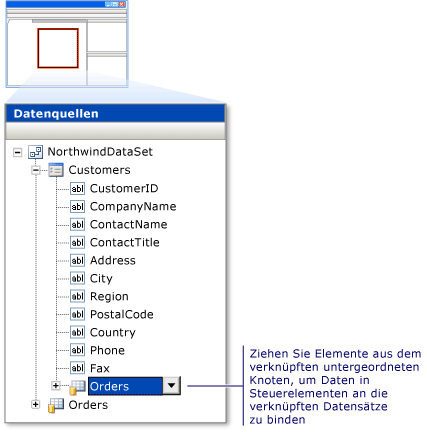

# Gewusst wie: Anzeigen von verkn&#252;pften Daten in einer Windows Forms-Anwendung
Um verknüpfte Daten anzuzeigen, ziehen Sie Elemente, die sich auf demselben Haupttabellenknoten befinden, aus dem [Datenquellenfenster](../Topic/Data%20Sources%20Window.md) auf das Formular.  Wenn z. B. eine Datenquelle mit einer Tabelle `Customers` und einer verknüpften Tabelle `Orders` vorliegt, würden Sie beide Tabellen in der Strukturansicht als Knoten der höchsten Ebene im **Datenquellenfenster** sehen.  Erweitern Sie den Knoten `Customers`, sodass die Spalten angezeigt werden. Sie sehen, dass es sich bei der letzen Spalte in der Liste um einen erweiterbaren Knoten handelt, der die Tabelle `Orders` darstellt.  Dieser Knoten entspricht den verknüpften Bestellungen eines Kunden.  Dies bedeutet, dass Sie die anzuzeigenden Elemente bei der Erstellung eines Formulars, das Ihnen die Auswahl eines Kunden und das anschließende Anzeigen einer Liste mit Bestellungen für diesen Kunden erlaubt, aus dieser einzelnen Hierarchie ziehen würden.  
  
   
Erstellen von datengebundenen Steuerelementen, die verknüpfte Datensätze anzeigen  
  
  Eine Videoversion dieses Themas finden Sie unter [How do I: Update Related Tables](http://go.microsoft.com/fwlink/?LinkId=143527).  
  
### So erstellen Sie Steuerelemente, die verknüpfte Datensätze anzeigen  
  
1.  Öffnen Sie das Formular im [Windows Forms Designer](http://msdn.microsoft.com/de-de/3c3d61f8-f36c-4d41-b9c3-398376fabb15).  
  
2.  Öffnen Sie das **Datenquellenfenster**.  Weitere Informationen finden Sie unter [Gewusst wie: Öffnen des Datenquellenfensters](../data-tools/how-to-open-the-data-sources-window.md).  
  
3.  Erweitern Sie den Knoten, der die übergeordnete Tabelle in der Beziehung darstellt. \(Die übergeordnete Tabelle ist die Tabelle auf der "Einserseite" einer 1:n\-Beziehung.\)  
  
4.  Ziehen Sie alle anzuzeigenden Elemente aus der übergeordneten Tabelle der Beziehung aus dem **Datenquellenfenster** auf das Formular.  
  
5.  Verknüpfte untergeordnete Tabellen werden als erweiterbare Knoten am unteren Ende der Spaltenliste einer übergeordneten Tabelle angezeigt.  Ziehen Sie die anzuzeigenden Elemente aus einem solchen verknüpften Knoten auf das Formular.  
  
    > [!NOTE]
    >  Wenn Sie ein Element aus einem Knoten der höchsten Ebene ziehen, wird eine separate, nicht verknüpfte [BindingSource\-Komponente](../Topic/BindingSource%20Component.md) erstellt, die das Navigieren in den verknüpften Datensätzen erschwert.  Um verknüpfte Daten zu binden, müssen Sie die Tabellen aus demselben hierarchischen Knoten auswählen.  
  
## Siehe auch  
 [Exemplarische Vorgehensweisen zur Arbeit mit Daten](../Topic/Data%20Walkthroughs.md)   
 [Exemplarische Vorgehensweise: Anzeigen von Daten in einem Windows Form](../data-tools/walkthrough-displaying-data-on-a-windows-form.md)   
 [Übersicht über TableAdapters](../data-tools/tableadapter-overview.md)   
 [Erstellen und Bearbeiten von typisierten Datasets](../data-tools/creating-and-editing-typed-datasets.md)   
 [Übersicht über Datenquellen](../data-tools/add-new-data-sources.md)   
 [Gewusst wie: Herstellen einer Verbindung zu Daten in einer Datenbank](../data-tools/how-to-connect-to-data-in-a-database.md)   
 [Überprüfen von Daten](../Topic/Validating%20Data.md)   
 [Gewusst wie: Datennavigation mithilfe des DataNavigator\-Steuerelements in Windows Forms](../Topic/How%20to:%20Navigate%20Data%20with%20the%20Windows%20Forms%20BindingNavigator%20Control.md)