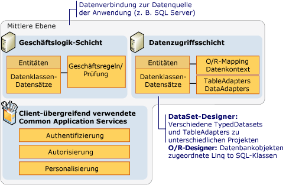
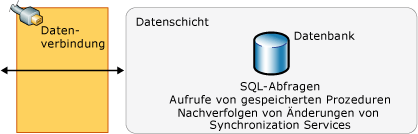

# Übersicht über n-schichtige Datenanwendungen
*n-schichtige* Datenanwendungen sind Datenanwendungen, die in mehrere *Schichten* aufgeteilt sind. Sie werden auch "verteilte Anwendungen" oder "Anwendungen mit mehreren Ebenen" genannt, da die Verarbeitung auf voneinander unabhängige, auf Client und Server verteilte Ebenen aufgeteilt wird. Beim Entwickeln einer Anwendung, die auf Daten zugreift, sollten die verschiedenen Ebenen, aus denen die Anwendung besteht, klar getrennt sein.

Eine typische N-Tier-Anwendung besteht aus einer Präsentationsschicht, einer mittleren Ebene und einer Datenschicht. Die einfachste Möglichkeit zum Trennen der verschiedenen Ebenen einer N-Tier-Anwendung besteht im Erstellen separater Projekte für jede Ebene, die in der Anwendung enthalten sein soll. Beispielsweise könnte die Präsentationsebene eine Windows Forms-Anwendung sein, während die Datenzugriffslogik eine in der mittleren Ebene angesiedelte Klassenbibliothek ist. Weiterhin könnte die Darstellungsschicht über einen Dienst wie einen Webdienst mit der Datenzugriffslogik in der mittleren Schicht kommunizieren. Die Aufteilung der Anwendungskomponenten in verschiedene Ebenen erhöht die Verwaltbarkeit und die Skalierbarkeit der Anwendung.  Auf diese Weise wird das Einarbeiten neuer, eine einzelne Ebene betreffender Technologien vereinfacht, ein erneutes Entwerfen der Anwendung ist nicht notwendig. Außerdem werden vertrauliche Informationen von N-Tier-Anwendungen in der Regel in der mittleren Ebene gespeichert, die von der Präsentationsebene getrennt ist.

Visual Studio enthält zahlreiche Features, die Entwicklern das Erstellen von N-Tier-Anwendungen erleichtern.

- Das Dataset stellt eine Eigenschaft **DataSet-Projekt** bereit, mit der Sie das Dataset (Datenentitätsschicht) und TableAdapters (Datenzugriffsschicht) in einzelne Projekte aufteilen können.

- Die [LINQ to SQL-Tools in Visual Studio](../data-tools/linq-to-sql-tools-in-visual-studio2.md) enthalten Einstellungen, mit denen DataContext und Datenklassen in separaten Namespaces erstellt werden können. Dies ermöglicht eine logische Trennung von Datenzugriffs- und Datenentitätsebenen.

- [LINQ to SQL](/dotnet/framework/data/adonet/sql/linq/index) stellt die Methode <xref:System.Data.Linq.Table%601.Attach%2A> bereit, mit der Sie die DataContext-Klasse aus verschiedenen Anwendungsschichten zusammenführen können. Weitere Informationen finden Sie unter [N-schichtige Anwendungen und Remoteanwendungen mit LINQ to SQL](/dotnet/framework/data/adonet/sql/linq/n-tier-and-remote-applications-with-linq-to-sql).

## Präsentationsschicht
Die *Präsentationsebene* ist die Ebene, auf der Benutzer mit einer Anwendung interagieren. Sie enthält oft auch zusätzliche Anwendungslogik. Zu den typischen Komponenten einer Präsentationsebene gehören:

- Komponenten zur Datenbindung, etwa <xref:System.Windows.Forms.BindingSource> und <xref:System.Windows.Forms.BindingNavigator>.

- Objektdarstellungen von Daten, wie [LINQ to SQL](/dotnet/framework/data/adonet/sql/linq/index)-Entitätsklassen, die in der Präsentationsschicht verwendet werden können.

Die Präsentationsschicht greift in der Regel mithilfe eines Dienstverweises (z. B. einer Anwendung aus einem [Windows Communication Foundation-Dienst und WCF Data Services in Visual Studio](../data-tools/windows-communication-foundation-services-and-wcf-data-services-in-visual-studio.md)) auf die Mittelschicht zu. Die Präsentationsschicht greift nicht direkt auf die Datenschicht zu. Sie kommuniziert mit der Datenebene unter Verwendung der Datenzugriffskomponenten der mittleren Ebene.

## Mittlere Ebene
Die *mittlere Ebene* ist die Ebene, über die Präsentationsebene und Datenebene miteinander kommunizieren. Zu den typischen Komponenten einer mittleren Ebene gehören:

- Geschäftslogik, z. B. Geschäftsregeln und Datenvalidierung.

- Komponenten und Logik für den Datenzugriff, wie beispielsweise:

  - [TableAdapters](create-and-configure-tableadapters.md) und [DataAdapters und DataReaders](/dotnet/framework/data/adonet/dataadapters-and-datareaders)

  - Objektdarstellungen von Daten, wie [LINQ to SQL](/dotnet/framework/data/adonet/sql/linq/index)-Entitätsklassen

  - Allgemeine Anwendungsdienste wie Authentifizierung, Autorisierung und Personalisierung.

In der folgenden Abbildung werden die in Visual Studio zur Verfügung stehenden Features und Technologien und deren mögliche Verwendung in der mittleren Ebene einer N-Tier-Anwendung dargestellt.

 Mittelschicht

Die mittlere Ebene stellt in der Regel mithilfe einer Datenverbindung eine Verbindung mit der Datenschicht her. Diese Datenverbindung wird üblicherweise in der Datenzugriffskomponente gespeichert.

## Datenschicht
Die *Datenebene* ist im Grunde der Server, auf dem Daten einer Anwendung (z.B. ein Server mit SQL Server) gespeichert werden.

In der folgenden Abbildung werden die in Visual Studio zur Verfügung stehenden Funktionen und Technologien und deren mögliche Verwendung in der Datenebene einer N-Tier-Anwendung dargestellt.

 Datenschicht

Vom Client in der Präsentationsebene kann nicht direkt auf die Datenschicht zugegriffen werden. Stattdessen fungiert die mittlere Ebene als Datenzugriffskomponente und dient zur Kommunikation zwischen der Präsentations- und der Datenebene.

## Hilfe zur n-schichtigen Entwicklung
In den folgenden Themen finden Sie Informationen über die Arbeit mit N-Tier-Anwendungen:

[Gewusst wie: DataSets und TableAdapters in verschiedene Projekte aufteilen](../data-tools/separate-datasets-and-tableadapters-into-different-projects.md)

[Exemplarische Vorgehensweise: Erstellen einer n-schichtigen Datenanwendung](../data-tools/walkthrough-creating-an-n-tier-data-application.md)

[N-schichtige Anwendungen und Remoteanwendungen mit LINQ to SQL](/dotnet/framework/data/adonet/sql/linq/n-tier-and-remote-applications-with-linq-to-sql)

## Weitere Informationen

- [Exemplarische Vorgehensweise: Erstellen einer n-schichtigen Datenanwendung](../data-tools/walkthrough-creating-an-n-tier-data-application.md)
- [Hierarchische Aktualisierung](../data-tools/hierarchical-update.md)
- [Datasettools in Visual Studio](../data-tools/dataset-tools-in-visual-studio.md)
- [Zugreifen auf Daten in Visual Studio](../data-tools/accessing-data-in-visual-studio.md)
