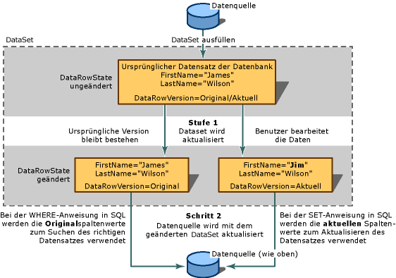

# <a name="save-data-back-to-the-database"></a>Rückspeichern von Daten in der Datenbank

Beim DataSet handelt es sich um eine Kopie der Daten im Arbeitsspeicher. Wenn Sie diese Daten ändern, empfiehlt es sich, diese Änderungen wieder in der Datenbank zu speichern. Hierfür gibt es drei Möglichkeiten:

- Durch Aufrufen einer der `Update` Methoden eines TableAdapter

- Durch Aufrufen einer `DBDirect`-Methode des TableAdapter

- Durch Aufrufen der `UpdateAll`-Methode für den TableAdapterManager, die Visual Studio für Sie generiert, wenn das Dataset Tabellen enthält, die mit anderen Tabellen im DataSet verknüpft sind.

Wenn Sie Dataset-Tabellen an Steuerelemente auf einer Windows Form-oder XAML-Seite binden, erledigt die Daten Bindungs Architektur die gesamte Arbeit.

Wenn Sie mit TableAdapters vertraut sind, können Sie direkt zu einem der folgenden Themen springen:

|Topic|Beschreibung|
|-----------|-----------------|
|[Gewusst wie: Einfügen neuer Datensätze in eine Datenbank](../data-tools/insert-new-records-into-a-database.md)|Ausführen von Aktualisierungen und Einfügungen mithilfe von TableAdapters oder Befehls Objekten|
|[Gewusst wie: Aktualisieren von Daten mit einem TableAdapter](../data-tools/update-data-by-using-a-tableadapter.md)|Ausführen von Updates mit TableAdapters|
|[Hierarchische Aktualisierung](../data-tools/hierarchical-update.md)|Ausführen von Updates aus einem DataSet mit zwei oder mehr verknüpften Tabellen|
|[Behandeln einer Parallelitätsausnahme](../data-tools/handle-a-concurrency-exception.md)|Behandeln von Ausnahmen, wenn zwei Benutzer gleichzeitig versuchen, dieselben Daten in einer Datenbank zu ändern|
|[Vorgehensweise: Speichern von Daten mithilfe von Transaktionen](../data-tools/save-data-by-using-a-transaction.md)|Speichern von Daten in einer Transaktion mithilfe des Systems. Transaktionen-Namespace und ein transaktionscope-Objekt|
|[Speichern von Daten in einer Transaktion](../data-tools/save-data-in-a-transaction.md)|Exemplarische Vorgehensweise, die eine Windows Forms Anwendung erstellt, um das Speichern von Daten in einer Datenbank innerhalb einer Transaktion zu veranschaulichen|
|[Speichern von Daten in einer Datenbank (mehrere Tabellen)](../data-tools/save-data-to-a-database-multiple-tables.md)|Bearbeiten von Datensätzen und Speichern von Änderungen in mehreren Tabellen in der Datenbank|
|[Gewusst wie: Speichern von Daten aus einem Objekt in einer Datenbank](../data-tools/save-data-from-an-object-to-a-database.md)|Übergeben von Daten aus einem Objekt, das sich nicht in einem Dataset befindet, an eine Datenbank mithilfe einer TableAdapter-DBDirect-Methode|
|[Speichern von Daten mit den TableAdapter-DBDirect-Methoden](../data-tools/save-data-with-the-tableadapter-dbdirect-methods.md)|So verwenden Sie den TableAdapter, um SQL-Abfragen direkt an die Datenbank zu senden|
|[Speichern eines Datasets als XML](../data-tools/save-a-dataset-as-xml.md)|Vorgehensweise beim Speichern eines Datasets in einem XML-Dokument|

## <a name="two-stage-updates"></a>Zweistufige Aktualisierungen

Das Aktualisieren einer Datenquelle ist ein zweistufiger Prozess. Der erste Schritt besteht darin, das DataSet mit neuen Datensätzen, geänderten Datensätzen oder gelöschten Datensätzen zu aktualisieren. Wenn Ihre Anwendung diese Änderungen niemals an die Datenquelle zurücksendet, sind Sie mit dem Update fertig.

Wenn Sie die Änderungen an die Datenbank zurücksenden, ist ein zweiter Schritt erforderlich. Wenn Sie keine Daten gebundenen Steuerelemente verwenden, müssen Sie die `Update`-Methode des gleichen TableAdapter (oder Daten Adapters), den Sie zum Auffüllen des Datasets verwendet haben, manuell aufzurufen. Sie können jedoch auch andere Adapter verwenden, um z. b. Daten aus einer Datenquelle in eine andere zu verschieben oder mehrere Datenquellen zu aktualisieren. Wenn Sie keine Datenbindung verwenden und Änderungen für verknüpfte Tabellen speichern, müssen Sie eine Variable der automatisch generierten `TableAdapterManager`-Klasse manuell instanziieren und dann Ihre `UpdateAll`-Methode aufzurufen.



Ein DataSet enthält Sammlungen von Tabellen, die eine Reihe von Zeilen enthalten. Wenn Sie beabsichtigen, eine zugrunde liegende Datenquelle zu einem späteren Zeitpunkt zu aktualisieren, müssen Sie beim Hinzufügen oder Entfernen von Zeilen die-Methoden für die `DataTable.DataRowCollection`-Eigenschaft verwenden. Diese Methoden führen die Änderungs Nachverfolgung aus, die zum Aktualisieren der Datenquelle erforderlich ist. Wenn Sie die `RemoveAt`-Auflistung für die Rows-Eigenschaft aufzurufen, wird der Löschvorgang nicht an die Datenbank zurückgegeben.

## <a name="merge-datasets"></a>Zusammenführen von Datasets

Sie können den Inhalt eines Datasets aktualisieren *, indem Sie* es mit einem anderen DataSet zusammenführen. Dies umfasst das Kopieren des Inhalts eines *Quell* Datasets in das aufrufende Dataset (als *Ziel* DataSet bezeichnet). Beim Zusammenführen von Datasets werden neue Datensätze aus dem Quell-Dataset in das Ziel-Dataset eingefügt. Darüber hinaus werden dem Ziel-Dataset zusätzliche Spalten aus dem Quell-Dataset hinzugefügt. Das Zusammenführen von Datasets ist nützlich, wenn Sie über ein lokales Dataset verfügen und ein zweites DataSet aus einer anderen Anwendung erhalten. Dies ist auch nützlich, wenn Sie ein zweites DataSet aus einer Komponente, z. b. einem XML-Webdienst, erhalten oder wenn Sie Daten aus mehreren Datasets integrieren müssen.

Beim Zusammenführen von Datasets können Sie ein boolesches Argument (`preserveChanges`) übergeben, das der <xref:System.Data.DataSet.Merge%2A> Methode mitteilt, ob vorhandene Änderungen im Ziel DataSet beibehalten werden sollen. Da Datasets mehrere Datensatzversionen verwalten, darf nicht außer Acht gelassen werden, dass auch mehrere Datensatzversionen zusammengeführt werden. In der folgenden Tabelle wird gezeigt, wie ein Datensatz in zwei Datasets zusammengeführt wird:

|DataRowVersion|Ziel-Dataset|Quell-Dataset|
| - | - | - |
|Ursprünglich|James Wilson|James C. Wilson|
|Aktuell|Jim Wilson|James C. Wilson|

Wenn Sie die <xref:System.Data.DataSet.Merge%2A>-Methode für die vorherige Tabelle mit `preserveChanges=false targetDataset.Merge(sourceDataset)` aufrufen, ergeben sich folgende Daten:

|DataRowVersion|Ziel-Dataset|Quell-Dataset|
| - | - | - |
|Ursprünglich|James C. Wilson|James C. Wilson|
|Aktuell|James C. Wilson|James C. Wilson|

Wenn die <xref:System.Data.DataSet.Merge%2A>-Methode mit `preserveChanges = true targetDataset.Merge(sourceDataset, true)` aufgerufen wird, werden die folgenden Daten angezeigt:

|DataRowVersion|Ziel-Dataset|Quell-Dataset|
| - | - | - |
|Ursprünglich|James C. Wilson|James C. Wilson|
|Aktuell|Jim Wilson|James C. Wilson|

> [!CAUTION]
> Wenn im `preserveChanges = true` Szenario die <xref:System.Data.DataSet.RejectChanges%2A>-Methode für einen Datensatz im Ziel DataSet aufgerufen wird, werden die ursprünglichen Daten aus dem *Quell* DataSet wieder hergestellt. Das heißt, wenn Sie versuchen, die ursprüngliche Datenquelle mit dem Ziel DataSet zu aktualisieren, ist es möglicherweise nicht möglich, die ursprüngliche zu Aktualisier Ende Zeile zu finden. Sie können eine Parallelitäts Verletzung vermeiden, indem Sie ein anderes Dataset mit den aktualisierten Datensätzen aus der Datenquelle ausfüllen und dann eine Zusammenführung durchführen, um eine Parallelitäts Verletzung zu verhindern. (Eine Parallelitätsverletzung liegt vor, wenn ein anderer Benutzer einen Datensatz in der Datenquelle ändert, nachdem das Dataset aufgefüllt wurde.)

## <a name="update-constraints"></a>Einschränkungen bei der Aktualisierung

Wenn Sie Änderungen an einer vorhandenen Daten Zeile vornehmen möchten, können Sie Daten in den einzelnen Spalten hinzufügen oder aktualisieren. Wenn das DataSet Einschränkungen enthält (z. b. Fremdschlüssel oder Einschränkungen, die keine NULL-Werte zulassen), kann sich der Datensatz vorübergehend in einem Fehlerzustand befinden, wenn Sie ihn aktualisieren. Das heißt, es kann sich in einem Fehlerzustand befinden, nachdem Sie eine Spalte aktualisiert haben, aber bevor Sie zur nächsten Spalte gelangen.

Um vorzeitige Verletzungen dieser Einschränkungen zu vermeiden, können Sie sie vorübergehend außer Kraft setzen. Dies erfüllt zweierlei Zwecke:

- Es wird verhindert, dass ein Fehler ausgelöst wird, nachdem Sie eine Spalte aktualisiert haben, aber noch nicht mit dem Aktualisieren eines weiteren begonnen haben.

- Es verhindert, dass bestimmte Update Ereignisse ausgelöst werden (Ereignisse, die häufig zur Validierung verwendet werden).

> [!NOTE]
> In Windows Forms unterbricht die Daten Bindungs Architektur, die in das DataGrid integriert ist, die Einschränkungs Überprüfung, bis sich der Fokus aus einer Zeile bewegt, und Sie müssen die Methoden <xref:System.Data.DataRow.BeginEdit%2A>, <xref:System.Data.DataRow.EndEdit%2A>oder <xref:System.Data.DataRow.CancelEdit%2A> nicht explizit aufzurufen.

Beim Aufruf der <xref:System.Data.DataSet.Merge%2A>-Methode für ein Dataset werden Einschränkungen automatisch deaktiviert. Wenn für das DataSet, das nicht aktiviert werden kann, Einschränkungen vorliegen, wird eine <xref:System.Data.ConstraintException> ausgelöst. In einer solchen Situation ist die <xref:System.Data.DataSet.EnforceConstraints%2A>-Eigenschaft auf `false,` festgelegt, und alle Einschränkungsverletzungen müssen vor dem Zurücksetzen der <xref:System.Data.DataSet.EnforceConstraints%2A>-Eigenschaft auf `true` aufgelöst werden.

Nachdem Sie ein Update durchgeführt haben, können Sie die Einschränkungs Überprüfung erneut aktivieren, wodurch auch Update Ereignisse erneut aktiviert und ausgelöst werden.

Weitere Informationen zum Anhalten von Ereignissen finden Sie unter [Deaktivieren von Einschränkungen beim Auffüllen eines Datasets](../data-tools/turn-off-constraints-while-filling-a-dataset.md).

## <a name="dataset-update-errors"></a>Fehler bei der Datasetaktualisierung

Bei der Aktualisierung von Datensätzen in einen Dataset können Fehler auftreten. Beispielsweise können Sie versehentlich Daten des falschen Typs in eine Spalte oder Daten, die zu lang sind, oder Daten, die ein anderes Integritäts Problem aufweisen, schreiben. Oder Sie verfügen über anwendungsspezifische Validierungs Überprüfungen, die in jeder Phase eines Update Ereignisses benutzerdefinierte Fehler hervorrufen können. Weitere Informationen finden Sie unter Überprüfen von [Daten in Datasets](../data-tools/validate-data-in-datasets.md).

## <a name="maintain-information-about-changes"></a>Informationen zu Änderungen beibehalten

Informationen zu den Änderungen in einem Dataset werden auf zweierlei Weise verwaltet: durch das Kennzeichnen von Zeilen, die angeben, dass Sie geändert wurden (<xref:System.Data.DataRow.RowState%2A>), und durch das Aufbewahren mehrerer Kopien eines Datensatzes (<xref:System.Data.DataRowVersion>). Mithilfe dieser Informationen können die geänderten Daten im Dataset vom Prozess ermittelt und die entsprechenden Aktualisierungen an die Datenquelle gesendet werden.

### <a name="rowstate-property"></a>RowState-Eigenschaft

Die <xref:System.Data.DataRow.RowState%2A>-Eigenschaft eines <xref:System.Data.DataRow>-Objekts stellt einen Wert dar, der Informationen zum Status einer bestimmten Datenzeile bereitstellt.

In der folgenden Tabelle sind die möglichen Werte für die <xref:System.Data.DataRowState>-Enumeration aufgeführt:

|DataRowState-Wert|Beschreibung|
| - |-----------------|
|<xref:System.Data.DataRowState.Added>|Die Zeile wurde einer <xref:System.Data.DataRowCollection> als Element hinzugefügt. (Eine Zeile in diesem Zustand hat keine entsprechende ursprüngliche Version, da Sie nicht vorhanden war, als die letzte <xref:System.Data.DataRow.AcceptChanges%2A>-Methode aufgerufen wurde).|
|<xref:System.Data.DataRowState.Deleted>|Die Zeile wurde mit <xref:System.Data.DataRow.Delete%2A> eines <xref:System.Data.DataRow>-Objekts gelöscht.|
|<xref:System.Data.DataRowState.Detached>|Die Zeile wurde zwar erstellt, gehört aber keiner <xref:System.Data.DataRowCollection> an. Ein <xref:System.Data.DataRow>-Objekt befindet sich unmittelbar nach dem Erstellen, vor dem Hinzufügen zu einer Auflistung und nach dem Entfernen aus einer Auflistung in diesem Zustand.|
|<xref:System.Data.DataRowState.Modified>|Ein Spaltenwert in der Zeile wurde in irgendeiner Weise geändert.|
|<xref:System.Data.DataRowState.Unchanged>|Die Zeile wurde seit dem letzten Aufruf von <xref:System.Data.DataRow.AcceptChanges%2A> nicht geändert.|

### <a name="datarowversion-enumeration"></a>DataRowVersion-Enumeration

In Datasets werden mehrere Datensatzversionen verwaltet. Die <xref:System.Data.DataRowVersion> Felder werden verwendet, wenn der Wert, der in einem <xref:System.Data.DataRow> gefunden wird, mithilfe der <xref:System.Data.DataRow.Item%2A>-Eigenschaft oder der <xref:System.Data.DataRow.GetChildRows%2A>-Methode des <xref:System.Data.DataRow> Objekts abgerufen wird.

In der folgenden Tabelle sind die möglichen Werte für die <xref:System.Data.DataRowVersion>-Enumeration aufgeführt:

|DataRowVersion-Wert|Beschreibung|
| - |-----------------|
|<xref:System.Data.DataRowVersion.Current>|Die aktuelle Version eines Datensatzes enthält alle Änderungen, die seit dem letzten Aufruf des <xref:System.Data.DataRow.AcceptChanges%2A> für den Datensatz ausgeführt wurden. Falls die Zeile gelöscht wurde, ist keine aktuelle Version vorhanden.|
|<xref:System.Data.DataRowVersion.Default>|Der Standardwert eines Datensatzes, wie er durch das Dataset-Schema oder die Datenquelle definiert wurde.|
|<xref:System.Data.DataRowVersion.Original>|Die ursprüngliche Version eines Datensatzes ist eine Kopie des Datensatzes zu dem Zeitpunkt, zu dem zuletzt ein Commit für Dataset-Änderungen ausgeführt wurde. Praktisch entspricht dies meist der Version eines Datensatzes, die aus einer Datenquelle gelesen wurde.|
|<xref:System.Data.DataRowVersion.Proposed>|Die vorläufige Version eines Datensatzes ist während der laufenden Aktualisierung vorübergehend verfügbar, d.h. nach dem Aufruf der <xref:System.Data.DataRow.BeginEdit%2A>-Methode und vor dem Aufruf der <xref:System.Data.DataRow.EndEdit%2A>-Methode. Auf die vorläufige Version eines Datensatzes greifen Sie i. d. R. in einem Ereignishandler zu, z. B. <xref:System.Data.DataTable.RowChanging>. Durch den Aufruf der <xref:System.Data.DataRow.CancelEdit%2A>-Methode werden die Änderungen rückgängig gemacht und die vorläufige Version aus der Datenzeile gelöscht.|

Die ursprüngliche und die aktuelle Version sind hilfreich, wenn Aktualisierungsinformationen an eine Datenquelle übertragen werden. Wenn eine Aktualisierung an die Datenquelle gesendet wird, befinden sich die neuen Informationen für die Datenbank i. d. R. in der aktuellen Version des Datensatzes. Anhand von Informationen aus der ursprünglichen Version wird der zu aktualisierende Datensatz gesucht.

Wenn z. b. der Primärschlüssel eines Datensatzes geändert wird, benötigen Sie eine Möglichkeit, den richtigen Datensatz in der Datenquelle zu finden, um die Änderungen zu aktualisieren. Wenn keine ursprüngliche Version vorhanden ist, wird der Datensatz höchstwahrscheinlich an die Datenquelle angefügt. Daraus resultiert dann nicht nur ein ungewollter zusätzlicher, sondern auch ungenauer und nicht mehr aktueller Datensatz. Die beiden Versionen werden auch in der Parallelitäts Steuerung verwendet. Sie können die ursprüngliche Version mit einem Datensatz in der Datenquelle vergleichen, um festzustellen, ob sich der Datensatz geändert hat, seit er in das DataSet geladen wurde.

Die vorläufige Version ist von Nutzen, wenn Sie eine Validierung durchführen müssen, bevor die Änderungen am Dataset endgültig bestätigt werden.

Selbst wenn Datensätze geändert wurden, ist nicht immer eine ursprüngliche oder aktuelle Version der betreffenden Zeile verfügbar. Wenn Sie eine neue Zeile in die Tabelle einfügen, existiert keine ursprüngliche, sondern nur eine aktuelle Version. Auch wenn Sie eine Zeile durch den Aufruf der tabellenspezifischen `Delete`-Methode löschen, ist eine ursprüngliche, aber keine aktuelle Version vorhanden.

Durch Abfrage der <xref:System.Data.DataRow.HasVersion%2A>-Methode der Datenzeile können Sie überprüfen, ob eine bestimmte Version eines Datensatzes vorhanden ist. Um auf eine der verschiedenen Datensatzversionen zuzugreifen, übergeben Sie einen <xref:System.Data.DataRowVersion>-Enumerationswert als optionales Argument, wenn Sie den Wert einer Spalte anfordern.

## <a name="get-changed-records"></a>Geänderte Datensätze erhalten

Es ist üblich, nicht jeden Datensatz in einem DataSet zu aktualisieren. Beispielsweise kann ein Benutzer mit einem <xref:System.Windows.Forms.DataGridView>-Steuerelement von Windows Forms arbeiten, durch das zahlreiche Datensätze angezeigt werden. Der Benutzer aktualisiert jedoch vielleicht nur einige wenige Datensätze, löscht einen Datensatz und fügt einen neuen ein. Datasets und Datentabellen bieten eine Methode (`GetChanges`), mit deren Hilfe ausschließlich die geänderten Zeilen zurückgegeben werden können.

Sie können Teilmengen der geänderten Datensätze erstellen, indem Sie entweder die `GetChanges`-Methode der Datentabelle (<xref:System.Data.DataTable.GetChanges%2A>) oder des Datasets selbst (<xref:System.Data.DataSet.GetChanges%2A>) verwenden. Wenn Sie die Methode für die Datentabelle aufrufen, wird eine Kopie der Tabelle zurückgegeben, die lediglich die geänderten Datensätze enthält. Ähnlich verhält es sich, wenn Sie die Methode für den Dataset aufrufen: Sie erhalten ein neues Dataset, das nur geänderte Datensätze enthält.

`GetChanges` allein gibt alle geänderten Datensätze zurück. Im Gegensatz dazu können Sie durch übergeben der gewünschten <xref:System.Data.DataRowState> als Parameter an die `GetChanges`-Methode angeben, welche Teilmenge der geänderten Datensätze Sie möchten: neu hinzugefügte Datensätze, Datensätze, die zum Löschen markiert sind, getrennte Datensätze oder geänderte Datensätze.

Es ist hilfreich, eine Teilmenge der geänderten Datensätze zu erhalten, wenn Sie Datensätze zur Verarbeitung an eine andere Komponente senden möchten. Anstatt das gesamte Dataset zu übertragen, können Sie die Kommunikation mit der anderen Komponente gering halten, indem Sie lediglich die Datensätze abrufen, die von der Komponente benötigt werden.

## <a name="commit-changes-in-the-dataset"></a>Commit für Änderungen im DataSet

Während Sie Änderungen im Dataset vornehmen, wird die <xref:System.Data.DataRow.RowState%2A>-Eigenschaft der geänderten Zeilen festgelegt. Die ursprüngliche und die aktuelle Version der Datensätze werden erstellt, verwaltet und Ihnen von der <xref:System.Data.DataRowView.RowVersion%2A>-Eigenschaft zur Verfügung gestellt. Die Metadaten, die in den Eigenschaften dieser geänderten Zeilen gespeichert sind, sind erforderlich, um die korrekten Updates an die Datenquelle zu senden.

Wenn die Änderungen den aktuellen Zustand der Datenquelle widerspiegeln, müssen diese Informationen nicht länger beibehalten werden. Es gibt in der Regel zwei Situationen, in denen das Dataset und seine Quelle synchron sind:

- Unmittelbar nach dem Laden von Informationen in das Dataset, z. B., wenn Sie Daten aus der Quelle einlesen.

- Nachdem Änderungen vom DataSet an die Datenquelle gesendet wurden (aber nicht vor, da Sie die Änderungs Informationen verlieren würden, die zum Senden von Änderungen an die Datenbank erforderlich sind).

Sie können für die ausstehenden Änderungen im Dataset ein Commit ausführen, indem Sie die <xref:System.Data.DataSet.AcceptChanges%2A>-Methode aufrufen. In der Regel wird <xref:System.Data.DataSet.AcceptChanges%2A> zu den folgenden Zeitpunkten aufgerufen:

- Nachdem Sie das DataSet geladen haben. Wenn Sie ein Dataset laden, indem Sie die `Fill`-Methode eines TableAdapter aufrufen, führt der Adapter automatisch ein Commit für die Änderungen aus. Wenn ein Dataset jedoch geladen wird, indem Sie ein anderes Dataset mit ihm zusammenführen, müssen Sie den Commit für die Änderungen manuell ausführen.

    > [!NOTE]
    > Sie können verhindern, dass der Adapter die Änderungen automatisch ausführt, wenn Sie die `Fill`-Methode aufzurufen, indem Sie die `AcceptChangesDuringFill`-Eigenschaft des Adapters auf `false`festlegen. Wenn Sie auf `false`festgelegt ist, wird die <xref:System.Data.DataRow.RowState%2A> der einzelnen Zeilen, die während des Füllvorgangs eingefügt werden, auf <xref:System.Data.DataRowState.Added>festgelegt.

- Nachdem Sie Datasetänderungen an einen anderen Prozess gesendet haben, z. b. an einen XML-Webdienst.

    > [!CAUTION]
    > Wenn ein Commit für Änderungen auf diese Weise ausgeführt wird, werden sämtliche Änderungsinformationen gelöscht. Nehmen Sie die Änderungen nicht vor, nachdem Sie die Ausführung von Vorgängen abgeschlossen haben, bei denen Ihre Anwendung wissen muss, welche Änderungen im Dataset vorgenommen wurden.

Diese Methode umfasst folgende Schritte:

- Schreibt die <xref:System.Data.DataRowVersion.Current> Version eines Datensatzes in seine <xref:System.Data.DataRowVersion.Original> Version und überschreibt die ursprüngliche Version.

- Entfernt alle Zeilen, in denen die <xref:System.Data.DataRow.RowState%2A>-Eigenschaft auf <xref:System.Data.DataRowState.Deleted>festgelegt ist.

- Legt die <xref:System.Data.DataRow.RowState%2A>-Eigenschaft eines Datensatzes auf <xref:System.Data.DataRowState.Unchanged> fest.

Die <xref:System.Data.DataSet.AcceptChanges%2A>-Methode ist auf drei Ebenen verfügbar. Sie können es für ein <xref:System.Data.DataRow> Objekt abrufen, um die Änderungen nur für diese Zeile zu committen. Sie können Sie auch für ein <xref:System.Data.DataTable> Objekt zum Commit aller Zeilen in einer Tabelle aufzurufen. Schließlich können Sie Sie für das <xref:System.Data.DataSet> Objekt aufzurufen, um alle ausstehenden Änderungen in allen Datensätzen aller Tabellen des Datasets zu übertragen.

In der folgenden Tabelle wird basierend auf dem Objekt, für das die Methode aufgerufen wird, beschrieben, für welche Änderungen ein Commit ausgeführt wird:

|-Methode|Ergebnis|
|------------|------------|
|<xref:System.Data.DataRow.AcceptChanges%2A?displayProperty=fullName>|Ein Commit wird nur für Änderungen in der spezifischen Zeile ausgeführt.|
|<xref:System.Data.DataTable.AcceptChanges%2A?displayProperty=fullName>|Ein Commit wird für Änderungen in allen Zeilen der spezifischen Tabelle ausgeführt.|
|<xref:System.Data.DataSet.AcceptChanges%2A?displayProperty=fullName>|Ein Commit wird für Änderungen in allen Zeilen der Datasettabellen ausgeführt.|

> [!NOTE]
> Wenn Sie ein Dataset laden, indem Sie die `Fill`-Methode eines TableAdapter aufrufen, müssen Sie die Änderungen nicht explizit akzeptieren. Standardmäßig ruft die `Fill`-Methode die `AcceptChanges`-Methode auf, nachdem Sie das Auffüllen der Datentabelle abgeschlossen hat.

Eine verwandte Methode, <xref:System.Data.DataSet.RejectChanges%2A>, macht die Auswirkungen von Änderungen rückgängig, indem die <xref:System.Data.DataRowVersion.Original> Version zurück in die <xref:System.Data.DataRowVersion.Current> Version von Datensätzen kopiert wird. Außerdem wird die <xref:System.Data.DataRow.RowState%2A> jedes Datensatzes wieder auf <xref:System.Data.DataRowState.Unchanged>festgelegt.

## <a name="data-validation"></a>Datenvalidierung

Um sicherzustellen, dass die in der Anwendung enthaltenen Daten die Anforderungen des Prozesses erfüllen, an den sie übergeben werden, sind oftmals Validierungen erforderlich. Dies kann das überprüfen, ob der Eintrag eines Benutzers korrekt ist, das Überprüfen von Daten, die von einer anderen Anwendung an die Anwendung gesendet werden, oder sogar das überprüfen, ob die in der Komponente berechneten Informationen in die Einschränkungen der Datenquelle fallen. und Anwendungsanforderungen.

Daten können auf verschiedene Weisen überprüft werden:

- In der Geschäftsschicht, indem der Anwendung Code für Datenüberprüfungen hinzugefügt wird. Dieses Vorgehen ist nur im Dataset möglich. Das Dataset bietet einige Vorteile der Back-End-Validierung, z. B. die Möglichkeit, Änderungen an Spalten- und Zeilenwerten zu überprüfen. Weitere Informationen finden Sie unter Überprüfen von [Daten in Datasets](../data-tools/validate-data-in-datasets.md).

- In der Präsentationsschicht, indem Formularen Validierungen hinzugefügt werden. Weitere Informationen finden Sie unter über [Prüfung der Benutzereingaben in Windows Forms](/dotnet/framework/winforms/user-input-validation-in-windows-forms).

- Im Back-End der Datenschicht. Daten werden an die Datenquelle, z. B. die Datenbank, gesendet, und die Datenbank kann diese Daten annehmen oder ablehnen. Bei Verwendung einer Datenbank, die hochentwickelte Datenüberprüfungsmechanismen besitzt und Fehlerinformationen bereitstellt, ist dieser Ansatz durchaus überlegenswert, da Daten unabhängig von ihrer Herkunft überprüft werden können. Diese Vorgehensweise kann jedoch nicht die anwendungsspezifischen Überprüfungsanforderungen erfüllen. Darüber hinaus kann das Überprüfen von Daten durch die Datenquelle zu einer Vielzahl von Roundtrips zur Datenquelle führen, je nachdem, wie Ihre Anwendung die Auflösung von Validierungs Fehlern, die durch das Back-End ausgelöst werden, vereinfacht.

   > [!IMPORTANT]
   > Wenn Sie Daten Befehle mit einer <xref:System.Data.SqlClient.SqlCommand.CommandType%2A>-Eigenschaft verwenden, die auf <xref:System.Data.CommandType.Text>festgelegt ist, sollten Sie vor der Übergabe an die Datenbank sorgfältig Informationen überprüfen, die von einem Client gesendet werden. Böswillige Benutzer könnten versuchen, veränderte oder zusätzliche SQL-Anweisungen zu senden (einzufügen), um unautorisierten Zugriff zu erhalten oder die Datenbank zu beschädigen. Bevor Sie Benutzereingaben in eine Datenbank übertragen, sollten Sie stets überprüfen, ob die Informationen gültig sind. Es wird empfohlen, nach Möglichkeit immer parametrisierte Abfragen oder gespeicherte Prozeduren zu verwenden.

## <a name="transmit-updates-to-the-data-source"></a>Übertragen von Aktualisierungen an die Datenquelle

Nachdem ein Dataset geändert wurde, können Sie die Änderungen an eine Datenquelle übertragen. In den meisten Fällen rufen Sie dazu die `Update`-Methode eines TableAdapter (oder Datenadapters) auf. Die-Methode durchläuft jeden Datensatz in einer Datentabelle, bestimmt, welcher Updatetyp erforderlich ist (aktualisieren, einfügen oder löschen) und führt dann den entsprechenden Befehl aus.

Um zu veranschaulichen, wie Aktualisierungen vorgenommen werden, wird angenommen, dass Ihre Anwendung ein DataSet verwendet, das eine einzelne Datentabelle enthält. Die Anwendung ruft zwei Zeilen aus der Datenbank ab. Nach dem Abruf sieht die Datentabelle im Arbeitsspeicher wie folgt aus:

```sql
(RowState)     CustomerID   Name             Status
(Unchanged)    c200         Robert Lyon      Good
(Unchanged)    c400         Nancy Buchanan    Pending
```

Die Anwendung ändert Nancy Buchanans Status in "Preferred". Durch diese Änderung wird der Wert der <xref:System.Data.DataRow.RowState%2A>-Eigenschaft von <xref:System.Data.DataRowState.Unchanged> in <xref:System.Data.DataRowState.Modified> geändert. Der Wert der <xref:System.Data.DataRow.RowState%2A>-Eigenschaft für die erste Zeile behält den Wert <xref:System.Data.DataRowState.Unchanged> bei. Die Datentabelle sieht nun wie folgt aus:

```sql
(RowState)     CustomerID   Name             Status
(Unchanged)    c200         Robert Lyon      Good
(Modified)     c400         Nancy Buchanan    Preferred
```

Anschließend ruft die Anwendung die `Update`-Methode auf, um das Dataset an die Datenbank zu übertragen. Durch die Methode werden wieder die einzelnen Zeilen untersucht. Für die erste Zeile überträgt die Methode keine SQL-Anweisung an die Datenbank, da diese Zeile seit dem ursprünglichen Abruf aus der Datenbank nicht geändert wurde.

In der zweiten Zeile Ruft die `Update`-Methode jedoch automatisch den korrekten Daten Befehl auf und überträgt sie an die Datenbank. Die spezifische Syntax der SQL-Anweisung hängt von dem Dialekt von SQL ab, der vom zugrunde liegenden Datenspeicher unterstützt wird. Die folgenden allgemeinen Merkmale der übertragenen SQL-Anweisung sollten jedoch beachtet werden:

- Die übertragene SQL-Anweisung ist eine UPDATE-Anweisung. Da der Wert der <xref:System.Data.DataRow.RowState%2A>-Eigenschaft <xref:System.Data.DataRowState.Modified> ist, ist es für Adapter offensichtlich, dass sie eine UPDATE-Anweisung verwenden müssen.

- Die übertragene SQL-Anweisung schließt eine WHERE-Klausel ein, die als Ziel der UPDATE-Anweisung die Zeile angibt, deren Wert `CustomerID = 'c400'` lautet. Durch diesen Teil der SELECT-Anweisung wird die Zielzeile von allen anderen Zeilen unterschieden, da die `CustomerID` der Primärschlüssel der Zieltabelle ist. Die Informationen für die WHERE-Klausel werden von der ursprünglichen Version des Datensatzes (`DataRowVersion.Original`) abgeleitet, falls sich die zum Identifizieren der Zeile erforderlichen Werte geändert haben.

- Die übertragene SQL-Anweisung umfasst eine SET-Klausel, mit der der neue Wert geänderter Spalten festgelegt wird.

   > [!NOTE]
   > Wenn die `UpdateCommand`-Eigenschaft des TableAdapter auf den Namen einer gespeicherten Prozedur festgelegt wurde, erstellt der Adapter keine SQL-Anweisung. Stattdessen wird die gespeicherte Prozedur mit den entsprechenden übergebenen Parametern aufgerufen.

## <a name="pass-parameters"></a>Übergeben von Parametern

Normalerweise verwenden Sie Parameter, um die Werte für Datensätze zu übergeben, die in der Datenbank aktualisiert werden. Wenn die `Update`-Methode des TableAdapters eine Update-Anweisung ausführt, muss Sie die Parameterwerte ausfüllen. Die benötigten Werte werden aus der `Parameters`-Auflistung des jeweiligen Datenbefehls abgerufen, in diesem Fall ist dies das `UpdateCommand`-Objekt im TableAdapter.

Wenn Sie die Visual Studio-Tools zum Generieren eines Daten Adapters verwendet haben, enthält das `UpdateCommand` Objekt eine Auflistung von Parametern, die den einzelnen Parameter Platzhaltern in der Anweisung entsprechen.

Die <xref:System.Data.SqlClient.SqlParameter.SourceColumn%2A?displayProperty=fullName>-Eigenschaft der einzelnen Parameter zeigt auf eine Spalte in der Datentabelle. Beispielsweise wird die `SourceColumn`-Eigenschaft für die Parameter `au_id` und `Original_au_id` auf jede Spalte in der Datentabelle festgelegt, die die Autoren-ID enthält. Wenn die `Update`-Methode des Adapters ausgeführt wird, liest Sie die Spalte Autor ID aus dem Datensatz, der aktualisiert wird, und füllt die Werte in die-Anweisung aus.

In einer Update-Anweisung müssen Sie sowohl die neuen Werte (die in den Datensatz geschrieben werden) als auch die alten Werte angeben (damit der Datensatz in der Datenbank gespeichert werden kann). Daher verfügt jeder Wert über zwei Parameter: einen für die SET-Klausel und einen anderen für die WHERE-Klausel. Beide Parameter lesen Daten aus dem Datensatz, der aktualisiert wird, erhalten jedoch unterschiedliche Versionen des Spaltenwerts basierend auf der <xref:System.Data.SqlClient.SqlParameter.SourceVersion>-Eigenschaft des Parameters. Für den Parameter der SET-Klausel wird die aktuelle Version und für den Parameter der WHERE-Klausel die ursprüngliche Version abgerufen.

> [!NOTE]
> Sie können auch selbst Werte für die `Parameters`-Auflistung im Code festlegen. Dies erfolgt in der Regel in einem Ereignishandler für das <xref:System.Data.DataTable.RowChanging>-Ereignis des Datenadapters.

## <a name="see-also"></a>Siehe auch

- [Datasettools in Visual Studio](../data-tools/dataset-tools-in-visual-studio.md)
- [Erstellen und Konfigurieren eines TableAdapters](create-and-configure-tableadapters.md)
- [Gewusst wie: Aktualisieren von Daten mit einem TableAdapter](../data-tools/update-data-by-using-a-tableadapter.md)
- [Binden von Steuerelementen an Daten in Visual Studio](../data-tools/bind-controls-to-data-in-visual-studio.md)
- [Überprüfen von Daten](validate-data-in-datasets.md)
- [Vorgehensweise: Hinzufügen, Ändern und Löschen von Entitäten (WCF Data Services)](/dotnet/framework/data/wcf/how-to-add-modify-and-delete-entities-wcf-data-services)
