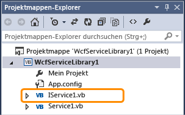
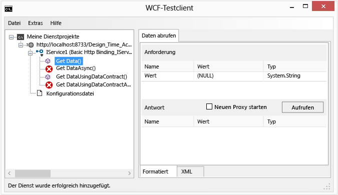
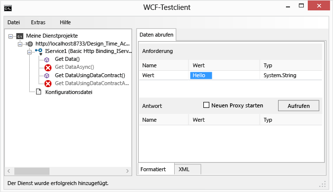
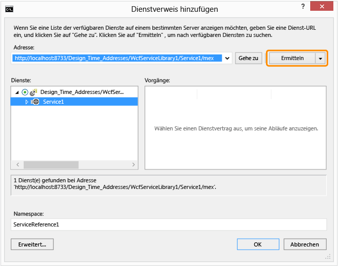
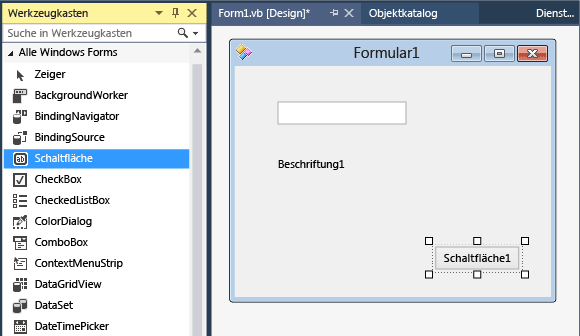
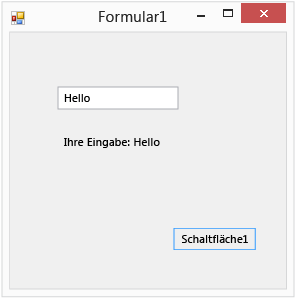

# Exemplarische Vorgehensweise: Erstellen eines einfachen WCF-Diensts in Windows Forms
In dieser exemplarischen Vorgehensweise wird gezeigt, wie Sie einen einfachen [!INCLUDE[vsindigo](../data-tools/includes/vsindigo_md.md)]-Dienst erstellen, testen und über eine Windows Forms-Anwendung darauf zugreifen können.  
  
[!INCLUDE[note_settings_general](../data-tools/includes/note_settings_general_md.md)]  
  
## Erstellen des Diensts  
  
#### So erstellen Sie einen WCF-Dienst  
  
1.  Zeigen Sie im Menü **Datei** auf **Neu** , und klicken Sie dann auf **Projekt**.  
  
2.  In der **neues Projekt** Dialogfeld erweitern Sie die **Visual Basic** oder **Visual C#-** Knoten, und klicken Sie auf **WCF**, gefolgt von **WCF Service-Bibliothek**. Klicken Sie auf **OK** auf das Projekt zu öffnen.  
  
       
  
    > [!NOTE]
    >  Dadurch wird ein funktionierender Dienst erstellt, der getestet und aufgerufen werden kann. Die folgenden beiden Schritte veranschaulichen, wie Sie die Standardmethode ändern können, um einen anderen Datentyp zu verwenden. In einer echten Anwendung würden Sie dem Dienst auch Ihre eigenen Funktionen hinzufügen.  
  
3.    
  
     In **Projektmappen-Explorer**, doppelklicken Sie auf "IService1.vb" oder "IService1.cs", und suchen Sie die folgende Zeile:  
  
     [!code-csharp[WCFWalkthrough#4](../data-tools/codesnippet/CSharp/walkthrough-creating-a-simple-wcf-service-in-windows-forms_1.cs)]
     [!code-vb[WCFWalkthrough#4](../data-tools/codesnippet/VisualBasic/walkthrough-creating-a-simple-wcf-service-in-windows-forms_1.vb)]  
  
     Ändern Sie den Typ für die `value` Parameter in eine Zeichenfolge:  
  
     [!code-csharp[WCFWalkthrough#1](../data-tools/codesnippet/CSharp/walkthrough-creating-a-simple-wcf-service-in-windows-forms_2.cs)]
     [!code-vb[WCFWalkthrough#1](../data-tools/codesnippet/VisualBasic/walkthrough-creating-a-simple-wcf-service-in-windows-forms_2.vb)]  
  
     Beachten Sie im obigen Code die `<OperationContract()>`- oder `[OperationContract]`-Attribute. Diese Attribute sind für jede Methode erforderlich, die vom Dienst zur Verfügung gestellt wird.  
  
4.    
  
     In **Projektmappen-Explorer**, doppelklicken Sie auf "Service1.vb" oder "Service1.cs", und suchen Sie die folgende Zeile:  
  
     [!code-vb[WCFWalkthrough#5](../data-tools/codesnippet/VisualBasic/walkthrough-creating-a-simple-wcf-service-in-windows-forms_3.vb)]
     [!code-csharp[WCFWalkthrough#5](../data-tools/codesnippet/CSharp/walkthrough-creating-a-simple-wcf-service-in-windows-forms_3.cs)]  
  
     Ändern Sie den Typ für den Value-Parameter in eine Zeichenfolge ein:  
  
     [!code-csharp[WCFWalkthrough#2](../data-tools/codesnippet/CSharp/walkthrough-creating-a-simple-wcf-service-in-windows-forms_4.cs)]
     [!code-vb[WCFWalkthrough#2](../data-tools/codesnippet/VisualBasic/walkthrough-creating-a-simple-wcf-service-in-windows-forms_4.vb)]  
  
## Testen des Diensts  
  
#### So testen Sie einen WCF-Dienst  
  
1.  Drücken Sie **F5** zum Ausführen des Diensts. Ein **WCF-Testclient** -Formular wird angezeigt und lädt den Dienst.  
  
2.  In der **WCF-Testclient** bilden, doppelklicken Sie auf die **GetData()** Methode unter **IService1**. Die **GetData** Registerkarte wird angezeigt.  
  
       
  
3.  In der **anfordern** aus, wählen die **Wert** Feld und Typ `Hello`.  
  
       
  
4.  Klicken Sie auf die **Invoke** Schaltfläche. Wenn eine **Sicherheitswarnung** im Dialogfeld angezeigt wird, klicken Sie auf **OK**. Das Ergebnis wird angezeigt, der **Antwort** Feld.  
  
       
  
5.  Auf der **Datei** Menü klicken Sie auf **beenden** um das Testformular zu schließen.  
  
## Zugriff auf den Dienst  
  
#### So greifen Sie auf einen WCF-Dienst zu  
  
1.  Auf der **Datei** Sie im Menü **hinzufügen** , und klicken Sie dann auf **neues Projekt**.  
  
2.  In der **neues Projekt** Dialogfeld erweitern Sie die **Visual Basic** oder **Visual C#-** Knoten, und wählen **Windows**, und wählen Sie dann auf **Windows Forms-Anwendung**. Klicken Sie auf **OK** auf das Projekt zu öffnen.  
  
       
  
3.  Mit der rechten Maustaste **WindowsApplication1** , und klicken Sie auf **Hinzufügen eines Dienstverweises**. Die **Hinzufügen eines Dienstverweises** Dialogfeld wird angezeigt.  
  
4.  In der **Hinzufügen eines Dienstverweises** (Dialogfeld), klicken Sie auf **Discover**.  
  
       
  
     **"Service1"** erscheint in der **Services** Bereich.  
  
5.  Klicken Sie auf **OK** um den Dienstverweis hinzuzufügen.  
  
#### So erstellen Sie eine Clientanwendung  
  
1.  In **Projektmappen-Explorer**, doppelklicken Sie auf **"Form1.vb"** oder **"Form1.cs"** Windows Forms-Designer zu öffnen, wenn er nicht bereits geöffnet ist.  
  
2.  Aus der **Toolbox**, ziehen Sie eine `TextBox` -Steuerelement, ein `Label` -Steuerelement, und ein `Button` -Steuerelement auf das Formular.  
  
       
  
3.  Doppelklicken Sie auf `Button`, und fügen Sie dem `Click`-Ereignishandler den folgenden Code hinzu:  
  
     [!code-csharp[WCFWalkthrough#3](../data-tools/codesnippet/CSharp/walkthrough-creating-a-simple-wcf-service-in-windows-forms_5.cs)]
     [!code-vb[WCFWalkthrough#3](../data-tools/codesnippet/VisualBasic/walkthrough-creating-a-simple-wcf-service-in-windows-forms_5.vb)]  
  
4.  In **Projektmappen-Explorer**, mit der rechten Maustaste **WindowsApplication1** , und klicken Sie auf **als Startprojekt festlegen**.  
  
5.  Drücken Sie **F5** um das Projekt auszuführen. Geben Sie Text ein, und klicken Sie auf die Schaltfläche. Zeigt die Bezeichnung "Ihre Eingabe:" und den von Ihnen eingegebenen Text an.  
  
       
  
## Siehe auch  
 [Windows Communication Foundation-Dienste und WCF Data Services in Visual Studio](../data-tools/windows-communication-foundation-services-and-wcf-data-services-in-visual-studio.md)