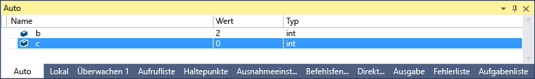
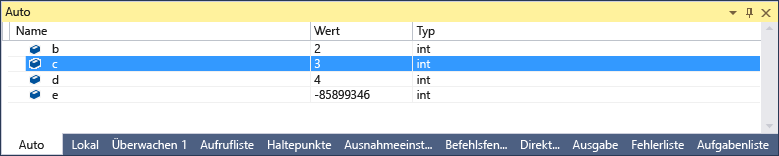
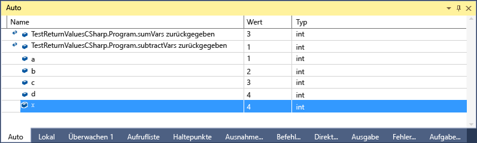

# <a name="inspect-variables-in-the-autos-and-locals-windows"></a>Prüfen Sie die Variablen im Auto und lokal

Die **Auto** und **lokale** Windows Variablenwerte anzeigen, während Sie debuggen. Die Windows sind nur verfügbar, während einer Debugsitzung. Die **Auto** Variablen verwendet, um dem aktuellen Haltepunkt angezeigt. Die **lokale** im lokalen Gültigkeitsbereich ist normalerweise die aktuelle Funktion oder Methode definierte Variablen angezeigt. Wenn dies das erste Mal, die Sie versucht haben ist, um Code zu debuggen, sollten Sie lesen [Debuggen für absolute Anfänger](../debugger/debugging-absolute-beginners.md) und [Debuggen, Techniken und Tools](../debugger/write-better-code-with-visual-studio.md) , bevor Sie diesen Artikel durchgehen.

 Die **"Auto"** Fenster ist verfügbar für C#, Visual Basic, C++ und Python-Code, aber nicht für JavaScript oder F#.

Öffnen der **Auto** Fenster während des Debuggens wählen **Debug** > **Windows** > **Auto**, oder drücken Sie **STRG**+**Alt**+**V** > **eine**.

Öffnen der **lokale** Fenster während des Debuggens wählen **Debuggen** > **Windows** > **lokal**, oder drücken Sie **Alt**+**4**.

> [!NOTE]
> Dieses Thema gilt für Visual Studio unter Windows. Visual Studio für Mac finden Sie unter [datenvisualisierungen in Visual Studio für Mac](/visualstudio/mac/data-visualizations).

## <a name="use-the-autos-and-locals-windows"></a>Verwenden der Autos und lokal

Anzeigen von Arrays und Objekten der **Auto** und **lokal** Windows als Strukturansicht. Wählen Sie den Pfeil links neben einem Variablennamen zum Erweitern der Ansicht Felder und Eigenschaften. Hier ist ein Beispiel für eine <xref:System.IO.FileStream?displayProperty=fullName> -Objekt in der **"lokal"** Fenster:


Ein roter Wert in der **lokale** oder **Auto** bedeutet der Wert wurde geändert, seit der letzten Auswertung. Von einer vorherigen Debugsitzung sein konnte oder weil den Wert im Fenster geändert haben.

Numerische kann in Debuggerfenstern Dezimal. Auf das Hexadezimalformat zu ändern, klicken Sie in der **lokale** oder **Auto** und wählen Sie **Hexadezimale Anzeige**. Diese Änderung wirkt sich auf alle Debuggerfenster.

## <a name="edit-variable-values-in-the-autos-or-locals-window"></a>Bearbeiten Sie Variablenwerte im Fenster Auto oder lokal

So bearbeiten Sie die Werte der Variablen in den meisten der **Auto** oder **lokale** Windows auf den Wert doppelklicken und den neuen Wert eingeben.

Sie können Sie einen Ausdruck für einen Wert eingeben, etwa `a + b`. Der Debugger akzeptiert im die meisten gültigen Sprachausdrücke.

In nativem C++-Code müssen Sie möglicherweise den Kontext eines Variablennamens qualifizieren. Weitere Informationen finden Sie unter [Kontextoperator (C++)](../debugger/context-operator-cpp.md).

>[!CAUTION]
>Stellen Sie sicher, dass Sie die Folgen kennen, bevor Sie Werte und Ausdrücke ändern. Mögliche Probleme sind:
>
>-   Die Auswertung bestimmter Ausdrücke kann zur Änderung des Werts einer Variablen führen oder sich auf den Programmzustand auswirken. Angenommen, bewerten `var1 = ++var2` ändert sich der Wert beider `var1` und `var2`. Diese Ausdrücke haben [Nebenwirkungen](https://en.wikipedia.org/wiki/Side_effect_\(computer_science\)). Nebeneffekte können zu unerwarteten Ergebnissen führen, wenn Sie nicht bewusst sind.
>
>-   Das Bearbeiten von Gleitkommawerten kann aufgrund der Dezimal-zu-Binär-Konvertierung von Nachkommastellen zu geringfügigen Ungenauigkeiten führen. Auch scheinbar harmlose bearbeiten kann ändert einige Bits in der Gleitkommavariable führen.

::: moniker range=">= vs-2019" 
## <a name="search-in-the-autos-or-locals-window"></a>Suchen Sie im Fenster "Auto" oder "lokal"

Sie können nach Schlüsselwörtern in den Spalten für Name, Wert und Typ der suchen die **"Auto"** oder **"lokal"** Fenster über die Suchleiste oben jedes Fenster. Drücken Sie die EINGABETASTE, oder wählen Sie einen der Pfeile, um eine Suche auszuführen. Um einen laufenden Suchvorgang abzubrechen, wählen Sie das Symbol "X" in der Suchleiste ein.

Verwenden Sie die Pfeile nach links und rechts (UMSCHALT + F3 und F3, bzw.) finden Sie zum Navigieren zwischen entspricht.


Um Ihre Suche mehr oder weniger umfassend und nutzen die **Suche tiefer** Dropdownliste am oberen Rand der **"Auto"** oder **"lokal"** Fenster auswählen, wie viele Ebenen, die Sie in suchen möchten geschachtelte Objekte. 

::: moniker-end

## <a name="change-the-context-for-the-autos-or-locals-window"></a>Ändern Sie den Kontext für das Auto oder lokal

Können die **Debugspeicherort** Symbolleiste wählen Sie eine Funktion, Thread oder Prozess den Kontext für wird die **Auto** und **lokale** Windows.

Aktivieren der **Debugspeicherort** Symbolleiste auf eine leere Stelle des Werkzeugleistenbereich und wählen **Debugspeicherort** aus der Dropdownliste oder wählen **Ansicht**  >   **Symbolleisten** > **Debugspeicherort**.

Legen Sie einen Haltepunkt fest, und starten Sie das Debuggen. Wenn der Haltepunkt Ausführung angehalten und sehen die Position in der **Debugspeicherort** Symbolleiste.


## <a name="bkmk_whatvariables"></a> Variablen im Fenster "Auto" (C#, C++, Visual Basic, Python)

 Unterschiedliche Sprachen anzeigen verschiedene Variablen in der **Auto** Fenster.

 - In C# und Visual Basic wird im Fenster **Auto** jede Variable angezeigt, die in der aktuellen oder vorherigen Zeile verwendet wird. In C# oder Visual Basic-code, die folgenden vier Variablen deklariert:

   ```csharp
       public static void Main()
       {
          int a, b, c, d;
          a = 1;
          b = 2;
          c = 3;
          d = 4;
       }
   ```

   Legen Sie einen Haltepunkt in der Zeile `c = 3;`, und den Debugger starten. Wenn die Ausführung angehalten wird, die **Auto** Fenster wird angezeigt:

   

   Der Wert der `c` ist 0, da die Zeile `c = 3` noch nicht ausgeführt.

 - In C++ die **Auto** Fenster zeigt die Variablen in drei Zeilen vor der aktuellen Zeile, an dem die Ausführung angehalten. Beispielsweise in C++-Code deklarieren Sie sechs Variablen:

   ```C++
       void main() {
           int a, b, c, d, e, f;
           a = 1;
           b = 2;
           c = 3;
           d = 4;
           e = 5;
           f = 6;
       }
   ```

    Legen Sie einen Haltepunkt in der Zeile `e = 5;` und führen Sie den Debugger. Stoppt die Ausführung der **Auto** Fenster wird angezeigt:

    

    Die Variable `e` ist nicht initialisiert, weil die Zeile `e = 5` noch nicht ausgeführt.

##  <a name="bkmk_returnValue"></a> View return values of method calls
 In .NET und C++-Code untersuchen Sie Rückgabewerte in der **Auto** Fenster über einen Methodenaufruf oder Schritt. Anzeigen von Methodenaufruf zurück Werte nützlich sein, wenn sie nicht in lokalen Variablen gespeichert werden. Eine Methode kann als Parameter oder Rückgabewert eine andere Methode verwendet werden.

 Das folgende C# Code fügt die Rückgabewerte von zwei Funktionen:

```csharp
static void Main(string[] args)
{
    int a, b, c, d;
    a = 1;
    b = 2;
    c = 3;
    d = 4;
    int x = sumVars(a, b) + subtractVars(c, d);
}

private static int sumVars(int i, int j)
{
    return i + j;
}

private static int subtractVars(int i, int j)
{
    return j - i;
}
```

Die Rückgabewerte der an die `sumVars()` und `subtractVars()` Methodenaufrufe im Fenster Auto:

1. Legen Sie einen Haltepunkt in der Zeile `int x = sumVars(a, b) + subtractVars(c, d);` fest.

1. Debuggen und die Ausführung am Haltepunkt hält, wählen **Prozedurschritt** , oder drücken Sie **F10**. Müsste die folgenden Rückgabewerte in der **Auto** Fenster:

  

## <a name="see-also"></a>Siehe auch

- [Was bedeutet „Debuggen“?](../debugger/what-is-debugging.md)
- [Debugverfahren und -tools](../debugger/write-better-code-with-visual-studio.md)
- [Ein erster Blick auf das Debuggen](../debugger/debugger-feature-tour.md)
- [Debuggerfenster](../debugger/debugger-windows.md)
