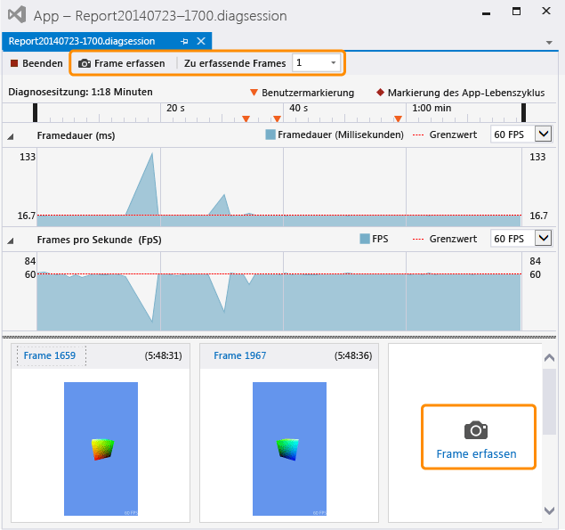

# Erfassen von Grafikinformationen
[!INCLUDE[vs2017banner](../code-quality/includes/vs2017banner.md)]

Erfassen Sie Grafikinformationen aus Ihrer Direct3D\-App, damit Sie die Visual Studio\-Grafikanalyse zum Diagnostizieren von Rendering\- und Leistungsproblemen verwenden können.  
  
## Aufzeichnen von Grafikinformationen  
 Das Aufzeichnen von Grafikinformationen ist ein zweistufiger Prozess.  Führen Sie zuerst Ihre App unter der Grafikdiagnose aus, und geben Sie dann einen oder mehrere Frames an, aus denen ausführliche Informationen erfasst werden sollen.  
  
#### So führen Sie die App unter der Grafikdiagnose aus  
  
-   Klicken Sie in der Menüleiste auf **Debuggen**, dann auf **Grafik** und **Diagnose starten**.  \(Tastatur: Drücken Sie ALT\+F5\)  
  
-   Wählen Sie auf der Symbolleiste **Grafik** die Schaltfläche **Diagnose starten** aus.  
  
 Wenn eine App unter der Grafikdiagnose ausgeführt wird, werden laufend bestimmte Arten von Grafikinformationen aufgezeichnet, beispielsweise Geräteinstallation, Erstellung der Swapkette, Erstellung von Grafikobjekten und Ressourcen sowie andere wichtige Ereignisse, die Auswirkungen auf einen oder mehrere Frames haben.  Gleichzeitig können Sie ausführliche Informationen über bestimmte Frames erfassen. Dazu gehören Zeichnen\-Aufrufe und Compute\-Shader\-Dispatchvorgänge gemeinsam mit Direct3D\-Objekten und \-Ressourcen, die diese unterstützen.  
  
#### So erfassen Sie einen Frame  
  
-   Wählen Sie in Visual Studio auf der Symbolleiste **Grafik** die Schaltfläche **Frame erfassen**  aus.  
  
-   Auf der Tastatur drücken Sie die Taste DRUCK.  
  
    > [!NOTE]
    >  Während eine App unter **Grafikdiagnose** ausgeführt wird, kann die Taste DRUCK nur verwendet werden, um Frames von Grafikinformationen aufzuzeichnen – die übliche Tastenfunktion wird nicht ausgeführt.  Dieses Verhalten bleibt bestehen, bis Sie die Aufzeichnung von Grafikinformationen beenden \(üblicherweise durch Beenden des Debuggings oder das normale Verlassen der App\), auch wenn der Fokus auf einer anderen Anwendung liegt.  
  
-   Wählen Sie in der Visual Studio\-Aufnahmeschnittstellen die Schaltfläche **Frame erfassen** oberhalb der Zeitachse **Diagnosesitzung** oder wählen Sie die große Schaltfläche **Frame erfassen** unterhalb des Verantwortlichkeitsbereichs **Frames pro Sekunde** und rechts von zuvor erfassten Frames aus.  Beide Schaltflächen werden in der folgenden Abbildung hervorgehoben.  
  
       
  
     Wenn Sie bereit sind, die von Ihnen erfassten Frames zu prüfen, starten Sie die **Visual Studio\-Grafikanalyse**, indem Sie den **Frame …**\-Link über den Bildminiaturansichten oder durch Doppelklicken auf die Miniaturansicht aufrufen.  
  
 Es können nur ganze Frames aufgezeichnet werden. Wenn Sie eine Aufzeichnung starten, werden daher die Grafikinformationen aus dem nächsten Frame aufgezeichnet.  Die Aufzeichnung beginnt sofort nach Darstellung des Frames, in dem Sie die Aufzeichnung gestartet haben, und endet, wenn der aufgezeichnete Frame dargestellt wird.  Während die App unter der Grafikdiagnose ausgeführt wird, können Sie so viele Frames aufzeichnen, wie Sie möchten.  Wenn Sie keine Frames aufzeichnen, wird das Grafikprotokoll verworfen.  
  
 Beim Erfassen von Frames zeigt Visual Studio das Diagnosesitzungsfenster \(.diagsession\) an.  Wenn Sie dieses Fenster schließen, das Debugging beenden oder die App schließen, können Sie in diesem Protokoll keine Frames mehr erfassen.  Wenn Sie weitere Grafikinformationen erfassen möchten, müssen Sie die App erneut unter der Grafikdiagnose ausführen, um ein neue Diagnosesitzung zu starten.  
  
### Erfassungsoptionen der Grafikdiagnose  
 Sie können die Aufzeichnung konfigurieren, um Aufruflisten für alle Grafikereignisse oder eine eingeschränkte Teilmenge zu sammeln, die HUD\-Aufzeichnung zu deaktivieren und den Capture\-Kompatibilitätsmodus zu deaktivieren oder zu aktivieren.  
  
##### So konfigurieren Sie die Aufnahmeoptionen für die Grafikdiagnose  
  
1.  Klicken Sie in der Menüleiste auf Extras, Optionen.  Das Dialogfeld Optionen wird angezeigt.  
  
2.  Wählen Sie Grafikdiagnose in der Kategorieliste auf der linken Seite und konfigurieren Sie die gewünschten Optionen für die Diagnose von Grafiken.  
  
     **Sammeln von Aufruflisten während der Aufzeichnung \(verlangsamt die Aufzeichnung\)**  
     Aktivieren Sie dieses Kontrollkästchen, um die Aufruflisten zu sammeln.  Standardmäßig werden die Aufruflisten nicht erfasst.  Stellen Sie zum Erfassen der Aufruflisten sicher, dass das Kontrollkästchen **Aufrufstapel während der Erfassung aufzeichnen \(verlangsamt die Erfassung\)** für die Aktivierung der Auflistung aktiviert ist. Legen Sie anschließend die Option \(Standard\) **Zeichnen, Versand, Vorhanden und Perf. Markierungen** so fest, dass nur die wichtigsten Aufruflisten erfasst werden, oder legen Sie die Option **für alles** fest, um alle Aufruflisten zu erfassen.  Deaktivieren Sie zum Anhalten der Erfassung von Aufruflisten zu einem späteren Zeitpunkt das Kontrollkästchen **Aufrufstapel während der Erfassung aufzeichnen \(verlangsamt die Erfassung\)**.  
  
     **In\-Game\-HUD während der Aufzeichnung deaktivieren**  
     Aktivieren Sie dieses Kontrollkästchen, um die HUD\-Überlagerung zu deaktivieren, die eine Anwendung unter der Grafikdiagnose in der Regel anzeigt.  Deaktivieren Sie das Kontrollkästchen Sie, um die HUD\-Überlagerung anzuzeigen.  
  
     **Erfassen im Kompatibilitätsmodus**  
     Aktivieren Sie dieses Kontrollkästchen, um Grafikinformationen im Kompatibilitätsmodus zu erfassen.  Erfassen im Kompatibilitätsmodus ist die Standardeinstellung.  Unter dem Kompatibilitätsmodus wird Direct3D nicht melden, dass die GPU zusätzliche Features unterstützt, die über die in der Basis\-KE\-Ebene definierten Features hinausgehen.  Dadurch wird verhindert, dass die Anwendung bei Verwendung von Hardware\-spezifischen Erweiterungen der GPU erfasst wird, und es wird sichergestellt, dass das Grafikprotokoll mit jeder GPU, die die gleiche oder eine höhere Funktionsebene unterstützt, wiedergegeben werden kann.  Deaktivieren Sie dieses Kontrollkästchen, um den Kompatibilitätsmodus zu deaktivieren; Protokolle mit deaktiviertem Kompatibilitätsmodus werden nicht auf allen GPUs wiedergegeben, die nicht die gleichen zusätzlichen Funktionen unterstützen, die von der Anwendung während der Aufnahme verwendet wurden.  
  
     **Erfassung beenden, wenn Fehler vom Typ „SDK\_layers“ gefunden werden**  
     Aktivieren Sie dieses Kontrollkästchen, um die Erfassung sofort anzuhalten, wenn Fehler ermittelt werden.  
  
## Grafikinformationen remote aufzeichnen  
 Grafikinformationen können von einer App aufgezeichnet werden, die auf dem lokalen Computer, einem Remotecomputer oder einem Remotegerät ausgeführt wird.  Die Remoteerfassung wird auf [!INCLUDE[winblue_client_2](../debugger/includes/winblue_client_2_md.md)]\-Computern und [!INCLUDE[winblue_winrt_2](../debugger/includes/winblue_winrt_2_md.md)]\-Geräten unterstützt.  Konfigurieren Sie Ihr Projekt für das Remotedebugging, wenn Sie Grafikinformationen von einer remote ausgeführten App aufzeichnen möchten, und führen Sie die App wie zuvor beschrieben unter der Grafikdiagnose aus.  Die App wird auf dem Remotecomputer ausgeführt, und die erfassten Grafikinformationen werden auf dem Entwicklungscomputer aufgezeichnet.  
  
 Wie Sie Ihr Projekt für das Remotedebugging konfigurieren, hängt von der Art der App ab, die Sie entwickeln, und von der dabei verwendeten Programmiersprache.  Weitere Informationen über das Konfigurieren des Remotedebuggings für eine Windows Store\-App finden Sie unter [Ausführen von Windows Store\-Apps auf einem Remotecomputer](../debugger/run-windows-store-apps-on-a-remote-machine.md).  Informationen über das Konfigurieren des Remotedebuggings für eine Windows\-Desktop\-App finden Sie unter [Einrichten des Remotedebuggens für ein Visual Studio\-Projekt](../Topic/Set%20Up%20Remote%20Debugging%20for%20a%20Visual%20Studio%20Project.md).  
  
 Sie können später einen Remotecomputer oder ein Remotegerät verwenden, um die Grafikinformationen unabhängig vom Gerät wiederzugeben, auf dem sie erfasst wurden.  Weitere Informationen finden Sie unter [Gewusst wie: Ändern des Grafikdiagnose\-Wiedergabecomputers](../debugger/how-to-change-the-graphics-diagnostics-playback-machine.md).  
  
## Das Aufzeichnen von Grafikinformationen von der Befehlszeile aus  
 Grafikinformationen können von einer Anwendung mit einem Befehlszeilentool erfasst werden.  Dieses Tool DXCap.exe kann Grafikinformationen schnell erfassen und ohne Verwendung von Visual Studio oder programmgesteuerte Aufnahme wiedergeben.  Insbesondere können Sie DXCap.exe für die Automatisierung oder in einer Testumgebung verwenden.  Weitere Informationen über „DXCap.exe“ finden Sie unter [Befehlszeilen\-Erfassungs\-Tool](../debugger/command-line-capture-tool.md).  
  
## Siehe auch  
 [Exemplarische Vorgehensweise: Erfassen von Grafikinformationen](../debugger/walkthrough-capturing-graphics-information.md)