# <a name="create-custom-views-of-native-objects-in-the-visual-studio-debugger"></a>Erstellen Sie benutzerdefinierte Ansichten von systemeigenen Objekten in Visual Studio-debugger
Das Visual Studio-Natvis-Framework können Sie die Darstellung anpassen Visual Studio systemeigene Typen in den Variablenfenstern des Debuggers zeigt (z. B. die **Überwachen** Fenster **"lokal"** Fenster, und klicken Sie in  **DataTips**.
  
 Natvis ersetzt die **autoexp.dat** -Datei, die in früheren Versionen von Visual Studio verwendet wurde, und bietet XML-Syntax, bessere Diagnosefunktionen, eine bessere Versionskontrolle und Unterstützung mehrerer Dateien.  
  
> [!NOTE]
>  Sie können das Natvis-Framework in den folgenden Fällen nicht für Visualisierungen verwenden:  
>   
>  -  Sie debuggen ein C++-Windows-Desktopprojekt mit einem auf **Gemischt**festgelegten Debuggertyp.  
> -   Sie nehmen das debugging im gemischten Modus in einer Windows-Desktopanwendung im verwalteten Kompatibilitätsmodus (**Extras > Optionen > Debugging > Allgemein > verwalteten Kompatibilitätsmodus verwenden**).  
> -   Sie Debuggen in einer Windows-Desktopanwendung im systemeigenen Kompatibilitätsmodus (**Extras > Optionen > Debugging > Allgemein > systemeigenen Kompatibilitätsmodus verwenden**).  
  
##  <a name="BKMK_Why_create_visualizations_"></a> Warum werden Natvis-Visualisierungen erstellt?  
 Sie können das Natvis-Framework zum Erstellen von Visualisierungsregeln für Typen verwenden, die Sie erstellen, damit sie von Entwicklern beim Debuggen problemlos angezeigt werden können.  
  
 Die folgende Abbildung zeigt z. B. eine Variable vom Typ [Windows::UI::Xaml::Controls::TextBox](http://go.microsoft.com/fwlink/?LinkId=258422) , die im Debugger ohne angewendete benutzerdefinierten Visualisierungen angezeigt wird.  
  
 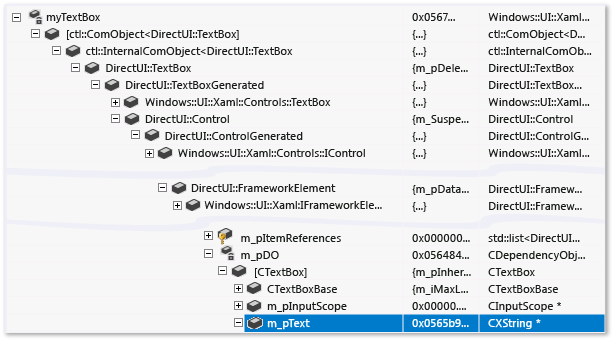  
  
 Die hervorgehobene Zeile zeigt die `Text` -Eigenschaft der `TextBox` -Klasse. Die komplexe Klassenhierarchie erschwert die finden Sie diesen Wert; der Debugger weiß darüber hinaus nicht interpretieren des benutzerdefinierten Zeichenfolgentyps an, die von dem Objekt verwendet werden, damit Sie nicht die Zeichenfolge, die im Textfeld angezeigt.  
  
 Die gleiche `TextBox` im Variablenfenster viel einfacher sieht, wenn benutzerdefinierte visualisierungsregeln angewendet werden. Die wichtigen Member der Klasse können gemeinsam angezeigt werden, und der Debugger zeigt den zugrunde liegenden Zeichenfolgenwert des benutzerdefinierten Zeichenfolgentyps an.  
  
 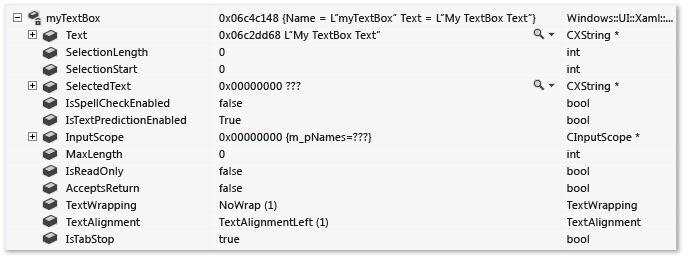  
  
##  <a name="BKMK_Using_Natvis_files"></a> Verwenden von Natvis-Dateien  
 Bei Natvis-Dateien handelt es sich um XML-Dateien mit der Erweiterung ".natvis". Das Schema wird in **%VSINSTALLDIR%\Xml\Schemas\natvis.xsd**definiert.  
  
 Die grundlegende Struktur einer Natvis-Datei enthält eine oder mehrere `Type` -Elemente, wobei jedes `Type` -Element einen Visualisierungseintrag für einen Typ darstellt, dessen vollqualifizierter Name im `Name` -Attribut angegeben ist.  
  
```xml
<?xml version="1.0" encoding="utf-8"?>  
<AutoVisualizer xmlns="http://schemas.microsoft.com/vstudio/debugger/natvis/2010">  
  <Type Name="MyNamespace::CFoo">  
    .  
    .  
  </Type>  
  
  <Type Name="...">  
    .  
    .  
  </Type>  
</AutoVisualizer>  
```  
  
 Visual Studio stellt im **%VSINSTALLDIR%\Common7\Packages\Debugger\Visualizers** -Ordner einige Natvis-Dateien bereit. Diese Dateien enthalten Visualisierungsregeln für viele allgemeine Typen und können als Beispiele dienen, wenn Visualisierungen für neue Typen geschrieben werden.  
  
## <a name="adding-natvis-files-to-your-projects"></a>Hinzufügen von Natvis-Dateien zu Projekten  
 Natvis-Dateien können zu jedem C++-Projekt hinzugefügt werden.  
  
 Wählen Sie zum Hinzufügen einer neuen natvis-Datei mit einem geöffneten C++-Projekt den Projektknoten in der **Projektmappen-Explorer**, und klicken Sie auf **hinzufügen > Neues Element > Visual C++ > Hilfsprogramm > Debugger Visualisierung-Datei (.natvis)**. Der Debugger lädt Natvis-Dateien automatisch aus C++-Projekten. Standardmäßig werden Natvis-Dateien in Ihrem Projekt auch in die PDB-Datei eingefügt, die durch das Projekt erstellt wurde. Wenn Sie die durch dieses Projekt erstellte binäre Datei debuggen, lädt der Debugger demnach die Natvis-Datei aus der PDB-Datei, selbst wenn Sie das Projekt nicht geöffnet haben. Wenn die Natvis-Datei nicht in die PDB-Datei eingefügt werden soll, klicken Sie im **Projektmappen-Explorer**mit der rechten Maustaste auf die Natvis-Datei, und legen Sie im Fenster **Konfigurationseigenschaften** die Option **Aus Build ausgeschlossen** auf **Ja**fest.  
  
 Sie sollten Natvis-Dateien mithilfe von Visual Studio bearbeiten. Beim Debuggen werden von Ihnen vorgenommene Änderungen automatisch übernommen, sobald Sie die Datei speichern. Sie erhalten durch IntelliSense zudem eine verbesserte Bearbeitungsoberfläche.  
  
 Aus einer PDB-Datei geladene Natvis-Dateien gelten nur für solche Typen im Modul, auf die sich die PDB-Datei bezieht. Wenn beispielsweise die Datei "Module1.pdb" einen Eintrag für einen Typ mit dem Namen `Test`definiert, gilt dieser Eintrag nur für die **Test** -Klasse  in "Module1.dll". Wenn ein anderes Modul außerdem eine Klasse namens definiert **Test**, des Module1.pdb Natvis-Eintrag gilt nicht für sie.  
  
##  <a name="BKMK_natvis_location"></a> Bereitstellen von Natvis-Dateien  
 Wenn die natvis-Datei nur für Typen angewendet wird, die Sie in einem Visual Studio-Projekt erstellen, müssen Sie nichts zu tun; die natvis ist in der PDB-Datei enthalten. Sie können jedoch Natvis-Dateien zu Ihrem Benutzerverzeichnis oder einem Systemverzeichnis hinzufügen, wenn sie für mehrere Projekte gelten sollen.  
  
 Die Reihenfolge, in der Natvis-Dateien ausgewertet werden, lautet wie folgt:  
  
1.  natvis-Dateien, die in einer PDB-Datei, die Sie Debuggen (es sei denn, eine Datei mit demselben Namen in einem anderen geladenen Projekt vorhanden ist) eingebettet sind.  
  
2.  natvis-Dateien, die Bestandteil eines geladenen C++-Projekts oder eines projektmappenelements sind. Diese Gruppe enthält alle geladenen C++-Projekte, einschließlich Klassenbibliotheken, aber es umfasst nicht die anderssprachige Projekte (z. B. nicht Sie eine natvis-Datei aus einem C#-Projekt geladen). Bei ausführbaren Projekten sollten Sie zum Hosten von Natvis-Dateien, die nicht bereits in einer PDB-Datei enthalten sind, Projektmappenelemente verwenden, da kein C++-Projekt verfügbar ist.  
  
3.  Das benutzerspezifische Natvis-Verzeichnis (z. B. **%USERPROFILE%\Documents\Visual Studio 2017\Visualizers** oder **%USERPROFILE%\My Dateien\Visual Studio 2015\Visualizers**).  
  
4.  Das systemweite Natvis-Verzeichnis (**%VSINSTALLDIR%\Common7\Packages\Debugger\Visualizers**). Dieses Verzeichnis ist, in der natvis-Dateien, die mit Visual Studio installiert sind, kopiert werden. Wenn Sie über Administratorberechtigungen verfügen, können Sie diesem Verzeichnis Weitere Dateien hinzufügen.  
  
## <a name="modifying-natvis-files-while-debugging"></a>Ändern von Natvis-Dateien beim Debuggen  
 Sie können Natvis-Datei in der IDE ändern, während Sie das Projekt, in dem sie enthalten ist, debuggen. Öffnen Sie die Datei in der IDE (unter Verwendung derselben Instanz von Visual Studio, mit der Sie debuggen), ändern Sie sie, und speichern Sie sie. Nach dem Speichern der Datei sollten die Fenster **Überwachen** und **Lokal** aktualisiert werden, um die Änderung zu übernehmen. Wenn Sie die Natvis-Datei außerhalb der IDE ändern, werden die Änderungen nicht automatisch wirksam. Zum Aktualisieren der Fenster können Sie den Befehl **.natvisreload** im Fenster **Überwachen** auswerten. Diese Aktion bewirkt, dass die Änderungen wirksam werden, ohne die Debugsitzung neu zu starten.  
  
 Sie können auch hinzufügen oder Löschen von natvis-Dateien zu einer Projektmappe, die Sie Debuggen, und Visual Studio hinzugefügt oder entfernt die relevanten Visualisierungen.  
  
 Wenn eine natvis-Datei in einer PDB-Datei eingebettet ist, können keine Änderungen während des Debuggens.  
  
 Verwenden der **.natvisreload** Befehl, wenn Sie die Natvis-Datei auf eine neuere Version aktualisieren (z. B. Wenn sie in die quellcodeverwaltung eingecheckt ist und Sie kürzlich vorgenommene Änderungen auswählen, dass ein Benutzer auf die Datei erstellt haben). Sie sollten die Natvis-Dateien mit dem Visual Studio-XML-Editor bearbeiten.  
  
##  <a name="BKMK_Expressions_and_formatting"></a> Ausdrücke und Formatierung  
 Natvis-Visualisierungen verwenden C++-Ausdrücke, um anzuzeigende Datenelementen anzugeben. Zusätzlich zu den Verbesserungen und Einschränkungen der C++-Ausdrücke im Debugger, die in beschriebenen [Kontext-Operator (C++)](../debugger/context-operator-cpp.md), müssen Sie die folgenden Unterschiede beachten:  
  
-   Natvis-Ausdrücke werden im Kontext des Objekts ausgewertet, das in der Schnellansicht und nicht im aktuellen Stapelrahmen angezeigt wird. Angenommen, Sie verwenden `x` in einem Natvis-Ausdruck, der Bezeichner bezieht sich auf das Feld `x` im-Objekt, das visualisiert werden, nicht um eine lokale Variable namens `x` in der aktuell ausgeführten Funktion. Sie können nicht auf lokale Variablen in Natvis-Ausdrücken zugreifen, obwohl Sie auf globale Variablen zugreifen können.  
  
-   Natvis-Ausdrücke lassen keine Funktionsauswertung oder Nebeneffekte zu. Dies bedeutet, dass Funktionsaufrufe und Zuweisungsoperatoren ignoriert werden. Da [systeminterne Debuggerfunktionen](../debugger/expressions-in-the-debugger.md#BKMK_Using_debugger_intrinisic_functions_to_maintain_state) keine Nebeneffekte haben, können sie beliebig von jedem Natvis-Ausdruck aufgerufen werden, obwohl andere Funktionsaufrufe nicht zulässig sind.  
  
 Um zu steuern, wie ein Ausdruck in einem Variablenfenster angezeigt wird, können Sie alle den Formatbezeichner, die in beschriebenen verwenden die [Formatbezeichner](../debugger/format-specifiers-in-cpp.md#BKMK_Visual_Studio_2012_format_specifiers) Teil der [Formatbezeichner in C++](../debugger/format-specifiers-in-cpp.md) Thema. Beachten Sie, dass Formatbezeichner ignoriert werden, wenn der virtualisierungseintrag intern von Natvis, wie z. B. dient der `Size` Ausdruck in einem [ArrayItems-Erweiterung](../debugger/create-custom-views-of-native-objects.md#BKMK_ArrayItems_expansion).  
  
## <a name="natvis-views"></a>Natvis-Ansichten  
 Mit Natvis-Ansichten können Sie jeden Typ auf verschiedene Weise anzeigen. Beispielsweise können Sie eine Ansicht mit dem Namen **simple** definieren, die eine vereinfachte Ansicht eines Typs ausgibt. Im Folgenden finden Sie beispielsweise die Visualisierung von `std::vector`:
  
```xml
<Type Name="std::vector&lt;*&gt;">  
    <DisplayString>{{ size={_Mylast - _Myfirst} }}</DisplayString>  
    <Expand>  
        <Item Name="[size]" ExcludeView="simple">_Mylast - _Myfirst</Item>  
        <Item Name="[capacity]" ExcludeView="simple">_Myend - _Myfirst</Item>  
        <ArrayItems>  
            <Size>_Mylast - _Myfirst</Size>  
            <ValuePointer>_Myfirst</ValuePointer>  
        </ArrayItems>  
    </Expand>  
</Type>  
```  
  
 Die Elemente `DisplayString` und `ArrayItems` werden in der standardmäßigen und in der einfachen Ansicht verwendet, während die Elemente `[size]` und `[capacity]` aus dieser einfachen Ansicht ausgeschlossen sind. Sie können den Formatbezeichner **view** verwenden, um eine alternative Ansicht anzugeben. Im Fenster **Überwachen** können Sie die einfache Ansicht als **vec,view(simple)**angeben:  
  
   
  
##  <a name="BKMK_Diagnosing_Natvis_errors"></a> Diagnose von Natvis-Fehlern  
 Sie können die Natvis-Diagnose verwenden, um Syntax- und Analysefehler zu beheben. Wenn der Debugger Fehler in einem Visualisierungseintrag ermittelt, ignoriert er die Fehler und zeigt den Typ in seiner Rohform an oder wählt eine andere geeignete Visualisierung aus. Um nachzuvollziehen, warum ein bestimmter visualisierungseintrag ignoriert wird und der zugrunde liegenden Fehler anzuzeigen, können Sie Natvis-Diagnose aktivieren **Extras > Optionen > Debugging > Fenster "Ausgabe" > Natvis-diagnosemeldungen (nur C++)** -Option. Die Fehler werden im Fenster **Ausgabe** angezeigt.  
  
##  <a name="BKMK_Syntax_reference"></a> Natvis-Syntaxverweis  
  
###  <a name="BKMK_AutoVisualizer"></a> AutoVisualizer-Element  
 Bei dem `AutoVisualizer`  -Element handelt es sich um den Stammknoten der Natvis-Datei, der das `xmlns:` -Attribut für den Namespace enthält.  
  
```xml
<?xml version="1.0" encoding="utf-8"?>  
<AutoVisualizer xmlns="http://schemas.microsoft.com/vstudio/debugger/natvis/2010">  
.  
.  
</AutoVisualizer>  
```  
  
###  <a name="BKMK_Type"></a> Type-Element  
 Ein Basistyp sieht folgendermaßen aus:  
  
```xml
<Type Name="[fully qualified type name]">  
  <DisplayString Condition="[Boolean expression]">[Display value]</DisplayString>  
  <Expand>  
    ...  
  </Expand>  
</Type>  
```  
  
 Er gibt Folgendes an:  
  
1.  Für welchen Typ diese Visualisierung verwendet werden soll (das `Type Name` -Attribut).  
  
2.  Wie der Wert eines Objekts dieses Typs aussehen soll (das `DisplayString` -Element).  
  
3.  Wie die Member des Typs aussehen sollen, wenn der Benutzer den Typ in einem variablen Fenster erweitert (der `Expand` -Knoten).  
  
 **Auf Vorlagen basierende Klassen** . Für das `Name` -Attribut des `Type` -Elements kann ein Sternchen ( `*` ) als Platzhalterzeichen für vorlagenbasierte Klassennamen verwendet werden:  
  
```xml
<Type Name="ATL::CAtlArray&lt;*&gt;">  
    <DisplayString>{{Count = {m_nSize}}}</DisplayString>  
</Type>  
  
```  
  
 In diesem Beispiel wird die gleiche Visualisierung verwendet wird, ob das Objekt eine `CAtlArray<int>` oder ein `CAtlArray<float>`. Wenn es ein bestimmten visualisierungseintrag für ist ein `CAtlArray<float>`, dann es Vorrang vor dem generischen Objekt enthält.  
  
 Beachten Sie, dass auf Vorlagenparameter im Visualisierungseintrag verwiesen werden kann, indem die Makros "$T1", "$T2" usw. verwendet werden. Beispiele zu diesen Makros finden Sie in den Natvis-Dateien, die in Visual Studio bereitgestellt werden.  
  
####  <a name="BKMK_Visualizer_type_matching"></a> Typenabgleich in der Schnellansicht  
 Wenn ein Visualisierungseintrag nicht überprüft werden kann, wird die nächste verfügbare Visualisierung verwendet.  
  
#### <a name="inheritable-attribute"></a>Inheritable-Attribut  
 Mit dem optionalen Attribut `Inheritable` können Sie angeben, ob eine Visualisierung nur auf einen Basistyp oder auf einen Basistyp und alle abgeleiteten Typen angewendet werden soll. Im Folgenden wird die Visualisierung nur auf den `BaseClass` -Typ angewendet.  
  
```xml
<Type Name="Namespace::BaseClass" Inheritable="true">  
    <DisplayString>{{Count = {m_nSize}}}</DisplayString>  
</Type>  
```  
  
 Der Standardwert von `Inheritable` ist `true`.  
  
#### <a name="priority-attribute"></a>Priority-Attribut  
 Das Attribut `Priority` gibt die Reihenfolge an, in der alternative Definitionen verwendet werden, wenn beim Analysieren einer Definition Fehler auftreten. Die möglichen Werte von `Priority` sind `Low`, `MediumLow`,`Medium`, `MediumHigh`und `High`, und der Standardwert ist `Medium`.  
  
 Das Attribut "priority" sollte nur zum Unterscheiden von Prioritäten in derselben Natvis-Datei und nicht in unterschiedlichen Dateien verwendet werden.  
  
 Im folgenden Beispiel wird zunächst der Eintrag analysiert, der 2015 STL entspricht, und wenn dies fehlschlägt, zu analysieren, verwenden wir des alternativen Eintrags für die 2013er Version von STL:  
  
```xml
<!-- VC 2013 -->  
<Type Name="std::reference_wrapper&lt;*&gt;" Priority="MediumLow">  
     <DisplayString>{_Callee}</DisplayString>  
    <Expand>  
        <ExpandedItem>_Callee</ExpandedItem>  
    </Expand>  
</Type>  
  
<!-- VC 2015 -->  
<Type Name="std::reference_wrapper&lt;*&gt;">  
    <DisplayString>{*_Ptr}</DisplayString>  
    <Expand>  
        <Item Name="[ptr]">_Ptr</Item>  
    </Expand>  
</Type>  
```  
  
####  <a name="BKMK_Versioning"></a> Version-Element  
 Verwenden Sie das `Version` -Element, um Visualisierungen auf bestimmte Module und ihre Versionen auszuweiten, sodass Namenskonflikte minimiert und verschiedene Visualisierungen für unterschiedliche Typenversionen verwendet werden können. Zum Beispiel:  
  
```xml
<Type Name="DirectUI::Border">  
  <Version Name="Windows.UI.Xaml.dll" Min="1.0" Max="1.5"/>  
  <DisplayString>{{Name = {*(m_pDO->m_pstrName)}}}</DisplayString>  
  <Expand>  
    <ExpandedItem>*(CBorder*)(m_pDO)</ExpandedItem>  
  </Expand>  
</Type>  
```  
  
 In diesem Beispiel gilt die Visualisierung nur für den `DirectUI::Border` -Typ, der sich in `Windows.UI.Xaml.dll` von Version 1.0 bis 1.5 befindet. Hinzufügen von Elementen der Version der visualisierungseintrag auf ein bestimmtes Modul und die Version und unbeabsichtigte Konflikte verringert. Jedoch, wenn ein Typ in einer allgemeinen Headerdatei definiert ist, die von anderen Modulen verwendet wird, wird die Visualisierung mit Versionsangaben nicht angewendet, wenn der Typ nicht im angegebenen Modul befindet.  
  
#### <a name="optional-attribute"></a>Optional-Attribut  
 Das Attribut `Optional` kann auf jedem Knoten angezeigt werden. Beliebiger Unterausdruck in einem optionalen Knoten nicht analysieren, dieser Knoten ignoriert, aber der Rest der Type-Element ist weiterhin gültig. Im folgenden Typ ist `[State]` nicht optional, während `[Exception]` jedoch optional ist.  Dies bedeutet, dass bei `MyNamespace::MyClass` enthält ein Feld mit dem Namen _`M_exceptionHolder`, weiterhin angezeigt wird sowohl `[State]` Knoten und die `[Exception]` Knoten, aber wenn die `_M_exceptionHolder` nicht vorhanden ist, wird nur angezeigt, die `[State]` Knoten.
  
```xml
<Type Name="MyNamespace::MyClass">  
    <Expand>  
      <Item Name="[State]">_M_State</Item>  
      <Item Name="[Exception]" Optional="true">_M_exceptionHolder</Item>  
    </Expand>  
</Type>  
```  
  
###  <a name="BKMK_Condition_attribute"></a> Condition-Attribut  
 Das optionale `Condition` -Attribut ist für viele Visualisierungselemente verfügbar und gibt an, wenn eine Visualisierungsregel verwendet werden soll. Wenn der Ausdruck im „condition“-Attribut zu `false`aufgelöst wird, wird die vom Element angegebene Visualisierungsregel nicht angewendet. Wenn der Ausdruck als „true“ ausgewertet wird oder wenn es kein `Condition` -Attribut gibt, wird die Visualisierungsregel auf den Typ angewendet. Sie können dieses Attribut für die `if-else` -Logik in den Visualisierungseinträgen verwenden. Die folgende Visualisierung verfügt beispielsweise über zwei `DisplayString` Elemente für einen intelligenten Zeiger vom Typ:  
  
```xml
<Type Name="std::auto_ptr&lt;*&gt;">  
  <DisplayString Condition="_Myptr == 0">empty</DisplayString>  
  <DisplayString>auto_ptr {*_Myptr}</DisplayString>  
  <Expand>  
    <ExpandedItem>_Myptr</ExpandedItem>  
  </Expand>  
</Type>  
  
```  
  
 Wenn der `_Myptr` -Member `null`ist, wird die Bedingung des ersten `DisplayString` -Elements in `true`aufgelöst, wodurch dieses Formular angezeigt wird. Wenn der `_Myptr` -Member nicht `null`ist, wird die Bedingung als `false`ausgewertet, und das zweite `DisplayString` -Element wird angezeigt.  
  
### <a name="includeview-and-excludeview-attributes"></a>IncludeView- und ExcludeView-Attribute  
 Diese Attribute geben Elemente an, die in unterschiedlichen Ansichten angezeigt oder nicht angezeigt werden sollen. Im Folgenden finden Sie beispielsweise die Natvis-Spezifikation von `std::vector`:  
  
```xml
<Type Name="std::vector&lt;*&gt;">  
    <DisplayString>{{ size={_Mylast - _Myfirst} }}</DisplayString>  
    <Expand>  
        <Item Name="[size]" ExcludeView="simple">_Mylast - _Myfirst</Item>  
        <Item Name="[capacity]" ExcludeView="simple">_Myend - _Myfirst</Item>  
        <ArrayItems>  
            <Size>_Mylast - _Myfirst</Size>  
            <ValuePointer>_Myfirst</ValuePointer>  
        </ArrayItems>  
    </Expand>  
</Type>  
```  
  
 Die einfache Ansicht zeigt die Elemente „[size]“ und „[capacity]“ in der einfachen Ansicht nicht an. Wenn wir anstelle von `IncludeView="simple"` `ExcludeView`verwendet hätten, würden die Elemente `[size]` und `[capacity]` anstelle in der Standardansicht in der einfachen Ansicht angezeigt werden.  
  
 Sie können die Attribute `IncludeView` und `ExcludeView` für Typen und einzelne Member verwenden.  
  
###  <a name="BKMK_DisplayString"></a> DisplayString  
 Ein `DisplayString` -Element gibt die Zeichenfolge an, die als Wert der Variable angezeigt werden soll. Beliebige Zeichenfolgen können mit Ausdrücken gemischt werden. Sämtliche Inhalte innerhalb von geschweiften Klammern werden als ein Ausdruck interpretiert. Z. B. eine `DisplayString` Eintrag wie folgt:  
  
```xml
<Type Name="CPoint">  
  <DisplayString>{{x={x} y={y}}}</DisplayString>   
</Type>  
  
```  
  
 Bedeutet, dass Variablen des Typs `CPoint` werden angezeigt, wie in dieser Abbildung dargestellt:  
  
 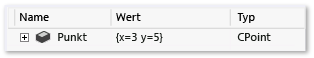  
  
 Im `DisplayString` -Ausdruck befinden sich `x` und `y`, die Member von `CPoint`sind, in geschweiften Klammern, sodass ihre Werte ausgewertet werden. Der Ausdruck zeigt auch, wie eine geschweifte Klammer mit doppelten geschweiften Klammern ( `{{` oder `}}` ) mit Escapezeichen versehen werden kann.  
  
> [!NOTE]
>  Das `DisplayString` -Element ist das einzige Element, das beliebige Zeichenfolgen und die Syntax mit geschweiften Klammern akzeptiert. Alle anderen Visualisierungselemente akzeptieren nur Ausdrücke, die vom Debugger ausgewertet werden.  
  
###  <a name="BKMK_StringView"></a> StringView-Element  
 Das `StringView` -Element definiert den Ausdruck, dessen Wert an die integrierte Text-Schnellansicht gesendet wird. Angenommen, es gibt beispielsweise die folgende Visualisierung für den `ATL::CStringT` -Typ:  
  
```xml
<Type Name="ATL::CStringT&lt;wchar_t,*&gt;">  
  <DisplayString>{m_pszData,su}</DisplayString>  
</Type>
```  
  
 Die Visualisierung zeigt ein `CStringT` -Objekt in einem Variablenfenster wie folgt an:   
  
 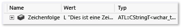  
  
 Hinzufügen einer `StringView` Element der Debugger zeigt an, dass dieser Wert durch eine textvisualisierung angezeigt werden kann:  
  
```xml
<Type Name="ATL::CStringT&lt;wchar_t,*&gt;">
  <DisplayString>{m_pszData,su}</DisplayString>  
  <StringView>m_pszData,su</StringView>  
</Type>  
```  
  
 Beachten Sie das Lupensymbol, das neben dem unten stehenden Wert angezeigt wird. Durch Auswahl des Symbols startet die Text-Schnellansicht der der Zeichenfolge angezeigt wird, die `m_pszData` verweist auf.  
  
 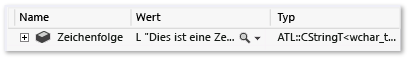  
  
> [!NOTE]
>  Beachten Sie, dass der `{m_pszData,su}` -Ausdruck den C++-Formatbezeichner `su` enthält, um den Wert als Unicode-Zeichenfolge anzuzeigen. Weitere Informationen finden Sie unter [Format Specifiers in C++](../debugger/format-specifiers-in-cpp.md) .  
  
###  <a name="BKMK_Expand"></a> Expand  
 Der `Expand` -Knoten wird verwendet, um die untergeordneten Elemente des Schnellansichtstyps anzupassen, wenn der Benutzer diesen in den Variablenfenstern erweitert. Er akzeptiert eine Liste untergeordneter Knoten, die die untergeordneten Elemente definieren.  
  
 Der `Expand` -Knoten ist optional.  
  
-   Wenn ein `Expand` -Knoten nicht angegeben ist in einem visualisierungseintrag Standard-Erweiterungsregeln von Visual Studio verwendet werden.  
  
-   Wenn ein `Expand` angegeben Knoten ohne untergeordnete Knoten, der Typ nicht in den Debuggerfenstern erweitert werden.  
  
####  <a name="BKMK_Item_expansion"></a> Item-Erweiterung  
 Das `Item` -Element ist das einfachste und häufigste Element in einem `Expand` -Knoten. Das`Item` -Element definiert ein einzelnes untergeordnetes Element. Angenommen, Sie haben beispielsweise eine `CRect` -Klasse mit `top`, `left`, `right`und `bottom` als dessen Felder und den folgenden Visualisierungseintrag:  
  
```xml
<Type Name="CRect">  
  <DisplayString>{{top={top} bottom={bottom} left={left} right={right}}}</DisplayString>  
  <Expand>  
    <Item Name="Width">right - left</Item>  
    <Item Name="Height">bottom - top</Item>  
  </Expand>  
</Type>  
  
```  
  
 Der `CRect` -Typ sieht wie folgt aus:  
  
 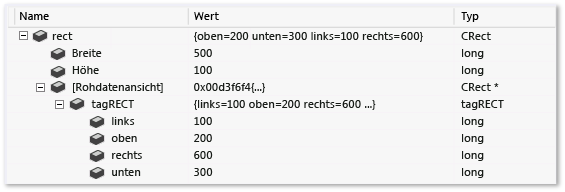  
  
 Die Ausdrücke, die in den `Width` - und `Height` -Elementen angegeben werden, werden in der Wertspalte ausgewertet und angezeigt. Der `[Raw View]` -Knoten wird automatisch vom Debugger erstellt, sobald eine benutzerdefinierte Erweiterung verwendet wird. Er wird im oben dargestellten Screenshot erweitert, um anzuzeigen, wie die Rohdatenansicht des Objekts sich von der Visualisierung unterscheidet. Mit der Visual Studio-Standarderweiterung werden eine Teilstruktur für die Basisklasse erstellt und alle Datenmember der Basisklasse als untergeordnete Elemente aufgeführt.  
  
> [!NOTE]
>  Wenn der Ausdruck des Item-Elements auf einen komplexen Typ weist, ist der `Item` -Knoten selbst erweiterbar.  
  
####  <a name="BKMK_ArrayItems_expansion"></a> ArrayItems expansion  
 Verwenden Sie den `ArrayItems` -Knoten, damit der Visual Studio-Debugger den Typ als Array interpretieren und die einzelnen Elemente anzeigen kann. Die Visualisierung für `std::vector` ist ein gutes Beispiel:  
  
```xml
<Type Name="std::vector&lt;*&gt;">  
  <DisplayString>{{size = {_Mylast - _Myfirst}}}</DisplayString>  
  <Expand>  
    <Item Name="[size]">_Mylast - _Myfirst</Item>  
    <Item Name="[capacity]">(_Myend - _Myfirst)</Item>  
    <ArrayItems>  
      <Size>_Mylast - _Myfirst</Size>  
      <ValuePointer>_Myfirst</ValuePointer>  
    </ArrayItems>  
  </Expand>  
</Type>  
```  
  
 Im `std::vector` -Knoten werden die einzelnen Elemente angezeigt, wenn sie im Variablenfenster erweitert werden:  
  
 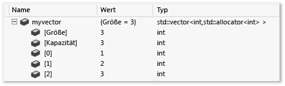  
  
 Der `ArrayItems` -Knoten muss mindestens über Folgendes verfügen:  
  
1.  Einen `Size` -Ausdruck (der als ganze Zahl ausgewertet werden muss), damit der Debugger die Länge des Arrays kennt  
  
2.  Einen `ValuePointer` -Ausdruck, der auf das erste Element verweisen sollte (das ein Zeiger eines Elementtyps sein muss, der nicht `void*`ist).  
  
 Der Standardwert mit der Arrayuntergrenze lautet „0“. Der Wert kann durch Verwendung eines `LowerBound` -Elements überschrieben werden. (Beispiele finden Sie in den Natvis-Dateien, die mit Visual Studio bereitgestellt werden.)  
  
 Sie können nun den `[]` -Operator mit einer `ArrayItems` -Erweiterung verwenden, beispielsweise `vector[i]`. Der []-Operator kann mit jeder beliebigen Visualisierung eines eindimensionalem Arrays verwendet werden, das `ArrayItems` oder `IndexListItems`verwendet, und zwar selbst dann, wenn der Typ an sich diesen Operator nicht erlaubt (beispielsweise `CATLArray`).  
  
 Mehrdimensionale Arrays können ebenfalls angegeben werden. Der Debugger benötigt nur etwas mehr Informationen ordnungsgemäß für die untergeordneten Elemente unter diesen Umständen angezeigt:  
  
```xml
<Type Name="Concurrency::array&lt;*,*&gt;">  
  <DisplayString>extent = {_M_extent}</DisplayString>  
  <Expand>  
    <Item Name="extent">_M_extent</Item>  
    <ArrayItems Condition="_M_buffer_descriptor._M_data_ptr != 0">  
      <Direction>Forward</Direction>  
      <Rank>$T2</Rank>  
      <Size>_M_extent._M_base[$i]</Size>  
      <ValuePointer>($T1*) _M_buffer_descriptor._M_data_ptr</ValuePointer>  
    </ArrayItems>  
  </Expand>  
</Type>  
```  
  
 `Direction` gibt an, ob das Array in zeilengerichteter oder spaltengerichteter Reihenfolge angegeben ist. `Rank` gibt den Rang des Arrays an. Die `Size` -Element akzeptiert den impliziten `$i` -Parameter, der durch den Index für die Dimension, die Länge des Arrays in dieser Dimension festzustellen dimensionsindex ersetzt wird. Im vorherigen Beispiel sollte über dem `_M_extent.M_base[0]` -Ausdruck die Länge der nullten Dimension `_M_extent._M_base[1]` , der ersten Dimension usw. angegeben sein.  
  
 Hier wird gezeigt, wie es ein zweidimensionales `Concurrency::array` Objekt im Debugger dargestellt:  
  
 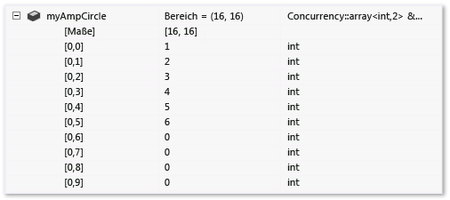  
  
####  <a name="BKMK_IndexListItems_expansion"></a> IndexListItems-Erweiterung  
 Sie können die `ArrayItems` -Erweiterung nur dann verwenden, wenn die Arrayelemente im Arbeitsspeicher zusammenhängend angeordnet sind. Der Debugger erreicht das nächste Element, indem einfach der Zeiger auf das aktuelle Element erhöht wird. Für die Fälle, bei denen der Index für Wertknoten bearbeitet werden muss, können Sie die `IndexListItems` -Knoten verwenden. Im folgenden ist eine Visualisierung mithilfe `IndexListItems` Knoten:  
  
```xml
<Type Name="Concurrency::multi_link_registry&lt;*&gt;">  
  <DisplayString>{{size = {_M_vector._M_index}}}</DisplayString>  
  <Expand>  
    <Item Name="[size]">_M_vector._M_index</Item>  
    <IndexListItems>  
      <Size>_M_vector._M_index</Size>  
      <ValueNode>*(_M_vector._M_array[$i])</ValueNode>  
    </IndexListItems>  
  </Expand>  
</Type>  
```  
  
 Sie können nun den `[]` -Operator mit einer `IndexListItems` -Erweiterung verwenden, beispielsweise `vector[i]`. Der `[]` -Operator kann mit jeder beliebigen Visualisierung eines eindimensionalem Arrays verwendet werden, das `ArrayItems` oder `IndexListItems`verwendet, und zwar selbst dann, wenn der Typ an sich diesen Operator nicht erlaubt (beispielsweise `CATLArray`).  
  
 Der einzige Unterschied zwischen `ArrayItems` und `IndexListItems` besteht darin, dass `ValueNode` den vollständigen Ausdruck für das i<sup>th</sup> -Element mit dem impliziten `$i` -Parameter erwartet.  
  
####  <a name="BKMK_LinkedListItems_expansion"></a> LinkedListItems-Erweiterung  
 Wenn der Schnellansichtstyp eine verknüpfte Liste darstellt, kann der Debugger die untergeordneten Elemente mithilfe eines `LinkedListItems` -Knotens anzeigen. Hier ist die Visualisierung für den `CAtlList` Geben Sie die Verwendung dieses Features:  
  
```xml
<Type Name="ATL::CAtlList&lt;*,*&gt;">  
  <DisplayString>{{Count = {m_nElements}}}</DisplayString>  
  <Expand>  
    <Item Name="Count">m_nElements</Item>  
    <LinkedListItems>  
      <Size>m_nElements</Size>  
      <HeadPointer>m_pHead</HeadPointer>  
      <NextPointer>m_pNext</NextPointer>  
      <ValueNode>m_element</ValueNode>  
    </LinkedListItems>  
  </Expand>  
</Type>  
```  
  
 Das `Size` -Element bezieht sich auf die Länge der Liste. `HeadPointer` zeigt auf das erste Element, `NextPointer` bezieht sich auf das nächste Element, und `ValueNode` verweist auf den Wert des Elements.  
  
-   Die `NextPointer` - und `ValueNode` -Ausdrücke werden im Kontext des verknüpften Listenknotenelements und nicht im Kontext des übergeordneten Listentyps ausgewertet. Im vorherigen Beispiel `CAtlList` verfügt über eine `CNode` Klasse (in gefunden `atlcoll.h`), die einen Knoten der verknüpften Liste darstellt. `m_pNext` und `m_element` sind Felder dieser `CNode` -Klasse und nicht der `CAtlList` -Klasse.  
  
-   Sie können `ValueNode` leer lassen oder mithilfe von `this` auf den verknüpften Listenknoten verweisen.  
  
#### <a name="customlistitems-expansion"></a>CustomListItems-Erweiterung  
 Die `CustomListItems` -Erweiterung ermöglicht Ihnen das Schreiben von benutzerdefinierter Logik für das Traversieren einer Datenstruktur, beispielsweise einer Hashtabelle. Verwenden Sie `CustomListItems` Strukturen, in denen alles, was Sie zum Auswerten benötigen, ist zum Anzeigen von Daten mithilfe von C++-Ausdrücken ausgedrückt werden kann, jedoch nicht wirklich für `ArrayItems`, `TreeItems`, oder`LinkedListItems.`  
  
 Die Schnellansicht für CAtlMap ist ein tolles Beispiel dafür, in welchen Fällen `CustomListItems` angemessen ist.  
  
```xml
<Type Name="ATL::CAtlMap&lt;*,*,*,*&gt;">  
    <AlternativeType Name="ATL::CMapToInterface&lt;*,*,*&gt;"/>  
    <AlternativeType Name="ATL::CMapToAutoPtr&lt;*,*,*&gt;"/>  
    <DisplayString>{{Count = {m_nElements}}}</DisplayString>  
    <Expand>  
      <CustomListItems MaxItemsPerView="5000" ExcludeView="Test">  
        <Variable Name="iBucket" InitialValue="-1" />  
        <Variable Name="pBucket" InitialValue="m_ppBins == nullptr ? nullptr : *m_ppBins" />  
        <Variable Name="iBucketIncrement" InitialValue="-1" />  
  
        <Size>m_nElements</Size>  
        <Exec>pBucket = nullptr</Exec>  
        <Loop>  
          <If Condition="pBucket == nullptr">  
            <Exec>iBucket++</Exec>  
            <Exec>iBucketIncrement = __findnonnull(m_ppBins + iBucket, m_nBins - iBucket)</Exec>  
            <Break Condition="iBucketIncrement == -1" />  
            <Exec>iBucket += iBucketIncrement</Exec>  
            <Exec>pBucket = m_ppBins[iBucket]</Exec>  
          </If>  
          <Item>pBucket,na</Item>  
          <Exec>pBucket = pBucket->m_pNext</Exec>  
        </Loop>  
      </CustomListItems>  
    </Expand>  
</Type>  
```  

Können Sie `Exec` zum Ausführen von Code in der eine `CustomListItems` Erweiterung mit Variablen und Objekte, die definiert, der `CustomListItems` Erweiterung. Sie können keine `Exec` auszuwertende Funktionen.

Sie können logische Operatoren, arithmetische Operatoren und Zuweisungsoperatoren mit `Exec`.

Die folgenden systeminternen Funktionen werden unterstützt:

- `strlen, wcslen, strnlen, wcsnlen, strcmp, wcscmp, _stricmp, _strcmpi, _wcsicmp, strncmp, wcsncmp, _strnicmp, _wcsnicmp, memcmp, memicmp, wmemcmp, strchr, wcschr, memchr, wmemchr, strstr, wcsstr, __log2, __findNonNull`
- `GetLastError, TlsGetValue, DecodeHString, WindowsGetStringLen, WindowsGetStringRawBuffer, WindowsCompareStringOrdinal, RoInspectCapturedStackBackTrace, CoDecodeProxy, GetEnvBlockLength, DecodeWinRTRestrictedException, DynamicMemberLookup, DecodePointer, DynamicCast`
- `ConcurrencyArray_OperatorBracket_idx // Concurrency::array<>::operator[index<>] and operator(index<>)`
- `ConcurrencyArray_OperatorBracket_int // Concurrency::array<>::operator(int, int, ...)`
- `ConcurrencyArray_OperatorBracket_tidx // Concurrency::array<>::operator[tiled_index<>] and operator(tiled_index<>)`
- `ConcurrencyArrayView_OperatorBracket_idx // Concurrency::array_view<>::operator[index<>] and operator(index<>)`
- `ConcurrencyArrayView_OperatorBracket_int // Concurrency::array_view<>::operator(int, int, ...)`
- `ConcurrencyArrayView_OperatorBracket_tidx // Concurrency::array_view<>::operator[tiled_index<>] and operator(tiled_index<>)`
- `Stdext_HashMap_Int_OperatorBracket_idx`
- `Std_UnorderedMap_Int_OperatorBracket_idx`
- `TreeTraverse_Init // Initializes a new tree traversal`
- `TreeTraverse_Next // Returns nodes in a tree`
- `TreeTraverse_Skip // Skips nodes in a pending tree traversal`
  
####  <a name="BKMK_TreeItems_expansion"></a> TreeItems-Erweiterung  
 Wenn der Schnellansichtstyp eine Struktur darstellt, kann der Debugger die Struktur durchlaufen und seine untergeordneten Elemente mithilfe eines `TreeItems` -Knotens anzeigen. Hier ist die Visualisierung für den `std::map` Geben Sie die Verwendung dieses Features:  
  
```xml
<Type Name="std::map&lt;*&gt;">  
  <DisplayString>{{size = {_Mysize}}}</DisplayString>  
  <Expand>  
    <Item Name="[size]">_Mysize</Item>  
    <Item Name="[comp]">comp</Item>  
    <TreeItems>  
      <Size>_Mysize</Size>  
      <HeadPointer>_Myhead->_Parent</HeadPointer>  
      <LeftPointer>_Left</LeftPointer>  
      <RightPointer>_Right</RightPointer>  
      <ValueNode Condition="!((bool)_Isnil)">_Myval</ValueNode>  
    </TreeItems>  
  </Expand>  
</Type>  
```  
  
 Die Syntax ähnelt der `LinkedListItems` Knoten. `LeftPointer`, `RightPointer`und `ValueNode` werden im Kontext der Strukturknotenklasse ausgewertet, und `ValueNode` können leer gelassen werden oder `this` aufweisen, um auf den Strukturknoten selbst zu verweisen.  
  
####  <a name="BKMK_ExpandedItem_expansion"></a> ExpandedItem-Erweiterung  
 Das `ExpandedItem` -Element kann verwendet werden, um eine aggregierte untergeordnete Ansicht zu generieren, indem die Eigenschaften von Basisklassen oder Datenmembern so angezeigt werden, als ob sie untergeordnete Elemente des Schnellansichtstyps wären. Der angegebene Ausdruck wird ausgewertet, und die untergeordneten Knoten des Ergebnisses werden an die untergeordnete Liste des Schnellansichtstyps angefügt. Nehmen wir beispielsweise an, wir haben einen intelligenten Zeigertyp `auto_ptr<vector<int>>`, der in der Regel als angezeigt:  
  
 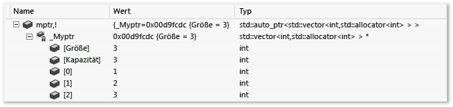  
  
 Um die Werte des Vektors anzuzeigen, müssen Sie im Variablenfenster einen Drilldown über zwei Ebenen durch den _Myptr-Member ausführen. Durch Hinzufügen eines `ExpandedItem` -Elements können Sie die `_Myptr` -Variable aus der Hierarchie ausschließen und die Vektorelemente direkt anzeigen:  
  
```xml
<Type Name="std::auto_ptr&lt;*&gt;">  
  <DisplayString>auto_ptr {*_Myptr}</DisplayString>  
  <Expand>  
    <ExpandedItem>_Myptr</ExpandedItem>  
  </Expand>  
</Type>  
```  
  
 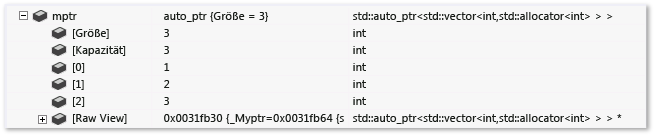  
  
 Im folgende Beispiel wird gezeigt, wie Eigenschaften der Basisklasse in einer abgeleiteten Klasse zusammengefasst werden. Angenommen, die `CPanel` -Klasse wird von `CFrameworkElement`abgeleitet. Anstatt die Eigenschaften zu wiederholen, die von der `CFrameworkElement` -Basisklasse stammen, ermöglicht der `ExpandedItem` -Knoten das Anfügen dieser Eigenschaften an die untergeordnete Liste der `CPanel` -Klasse. Die **Nd** Formatbezeichner, der Visualisierung Abgleich für die abgeleitete Klasse deaktiviert werden, ist hier erforderlich. Andernfalls, den Ausdruck `*(CFrameworkElement*)this` bewirkt, dass die `CPanel` Visualisierung erneut angewendet werden, da der standardmäßige visualisierungstypenabstimmung halten es für geeignetste. Mithilfe der **Nd** -Formatbezeichner weist den Debugger an die basisklassenvisualisierung oder die basisklassenstandarderweiterung zu verwenden, wenn die Basisklasse keine Visualisierung nicht.  
  
```xml
<Type Name="CPanel">  
  <DisplayString>{{Name = {*(m_pstrName)}}}</DisplayString>  
  <Expand>  
    <Item Name="IsItemsHost">(bool)m_bItemsHost</Item>  
    <ExpandedItem>*(CFrameworkElement*)this,nd</ExpandedItem>  
  </Expand>  
</Type>  
```  
  
####  <a name="BKMK_Synthetic_Item_expansion"></a> Synthetische Item-Erweiterung  
 Wen das `ExpandedItem` -Element eine flachere Datenansicht durch die Beseitigung von Hierarchien bereitstellt, bewirkt der `Synthetic` -Knoten das Gegenteil. Er ermöglicht es Ihnen, ein künstliches untergeordnetes Element zu erstellen (d. h. ein untergeordnetes Element, das kein Ergebnis eines Ausdrucks ist). Das untergeordnete Element kann eigene untergeordnete Elemente enthalten. Im folgenden Beispiel verwendet die Visualisierung für den `Concurrency::array` -Typ einen `Synthetic` -Knoten, um dem Benutzer eine Diagnosemeldung anzuzeigen:  
  
```xml
<Type Name="Concurrency::array&lt;*,*&gt;">  
  <DisplayString>extent = {_M_extent}</DisplayString>  
  <Expand>  
    <Item Name="extent" Condition="_M_buffer_descriptor._M_data_ptr == 0">_M_extent</Item>  
    <ArrayItems Condition="_M_buffer_descriptor._M_data_ptr != 0">  
      <Rank>$T2</Rank>  
      <Size>_M_extent._M_base[$i]</Size>  
      <ValuePointer>($T1*) _M_buffer_descriptor._M_data_ptr</ValuePointer>  
    </ArrayItems>  
    <Synthetic Name="Array" Condition="_M_buffer_descriptor._M_data_ptr == 0">  
      <DisplayString>Array members can be viewed only under the GPU debugger</DisplayString>  
    </Synthetic>  
  </Expand>  
</Type>  
  
```  
  
 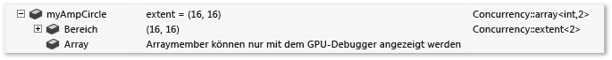  
  
###  <a name="BKMK_HResult"></a> HResult  
 Das `HResult` -Element ermöglicht Ihnen die Anpassung der Informationen, die für ein HRESULT-Element in den Debuggerfenstern angezeigt werden. Das `HRValue` -Element muss den 32-Bit-Wert des anzupassenden HRESULT-Elements enthalten. Das `HRDescription` -Element enthält Informationen, die im Debugger angezeigt werden.  
  
```  
  
<HResult Name="MY_E_COLLECTION_NOELEMENTS">  
  <HRValue>0xABC0123</HRValue>  
  <HRDescription>No elements in the collection.</HRDescription>  
</HResult>  
```  
  
###  <a name="BKMK_UIVisualizer"></a> UIVisualizer  
 Ein `UIVisualizer` -Element registriert ein grafisches Schnellansichts-Plug-In mit dem Debugger. Ein Schnellansichts-Plug-In erstellt ein Dialogfeld oder eine andere Benutzeroberfläche, um eine Variable oder ein Objekt auf eine Art anzuzeigen, die für den Datentyp geeignet ist. Das Schnellansichts-Plug-In muss als [VSPackage](../extensibility/internals/vspackages.md) erstellt werden und einen Dienst verfügbar machen, der vom Debugger verwendet werden kann. Die Natvis-Datei enthält Registrierungsinformationen für das Plug-In, z. B. den Namen, die GUID des verfügbar gemachten Diensts und auch die Typen, die sie visualisieren kann.  
  
 Im Folgenden ist ein Beispiel eines UIVisualizer-Elements angegeben:  
  
```xml
<?xml version="1.0" encoding="utf-8"?>  
<AutoVisualizer xmlns="http://schemas.microsoft.com/vstudio/debugger/natvis/2010">  
    <UIVisualizer ServiceId="{5452AFEA-3DF6-46BB-9177-C0B08F318025}"   
        Id="1" MenuName="Vector Visualizer"/>  
    <UIVisualizer ServiceId="{5452AFEA-3DF6-46BB-9177-C0B08F318025}"   
        Id="2" MenuName="List Visualizer"/>  
.  
.  
</AutoVisualizer>  
```  
  
 Ein `UIVisualizer` -Element wird durch das Attriputpaar `ServiceId` - `Id` identifiziert. `ServiceId` ist die GUID des Diensts, der vom Schnellansichtspaket verfügbar gemacht wird. `Id` ist ein eindeutiger Bezeichner, der zur Unterscheidung von Schnellansichten verwendet werden kann, wenn ein Dienst mehrere Schnellansichten bereitstellt. Im oben genannten Beispiel stellt der gleiche Schnellansichtsdienst zwei Schnellansichten bereit.  
  
 Das `MenuName` -Attribut wird den Benutzern als Namen der Schnellansicht angezeigt, wenn sie das Dropdownmenü neben dem Lupensymbol in den Debuggervariablenfenstern öffnen. Beispiel:  
  
 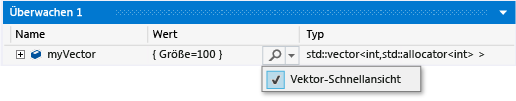  
  
 Alle Typen, die in der Natvis-Datei definiert sind, müssen die Benutzeroberflächenschnellansichten explizit auflisten, die sie anzeigen können. Der Debugger passt die Schnellansichtsverweise in den Typeinträgen an, um die Typen mit den registrierten Schnellansichten abzugleichen. Beispielsweise der folgenden typeintrag für `std::vector` verweist auf das uivisualizer-Element im vorherigen Beispiel.  
  
```xml
<Type Name="std::vector&lt;int,*&gt;">  
  <UIVisualizer ServiceId="{5452AFEA-3DF6-46BB-9177-C0B08F318025}" Id="1" />  
</Type>  
```  
  
 Ein Beispiel für Benutzeroberflächenschnellansichten (UIVisualizer) finden Sie in der Image Watch-Erweiterung, die zum Anzeigen von Bitmaps im Speicher verwendet wird: [ImageWatch](https://visualstudiogallery.msdn.microsoft.com/e682d542-7ef3-402c-b857-bbfba714f78d)  
  
### <a name="customvisualizer-element"></a>CustomVisualizer-Element  
 `CustomVisualizer` ist ein Erweiterungspunkt. Er gibt eine VSIX-Erweiterung an, die Sie schreiben können, um die Visualisierung im Code zu steuern, der in Visual Studio ausgeführt wird. Weitere Informationen zum Schreiben von VSIX-Erweiterungen finden Sie unter [Visual Studio SDK](../extensibility/visual-studio-sdk.md). Eine benutzerdefinierte Schnellansicht zu schreiben ist viel aufwendiger als das Schreiben einer XML-Natvis-Definition, Sie sind jedoch frei von Einschränkungen zu was Natvis unterstützt und nicht unterstützt. Benutzerdefinierte Schnellansichten verfügen über Zugriff auf den vollständigen Satz der Debugger-Erweiterbarkeits-APIs. Diese können zum Abfragen und Ändern des debuggenden Prozesses oder zum Kommunizieren mit anderen Bestandteilen von Visual Studio verwendet werden.  
  
 Sie können die Attribute `Condition`, `IncludeView`und `ExcludeView` für „CustomVisualizer“-Elemente verwenden.