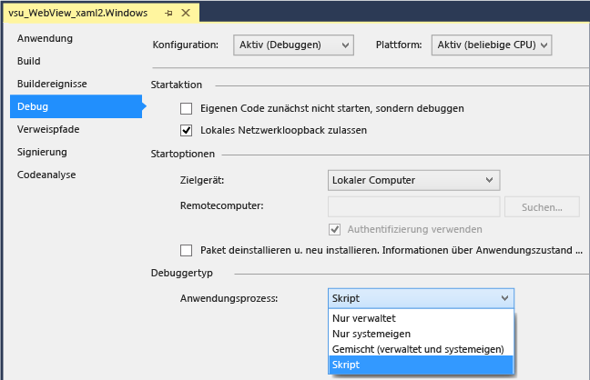
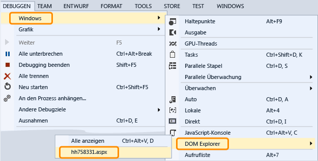

# Debuggen eines WebView-Steuerelements in einer UWP-App

 Um `WebView`-Steuerelemente in einer Windows-Runtime-App zu überprüfen und zu debuggen, können Sie Visual Studio so konfigurieren, dass es den Skriptdebugger anfügt, wenn Sie Ihre App starten. Sie haben zwei Möglichkeiten für die Interaktion mit `WebView` steuert, mit dem Debugger:

-   Öffnen Sie [DOM Explorer](../debugger/quickstart-debug-html-and-css.md) für eine `WebView`-Instanz, und prüfen Sie DOM-Elemente, untersuchen Sie CSS-Formatvorlagenprobleme und testen Sie dynamisch gerenderte Änderungen an Formatvorlagen.

-   Wählen Sie die Webseite oder den `iFrame`, die in der `WebView`-Instanz angezeigt werden, als Ziel im [JavaScript-Konsolenfenster](../debugger/javascript-console-commands.md), und interagieren Sie dann über Konsolenbefehle mit der Webseite. Die Konsole bietet Zugriff auf den aktuellen Skriptausführungskontext.

### Anfügen des Debuggers (C#, Visual Basic, C++)

1.  In Visual Studio: Fügen Sie ein `WebView`-Steuerelement an Ihre Windows-Runtime-App an.

2.  Im Projektmappen-Explorer: Öffnen Sie die Eigenschaften für das Projekt, indem Sie im Kontextmenü die Option **Eigenschaften** auswählen.

3.  Wählen Sie **Debuggen** aus. Wählen Sie in der Liste **Anwendungsprozesse** die Option **Skript**.

     

4.  (Optional) Für Nicht-Express-Versionen von Visual Studio: Deaktivieren Sie das Just-in-time-Debuggen (JIT), indem Sie **Extras > Optionen > Debuggen > Just-In-Time** auswählen und dann das JIT-Debuggen für Skript deaktivieren.

    > [!NOTE]
    >  Indem Sie das JIT-Debuggen deaktivieren, können Sie Dialogfelder für unbehandelte Ausnahmen ausblenden, die auf einigen Webseiten auftreten. In Visual Studio Express ist das JIT-Debuggen stets deaktiviert.

5.  Drücken Sie die Taste F5, um mit dem Debuggen zu beginnen.

### Verwenden des DOM Explorers, um ein WebView-Steuerelement zu untersuchen und zu debuggen

1.  (C#, Visual Basic, C++) Fügen Sie den Skriptdebugger an Ihre App an. Die Anleitung dazu finden Sie im ersten Abschnitt.

2.  Fügen Sie ein `WebView`-Steuerelement an Ihre App an, wenn Sie dies noch nicht getan haben, und drücken Sie F5, um mit dem Debuggen zu beginnen.

3.  Navigieren Sie zu der Seite, die die `Webview`-Steuerelemente enthält.

4.  Öffnen Sie das DOM Explorer-Fenster für das `WebView`-Steuerelement, indem Sie **Debuggen**, **Fenster**, **DOM Explorer** und dann die URL des zu untersuchenden `WebView`-Elements auswählen.

     

     Der mit dem `WebView` verknüpfte DOM Explorer erscheint als neue Registerkarte in Visual Studio.

5.  Anzeigen und Ändern von live-DOM-Elemente und CSS-Formatvorlagen, siehe [Debuggen von CSS-Stilen mithilfe von DOM Explorer](/visualstudio/debugger/quickstart-debug-html-and-css).

### Verwenden des JavaScript-Konsolenfensters, um ein WebView-Steuerelement zu untersuchen und zu debuggen

1.  (C#, Visual Basic, C++) Fügen Sie den Skriptdebugger an Ihre App an. Die Anleitung dazu finden Sie im ersten Abschnitt.

2.  Fügen Sie ein `WebView`-Steuerelement an Ihre App an, wenn Sie dies noch nicht getan haben, und drücken Sie F5, um mit dem Debuggen zu beginnen.

3.  Öffnen Sie das JavaScript-Konsolenfenster für das `WebView`-Steuerelement, indem Sie **Debuggen**, **Fenster**, **JavaScript-Konsole** auswählen.

     Das JavaScript-Konsolenfenster wird angezeigt.

4.  Navigieren Sie zu der Seite, die die `Webview`-Steuerelemente enthält.

5.  Wählen Sie im Konsolenfenster die Webseite oder einen `iFrame`, der durch das `WebView`-Steuerelement in der Liste **Ziele** angezeigt wird.

     

    > [!NOTE]
    >  Mithilfe der Konsole können Sie jeweils mit einem einzelnen `WebView`, `iFrame`, Freigabe-Vertrag oder Web-Worker interagieren. Jedes Element erfordert eine separate Instanz des Webplattform-Hosts (WWAHost.exe). Sie können jeweils mit einem Host interagieren.

6.  Anzeigen und Ändern von Variablen in Ihrer app aus, oder verwenden Sie Konsolenbefehle, wie in beschrieben [Schnellstart: Debuggen von JavaScript](../debugger/quickstart-debug-javascript-using-the-console.md) und [JavaScript-Konsolenbefehle](../debugger/javascript-console-commands.md).

## Siehe auch

- [Schnellstart: Debug HTML and CSS (Schnellstart: Debuggen von HTML und CSS)](../debugger/quickstart-debug-html-and-css.md)