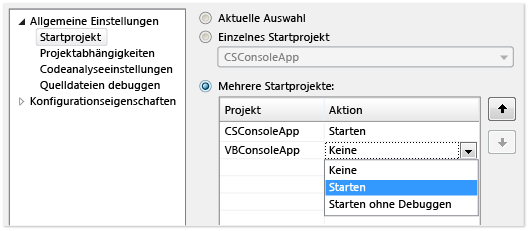
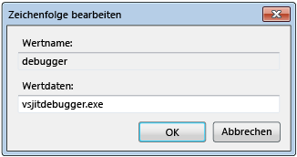
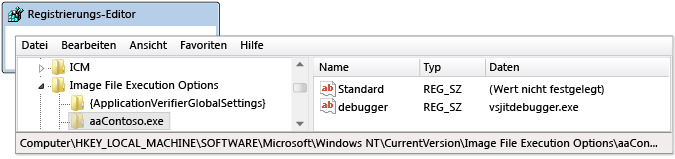
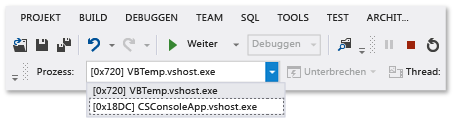
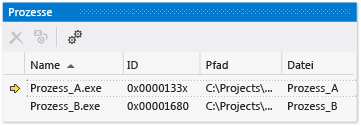

# Debuggen mehrerer Prozesse (C#, Visual Basic C++)

Eine Lösung, die über mehrere Prozesse verfügt, können von Visual Studio debuggen. Starten und Wechseln zwischen Prozessen, unterbrechen, fortsetzen, und Durchlaufen der Quelle, das Debuggen beendet und End oder Trennen von einzelnen Prozessen.

## Starten Sie das Debuggen mit mehreren Prozessen

Wenn mehr als ein Projekt in Visual Studio-Projektmappe unabhängig ausführen kann, können Sie auswählen, welches Projekt der Debugger wird gestartet. Das aktuelle Startprojekt wird im in fett formatiert **Projektmappen-Explorer**.

So ändern Sie das Startprojekt in **Projektmappen-Explorer**mit der rechten Maustaste auf ein anderes Projekt, und wählen Sie **als Startprojekt festlegen**.

So debuggen Sie ein Projekt aus **Projektmappen-Explorer** ohne dass sie das Startprojekt, mit der rechten Maustaste in des Projekts, und wählen Sie **Debuggen** > **neue Instanz starten** oder **in neue Instanz springen**.

**So legen Sie die Startup-Projekt oder mehrere Projekte aus Projektmappe Eigenschaften fest:**

1. Wählen Sie die Projektmappe in **Projektmappen-Explorer** und wählen Sie dann die **Eigenschaften** Symbol in der Symbolleiste oder mit der rechten Maustaste die Projektmappe, und wählen **Eigenschaften**.

1. Auf der **Eigenschaften** Seite **allgemeine Eigenschaften** > **Startprojekt**.

   

1. Wählen Sie **aktuelle Auswahl**, **einzelnes Startprojekt** und eine Projektdatei oder **mehrere Startprojekte**.

   Bei Auswahl von **mehrere Startprojekte**, können Sie die Startreihenfolge und die Aktion für jedes Projekt zu ändern: **Starten Sie**, **Starten ohne debugging**, oder **keine**.

1. Wählen Sie **übernehmen**, oder **OK** zu übernehmen und das Dialogfeld zu schließen.

###  Anfügen an einen Prozess

Der Debugger kann auch *Anfügen* in apps, die in Prozessen außerhalb von Visual Studio, einschließlich auf Remotegeräten ausgeführt. Nachdem Sie eine app anfügen, können Sie Visual Studio-Debugger verwenden. Debuggen von Features kann beschränkt sein. Es hängt ab, ob die app mit Debuginformationen erstellt wurde, ob Sie Zugriff auf den Quellcode der app haben und gibt an, ob der JIT-Compiler Debuginformationen verfolgt.

Weitere Informationen finden Sie unter [Anfügen an laufende Prozesse](../debugger/attach-to-running-processes-with-the-visual-studio-debugger.md).

**Anfügen an einen laufenden Prozess:**

1. Wählen Sie die app ausgeführt wird, **Debuggen** > **an den Prozess anhängen**.

   ")

1. In der **an den Prozess anhängen** Dialogfeld Feld, wählen Sie den Prozess aus der **verfügbare Prozesse** aus, und wählen Sie dann **Anfügen**.

>[!NOTE]
>Auch wenn sich das untergeordnete Projekt in derselben Projektmappe befindet, wird der Debugger nicht automatisch an einen untergeordneten Prozess angefügt, der durch einen debuggten Prozess gestartet wird. Um einen untergeordneten Prozess zu debuggen, an den untergeordneten Prozess angefügt werden, nachdem es gestartet wurde, oder konfigurieren Sie den Windows Registrierungs-Editor, um den untergeordneten Prozess in eine neue Instanz der Debugger zu starten.

###  Verwenden Sie den Registrierungs-Editor für den automatischen start von einem Prozess im debugger

In einigen Fällen müssen Sie den Startcode für eine app zu debuggen, die von einem anderen Prozess gestartet wird. Zu den Beispielen hierfür gehören Dienste und benutzerdefinierte Setupaktionen. Sie können den Debugger starten, und fügen automatisch an die Anwendung verwenden.

1. Führen Sie den Windows-Registrierungs-Editor zunächst *regedit.exe*.

1. Navigieren Sie im Registrierungs-Editor zu **HKEY_LOCAL_MACHINE\Software\Microsoft\Windows NT\CurrentVersion\Image File Execution Options**.

1. Wählen Sie den Ordner der Anwendung aus, die Sie im Debugger starten möchten.

   Die app als untergeordneter Ordner aufgeführt, mit der rechten Maustaste **Image File Execution Options**Option **neu** > **Schlüssel**, und geben Sie den Namen der app. Oder, mit der rechten Maustaste in des neuen Schlüssels in der Struktur der select **umbenennen**, und geben Sie dann den Namen der app.

1. Mit der rechten Maustaste in der Struktur und wählen Sie des neuen Schlüssels **neu** > **Zeichenfolgenwert**.

1. Ändern Sie den Namen des neuen Werts von **neuer Wert Nr. 1** zu `debugger`.

1. Mit der rechten Maustaste **Debugger** , und wählen Sie **ändern**.

   

1. In der **Zeichenfolge bearbeiten** (Dialogfeld), Typ `vsjitdebugger.exe` in die **Wertdaten** Feld, und wählen Sie dann **OK**.

   

##  Debuggen mit mehreren Prozessen

Debuggen einer app mit mehreren Prozessen wirkt sich auf wichtige zum schrittweisen und Fortfahren Debuggerbefehle alle Prozesse standardmäßig. Z. B. wenn ein Prozess an einem Haltepunkt angehalten wird, wird die Ausführung aller anderen Prozesse auch angehalten. Sie können dieses Standardverhalten ändern, um mehr Kontrolle über die Ziele von Ausführungsbefehlen zu erhalten.

**So ändern Sie, ob alle Prozesse angehalten werden, wenn ein Prozess anhält**

- Klicken Sie unter **Tools** (oder **Debuggen**) > **Optionen** > **Debuggen** > **Allgemein**aktivieren oder Deaktivieren der **alle Prozesse anhalten, wenn ein Prozess anhält** Kontrollkästchen.

###  Befehle für Unterbrechen, Durchlaufen und Fortsetzen

Die folgende Tabelle beschreibt die Verhalten des Debuggens Befehle, wenn die **alle Prozesse anhalten, wenn ein Prozess anhält** das Kontrollkästchen aktiviert oder deaktiviert wird:

|**Befehl**|Ausgewählt|Deaktiviert|
|-|-|-|
|**Debuggen von**  > **alle unterbrechen**|Alle Prozesse werden unterbrochen.|Alle Prozesse werden unterbrochen.|
|**Debuggen von** > **fortsetzen**|Alle Prozesse werden fortgesetzt.|Alle angehaltenen Prozesse werden fortgesetzt.|
|**Debuggen von** > **Einzelschritt**, **Prozedurschritt**, oder **Ausführen bis Rücksprung**|Alle Prozesse werden während der aktuellen Prozessschritte ausgeführt.  Anschließend werden alle Prozesse unterbrochen.|Aktuelle Prozessschritte.  Angehaltene Prozesse werden fortgesetzt.  Ausgeführte Prozesse werden fortgesetzt.|
|**Debuggen von** > **Einzelschritt in aktuellem Prozess**, **Prozedurschritt in aktuellem Prozess**, oder **Ausführen bis Rücksprung aktuellem Prozess**|Nicht zutreffend|Aktuelle Prozessschritte. Andere Prozesse behalten ihren vorhandenen Zustand bei (angehaltener Zustand oder Ausführzustand).|
|Quellcodefenster **Haltepunkt**|Alle Prozesse werden unterbrochen.|Nur der Prozess im Quellcodefenster wird unterbrochen.|
|Quellcodefenster **Ausführen bis Cursor** Das Quellcodefenster muss sich im aktuellen Prozess befinden.|Alle Prozesse werden ausgeführt, während der Prozess im Quellcodefenster bis zum Cursor ausgeführt und dann unterbrochen wird. Anschließend werden alle anderen Prozesse unterbrochen.|Der Prozess im Quellcodefenster wird bis zum Cursor ausgeführt. Andere Prozesse behalten ihren vorhandenen Zustand bei (angehaltener Zustand oder Ausführzustand).|
|**Prozesse** Fenster > **Prozess anhalten**|Nicht zutreffend|Der ausgewählte Prozess wird angehalten. Andere Prozesse behalten ihren vorhandenen Zustand bei (angehaltener Zustand oder Ausführzustand).|
|**Prozesse** Fenster > **Prozess fortsetzen**|Nicht zutreffend|Der ausgewählte Prozess wird fortgesetzt. Andere Prozesse behalten ihren vorhandenen Zustand bei (angehaltener Zustand oder Ausführzustand).|

###  Suchen der Quell- und Symboldateien (.pdb)
Um den Quellcode eines Prozesses zu navigieren, werden von der Debugger Zugriff auf die Quelldateien und Symboldateien erforderlich. Weitere Informationen finden Sie unter [Specify symbol (.pdb) and source files (Angeben von Symbol- und Quelldateien (.pdb))](../debugger/specify-symbol-dot-pdb-and-source-files-in-the-visual-studio-debugger.md).

Wenn Sie die Dateien für einen Prozess zugreifen können, können Sie navigieren, indem die **Disassembly** Fenster. Weitere Informationen finden Sie unter [Vorgehensweise: Verwenden des Disassembierungsfensters](../debugger/how-to-use-the-disassembly-window.md).

###  Wechseln zwischen Prozessen

Sie können mit mehreren Prozessen verbunden, wenn Sie Debuggen, aber nur ein Prozess im Debugger aktiv, zu jedem Zeitpunkt ist. Sie können den aktiven bzw. *aktuellen* Prozess auf der Symbolleiste **Debugspeicherort** oder im Fenster **Prozesse** festlegen. Um zwischen den Prozessen zu wechseln, müssen sich beide Prozesse im Unterbrechungsmodus befinden.

**So legen Sie den aktuellen Prozess über die Symbolleiste Debugspeicherort fest:**

1. Zum Öffnen der **Debugspeicherort** Symbolleiste wählen **Ansicht** > **Symbolleisten** > **Debugspeicherort**.

1. Während des Debuggens auf dem **Debugspeicherort** Symbolleiste wählen Sie den Prozess, die Sie als den aktuellen Prozess festlegen möchten die **Prozess** Dropdownliste.

   

**So legen Sie den aktuellen Prozess aus dem Fenster "Prozesse" fest:**

1. Zum Öffnen der **Prozesse** wählen Sie im Fenster während des Debuggens **Debuggen** > **Windows** > **Prozesse**.

1. In der **Prozesse** Fenster, den aktuellen Prozess ist durch einen gelben Pfeil gekennzeichnet. Doppelklicken Sie auf den Prozess, den Sie als aktuellen Prozess festlegen möchten.

   

Wechseln zu einem Prozess wird als der aktuelle Prozess zum Debuggen. Debugger-Fenster den Zustand für den aktuellen Prozess anzuzeigen und steppingbefehle beeinflussen nur den aktuellen Prozess.

## Beenden des Debuggens mit mehreren Prozessen

Wenn Sie auswählen, wird standardmäßig **Debuggen** > **Debuggen beenden**, der Debugger beendet oder wird von allen Prozessen getrennt.

- Wenn der aktuelle Prozess im Debugger gestartet wurde, wird der Prozess beendet.

- Wenn der Debugger an den aktuellen Prozess angefügt wurde, wird er vom Prozess getrennt. Der Prozess wird weiterhin ausgeführt.

Wenn Sie einen Prozess aus Visual Studio-Projektmappe debuggen, fügen Sie dann auf einem anderen Prozess, der bereits ausgeführt wird, und wählen Sie dann **Debuggen beenden**, wird die Debuggen-Sitzung beendet. Beendet der Prozess, der in Visual Studio gestartet wurde, während der Prozess, dem Sie angefügt ausgeführt wird weiterhin.

Um zu steuern, **Debuggen beenden** wirkt sich auf einen einzelnen Prozess, der **Prozesse** Fenster mit der rechten Maustaste in eines Prozess, und aktivieren bzw. deaktivieren Sie die **getrennt werden, wenn das Debuggenbeendet** Kontrollkästchen.

>[!NOTE]
>Die **alle Prozesse anhalten, wenn ein Prozess anhält** Debugoption wirkt sich nicht, beenden, beenden und Abtrennen von Prozessen.

### Befehle für Anhalten, Beenden und Abtrennen

Die folgende Tabelle beschreibt die Verhalten der der Debugger beenden, beenden und Abtrennen von Befehlen mit mehreren Prozessen:

|**Befehl**|**Beschreibung**|
|-|-|
|**Debuggen von** > **Beenden des Debuggens**|Es sei denn, das Verhalten, in geändert wird der **Prozesse** , vom Debugger gestarteten Prozesse werden beendet, und angefügte Prozesse getrennt sind.|
|**Debuggen von** > **alle beenden**|Alle Prozesse werden beendet.|
|**Debuggen von** > **Debuggen**|Der Debugger wird von allen Prozessen getrennt.|
|**Prozesse** Fenster > **Prozess abtrennen**|Der Debugger wird vom ausgewählten Prozess getrennt. Andere Prozesse behalten ihren vorhandenen Zustand bei (angehaltener Zustand oder Ausführzustand).|
|**Prozesse** Fenster > **Prozess beenden**|Der ausgewählte Prozess wird beendet. Andere Prozesse behalten ihren vorhandenen Zustand bei (angehaltener Zustand oder Ausführzustand).|
|**Prozesse** Fenster > **nach Beenden des Debuggings trennen**|Wenn ausgewählt, **Debuggen** > **Debuggen beenden** wird von den ausgewählten Prozess getrennt.  Wenn nicht ausgewählt, **Debuggen** > **Debuggen beenden** den ausgewählten Prozess beendet. |

## Siehe auch

- [Specify symbol (.pdb) and source files (Angeben von Symboldateien (PDB) und Quelldateien)](../debugger/specify-symbol-dot-pdb-and-source-files-in-the-visual-studio-debugger.md)
- [Attach to running processes (Anfügen an laufende Prozesse)](../debugger/attach-to-running-processes-with-the-visual-studio-debugger.md)
- [Navigating through code with the debugger (Navigieren im Code mit dem Debugger)](../debugger/navigating-through-code-with-the-debugger.md)
- [Just-In-Time debugging (Just-In-Time-Debuggen)](../debugger/just-in-time-debugging-in-visual-studio.md)
- [Debuggen von Multithreadanwendungen](../debugger/debug-multithreaded-applications-in-visual-studio.md)