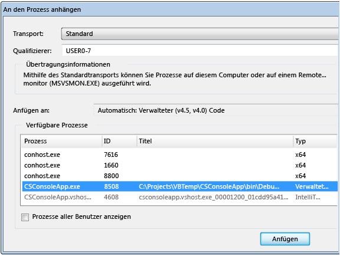

# Debuggen mehrerer Prozesse (C#, Visual Basic, C++)

Visual Studio kann eine Projektmappe mit mehreren Prozessen debuggen. Sie können beginnen und dann zwischen Prozessen wechseln, Prozesse anhalten, sie fortsetzen und die Quelle schrittweise durchlaufen, das Debuggen beenden oder einzelne Prozesse trennen.

## Starten des Debuggens mit mehreren Prozessen

Wenn mehrere Projekte in einer Visual Studio-Projektmappe unabhängig voneinander ausgeführt werden können, können Sie auswählen, welches Projekt der Debugger startet. Das aktuelle Startprojekt wird im **Projektmappen-Explorer** fett formatiert angezeigt.

Zum Ändern des Startprojekts klicken Sie im **Projektmappen-Explorer** mit der rechten Maustaste auf ein anderes Projekt und wählen dann **Als Startprojekt festlegen** aus.

Um das Debuggen eines Projekts aus dem **Projektmappen-Explorer** zu starten, ohne es zum Startprojekt zu erklären, klicken Sie mit der rechten Maustaste auf das Projekt und wählen dann **Debuggen** > **Neue Instanz starten** oder **In neue Instanz springen** aus.

**So legen Sie das Startprojekt oder mehrere Projekte über die „Eigenschaften“ des Projekts fest:**

1. Wählen Sie die Projektmappe im **Projektmappen-Explorer** aus, und wählen Sie dann auf der Symbolleiste das Symbol **Eigenschaften** aus, oder klicken Sie mit der rechten Maustaste auf die Projektmappe, und wählen Sie **Eigenschaften** aus.

1. Wählen Sie auf der Seite **Eigenschaften** **Allgemeine Eigenschaften** > **Startprojekt** aus.

   

1. Wählen Sie **Aktuelle Auswahl**, **Einzelnes Startprojekt** und eine Projektdatei oder **Mehrere Startprojekte** aus.

   Wenn Sie **Mehrere Startprojekte** auswählen, können Sie die Startreihenfolge und die auszuführende Aktion für jedes Projekt ändern: **Starten**, **Ohne Debuggen starten** oder **Keine**.

1. Wählen Sie **Anwenden** oder **OK** aus, um die Einstellung anzuwenden und das Dialogfeld zu schließen.

###  Anfügen an einen Prozess

Der Debugger kann auch an Apps *angefügt* werden, die in Prozessen außerhalb von Visual Studio ausgeführt werden, auch auf Remotegeräten. Nach dem Anfügen an eine App können Sie den Visual Studio-Debugger verwenden. Die Debugfunktionen sind möglicherweise eingeschränkt. Dies hängt davon ab, ob die App mit Debuginformationen erstellt wurde, ob Sie Zugriff auf den Quellcode der App haben und ob der JIT-Compiler Debuginformationen nachverfolgt.

Weitere Informationen finden Sie unter [Anfügen an laufende Prozesse](../debugger/attach-to-running-processes-with-the-visual-studio-debugger.md).

**Anfügen an einen laufenden Prozess:**

1. Wenn die App ausgeführt wird, wählen Sie **Debuggen** > **An Prozess anfügen** aus.

   Dialogfeld 

1. Wählen Sie den Prozess im Dialogfeld **An Prozess anfügen** in der Liste **Verfügbare Prozesse** aus, und klicken Sie dann auf **Anfügen**.

>[!NOTE]
>Auch wenn sich das untergeordnete Projekt in derselben Projektmappe befindet, wird der Debugger nicht automatisch an einen untergeordneten Prozess angefügt, der durch einen debuggten Prozess gestartet wird. Um einen untergeordneten Prozess zu debuggen, fügen Sie den Debugger nach dem Starten entweder an den untergeordneten Prozess an, oder konfigurieren Sie den Registrierungs-Editor von Windows, um den untergeordneten Prozess in einer neuen Debuggerinstanz zu starten.

###  Verwenden des Registrierungs-Editors zum automatischen Starten eines Prozesses im Debugger

In bestimmten Fällen müssen Sie möglicherweise den Startcode für eine App debuggen, die von einem anderen Prozess gestartet wird. Zu den Beispielen hierfür gehören Dienste und benutzerdefinierte Setupaktionen. Der Debugger kann gestartet und automatisch an die App angefügt werden.

1. Starten Sie den Registrierungs-Editor von Windows, indem Sie *regedit.exe*ausführen.

1. Navigieren Sie im Registrierungs-Editor zu **HKEY_LOCAL_MACHINE \SOFTWARE\Microsoft\Windows NT\CurrentVersion\Image File Execution Options**.

1. Wählen Sie den Ordner der Anwendung aus, die Sie im Debugger starten möchten.

   Wenn die App nicht als untergeordneter Ordner aufgeführt wird, klicken Sie mit der rechten Maustaste auf **Image File Execution Options**, wählen Sie **Neu** > **Schlüssel** aus, und geben Sie den Namen der App ein. Sie können auch in der Struktur mit der rechten Maustaste auf den neuen Schlüssel klicken, **Umbenennen** auswählen und dann den Namen der App eingeben.

1. Klicken Sie in der Struktur mit der rechten Maustaste auf den neuen Schlüssel, und wählen Sie **Neu** > **Zeichenfolgenwert** aus.

1. Ändern Sie den Namen des neuen Werts aus **New Value #1** in `debugger`.

1. Klicken Sie mit der rechten Maustaste auf **Debugger**, und wählen Sie dann **Ändern** aus.

   

1. Geben Sie im Dialogfeld **Zeichenfolge bearbeiten** `vsjitdebugger.exe` in das Feld **Wertdaten** ein, und klicken Sie dann auf **OK**.

   

##  Debuggen mit mehreren Prozessen

Wenn Sie eine App mit mehreren Prozessen debuggen, wirken sich die Debuggerbefehle für Anhalten, schrittweises Ausführen und Fortsetzen standardmäßig auf alle Prozesse aus. Wenn ein Prozess beispielsweise an einem Breakpoint angehalten wird, wird die Ausführung aller anderen Prozesse ebenfalls angehalten. Sie können dieses Standardverhalten ändern, um mehr Kontrolle über die Ziele von Ausführungsbefehlen zu erhalten.

**So ändern Sie, ob alle Prozesse angehalten werden, wenn ein Prozess angehalten wird:**

- Aktivieren oder deaktivieren Sie unter **Tools** (oder **Debuggen**) > **Optionen** > **Debuggen** > **Allgemein** das Kontrollkästchen **Alle Prozesse anhalten, wenn ein Prozess anhält**.

###  Befehle für Unterbrechen, Durchlaufen und Fortsetzen

In der folgenden Tabelle wird das Verhalten von Debugbefehlen beschrieben, wenn das Kontrollkästchen **Alle Prozesse anhalten, wenn ein Prozess anhält** aktiviert oder deaktiviert ist:

|**Befehl**|Ausgewählt|Deaktiviert|
|-|-|-|
|**Debuggen**  > **Alle anhalten**|Alle Prozesse werden unterbrochen.|Alle Prozesse werden unterbrochen.|
|**Debuggen** > **Fortsetzen**|Alle Prozesse werden fortgesetzt.|Alle angehaltenen Prozesse werden fortgesetzt.|
|**Debuggen** > **Einzelschritt**, **Prozedurschritt** oder **Rücksprung**|Alle Prozesse werden während der aktuellen Prozessschritte ausgeführt.  Anschließend werden alle Prozesse unterbrochen.|Aktuelle Prozessschritte.  Angehaltene Prozesse werden fortgesetzt.  Ausgeführte Prozesse werden fortgesetzt.|
|**Debuggen** > **Einzelschritt in aktuellen Prozess**, **Prozedurschritt in aktuellem Prozess** oder **Ausführen bis Rücksprung in aktuellem Prozess**|Nicht zutreffend|Aktuelle Prozessschritte. Andere Prozesse behalten ihren vorhandenen Zustand bei (angehaltener Zustand oder Ausführzustand).|
|Quellcodefenster **Breakpoint**|Alle Prozesse werden unterbrochen.|Nur der Prozess im Quellcodefenster wird unterbrochen.|
|Quellcodefenster **Ausführen bis Cursor** Das Quellcodefenster muss sich im aktuellen Prozess befinden.|Alle Prozesse werden ausgeführt, während der Prozess im Quellcodefenster bis zum Cursor ausgeführt und dann unterbrochen wird. Anschließend werden alle anderen Prozesse unterbrochen.|Der Prozess im Quellcodefenster wird bis zum Cursor ausgeführt. Andere Prozesse behalten ihren vorhandenen Zustand bei (angehaltener Zustand oder Ausführzustand).|
|Fenster **Prozesse** > **Prozess anhalten**|Nicht zutreffend|Der ausgewählte Prozess wird angehalten. Andere Prozesse behalten ihren vorhandenen Zustand bei (angehaltener Zustand oder Ausführzustand).|
|Fenster **Prozesse** > **Prozess fortsetzen**|Nicht zutreffend|Der ausgewählte Prozess wird fortgesetzt. Andere Prozesse behalten ihren vorhandenen Zustand bei (angehaltener Zustand oder Ausführzustand).|

###  Suchen der Quell- und Symboldateien (.pdb)
Um im Quellcode eines Prozesses zu navigieren, muss der Debugger Zugriff auf die Quell- und Symboldateien besitzen. Weitere Informationen finden Sie unter [Specify symbol (.pdb) and source files (Angeben von Symbol- und Quelldateien (.pdb))](../debugger/specify-symbol-dot-pdb-and-source-files-in-the-visual-studio-debugger.md).

Wenn Sie nicht auf die Dateien eines Prozesses zugreifen können, können Sie mithilfe des **Disassemblyfensters** navigieren. Weitere Informationen finden Sie unter [Vorgehensweise: Verwenden des Disassembierungsfensters](../debugger/how-to-use-the-disassembly-window.md).

###  Wechseln zwischen Prozessen

Sie können den Debugger an mehrere Prozessen anfügen, es ist jedoch jeweils nur ein Prozess im Debugger aktiv. Sie können den aktiven bzw. *aktuellen* Prozess auf der Symbolleiste **Debugspeicherort** oder im Fenster **Prozesse** festlegen. Um zwischen den Prozessen zu wechseln, müssen sich beide Prozesse im Unterbrechungsmodus befinden.

**So legen Sie den aktuellen Prozess über die Symbolleiste „Debugspeicherort“ fest:**

1. Öffnen Sie die Symbolleiste **Debugspeicherort**, indem Sie **Anzeigen** > **Symbolleisten** > **Debugspeicherort** auswählen.

1. Wählen Sie während des Debuggens auf der Symbolleiste **Debugspeicherort** in der Dropdownliste **Prozess** den Prozess aus, den Sie als aktuellen Prozess festlegen möchten.

   

**So legen Sie den aktuellen Prozess im Fenster "Prozesse" fest:**

1. Wählen Sie zum Öffnen des Fensters **Debuggen** während des Debuggens **Debuggen** > **Windows** > **Prozesse** aus.

1. Im Fenster **Prozesse** ist der aktuelle Prozess durch einen gelben Pfeil gekennzeichnet. Doppelklicken Sie auf den Prozess, den Sie als aktuellen Prozess festlegen möchten.

   

Wenn Sie zu einem Prozess wechseln, wird dieser als aktueller Prozess zum Debuggen festgelegt. In Debuggerfenstern wird der Zustand für den aktuellen Prozess angezeigt, und Schrittbefehle wirken sich nur auf den aktuellen Prozess aus.

## Beenden des Debuggens mit mehreren Prozessen

Wenn Sie **Debuggen** > **Debuggen beenden** auswählen, wird der Debugger standardmäßig beendet oder von allen Prozessen getrennt.

- Wenn der aktuelle Prozess im Debugger gestartet wurde, wird er beendet.

- Wenn der Debugger an den aktuellen Prozess angefügt wurde, wird er vom Prozess getrennt. Der Prozess wird weiterhin ausgeführt.

Wenn Sie mit dem Debuggen eines Prozesses aus einer Visual Studio-Projektmappe beginnen, den Debugger dann an einen anderen Prozess anfügen, der bereits ausgeführt wird, und dann **Debuggen beenden** auswählen, wird die Debugsitzung beendet. Der Prozess, der in Visual Studio gestartet wurde, wird beendet, während der Prozess, an den Sie den Debugger angefügt haben, weiterhin ausgeführt wird.

Um die Art und Weise zu steuern, wie sich **Debuggen beenden** auf einen einzelnen Prozess auswirkt, klicken Sie im Fenster **Prozesse** mit der rechten Maustaste auf einen Prozess, und aktivieren bzw. deaktivieren Sie dann das Kontrollkästchen **Nach Beenden des Debuggens trennen**.

>[!NOTE]
>Die Debuggeroption **Alle Prozesse anhalten, wenn ein Prozess anhält** beeinflusst nicht das Anhalten, Beenden oder Trennen von Prozessen.

### Befehle für Anhalten, Beenden und Abtrennen

In der folgenden Tabelle werden die Verhaltensweisen der Debuggerbefehle zum Anhalten, Beenden, Beenden und Trennen mit mehreren Prozessen beschrieben:

|**Befehl**|**Beschreibung**|
|-|-|
|**Debuggen** > **Debuggen beenden**|Wenn das Verhalten im Fenster **Prozesse** nicht geändert wird, werden vom Debugger gestartete Prozesse beendet, und angefügte Prozesse werden getrennt.|
|**Debuggen** > **Alle beenden**|Alle Prozesse werden beendet.|
|**Debuggen** > **Alle trennen**|Der Debugger wird von allen Prozessen getrennt.|
|Fenster **Prozesse** > **Prozess trennen**|Der Debugger wird vom ausgewählten Prozess getrennt. Andere Prozesse behalten ihren vorhandenen Zustand bei (angehaltener Zustand oder Ausführzustand).|
|Fenster **Prozesse** > **Prozess beenden**|Der ausgewählte Prozess wird beendet. Andere Prozesse behalten ihren vorhandenen Zustand bei (angehaltener Zustand oder Ausführzustand).|
|Fenster **Prozesse** > **Nach Beenden des Debuggens trennen**|Wenn diese Option aktiviert ist, trennt **Debuggen** > **Debuggen beenden** den ausgewählten Prozess.  Wenn diese Option nicht aktiviert ist, beendet **Debuggen** > **Debuggen beenden** den ausgewählten Prozess. |

## Siehe auch

- [Specify symbol (.pdb) and source files (Angeben von Symboldateien (PDB) und Quelldateien)](../debugger/specify-symbol-dot-pdb-and-source-files-in-the-visual-studio-debugger.md)
- [Attach to running processes (Anfügen an laufende Prozesse)](../debugger/attach-to-running-processes-with-the-visual-studio-debugger.md)
- [Navigating through code with the debugger (Navigieren im Code mit dem Debugger)](../debugger/navigating-through-code-with-the-debugger.md)
- [Just-In-Time debugging (Just-In-Time-Debuggen)](../debugger/just-in-time-debugging-in-visual-studio.md)
- [Debuggen von Multithreadanwendungen](../debugger/debug-multithreaded-applications-in-visual-studio.md)