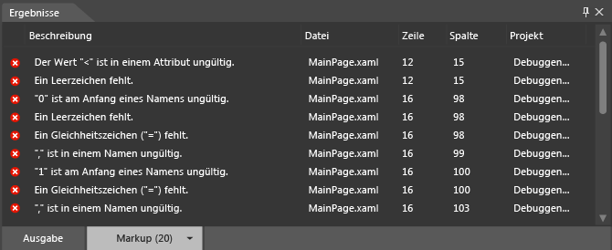
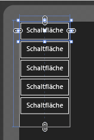

# <a name="debug-xaml-in-blend"></a>Debuggen von XAML in Blend
Verwenden Sie die Tools in [!INCLUDE[blend_first](../debugger/includes/blend_first_md.md)], um den XAML-Code in der App zu debuggen. Wenn Sie ein Projekt erstellen, werden Fehler angezeigt, der **Ergebnisse** Bereich. Doppelklicken Sie auf einen Fehler, um das dazugehörige Markup zu suchen. Wenn Sie mehr Platz zum Arbeiten benötigen, können Sie Ausblenden der **Ergebnisse** Bereich durch Drücken von F12.  
  
## <a name="syntax-errors"></a>Syntaxfehler  
 Syntaxfehler treten auf, wenn die Formatierungsregeln der Sprache im XAML-Code oder in Code-Behind-Dateien nicht befolgt werden. Die Beschreibung des Fehlers kann bei seiner Behebung hilfreich sein. In der Liste wird auch der Name der Datei und die Nummer der Zeile angegeben, in der der Fehler auftritt. Verwendung von XAML-Fehler werden auch auf die **Markup** Registerkarte der **Ergebnisse** Bereich.  
  
> [!TIP]
>  XAML ist eine XML-basierte Markupsprache, die XML-Syntaxregeln befolgt.  
  
 Es folgen einige häufige Ursachen für XAML-Syntaxfehler:  
  
-   Ein Schlüsselwort wurde falsch geschrieben, oder die Groß-/Kleinschreibung ist falsch.  
  
-   Um Attribute oder um Textzeichenfolgen fehlen Anführungszeichen.  
  
-   Für ein XAML-Element fehlt ein Endtag.  
  
-   Ein XAML-Element ist an einer Position vorhanden, an der es nicht zulässig ist.  
  
 Weitere Informationen über die allgemeine XAML-Syntax finden Sie unter [grundlegenden XAML-Syntax Handbuch](http://go.microsoft.com/fwlink/?LinkId=329942).  
  
 Sie können in [!INCLUDE[blend_subs](../debugger/includes/blend_subs_md.md)] auch einfache Code-Behind-Syntaxfehler, Kompilierungsfehler und Laufzeitfehler identifizieren und beheben. Für Code-Behind-Fehler können Sie dies allerdings möglicherweise in Visual Studio einfacher durchführen.  
  
### <a name="debugging-sample-xaml-code"></a>Debuggen von XAML-Beispielcode  
 Im folgenden Beispiel wird eine einfache XAML-Debugsitzung in [!INCLUDE[blend_subs](../debugger/includes/blend_subs_md.md)] schrittweise beschrieben.  
  
##### <a name="to-create-a-project"></a>So erstellen Sie ein Projekt  
  
1.  In [!INCLUDE[blend_subs](../debugger/includes/blend_subs_md.md)]öffnen die **Datei** Menü, und klicken Sie dann auf **neues Projekt**.  
  
     In der **neues Projekt** (Dialogfeld), eine Liste der Projekttypen angezeigt, auf der linken Seite. Wenn Sie auf einen Projekttyp klicken, werden die Projektvorlagen, die diesem Typ zugeordnet sind, auf der rechten Seite angezeigt.  
  
2.  Klicken Sie in der Liste der Projekttypen auf **universellen Windows-**.  
  
3.  Klicken Sie in der Liste der Projektvorlagen auf **leere App (universelle Windows)**.  
  
4.  In der **Namen** Textfeld `DebuggingSample`.  
  
5.  In der **Speicherort** Text Vergewissern Sie sich den Speicherort des Projekts.  
  
6.  In der **Sprache** auf **Visual C#-**, und klicken Sie dann auf **OK** zum Erstellen des Projekts.  
  
7.  Mit der rechten Maustaste auf die Entwurfsoberfläche, und klicken Sie dann auf **Quelltext anzeigen** So wechseln Sie zu **Teilung** anzeigen.  
  
8.  Kopieren Sie den folgenden Code, indem Sie auf die **Kopie** Link in der oberen rechten Ecke des Codes.  
  
    ```  
    <Grid HorizontalAlignment="Left" Height="222" VerticalAlignment="Top>  
         <Button content="Button" x:Mame="Home" HorizontalAlignment="Left" VerticalAlignment="Top"/>  
         <Button Content="Button" HorizontalAlignment="Left" VerticalAlignment="Top" Margin="0,38,0,0">  
         <Button Content="Button" HorizontalAlignment="Left" VerticalAlignment="Top" Margin="0,75,0,0"/>  
         <Button Content="Button" HorizontalAlignment="Left" VerticalAlignment="Top" Margin="0,112,0,0"/>  
         <Button Content="Button" HorizontalAlignment="Left" VerticalAlignment="Top Margin="0,149,0,0"/>  
    </Grid>  
  
    ```  
  
9. Suchen Sie das standardmäßige **Raster**, und fügen Sie den Code zwischen den öffnenden und schließenden **Raster** Tags. Anschließend sollte der Code ungefähr wie folgt aussehen:  
  
    ```  
    <Grid Background="{ThemeResource ApplicationPageBackgroundThemeBrush}">  
         <Grid HorizontalAlignment="Left" Height="222" VerticalAlignment="Top>  
              <Button content="Button" x:Mame="Home" HorizontalAlignment="Left" VerticalAlignment="Top"/>  
              <Button Content="Button" HorizontalAlignment="Left" VerticalAlignment="Top" Margin="0,38,0,0">  
              <Button Content="Button" HorizontalAlignment="Left" VerticalAlignment="Top" Margin="0,75,0,0"/>  
              <Button Content="Button" HorizontalAlignment="Left" VerticalAlignment="Top" Margin="0,112,0,0"/>  
              <Button Content="Button" HorizontalAlignment="Left" VerticalAlignment="Top Margin="0,149,0,0"/>  
         </Grid>  
    </Grid>  
  
    ```  
  
10. Drücken Sie STRG+UMSCHALT+B, um das Projekt zu erstellen.  
  
 Eine Fehlermeldung angezeigt, dass das Projekt kann nicht erstellt werden, und die **Ergebnisse** Panel, die Liste der Fehler am unteren Rand der app angezeigt wird.  
  
   
  
### <a name="resolving-xaml-errors"></a>Beheben von XAML-Fehlern  
 Wenn XAML-Fehler ermittelt werden, zeigt die Entwurfsoberfläche eine Warnung an, dass das Projekt ungültiges Markup enthält. Wie Sie die Fehler behoben haben, werden die Fehlerliste im die **Ergebnisse** Bereich aktualisiert. Wenn Sie alle Fehler behoben haben, wird die Entwurfsoberfläche aktiviert und die App wird darin angezeigt.  
  
##### <a name="to-resolve-the-xaml-errors"></a>So beheben Sie die XAML-Fehler  
  
1.  Doppelklicken Sie auf den ersten Fehler in der Fehlerliste. Die Beschreibung lautet: "Der Wert'" '<' ist in einem Attribut ungültig." Wenn Sie auf den Fehler doppelklicken, ermittelt der Zeiger die entsprechende Position im Code. `<` vor `Button` ist gültig und kein Attribut, wie in der Fehlermeldung beschrieben. Wenn Sie die vorhergehende Codezeile prüfen, stellen Sie fest, dass die schließenden Anführungszeichen für das `Top`-Attribut fehlen. Geben Sie die schließenden Anführungszeichen ein. Beachten Sie die Fehlerliste im die **Ergebnisse** Bereich aktualisiert, um die Änderungen zu reflektieren.  
  
2.  Doppelklicken Sie auf die Beschreibung "'0' ist ungültig am Anfang eines Namens." `Margin="0,149,0,0"` sieht ordnungsgemäß formatiert sein. Allerdings stimmt der Farbcode für `Margin` nicht mit den anderen Instanzen von `Margin` im Code überein. Da für das vorangehende Name-Wert-Paar die schließenden Anführungszeichen fehlen (`VerticalAlignment="Top`), wird `Margin="` als Teil des Werts des vorangehenden Attributs gelesen, und 0 wird als Anfang von einem Name-Wert-Paar gelesen. Geben Sie die schließenden Anführungszeichen für `Top` ein. In der Fehlerliste die **Ergebnisse** Bereich aktualisiert, um die Änderungen zu reflektieren.  
  
3.  Doppelklicken Sie auf den verbleibenden Fehler: „Das schließende XML-Tag 'Button' ist falsch zugeordnet.“ Der Zeiger befindet sich unter dem schließenden **Raster** Tag (`</Grid>`), vorgeschlagen, die der Fehler die `Grid` Objekt. Beachten Sie, dass das Endtag für das `Button`-Objekt fehlt. Nach dem Hinzufügen der schließenden `/`, **Ergebnisse** Liste im Bereich aktualisiert wird. Nach dem Beheben dieser Anfangsfehler wurden zwei weitere Fehler identifiziert.  
  
4.  Doppelklicken Sie auf: "Das Element 'content' wurde nicht erkannt, oder es kann nicht auf das Element zugegriffen werden." Das `c` in `content` muss groß geschrieben sein. Ersetzen Sie das klein geschriebene "c" durch ein groß geschriebenes "C".  
  
5.  Doppelklicken Sie auf "die Eigenschaft 'Mame' nicht, in vorhanden ist der"http://schemas.microsoft.com/winfx/2006/xaml"Namespace." Das "M" in "Mame" muss ein "N" sein. Ersetzen Sie das "M" durch ein "N". Da der XAML-Code jetzt verarbeitet werden kann, wird die App auf der Entwurfsoberfläche angezeigt.  
  
       
  
     Drücken Sie STRG+UMSCHALT+B, um das Projekt zu erstellen und zu bestätigen, dass es keine weiteren Fehler enthält.  
  
## <a name="debugging-in-visual-studio"></a>Debuggen in Visual Studio  
 Sie können [!INCLUDE[blend_subs](../debugger/includes/blend_subs_md.md)]-Projekte in Visual Studio öffnen, um den App-Code einfacher zu debuggen. So öffnen eine [!INCLUDE[blend_subs](../debugger/includes/blend_subs_md.md)] -Projekt in Visual Studio der rechten Maustaste auf das Projekt in der **Projekte** Bereich, und klicken Sie dann auf **in Visual Studio bearbeiten**. Wenn Sie die Debugsitzung in Visual Studio abgeschlossen haben, drücken Sie STRG+UMSCHALT+S, um sämtliche Änderungen zu speichern, und wechseln Sie anschließend zurück zu [!INCLUDE[blend_subs](../debugger/includes/blend_subs_md.md)]. Sie werden aufgefordert, das Projekt erneut zu laden. Klicken Sie auf **Ja für alle** weiterarbeiten [!INCLUDE[blend_subs](../debugger/includes/blend_subs_md.md)].  
  
 Weitere Informationen zum Debuggen von Apps finden Sie unter [Debuggen uwp-apps in Visual Studio](http://go.microsoft.com/fwlink/?LinkId=329944).  
  
## <a name="getting-help"></a>Anzeigen der Hilfe  
 Wenn Sie weitere Unterstützung zum Debuggen benötigen Ihre [!INCLUDE[blend_subs](../debugger/includes/blend_subs_md.md)] -app, die Sie Suchen der [uwp-app – Foren](http://go.microsoft.com/fwlink/?LinkId=280308) für Beiträge Problem oder eine Frage.