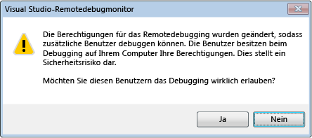

# Debuggersicherheit
Die Fähigkeit zum Debuggen eines anderen Prozesses verleiht Ihnen weitreichende Möglichkeiten, die sonst nicht zur Verfügung stehen. Dies gilt insbesondere für das Remotedebuggen. Ein bösartiger Debugger könnte sich diese Möglichkeiten zunutze machen und auf dem zu debuggenden Computer schwere Schäden verursachen.  
  
 Viele Entwickler sind sich jedoch der Tatsache nicht bewusst, dass die Sicherheit auch in entgegengesetzter Richtung bedroht werden kann. Bösartiger Code im zu debuggenden Prozess kann die Sicherheit des debuggenden Computers gefährden: Es gibt eine Reihe von Angriffsmöglichkeiten, gegen die Vorsichtsmaßnahmen zu treffen sind.  
  
## Empfohlene Vorgehensweisen bezüglich der Sicherheit  
 Zwischen dem Debugger und dem zu debuggenden Code besteht ein implizites Vertrauensverhältnis. Sie sollten ein Codefragment nur debuggen, wenn Sie auch bereit wären, es auszuführen. Die Grundfrage besteht darin, ob Sie dem zu debuggenden Code vertrauen können. Wenn Sie dem Code nicht vertrauen können, sollten Sie ihn nicht debuggen, oder Sie sollten ihn von einem Computer aus debuggen, bei dem die mögliche Gefährdung der Sicherheit kein Problem darstellt, da er sich in einer isolierten Umgebung befindet.  
  
 Um möglichst wenig Angriffsfläche zu bieten, sollte das Debuggen auf Produktionscomputern deaktiviert werden. Aus demselben Grund sollte das Debuggen niemals für unbegrenzte Zeit aktiviert werden.  
  
### Sicherheit bei verwaltetem Debuggen  
 Im Folgenden finden Sie allgemeine Empfehlungen für das verwaltete Debuggen.  
  
-   Seien Sie vorsichtig beim Anfügen an eine nicht vertrauenswürdige Benutzer Prozess: Wenn Sie dies tun, Sie davon ausgehen, dass es vertrauenswürdig ist. Wenn Sie versuchen, den Debugger an einen Prozess eines nicht vertrauenswürdigen Benutzers anzuhängen, wird ein Dialogfeld mit einer Sicherheitswarnung angezeigt, das Sie dazu auffordert, das Anhängen an den Prozess zu bestätigen. „Vertrauenswürdige Benutzer“ schließt Sie selbst und eine Reihe von Standardbenutzern ein, die üblicherweise auf Computern mit installiertem .NET Framework definiert sind, z.B. **aspnet**, **localsystem**, **networkservice**und **localservice**. Weitere Informationen finden Sie unter [Sicherheitswarnung: Anfügen an einen Prozess, der im Besitz eines nicht vertrauenswürdigen Benutzers kann riskant sein. Wenn die folgende Informationen verdächtig, oder Sie nicht sicher sind, nicht für diesen Prozess anfügen](../debugger/security-warning-attaching-to-a-process-owned-by-an-untrusted-user.md).  
  
-   Seien Sie vorsichtig, wenn Sie ein Projekt aus dem Internet herunterladen und in [!INCLUDE[vsprvs](../code-quality/includes/vsprvs_md.md)]laden. Dies ist auch ohne Debuggen sehr riskant. Indem Sie dies tun, gehen Sie davon aus, dass das Projekt und der darin enthaltene Code vertrauenswürdig sind.  
  
 Weitere Informationen finden Sie unter [Debugging Managed Code](../debugger/debugging-managed-code.md).  
  
### Sicherheit beim Remotedebuggen  
 Lokales Debuggen ist im Allgemeinen sicherer als Remotedebuggen. Beim Remotedebuggen wird eine wesentlich größere Angriffsfläche geboten, die ausgenutzt werden könnte.  
  
 Beim Remotedebuggen wird der Visual Studio-Remotedebugmonitor (msvsmon.exe) verwendet, bei dessen Konfiguration verschiedene Sicherheitsempfehlungen beachtet werden sollten. Der bevorzugte Authentifizierungsmodus ist die Windows-Authentifizierung, da der Modus Keine Authentifizierung ein Sicherheitsrisiko darstellt.  
  
   
  
 Bedenken Sie bei Verwendung des Windows-Authentifizierungsmodus, dass ein gewisses Sicherheitsrisiko vorliegt, wenn Sie einem nicht vertrauenswürdigen Benutzer die Berechtigung zur Verbindungsherstellung mit "msvsmon" gewähren, da der Benutzer sämtliche Zugriffsrechte auf den Computer erhält.  
  
 Debuggen Sie niemals einen unbekannten Prozess auf einem Remotecomputer: Es existieren verschiedene Angriffe, die den Computer beeinträchtigen können, auf dem der Debugger ausgeführt wird, oder die den Visual Studio-Remotedebugmonitor msvsmon.exe gefährden können. Wenn sich das Debuggen eines unbekannten Prozesses nicht vermeiden lässt, versuchen Sie, den Prozess lokal zu debuggen, und verwenden Sie eine Firewall, damit die Bedrohung auf den lokalen Computer beschränkt bleibt.  
  
 Weitere Informationen finden Sie unter [Remotedebuggen](../debugger/remote-debugging.md).  
  
### Sicherheit beim Debuggen von Webdiensten  
 Lokales Debuggen ist sicherer, aber häufig nicht durchführbar, da [!INCLUDE[vsprvs](../code-quality/includes/vsprvs_md.md)] wahrscheinlich nicht auf dem Webserver installiert ist. Das Debuggen von Webdiensten erfolgt außer während der Entwicklung im Allgemeinen remote. Daher gelten die Empfehlungen für die Sicherheit beim Remotedebuggen auch für das Debuggen von Webdiensten. Im Folgenden finden Sie einige zusätzlich empfohlene Vorgehensweisen. Weitere Informationen finden Sie unter [Debugging XML Web Services](http://msdn.microsoft.com/en-us/c900b137-9fbd-4f59-91b5-9c2c6ce06f00).  
  
-   Aktivieren Sie das Debuggen nicht auf einem Webserver, dessen Sicherheit gefährdet ist.  
  
-   Überprüfen Sie vor dem Debuggen die Sicherheit des Webservers. Debuggen Sie ihn nicht, wenn Sie nicht von seiner Sicherheit überzeugt sind.  
  
-   Seien Sie besonders vorsichtig, wenn Sie einen Webdienst debuggen, der vom Internet aus verfügbar ist.  
  
### Externe Komponenten  
 Beachten Sie den Vertrauenswürdigkeitsstatus externer Komponenten, mit denen das Programm interagiert. Dies ist besonders wichtig, wenn Sie den Code nicht selbst geschrieben haben. Beachten Sie dabei auch die Komponenten, die [!INCLUDE[vsprvs](../code-quality/includes/vsprvs_md.md)] oder der Debugger möglicherweise verwenden.  
  
### Symbole und Quellcode  
 Die folgenden beiden [!INCLUDE[vsprvs](../code-quality/includes/vsprvs_md.md)] -Tools erfordern ebenfalls einige Überlegungen zur Sicherheit:  
  
-   Der Quellserver, der verschiedene Versionen des Quellcodes in einem Quellcoderepository bereitstellt. Dieses Tool ist nützlich, wenn Sie nicht über die aktuelle Version des Quellcodes eines Programms verfügen. [Security Warning: Debugger Must Execute Untrusted Command](../debugger/security-warning-debugger-must-execute-untrusted-command.md).  
  
-   Der Symbolserver, der die Symbole zur Verfügung stellt, die zum Debuggen eines Absturzes während eines Systemaufrufs erforderlich sind.  
  
 Finden Sie unter [angeben von Symbol(PDB)- und Quelldateien](../debugger/specify-symbol-dot-pdb-and-source-files-in-the-visual-studio-debugger.md)  
  
## Siehe auch  
 [Debuggereinstellungen und -vorbereitung](../debugger/debugger-settings-and-preparation.md)   
 [Debugger – Grundlagen](../debugger/debugger-basics.md)   
 [Sicherheitswarnung: Das Anfügen an einen Prozess, der einem nicht vertrauenswürdigen Benutzer gehört, kann gefährlich sein. Wenn die folgende Informationen verdächtig, oder Sie nicht sicher sind, nicht für diesen Prozess anfügen](../debugger/security-warning-attaching-to-a-process-owned-by-an-untrusted-user.md)   
 [Sicherheitswarnung: Der Debugger muss diesen nicht vertrauenswürdigen Befehl ausführen](../debugger/security-warning-debugger-must-execute-untrusted-command.md)