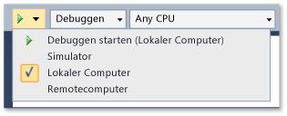
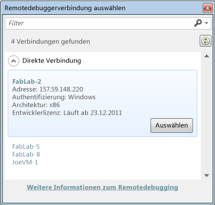
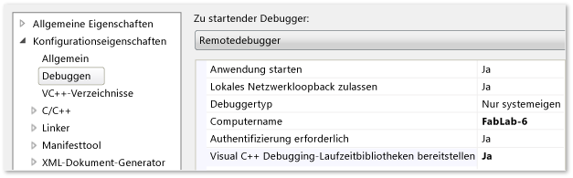
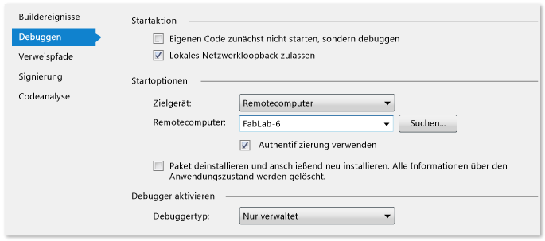

# Bereitstellen von UWP-Apps aus Visual Studio

Die Funktionen zur Bereitstellung von Visual Studio erstellt und registriert UWP-apps, die mit Visual Studio auf einem Zielgerät erstellt werden. Wie genau die App registriert wird, hängt davon ob, ob sich das Zielgerät lokal oder remote befindet:

- Handelt es sich bei dem Ziel um einen lokalen Visual Studio-Computer, registriert Visual Studio die App vom Erstellungsordner aus.

- Handelt es sich bei dem Ziel um ein Remotegerät, kopiert Visual Studio die erforderlichen Dateien auf den Remotecomputer und registriert anschließend die App auf dem Gerät.

Die Bereitstellung erfolgt automatisch, wenn Sie die App von Visual Studio aus mit der Option **Debuggen starten** (Tastatur: F5) oder der Option **Starten ohne Debuggen** (Tastatur: STRG + F5) debuggen. Sie können die App auch manuell bereitstellen. Die manuelle Bereitstellung ist in folgenden Szenarios nützlich:

- Ad-Hoc-Tests auf einem lokalen oder Remotecomputer.

- Bereitstellen einer App, die eine andere App startet, welche Sie debuggen möchten.

- Bereitstellen einer App, deren Debugging beim Start durch eine andere App oder Methode erfolgen soll.

##   Gewusst wie: Bereitstellen einer UWP-app
 Das manuelle Bereitstellen einer App ist ein einfacher Vorgang:

1.  Wenn Sie ein Remotegerät bereitstellen, geben Sie den Namen oder die IP-Adresse des Geräts auf der Projekteigenschaftenseite des Startprojekts der App an. (Die entsprechenden Schritte sind weiter unten in diesem Thema aufgelistet.)

2.  Wählen Sie auf der Debugger-Symbolleiste von Visual Studio das Bereitstellungsziel aus der Dropdownliste neben der Schaltfläche **Debuggen starten** aus.

     

3.  Klicken Sie im Menü **Erstellen** auf **Bereitstellen**.

##   Festlegen eines Remotegeräts

**Erforderliche Komponenten**

Sie müssen auf einem Windows 10-Remotegerät aktivieren [Entwicklermodus](/windows/uwp/get-started/enable-your-device-for-development). Auf Windows 10-Geräten, die mit creators Update oder höher, die Remoteserver-Verwaltungstools werden automatisch installiert, wenn Sie Ihre app bereitstellen. Weitere Informationen finden Sie unter [Debuggen eines installierten app-Pakets](../debugger/debug-installed-app-package.md).

> [!NOTE]
> Klicken Sie auf Pre-creators Update-Versionen von Windows 10 die Remotetools für Visual Studio muss auf dem Remotegerät installiert sein, und der Remotedebugger muss ausgeführt werden.

Bei der Bereitstellung wird der Remotedebugger-Netzwerkkanal verwendet, um die App-Dateien an das Remotegerät zu senden.

#### So legen Sie ein Remotegerät fest

1. Geben Sie auf der Debugeigenschaftenseite für das Startprojekt den Namen oder die IP-Adresse des Remotebereitstellungsziels an.

2. Wählen Sie zum Öffnen der Debugeigenschaftenseite das Projekt im Projektmappen-Explorer aus, und klicken Sie dann im Kontextmenü auf **Eigenschaften** .

3. Wählen Sie dann den Knoten **Debuggen** im Eigenschaftenseitenfenster aus.

4. Für **Zielgerät**Option **Remotecomputer**.

5. Klicken Sie unter **Remotecomputer**, klicken Sie auf **finden**.

6. Sie können den Namen oder die IP-Adresse des Remotegeräts eingeben oder Sie können das Gerät aus der **Remoteverbindung** Dialogfeld.

    

    Die **Remoteverbindung** Dialogfeld zeigt die Geräte im Subnetz des lokalen Netzwerks sowie solche Geräte, die durch ein Ethernetkabel direkt mit dem Visual Studio-Computer verbunden ist.

   **Angeben des Remotegeräts auf einer Visual C++-Projektseite**

   

7. Wählen Sie **Remote Debugger** in der Liste **Zu startender Debugger** aus.

8. Geben Sie den Netzwerknamen des Remotegeräts in das Feld **Computername** ein. Oder verwenden Sie den nach unten weisenden Pfeil im Feld, um das Gerät im Dialogfeld "Remotedebuggerverbindung auswählen" auszuwählen.

   **Angeben des Remotegeräts auf einer Visual C#- oder Visual Basic-Projektseite**

   

9. Wählen Sie in der Liste **Zielgerät** die Option **Remotecomputer** aus.

10. Geben Sie den Netzwerknamen des Remotegeräts in das Feld **Remotecomputer** ein oder klicken Sie auf **Suchen** , um das Gerät im Dialogfeld **Remotedebuggerverbindung auswählen** auszuwählen.

##   Bereitstellungsoptionen

Sie können die folgenden Bereitstellungsoptionen auf der Debugeigenschaftenseite für das Startprojekt festlegen.

**Netzwerkloopback zulassen**

Aus Sicherheitsgründen eine UWP oder [!INCLUDE[win8_appname_long](../debugger/includes/win8_appname_long_md.md)] im Standardverfahren installierten app ist nicht zulässig, Netzwerkaufrufe an das Gerät auszuführen, auf installiert ist. Standardmäßig wird durch die Visual Studio-Bereitstellung eine Ausnahme von dieser Regel für die bereitgestellte App erstellt. Diese Ausnahme ermöglicht das Testen von Kommunikationsverfahren auf einem einzelnen Computer. Bevor Sie die App an [!INCLUDE[win8_appstore_long](../debugger/includes/win8_appstore_long_md.md)]senden, sollten Sie die App ohne die Ausnahme testen.

So entfernen Sie die Netzwerkloopbackausnahme aus der App:

- Auf der C# und Debuggen von Visual Basic auf der Seite Deaktivieren der **Netzwerkloopback zulassen** Kontrollkästchen.

- Legen Sie auf der C++-Debug-Eigenschaft der **Netzwerkloopback zulassen** Wert **keine**.

**Nicht starten sondern Debuggen mein Code (C# und Visual Basic) / Anwendung starten (C++)**

So konfigurieren Sie den automatischen Start einer Debugsitzung beim Starten der Anwendung für die Bereitstellung:

- Auf der C# und Debuggen von Visual Basic auf der Seite überprüfen Sie die **nicht starten sondern Debuggen meinen Code** Kontrollkästchen.

- Legen Sie auf der C++-Debug-Eigenschaft der **Anwendung starten** Wert **Ja**.

## Siehe auch

- [Advanced remote deployment options (Erweiterte Optionen für die Remotebereitstellung)](/windows/uwp/debug-test-perf/deploying-and-debugging-uwp-apps#advanced-remote-deployment-options)
- [Debuggen eines installierten App-Pakets](../debugger/debug-installed-app-package.md)
- [Ausführen von Apps aus Visual Studio](/visualstudio/debugger/debugging-windows-store-and-windows-universal-apps)
