# <a name="diagnose-problems-after-deployment-using-intellitrace-c-visual-basic"></a>Diagnostizieren von Problemen nach der Bereitstellung mithilfe von IntelliTrace (C#, Visual Basic)

Um Probleme mit der Webanwendung ASP.NET nach der Bereitstellung mit IntelliTrace zu diagnostizieren, geben Sie Buildinformationen zu Ihrer Version mit an, damit Visual Studio automatisch die richtigen Quelldateien und Symboldateien findet, die für das Debuggen des IntelliTrace-Protokolls erforderlich sind.

 Wenn Sie Microsoft Monitoring Agent zur Steuerung von IntelliTrace verwenden, müssen Sie Application Performance Monitoring auf dem Webserver einrichten. Auf diese Weise werden Diagnoseereignisse beim Betrieb Ihrer App gesammelt und in einer IntelliTrace-Protokolldatei gespeichert. Anschließend können Sie die Ereignisse in Visual Studio Enterprise (nicht den Professional oder Community Editions) öffnen, zum Code springen, in dem ein Ereignis eingetreten ist, die aufgezeichneten Werte zum jeweiligen Zeitpunkt anzeigen und den ausgeführten Code vorwärts oder rückwärts durchlaufen. Nachdem Sie das Problem gefunden und behoben haben, wiederholen Sie den Zyklus zum Erstellen, Freigeben und Überwachen der Version, um zukünftige Probleme früher und schneller beheben zu können.

 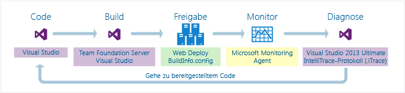

 **Sie benötigen Folgendes:**

- Visual Studio, Azure DevOps oder Team Foundation Server 2017, 2015, 2013, 2012 oder 2010 zum Erstellen Ihres Builds

- Microsoft Monitoring Agent zum Überwachen der App und zum Aufzeichnen von Diagnosedaten

- Visual Studio Enterprise (nicht Professional oder Community Editions) zum Anzeigen von Diagnosedaten und Debuggen Ihres Codes mit IntelliTrace

## <a name="SetUpBuild"></a> Schritt 1: Einschließen von Build-Informationen in Ihren Versionscode
 Richten Sie den Buildprozess ein, um eine Buildmanifestdatei (*BuildInfo.config*) für Ihr Webprojekt zu erstellen, und fügen Sie dieses Manifest in Ihre Version ein. Dieses Manifest enthält Informationen über Projekt, Quellcodeverwaltung und Buildsystem, die für die Erstellung einer bestimmten Version verwendet wurden. Mit diesen Informationen kann Visual Studio die entsprechenden Quellen und Symbole finden, nachdem Sie das IntelliTrace-Protokoll geöffnet haben, um die aufgezeichneten Ereignisse zu prüfen.

### <a name="AutomatedBuild"></a> Erstellen des Buildmanifests für einen automatischen Buildvorgang mithilfe von Team Foundation Server

 Führen Sie diese Schritte aus, egal ob Sie Team Foundation oder Git als Versionskontrolle verwenden.

#### <a name="TFS2017"></a> Azure DevOps und Team Foundation Server 2017

Visual Studio 2017 und höhere Versionen enthalten nicht die *Buildinfo.config*-Datei, die als veraltet markiert und entfernt wurde. Verwenden Sie zum Debuggen von ASP.NET-Web-Apps nach der Bereitstellung eine der folgenden Methoden:

* Verwenden Sie für die Bereitstellung in Azure [Application Insights](https://docs.microsoft.com/azure/application-insights/).

* Wenn Sie IntelliTrace verwenden müssen, öffnen Sie das Projekt in Visual Studio, und laden Sie die Symboldateien aus dem entsprechenden Build. Sie können Symboldateien aus dem Fenster **Module** oder durch Konfigurieren von Symbolen in **Extras** > **Optionen** > **Debuggen** > **Symbole** laden.

#### <a name="TFS2013"></a> Team Foundation Server 2013
 Richten Sie Ihre Buildpipeline so ein, dass sie die Speicherorte Ihrer Quellen, des Builds und der Symbole in das Buildmanifest (BuildInfo.config-Datei) schreibt. Team Foundation Build erstellt diese Datei automatisch und fügt sie in das Ausgabeverzeichnis Ihres Projekts ein.

1. [Bearbeiten Sie Ihrer erstellungspipeline, oder erstellen Sie eine neue Buildpipeline.](/azure/devops/pipelines/get-started-designer?view=vsts)

     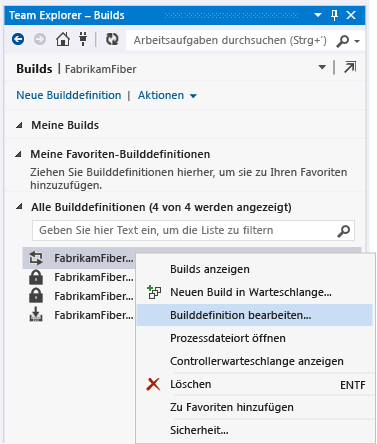

2. Wählen Sie die Standardvorlage (TfvcTemplate.12.xaml) oder eine eigene benutzerdefinierte Vorlage aus.

     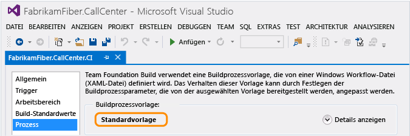

3. Geben Sie an, wo die Symboldatei (PDB) gespeichert werden soll, sodass die Quelle automatisch indiziert wird.

     Wenn Sie eine benutzerdefinierte Vorlage verwenden, vergewissern Sie sich, dass die Vorlage über eine Aktivität zum Indizieren der Quelle verfügt. Später fügen Sie ein MSBuild-Argument hinzu, um anzugeben, wo die Symboldateien gespeichert werden sollen.

     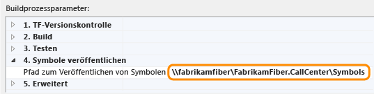

     Weitere Informationen über Symbole finden Sie unter [Veröffentlichen von Symboldaten](/azure/devops/pipelines/tasks/build/index-sources-publish-symbols?view=vsts).

4. Fügen Sie dieses MSBuild-Argument hinzu, um TFS und Symboldateispeicherorte zur Buildmanifestdatei hinzuzufügen:

     **/p:IncludeServerNameInBuildInfo=True**

     Jeder, der auf Ihren Webserver zugreifen kann, kann diese Speicherorte im Buildmanifest anzeigen. Achten Sie darauf, dass Ihr Quellserver sicher ist.

5. Wenn Sie eine benutzerdefinierte Vorlage verwenden, fügen Sie dieses MSBuild-Argument hinzu, um anzugeben, wo die Symboldatei gespeichert werden soll:

     **/p:BuildSymbolStorePath=**\<*Pfad zu Symbolen*>

     

     Fügen Sie der Webprojektdatei (CSPROJ oder VBPROJ) diese Zeilen hinzu:

    ```xml
    <!-- Import the targets file. Change the folder location as necessary. -->
       <Import Project=""$(MSBuildExtensionsPath)\Microsoft\VisualStudio\v$(VisualStudioVersion)\BuildInfo\Microsoft.VisualStudio.ReleaseManagement.BuildInfo.targets" />

    ```

     Jeder, der auf Ihren Webserver zugreifen kann, kann diese Speicherorte im Buildmanifest anzeigen. Achten Sie darauf, dass Ihr Quellserver sicher ist.

6. Führen Sie einen neuen Build aus.

    Wechseln Sie zu [Schritt 2: Veröffentlichen Ihrer Anwendung](#DeployRelease)

#### <a name="TFS2012_2010"></a> Team Foundation Server 2012 oder 2010
 Führen Sie die folgenden Schritte aus, um das Buildmanifest (BuildInfo.config) für Ihr Projekt automatisch zu erstellen und in das Ausgabeverzeichnis Ihres Projekts einzufügen. Die Datei erscheint als "*ProjektName*.BuildInfo.config" im Ausgabeverzeichnis, wird jedoch im Bereitstellungsverzeichnis als "BuildInfo.config" umbenannt, nachdem Sie Ihre App veröffentlicht haben.

1. Installieren Sie eine beliebige Edition von Visual Studio 2013 auf Ihrem Team Foundation Build-Server.

2. Geben Sie in Ihrer Buildpipeline an, wo die Symbole gespeichert werden sollen, sodass die Quelle automatisch indiziert wird.

     Wenn Sie eine benutzerdefinierte Vorlage verwenden, vergewissern Sie sich, dass die Vorlage über eine Aktivität zum Indizieren der Quelle verfügt.

3. Fügen Sie der Buildpipeline die folgenden MSBuild-Argumente hinzu:

    - **/p:VisualStudioVersion=12.0**

    - **/p:MSBuildAssemblyVersion=12.0**

    - **/tv:12.0**

    - **/p:IncludeServerNameInBuildInfo=True**

    - **/p:BuildSymbolStorePath=**\<*Pfad zu Symbolen*>

4. Führen Sie einen neuen Build aus.

    Wechseln Sie zu [Schritt 2: Veröffentlichen Ihrer Anwendung](#DeployRelease)

### <a name="ManualBuild"></a> Erstellen des Buildmanifests für einen manuellen Buildvorgang mithilfe von Visual Studio
 Führen Sie die folgenden Schritte aus, um das Buildmanifest (BuildInfo.config) für Ihr Projekt automatisch zu erstellen und in das Ausgabeverzeichnis Ihres Projekts einzufügen. Die Datei erscheint als "*ProjektName*.BuildInfo.config" im Ausgabeverzeichnis, wird jedoch im Bereitstellungsverzeichnis als "BuildInfo.config" umbenannt, nachdem Sie Ihre App veröffentlicht haben.

1. Entladen Sie das Webprojekt im **Projektmappen-Explorer**.

2. Öffnen Sie die Projektdatei (.csproj, .vbproj). Fügen Sie die folgenden Zeilen ein:

    ```xml
    <!-- **************************************************** -->
    <!-- Build info -->
    <PropertyGroup>
       <!-- Generate the BuildInfo.config file -->
       <GenerateBuildInfoConfigFile>True</GenerateBuildInfoConfigFile>
       <!-- Include server name in build info -->
       <IncludeServerNameInBuildInfo>True</IncludeServerNameInBuildInfo>
       <!-- Include the symbols path so Visual Studio can find the matching deployed code when you start debugging. -->
       <BuildSymbolStorePath><path to symbols></BuildSymbolStorePath>
    </PropertyGroup>
    <!-- **************************************************** -->
    ```

3. Checken Sie die aktualisierte Projektdatei ein.

4. Führen Sie einen neuen Build aus.

    Wechseln Sie zu [Schritt 2: Veröffentlichen Ihrer Anwendung](#DeployRelease)

### <a name="MSBuild"></a> Erstellen des Buildmanifests für einen manuellen Buildvorgang mithilfe von „MSBuild.exe“
 Fügen Sie diese Buildargumente beim Ausführen des Builds hinzu:

 **/p:GenerateBuildInfoConfigFile=True**

 **/p:IncludeServerNameInBuildInfo=True**

 **/p:BuildSymbolStorePath=**\<*Pfad zu Symbolen*>

## <a name="DeployRelease"></a> Schritt 2: Veröffentlichen Ihrer Anwendung
 Wenn Sie das [Web.Deploy-Paket](https://msdn.microsoft.com/library/dd394698.aspx) verwenden, das vom Build-Prozess zum Bereitstellen Ihrer App erstellt wurde, wird das Buildmanifest automatisch von „*Projektname*.BuildInfo.config“ zu „BuildInfo.config“ umbenannt und auf dem Webserver im gleichen Verzeichnis wie die Web.config-Datei Ihrer App abgelegt.

 Wenn Sie eine andere Methode zum Bereitstellen Ihrer App verwenden, müssen Sie sicherstellen, dass das Buildmanifest von "*ProjektName*.BuildInfo.config" zu "BuildInfo.config" umbenannt und auf dem Webserver im gleichen Verzeichnis wie die Web.config-Datei Ihrer App abgelegt wird.

## <a name="step-3-monitor-your-app"></a>Schritt 3: Überwachen Sie Ihre app
 Richten Sie Leistungsüberwachung für Ihre App auf dem Webserver ein, um Ihre App auf Probleme zu untersuchen, Diagnoseereignisse aufzuzeichnen und diese Ereignisse in einer IntelliTrace-Protokolldatei zu speichern. Siehe [Überwachen Ihrer App auf Bereitstellungsprobleme](../debugger/using-the-intellitrace-stand-alone-collector.md).

## <a name="InvestigateEvents"></a> Schritt 4: Problemsuche
 Sie benötigen Visual Studio Enterprise auf Ihrem Entwicklungscomputer oder einem anderen Computer, um die aufgezeichneten Ereignisse anzuzeigen und Ihren Code mit IntelliTrace zu debuggen. Sie können alternativ Tools wie CodeLens, IntelliTrace, Debuggerzuordnungen und Code Maps verwenden, um das Problem zu diagnostizieren.

### <a name="open-the-intellitrace-log-and-matching-solution"></a>Öffnen des IntelliTrace-Protokolls und der entsprechenden Projektmappe

1. Öffnen Sie das IntelliTrace-Protokoll (ITRACE-Datei) in Visual Studio Enterprise. Oder doppelklicken Sie einfach auf die Datei, wenn Visual Studio Enterprise auf demselben Computer installiert ist.

2. Wählen Sie **Projektmappe öffnen** aus, damit die entsprechende Projektmappe oder das Projekt automatisch in Visual Studio geöffnet wird, wenn das Projekt nicht als Teil einer Projektmappe erstellt wurde. [Frage: Im IntelliTrace-Protokoll fehlen Informationen über die bereitgestellte App. Wie konnte das geschehen? Wie gehe ich vor?](#InvalidConfigFile)

     Visual Studio legt alle ausstehenden Änderungen automatisch ab, wenn die entsprechende Projektmappe oder das Projekt geöffnet wird. Nähere Informationen zu diesem Shelvesets finden Sie im Fenster **Ausgabe** oder **Team Explorer**.

     Bevor Sie Änderungen vornehmen, sollten Sie überprüfen, ob Sie über die richtige Quelle verfügen. Wenn Sie Verzweigung verwenden kann es sein, dass die aktuelle Verzweigung von der Verzweigung abweicht, in der Visual Studio die entsprechende Quelle findet, z. B. Ihre Versionsverzweigung.

     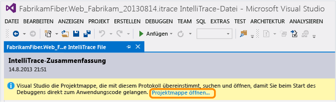

     Wenn Sie einen Arbeitsbereich zu dieser Lösung oder diesem Projekt zugeordnet haben, wählt Visual Studio diesen Arbeitsbereich aus, um die gesuchte Quelle einzufügen.

     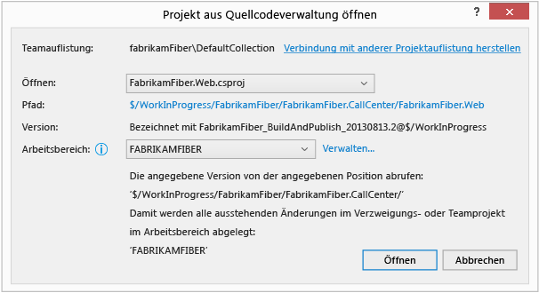

     Andernfalls wählen Sie einen anderen Arbeitsbereich aus oder erstellen Sie einen neuen Arbeitsbereich. Visual Studio ordnet diesem Arbeitsbereich die gesamte Verzweigung zu.

     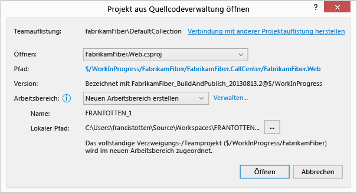

     Um einen Arbeitsbereich mit bestimmten Zuordnungen oder einen Namen zu erstellen, der nicht Ihrem Computernamen entspricht, wählen Sie **Verwalten**aus.

     [Frage: Warum meldet Visual Studio, dass mein ausgewählter Arbeitsbereich ungültig ist?](#IneligibleWorkspace)

     [Frage: Warum kann ich den Vorgang erst fortsetzen, wenn ich eine Teamauflistung oder eine andere Auflistung ausgewählt habe?](#ChooseTeamProject)

### <a name="diagnose-a-performance-problem"></a>Diagnose eines Leistungsproblems

1. Unter **Leistungsverletzungen**überprüfen Sie die aufgezeichneten Leistungsereignisse, ihre Gesamtausführungszeiten und andere Ereignisinformationen. Sehen Sie sich anschließend die Details der Methoden näher an, die während eines bestimmten Leistungsereignisses aufgerufen wurden.

     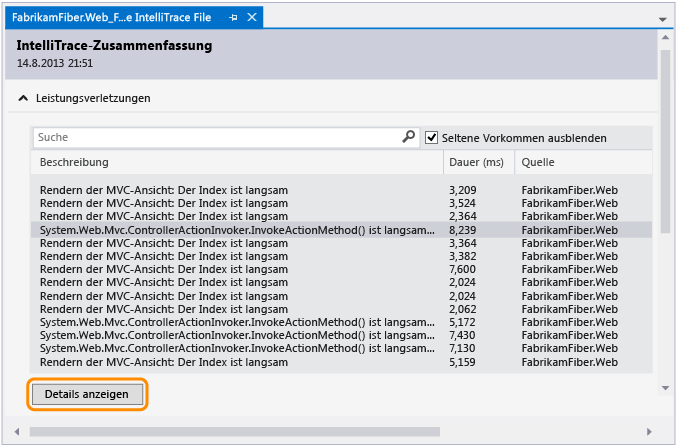

     Sie können auch einfach auf das Ereignis doppelklicken.

2. Überprüfen Sie auf der Ereignisseite die Ausführungszeiten für diese Aufrufe. Suchen Sie einen langsamen Aufruf in der Ausführungsstruktur.

     Die langsamsten Aufrufe werden in einem eigenen Bereich angezeigt, wenn Sie mehrere, geschachtelte oder andere Aufrufe haben.

     Erweitern Sie diesen Aufruf, um alle geschachtelten Aufrufe und Werte zu überprüfen, die zu diesem Zeitpunkt aufgezeichnet wurden. Starten Sie dann das Debuggen über diesen Aufruf.

     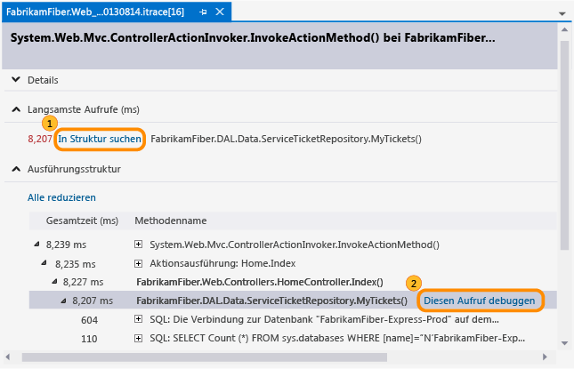

     Sie können auch einfach auf den Aufruf doppelklicken.

     Wenn die Methode in Ihrem Anwendungscode enthalten ist, wechselt Visual Studio zu dieser Methode.

     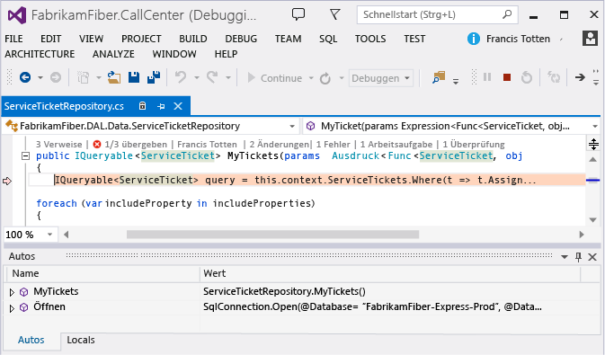

     Jetzt können Sie andere aufgezeichnete Werte und die Aufrufliste überprüfen, den Code schrittweise durchlaufen oder das Fenster **IntelliTrace** verwenden, um [sich zwischen anderen Methoden zeitlich rückwärts oder vorwärts zu bewegen](../debugger/intellitrace.md) , die während dieses Leistungsereignisses aufgerufen wurden.

    - [Was bedeuten die restlichen Ereignisse und Informationen im IntelliTrace-Protokoll?](../debugger/using-saved-intellitrace-data.md)
    - [Welche weiteren Möglichkeiten gibt es hier?](#WhatElse)
    - [Wünschen Sie weitere Informationen zu Leistungsereignissen?](https://devblogs.microsoft.com/devops/performance-details-in-intellitrace/)

### <a name="diagnose-an-exception"></a>Diagnose einer Ausnahme

1. Überprüfen Sie unter **Ausnahmedaten**die aufgezeichneten Ausnahmeereignisse, deren Typen und Meldungen und wann die Ausnahmen aufgetreten sind. Um tiefer in den Code zu vorzudringen, starten Sie das Debuggen des letzten Ereignisses in einer Gruppe von Ausnahmen.

     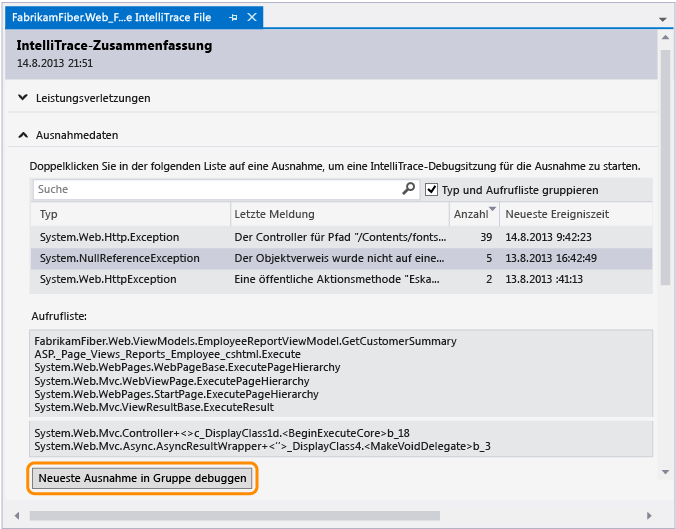

     Sie können auch einfach auf das Ereignis doppelklicken.

     Wenn die Ausnahme im Anwendungscode aufgetreten ist, wechselt Visual Studio zu der Stelle, an der die Ausnahme aufgetreten ist.

     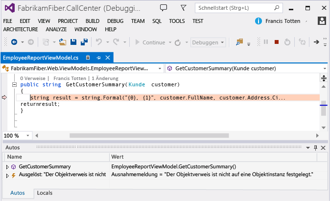

     Jetzt können Sie andere aufgezeichnete Werte und die Aufrufliste überprüfen oder das Fenster **IntelliTrace** verwenden, um [sich zwischen anderen aufgezeichneten Ereignissen](../debugger/intellitrace.md), zugehörigem Code und den Werten zu bewegen, die zu diesen Zeitpunkten erfasst wurden.

     [Was bedeuten die restlichen Ereignisse und Informationen im IntelliTrace-Protokoll?](../debugger/using-saved-intellitrace-data.md)

### <a name="WhatElse"></a> Welche weiteren Möglichkeiten gibt es hier?

- [Rufen Sie mehr Informationen zu diesem Code ab](../ide/find-code-changes-and-other-history-with-codelens.md). Um Verweise für diesen Code, dessen Änderungsverlauf und alle entsprechenden Fehler, Arbeitselemente, Codeüberprüfungsanforderungen oder Komponententests zu suchen, ohne den Editor zu verlassen, können Sie die CodeLens-Indikatoren im Editor verwenden.

     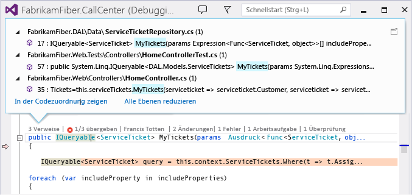

     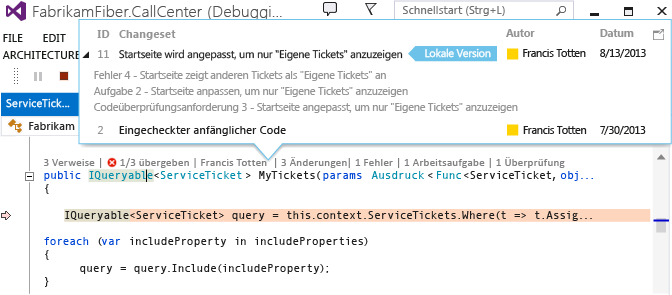

- [Ordnen Sie die Stelle im Code während des Debuggens zu.](../debugger/map-methods-on-the-call-stack-while-debugging-in-visual-studio.md) Um die Methoden, die während der Debugsitzung aufgerufen wurden, visuell nachzuverfolgen, ordnen Sie die Aufrufliste zu.

     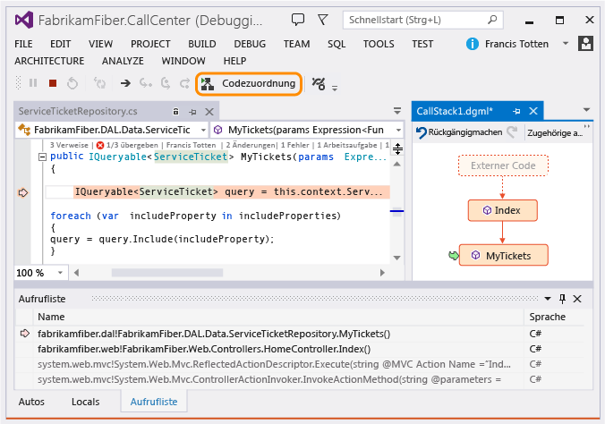

### <a name="FAQ"></a> Fragen und Antworten

#### <a name="WhyInclude"></a> Frage: Warum sollte ich Informationen über mein Projekt, die Quellcodeverwaltung, Version und Symbole in meine Version integrieren?
 Visual Studio verwendet diese Informationen, um die passende Lösung und den entsprechenden Quellcode für die Version zu finden, die Sie gerade debuggen. Nachdem Sie das IntelliTrace-Protokoll geöffnet und ein zu debuggendes Ereignis ausgewählt haben, zeigt Ihnen Visual Studio anhand der Symbole den Code, in dem das Ereignis aufgetreten ist. Anschließend können Sie die aufgezeichneten Werte anzeigen und den ausgeführten Code vorwärts und rückwärts durchlaufen.

 Falls Sie TFS verwenden und Ihr Buildmanifest (Datei „BuildInfo.config“) diese Informationen nicht enthält, sucht Visual Studio in Ihrem aktuell verbundenen TFS nach dem passenden Quellcode und den entsprechenden Symbolen. Wenn Visual Studio das korrekte TFS oder den entsprechenden Quellcode nicht findet, werden Sie aufgefordert, ein anderes TFS auszuwählen.

#### <a name="InvalidConfigFile"></a> Frage: Im IntelliTrace-Protokoll fehlen Informationen über die bereitgestellte App. Wie konnte das geschehen? Was kann ich unternehmen?
 Dies kann geschehen, wenn Sie die App von Ihrem Entwicklungscomputer bereitstellen oder bei der Bereitstellung nicht mit dem TFS verbunden sind.

1. Öffnen Sie den Bereitstellungsordner Ihres Projekts.

2. Suchen und öffnen Sie das Buildmanifest (BuildInfo.config-Datei).

3. Vergewissern Sie sich, dass die folgenden Informationen enthalten sind:

- **ProjectName**

   Der Name Ihres Projekts in Visual Studio. Zum Beispiel:

  ```xml
  <ProjectName>FabrikamFiber.Extranet.Web</ProjectName>
  ```

- **SourceControl**

- Informationen über Ihr Quellcodeverwaltungssystem und die folgenden erforderlichen Eigenschaften:

  - **TFS**

    - **ProjectCollectionUri**: Der URI für Ihren Team Foundation Server und Ihre Projektsammlung

    - **ProjectItemSpec**: Pfad zur Projektdatei Ihrer App (.csproj or .vbproj)

    - **ProjectVersionSpec**: Die Version Ihres Projekts

      Zum Beispiel:

    ```xml
    <SourceControl type="TFS">
       <TfsSourceControl>
          <ProjectCollectionUri>http://fabrikamfiber:8080/tfs/FabrikamFiber</ProjectCollectionUri>
          <ProjectItemSpec>$/WorkInProgress/FabrikamFiber/FabrikamFiber.CallCenter/FabrikamFiber.Web/FabrikamFiber.Web.csproj</ProjectItemSpec>
          <ProjectVersionSpec>LFabrikamFiber_BuildAndPublish_20130813@$/WorkInProgress</ProjectVersionSpec>
       </TfsSourceControl>
    </SourceControl>
    ```

  - **Git**

    - **GitSourceControl**: Der Speicherort des **GitSourceControl**-Schemas

    - **RepositoryUrl**: Der URI für Ihren Team Foundation Server, Ihre Projektsammlung und Ihr Git-Repository

    - **ProjectPath**: Pfad zur Projektdatei Ihrer App (.csproj or .vbproj)

    - **CommitId**: Die ID Ihres Commits

      Zum Beispiel:

    ```xml
    <SourceControl type="Git">
       <GitSourceControl xmlns="http://schemas.microsoft.com/visualstudio/deploymentevent_git/2013/09">
          <RepositoryUrl>http://gittf:8080/tfs/defaultcollection/_git/FabrikamFiber</RepositoryUrl>
          <ProjectPath>/FabrikamFiber.CallCenter/FabrikamFiber.Web/FabrikamFiber.Web.csproj</ProjectPath>
          <CommitId>50662c96502dddaae5cd5ced962d9f14ec5bc64d</CommitId>
       </GitSourceControl>
    </SourceControl>
    ```

- **Erstellen**

   Informationen über Ihr Buildsystem, entweder `"TeamBuild"` oder `"MSBuild"`, sowie die folgenden erforderlichen Eigenschaften:

  - **BuildLabel** (für TeamBuild): Buildname und -Nummer. Diese Bezeichnung wird auch als Name des Bereitstellungsereignisses verwendet. Weitere Informationen zu Buildnummern finden Sie unter [Verwenden von Buildnummern, um abgeschlossene Builds mit aussagekräftigen Namen zu versehen](/azure/devops/pipelines/build/options?view=vsts).

  - **SymbolPath** (empfohlen): Die Liste der URIs für die Orte Ihrer Symbole (PDB-Datei) getrennt durch Semikolons. Diese URIs können URLs oder Netzwerkpfade (UNC) sein. Dies erleichtert Visual Studio das Auffinden der entsprechenden Symbole zum Debuggen.

  - **BuildReportUrl** (für TeamBuild): Der Speicherort des Buildreports in TFS

  - **BuildId** (für TeamBuild): Der URI für die Builddetails in TFS. Dieser URI wird auch als ID des Bereitstellungsereignisses verwendet. Diese ID muss eindeutig sein, wenn Sie TeamBuild nicht verwenden.

  - **BuiltSolution**: Pfad zur Buildprojektmappe, die Visual Studio zum Suchen und Öffnen der entsprechenden Projektmappe verwendet. Dies ist der Inhalt der MsBuild-Eigenschaft **SolutionPath** .

    Zum Beispiel:

  - **TFS**

    ```xml
    <Build type="TeamBuild">
       <MsBuild>
          <BuildLabel kind="label">FabrikamFiber_BuildAndPublish_20130813.1</BuildLabel>
          <SymbolPath>\\fabrikamfiber\FabrikamFiber.CallCenter\Symbols</SymbolPath>
          <BuildReportUrl kind="informative, url" url="http://fabrikamfiber:8080/tfs/FabrikamFiber/_releasePipeline/FindRelease?buildUri=fabrikamfiber%3a%2f%2f%2fBuild%2fBuild%2f448">Build Report Url</BuildReportUrl>
          <BuildId kind="id">1c4444d2-518d-4673-a590-dce2773c7744,fabrikamfiber:///Build/Build/448</BuildId>
          <BuiltSolution>$/WorkInProgress/FabrikamFiber/FabrikamFiber.CallCenter/FabrikamFiber.CallCenter.sln</BuiltSolution>
       </MsBuild>
    </Build>
    ```

  - **Git**

    ```xml
    <Build type="MSBuild">
       <MSBuild>
          <SymbolPath>\\gittf\FabrikamFiber.CallCenter\Symbols</SymbolPath>
          <BuiltSolution>/FabrikamFiber.CallCenter/FabrikamFiber.CallCenter.sln</BuiltSolution>
       </MSBuild>
    </Build>
    ```

#### <a name="IneligibleWorkspace"></a> Frage: Warum meldet Visual Studio, dass mein ausgewählter Arbeitsbereich ungültig ist?
 **Antwort:** Der ausgewählte Arbeitsbereich besitzt keine Zuordnungen zwischen dem Quellverwaltungsordner und einem lokalen Ordner. Um eine Zuordnung für diesen Arbeitsbereich zu erstellen, wählen Sie **Verwalten**aus. Andernfalls wählen Sie einen bereits zugeordneten Arbeitsbereich aus oder erstellen Sie einen neuen Arbeitsbereich.

 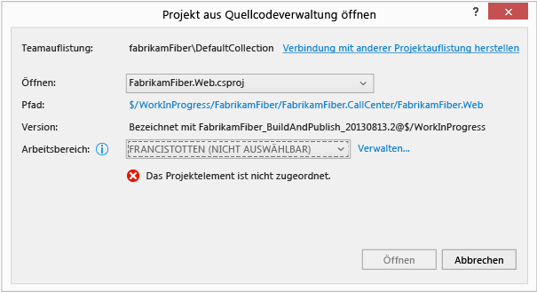

#### <a name="ChooseTeamProject"></a> Frage: Warum kann ich den Vorgang erst fortsetzen, wenn ich eine Teamauflistung oder eine andere Auflistung ausgewählt habe?
 **Antwort:** Dies kann aus folgenden Gründen der Fall sein:

- Visual Studio ist nicht mit dem TFS verbunden.

     

- Visual Studio konnte die Projektmappe oder das Projekt nicht in der aktuellen Teamauflistung finden.

     Wenn die Buildmanifestdatei (\<*ProjektName*>.BuildInfo.config) nicht angibt, wo Visual Studio die entsprechende Quelle finden kann, verwendet Visual Studio den aktuell verbundenen TFS, um die entsprechende Projektmappe oder das Projekt zu suchen. Wenn die aktuelle Teamauflistung nicht über die entsprechende Quelle verfügt, fordert Visual Studio Sie auf, eine Verbindung mit einer anderen Teamauflistung herzustellen.

- Visual Studio konnte die Projektmappe oder das Projekt nicht in der von der Buildmanifestdatei (\<*ProjektName*>.BuildInfo.config) angegeben Sammlung finden.

     Der angegebene TFS verfügt möglicherweise nicht mehr über die entsprechende Quelle oder Sie ist nicht mehr vorhanden, da Sie möglicherweise zu einem neuen TFS migriert sind. Wenn der angegebene TFS nicht vorhanden ist, kann bei Visual Studio nach etwa einer Minute ein Timeout auftreten, und Sie werden anschließend aufgefordert, eine Verbindung mit einer anderen Auflistung herzustellen. Um den Vorgang fortzusetzen, stellen Sie eine Verbindung mit dem richtigen TFS her.

     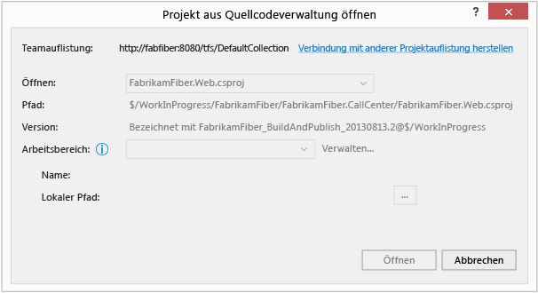

#### <a name="WhatWorkspace"></a> Frage: Was ist ein Arbeitsbereich?
 **Antwort:** Der [Arbeitsbereich speichert eine Kopie der Quelle](/azure/devops/repos/tfvc/create-work-workspaces?view=vsts) sodass Sie sie separat entwickeln und testen können, bevor Sie die Arbeit einchecken. Wenn Sie nicht bereits über einen Arbeitsbereich verfügen, der der gefundenen Projektmappe oder dem Projekt speziell zugeordnet ist, dann werden Sie von Visual Studio aufgefordert, einen verfügbaren Arbeitsbereich auszuwählen oder einen neuen Arbeitsbereich mit Ihrem Computernamen als Standardarbeitsbereichsname zu erstellen.

#### <a name="UntrustedSymbols"></a> Frage: Warum erhalte ich diese Meldung über nicht vertrauenswürdige Symbole?
 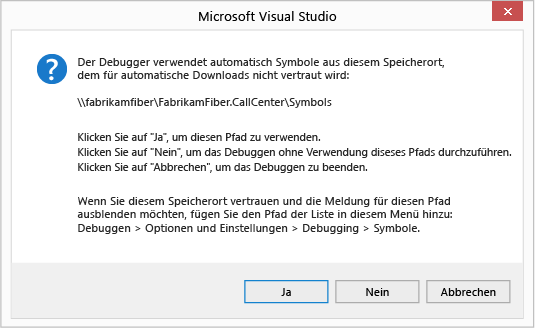

 **Antwort:** Diese Meldung wird angezeigt, wenn der Symbolpfad in der Buildmanifestdatei (\<*ProjectName*>.BuildInfo.config) nicht in der Liste der vertrauenswürdigen Symbolpfade enthalten ist. Sie können den Pfad zur Liste der Symbolpfade in den Debuggeroptionen hinzufügen.
