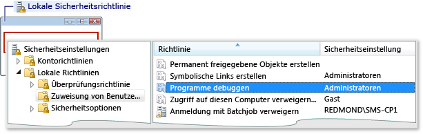
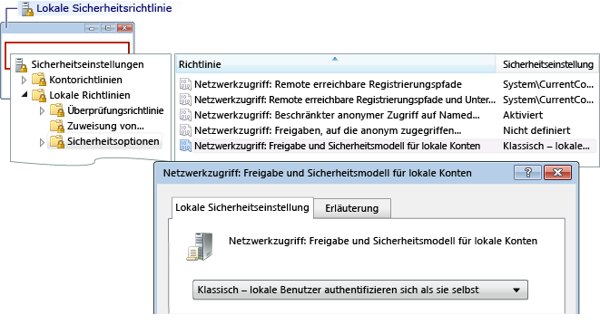

# Fehler: Fehler bei Remoteanmeldung von Arbeitsgruppe
Inhalt dieses Fehlers:  
  
 Fehler bei der Anmeldung: Unbekannter Benutzername oder ungültiges Kennwort.  
  
 **Ursache**  
  
 Dieser Fehler kann auftreten, wenn Sie von einem Computer in einer Arbeitsgruppe debuggen und versuchen, eine Verbindung mit einem Remotecomputer herzustellen. Mögliche Ursachen sind:  
  
-   Es gibt kein Konto auf dem Remotecomputer mit übereinstimmendem Namen und Kennwort.  
  
-   Wenn der Visual Studio-Computer und dem Remotecomputer in Arbeitsgruppen befinden, kann dieser Fehler auftreten, aufgrund der Standardeinstellung **lokale Sicherheitsrichtlinie** auf dem Remotecomputer festlegen. Die Standardeinstellung für die **lokale Sicherheitsrichtlinie** Einstellung **nur Gast - lokale Benutzer authentifizieren sich als Gast**. Um in diesem Setup zu debuggen, müssen Sie die Einstellung auf dem Remotecomputer zu ändern **Klassisch - lokale Benutzer authentifizieren sich als Sie selbst**.  
  
> [!NOTE]
>  Sie müssen Administrator sein, um die folgenden Aufgaben ausführen zu können.  
  
### So öffnen Sie das Fenster "Lokale Sicherheitsrichtlinie"  
  
1.  Starten Sie die **secpol.msc** Microsoft Management Console-Snap-in. Geben Sie "secpol.msc" in die Windows-Suche, das Windows-Ausführungsfeld oder in einer Eingabeaufforderung ein.  
  
### So fügen Sie Benutzerrechtezuordnungen hinzu  
  
1.  Öffnen der **lokale Sicherheitsrichtlinie** Fenster.  
  
2.  Erweitern Sie die **lokale Richtlinien** Ordner.  
  
3.  Klicken Sie auf **Zuweisen von Benutzerrechten**.  
  
4.  In der **Richtlinie** Spalte doppelklicken Sie auf **Debuggen von Programmen** zum Anzeigen der aktuellen richtlinienzuweisungen der lokalen Gruppe "in der **lokale Sicherheitsrichtlinie einstellen** (Dialogfeld).  
  
       
  
5.  Um neue Benutzer hinzuzufügen, klicken Sie auf die **Benutzer oder Gruppe hinzufügen** Schaltfläche.  
  
### So ändern Sie das Modell für gemeinsame Nutzung und das Sicherheitsmodell  
  
1.  Öffnen der **lokale Sicherheitsrichtlinie** Fenster.  
  
2.  Erweitern Sie die **lokale Richtlinien** Ordner.  
  
3.  Klicken Sie auf **Sicherheitsoptionen**.  
  
4.  In der **Richtlinie** Spalte doppelklicken Sie auf **Netzwerkzugriff: Modell für gemeinsame Nutzung und Sicherheitsmodell für lokale Konten**.  
  
5.  In der **Netzwerkzugriff: Modell für gemeinsame Nutzung und Sicherheitsmodell für lokale Konten** Dialogfeld Feld, ändern Sie den Wert auf **Klassisch - lokale Benutzer authentifizieren sich als Sie selbst** , und klicken Sie auf die **übernehmen**Schaltfläche.  
  
       
  
## Siehe auch  
 [Remotedebuggen – Fehler und Problembehandlung](../debugger/remote-debugging-errors-and-troubleshooting.md)   
 [Remotedebuggen](../debugger/remote-debugging.md)