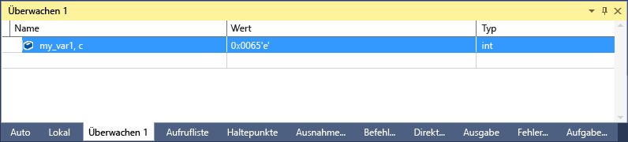

# <a name="format-specifiers-for-c-in-the-visual-studio-debugger"></a>Formatbezeichner für C++ in Visual Studio-Debugger
Sie können das Format, in dem ein Wert, im angezeigt wird, Ändern der **Watch**, **"Auto"**, und **"lokal"** Windows mithilfe von Formatbezeichnern.

Sie können auch die Formatbezeichner in der **direkt** Fenster die **Befehl** Fenster im [Ablaufverfolgungspunkte](../debugger/using-breakpoints.md#BKMK_Print_to_the_Output_window_with_tracepoints), und sogar in den Quellcodefenstern. Wenn Sie auf einem Ausdruck in diesen Fenstern anhalten, das Ergebnis wird in einem [DataTip](../debugger/view-data-values-in-data-tips-in-the-code-editor.md). Die DataTip-Anzeige entspricht dem Formatbezeichner.

> [!NOTE]
> Bei der native Debugger von Visual Studio als neues Debugmodul konstruiert geändert, es wurden mehrere neue Formatbezeichner hinzugefügt und einige alte Formatbezeichner entfernt. Der ältere Debugger wird weiterhin verwendet, wenn Sie das Interop-Debuggen (systemeigen und verwaltet) mit C++/CLI durchführen.

## <a name="set-format-specifiers"></a>Satz von Formatbezeichnern
Wir verwenden den folgenden aus:

```C++
int main() {
    int my_var1 = 0x0065;
    int my_var2 = 0x0066;
    int my_var3 = 0x0067;
}
```

Hinzufügen der `my_var1` Variable die **Überwachen** Fenster während des Debuggens **Debuggen** > **Windows** > **ansehen**  >  **Überwachen 1**. Als Nächstes mit der rechten Maustaste in der Variablenwerts, und wählen Sie **Hexadezimale Anzeige**. Jetzt die **Watch** Fenster zeigt den Wert 0 x 0065. Um diesen Wert als ein Zeichen anstatt in eine ganze Zahl anzuzeigen, zuerst mit der rechten Maustaste, und deaktivieren Sie **Hexadezimale Anzeige**. Fügen Sie dann den Zeichenformatbezeichner **, C** in die **Namen** Spalte nach dem Variablennamen ein. Die **Wert** Spalte zeigt jetzt **101 'e'**.



::: moniker range=">= vs-2019" 
Sie können anzeigen, und wählen Sie aus einer Liste der verfügbaren Formatbezeichner durch ein Komma (,) anfügen, auf den Wert in der **Überwachen** Fenster. 


::: moniker-end

## <a name="BKMK_Visual_Studio_2012_format_specifiers"></a> Formatbezeichner
Die folgenden Tabellen beschreiben die Formatbezeichner angegeben, die Sie in Visual Studio verwenden können. Fett formatierte Bezeichner werden nur unterstützt, für den neuen Debugger und nicht für das interop-Debuggen mit C++/CLI.

::: moniker range=">= vs-2019" 

|Bezeichner|Format|Ursprünglicher Wert in "Überwachen"|Angezeigter Wert|
|---------------|------------|--------------------------|---------------------|
|T|Ganze Dezimalzahl|0x00000066|102|
|o|Oktale ganze Zahl ohne Vorzeichen|0x00000066|000000000146|
|w<br /><br /> **h**|Ganze Hexadezimalzahl|102|0xcccccccc|
|X<br /><br /> **H**|Ganze Hexadezimalzahl|102|0xcccccccc|
|xb<br /><br /> **hb**|Ganze Hexadezimalzahl (ohne vorangestelltes 0x)|102|cccccccc|
|Xb<br /><br /> **Hb**|Ganze Hexadezimalzahl (ohne vorangestelltes 0x)|102|CCCCCCCC|
|k|Binäre ganze Zahl ohne Vorzeichen|25|0b00000000000000000000000000011001|
|bb|Binäre ganze Zahl ohne Vorzeichen (ohne vorangestelltes 0b)|25|00000000000000000000000000011001|
|e|Wissenschaftliche Schreibweise|25000000|2.500000e+07|
|g|Kürzere Variante aus wissenschaftlicher oder Gleitkommaschreibweise|25000000|2.5e+07|
|c|Einzelnes Zeichen|0x0065, c|101 'e'|
|s|const Char * string (mit Anführungszeichen)|\<Speicherort > "Hello World"|"hello world"|
|**sb**|const char*-Zeichenfolge (ohne Anführungszeichen)|\<Speicherort > "Hello World"|hello world|
|s8|UTF-8-Zeichenfolge|\<Speicherort > "Dies ist eine UTF-8-˜• Kaffee Cup"|"Dies ist eine UTF-8-☕ Kaffee Cup"|
|**s8b**|UTF-8-Zeichenfolge (ohne Anführungszeichen)|\<Speicherort > "Hello World"|hello world|
|su|Unicode (UTF-16-Codierung)-Zeichenfolge (mit Anführungszeichen)|\<Speicherort > L "Hello World"|L"hello world"<br /><br /> u"hello world"|
|sub|Unicode-Zeichenfolge (UTF-16-Codierung ohne Anführungszeichen)|\<Speicherort > L "Hello World"|hello world|
|bstr|Binärer BSTR-Zeichenfolge (mit Anführungszeichen)|\<Speicherort > L "Hello World"|L"hello world"|
|env|Umgebungsblock (doppelt nullterminierte Zeichenfolge)|\<location> L"=::=::\\\\"|L "=:: =::\\\\\\0 = C: = C:\\\\Windows\\\\" System32 "\\0ALLUSERSPROFILE =...|
|**s32**|UTF-32-Zeichenfolge (mit Anführungszeichen)|\<Speicherort > U "Hello World"|u"hello world"|
|**s32b**|UTF-32-Zeichenfolge (ohne Anführungszeichen)|\<Speicherort > U "Hello World"|hello world|
|**en**|enum|Samstag(6)|Samstag|
|**hv**|Zeigertyp - gibt an, dass der überprüfte Zeigerwert das Ergebnis der Heapzuweisung eines Arrays ist, z. B. `new int[3]`.|\<Speicherort>{\<Erster Member>}|\<Speicherort > {\<erste Member >, \<zweite Member >,...}|
|**na**|Unterdrückt die Speicheradresse eines Zeigers auf ein Objekt.|\<Speicherort>, {member=value…}|{member=value...}|
|**nd**|Es werden nur die Basisklasseninformationen angezeigt, die abgeleiteten Klassen werden ignoriert.|`(Shape*) square` enthält die Basisklassen- und abgeleitete Klasseninformationen|Zeigt nur Basisklasseninformationen an|
|hr|HRESULT oder Win32-Fehlercode. Dieser Bezeichner wird für HRESULTs nicht mehr benötigt werden, wie der Debugger sie automatisch decodiert.|S_OK|S_OK|
|wc|Fensterklassenflag|0x0010|WC_DEFAULTCHAR|
|wm|Windows-Meldungsnummern|16|WM_CLOSE|
|nr|"Raw View"-Element unterdrücken|
|nvo|"Rohdatenansicht"-Element für nur numerische Werte anzeigen|
|!|Rohdatenformat, jegliche Ansichtsanpassungen für den Datentyp werden ignoriert.|\<Benutzerdefinierte Darstellung>|4|

::: moniker-end

::: moniker range="vs-2017" 

|Bezeichner|Format|Ursprünglicher Wert in "Überwachen"|Angezeigter Wert|
|---------------|------------|--------------------------|---------------------|
|T|Ganze Dezimalzahl|0x00000066|102|
|o|Oktale ganze Zahl ohne Vorzeichen|0x00000066|000000000146|
|w<br /><br /> **h**|Ganze Hexadezimalzahl|102|0xcccccccc|
|X<br /><br /> **H**|Ganze Hexadezimalzahl|102|0xcccccccc|
|c|Einzelnes Zeichen|0x0065, c|101 'e'|
|s|const Char * string (mit Anführungszeichen)|\<Speicherort > "Hello World"|"hello world"|
|**sb**|const char*-Zeichenfolge (ohne Anführungszeichen)|\<Speicherort > "Hello World"|hello world|
|s8|UTF-8-Zeichenfolge|\<Speicherort > "Dies ist eine UTF-8-˜• Kaffee Cup"|"Dies ist eine UTF-8-☕ Kaffee Cup"|
|**s8b**|UTF-8-Zeichenfolge (ohne Anführungszeichen)|\<Speicherort > "Hello World"|hello world|
|su|Unicode (UTF-16-Codierung)-Zeichenfolge (mit Anführungszeichen)|\<Speicherort > L "Hello World"|L"hello world"<br /><br /> u"hello world"|
|sub|Unicode-Zeichenfolge (UTF-16-Codierung ohne Anführungszeichen)|\<Speicherort > L "Hello World"|hello world|
|bstr|Binärer BSTR-Zeichenfolge (mit Anführungszeichen)|\<Speicherort > L "Hello World"|L"hello world"|
|env|Umgebungsblock (doppelt nullterminierte Zeichenfolge)|\<location> L"=::=::\\\\"|L "=:: =::\\\\\\0 = C: = C:\\\\Windows\\\\" System32 "\\0ALLUSERSPROFILE =...|
|**s32**|UTF-32-Zeichenfolge (mit Anführungszeichen)|\<Speicherort > U "Hello World"|u"hello world"|
|**s32b**|UTF-32-Zeichenfolge (ohne Anführungszeichen)|\<Speicherort > U "Hello World"|hello world|
|**en**|enum|Samstag(6)|Samstag|
|**hv**|Zeigertyp - gibt an, dass der überprüfte Zeigerwert das Ergebnis der Heapzuweisung eines Arrays ist, z. B. `new int[3]`.|\<Speicherort>{\<Erster Member>}|\<Speicherort > {\<erste Member >, \<zweite Member >,...}|
|**na**|Unterdrückt die Speicheradresse eines Zeigers auf ein Objekt.|\<Speicherort>, {member=value…}|{member=value...}|
|**nd**|Es werden nur die Basisklasseninformationen angezeigt, die abgeleiteten Klassen werden ignoriert.|`(Shape*) square` enthält die Basisklassen- und abgeleitete Klasseninformationen|Zeigt nur Basisklasseninformationen an|
|hr|HRESULT oder Win32-Fehlercode. Dieser Bezeichner wird für HRESULTs nicht mehr benötigt werden, wie der Debugger sie automatisch decodiert.|S_OK|S_OK|
|wc|Fensterklassenflag|0x0010|WC_DEFAULTCHAR|
|wm|Windows-Meldungsnummern|16|WM_CLOSE|
|!|Rohdatenformat, jegliche Ansichtsanpassungen für den Datentyp werden ignoriert.|\<Benutzerdefinierte Darstellung>|4|

::: moniker-end

> [!NOTE]
> Wenn die **Hv** Formatbezeichner vorhanden ist, wird der Debugger versucht, die Länge des Puffers zu bestimmen, und zeigt diese Anzahl von Elementen. Da der Debugger nicht immer die exakte Puffergröße eines Arrays finden kann, sollten Sie möglichst immer einen Größenbezeichner `(pBuffer,[bufferSize])` verwenden. Die **Hv** Formatbezeichner ist nützlich, wenn die Größe des Puffers nicht sofort verfügbar ist.

### <a name="BKMK_Size_specifiers_for_pointers_as_arrays_in_Visual_Studio_2012"></a> Größenbezeichner für Zeiger als Arrays
Wenn Sie über einen Zeiger für ein Objekt verfügen, das Sie als Array anzeigen möchten, können Sie eine ganze Zahl oder einen Ausdruck verwenden, um die Anzahl von Arrayelementen zu bestimmen.

|Bezeichner|Format|Ursprünglicher Wert in "Überwachen"|Angezeigter Wert|
|---------------|------------|---------------------------|---------------------|
|n|Dezimalzahl oder ganze **Hexadezimalzahl**|pBuffer,[32]<br /><br /> pBuffer,**[0x20]**|Zeigt `pBuffer` als Array mit 32 Elementen an.|
|**[exp]**|Ein gültiger C++-Ausdruck, der für eine ganze Zahl ausgewertet wird.|pBuffer,[bufferSize]|Zeigt pBuffer als Array von `bufferSize` Elementen an.|
|**expand(n)**|Ein gültiger C++-Ausdruck, der für eine ganze Zahl ausgewertet wird|pBuffer, expand(2)|Zeigt das dritte Element von  `pBuffer`an|

## <a name="BKMK_Format_specifiers_for_interop_debugging_and_C___edit_and_continue"></a> Formatbezeichner für das Interop-Debuggen mit C++/CLI
**Fett formatierte** Bezeichner werden nur zum Debuggen von systemeigenem und C++/CLI-Code unterstützt.

|Bezeichner|Format|Ursprünglicher Wert in "Überwachen"|Angezeigter Wert|
|---------------|------------|--------------------------|---------------------|
|**d**<br /><br />**i**|Ganze Dezimalzahl mit Vorzeichen|0xF000F065|-268373915|
|**n**|Ganze Dezimalzahl ohne Vorzeichen|0x0065|101|
|o|Oktale ganze Zahl ohne Vorzeichen|0xF065|0170145|
|w<br /><br />X|Ganze Hexadezimalzahl|61541|0x0000f065|
|**l**<br /><br />**h**|Langes oder kurzes Präfix für: d, i, u, o, x, X|00406042|0x0c22|
|**f**|Gleitkommazahl mit Vorzeichen|(3./2.), f|1.500000|
|**e**|Wissenschaftliche Notation mit Vorzeichen|(3.0/2.0)|1.500000e+000|
|**g**|signiert Gleitkommazahl oder wissenschaftliche Notation mit Vorzeichen,<br/> Je nachdem, was kürzer ist.|(3.0/2.0)|1.5|
|c|Einzelnes Zeichen|\<Speicherort>|101 'e'|
|s|const Char * (mit Anführungszeichen)|\<Speicherort>|"hello world"|
|su|const wchar_t*<br /><br /> const char16_t\* (mit Anführungszeichen)|\<Speicherort>|L"hello world"|
|sub|const wchar_t*<br /><br /> const char16_t\*|\<Speicherort>|hello world|
|s8|const Char * (mit Anführungszeichen)|\<Speicherort>|"hello world"|
|hr|HRESULT oder Win32-Fehlercode.<br/>Dieser Bezeichner wird für HRESULTs nicht mehr benötigt werden, wie der Debugger sie automatisch decodiert.|S_OK|S_OK|
|wc|Fensterklassenflag|0x00000040,|WC_DEFAULTCHAR|
|wm|Windows-Meldungsnummern|0x0010|WM_CLOSE|
|!|RAW-Format wird ignoriert, Anpassungen Ansicht Typ von Daten|\<Benutzerdefinierte Darstellung>|4|

### <a name="BKMK_Format_specifiers_memory_locations_in_interop_debugging_and_C___edit_and_continue"></a> Formatbezeichner für Speicherbereiche beim interop-Debuggen mit C++/CLI
Die folgende Tabelle beschreibt die Formatierungssymbole, die für Speicherbereiche verwendet. Bezeichner für Speicherbereiche können mit beliebigen Werten oder Ausdrücken verwendet werden, die als Speicherbereiche ausgewertet werden.

|Symbol|Format|Ursprünglicher Wert in "Überwachen"|Angezeigter Wert|
|------------|------------|--------------------------|---------------------|
|**ma**|64 ASCII-Zeichen|0x0012ffac|0x0012ffac .4...0...".0W&.......1W&.0.:W..1...."..1.JO&.1.2.."..1...0y....1|
|**m**|16 Bytes im Hexadezimalformat, gefolgt von 16 ASCII-Zeichen|0x0012ffac|0x0012ffac B3 34 CB 00 84 30 94 80 FF 22 8A 30 57 26 00 00 .4...0...".0W&amp;.|
|**mb**|16 Bytes im Hexadezimalformat, gefolgt von 16 ASCII-Zeichen|0x0012ffac|0x0012ffac B3 34 CB 00 84 30 94 80 FF 22 8A 30 57 26 00 00 .4...0...".0W&amp;.|
|**mw**|8 Wörter|0x0012ffac|0x0012ffac 34B3 00CB 3084 8094 22FF 308A 2657 0000|
|**md**|4 Doppelwörter|0x0012ffac|0x0012ffac 00CB34B3 80943084 308A22FF 00002657|
|**mq**|2 Vierfachwörter|0x0012ffac|0x0012ffac 7ffdf00000000000 5f441a790012fdd4|
|**mu**|2-Byte-Zeichen (Unicode)|0x0012ffac|0x0012ffac 8478 77f4 ffff ffff 0000 0000 0000 0000|

### <a name="BKMK_Size_specifier_for_pointers_as_arrays_in_interop_debugging_and_C___edit_and_continue"></a> Größenbezeichner für Zeiger als Arrays beim Interop-Debuggen mit C++/CLI
Wenn Sie einen Zeiger für ein Objekt haben, das Sie als Array anzeigen möchten, können Sie eine ganze Zahl verwenden, um die Anzahl von Arrayelementen zu bestimmen.

|Bezeichner|Format|Ausdruck|Angezeigter Wert|
|---------------|------------|----------------|---------------------|
|n|Ganze Dezimalzahl|pBuffer[32]|Zeigt `pBuffer` als Array mit 32 Elementen an.|