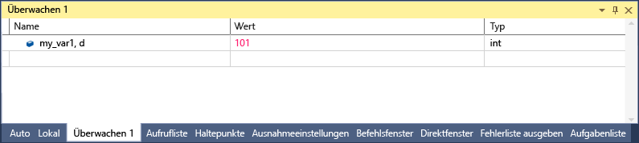

# <a name="format-specifiers-in-c-in-the-visual-studio-debugger"></a>Formatbezeichner in c# in Visual Studio-debugger
Sie können das Format ändern, in dem ein Wert im Fenster **Überwachen** mithilfe von Formatbezeichnern angezeigt wird. Sie können auch die Formatbezeichner in der **Direktfenster** Fenster der **Befehl** Fenster im [Ablaufverfolgungspunkte](../debugger/using-breakpoints.md#BKMK_Print_to_the_Output_window_with_tracepoints), und sogar in den Quellcodefenstern. Wenn Sie in einen Ausdruck in diesen Fenstern anhalten, wird das Ergebnis in einem DataTip angezeigt. DataTips geben den Formatbezeichner in der DataTip-Anzeige wieder.  
  
 Zum Verwenden eines Formatbezeichners geben Sie den von einem Komma gefolgten Ausdruck ein. Fügen Sie nach dem Komma den entsprechenden Bezeichner hinzu.  
  
## <a name="using-format-specifiers"></a>Verwenden von Formatbezeichnern  
 Wenn Ihr Code folgendermaßen lautet:  
  
```csharp  
{  
        int my_var1 = 0x0065;  
        int my_var2 = 0x0066;  
        int my_var3 = 0x0067;  
}  
```  
  
 Hinzufügen der `my_var1` Variablen im Fenster "überwachen" (während des Debuggens **Debuggen > Windows > Überwachen > Überwachen 1**), und legen Sie die Anzeige auf hexadezimal (in der **Überwachen** Fenster mit der rechten Maustaste in der Variablenwerts und Wählen Sie **Hexadezimale Anzeige**). Im Fenster **Überwachen** wird nun angezeigt, dass der Wert 0x0065 enthalten ist. Um diesen Wert als ganze Dezimalzahl und nicht als ganze Hexadezimalzahl auszudrücken, geben Sie in der Spalte "Name" nach dem Variablennamen den Dezimalformatbezeichner **, d**ein. In der Spalte "Wert" wird nun der Dezimalwert 101 angezeigt.  
  
   
  
## <a name="format-specifiers"></a>Formatbezeichner  
 In der folgenden Tabelle wird der C#-Formatbezeichner angezeigt, die vom Debugger erkannt werden.  
  
|Bezeichner|Format|Ursprünglicher Wert in "Überwachen"|Anzeige|  
|---------------|------------|--------------------------|--------------|  
|ac|Erzwingen der Auswertung eines Ausdrucks. Dies kann nützlich sein, wenn die implizite Auswertung von Eigenschaften sowie implizite Funktionsaufrufe deaktiviert sind.|Meldung "implizite funktionsevaluierung wird durch den Benutzer deaktiviert"|\<value>|  
|T|Ganze Dezimalzahl|0x0065|101|  
|dynamic|Zeigt das angegebene Objekt mit einer dynamischen Ansicht an.|Zeigt alle Member des Objekts einschließlich der dynamischen Ansicht an.|Zeigt nur die dynamische Ansicht an.|  
|h|Ganze Hexadezimalzahl|61541|0x0000F065|  
|nq|Zeichenfolge ohne Anführungszeichen|"Meine Zeichenfolge"|Meine Zeichenfolge|  
|hidden|Zeigt alle öffentlichen und nicht öffentlichen Member an.|Zeigt öffentliche Member an.|Zeigt alle Member an.|  
|raw|Zeigt ein Element so an, wie es im Knoten für Rohdatenelemente dargestellt wird. Nur für Proxyobjekte gültig.|Wörterbuch\<T >|Rohdatenansicht von Dictionary\<T >|  
|results|Wird mit einer Variablen eines Typs, der IEnumerable "oder" IEnumerable implementiert\<T >, in der Regel das Ergebnis eines Abfrageausdrucks. Zeigt nur die das Abfrageergebnis enthaltenden Member an.|Zeigt alle Member an.|Zeigt die Elemente an, die die Bedingungen der Abfrage erfüllen.|  
  
## <a name="see-also"></a>Siehe auch  
 [Überwachen "und" Schnellüberwachung Windows](../debugger/watch-and-quickwatch-windows.md)   
 [Fenster „Auto“ und „Lokal“](../debugger/autos-and-locals-windows.md)
