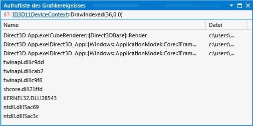

# Aufrufliste des Grafikereignisses
[!INCLUDE[vs2017banner](../code-quality/includes/vs2017banner.md)]

Die Aufrufliste des Grafikereignisses in der Visual Studio\-Grafikanalyse kann Ihnen die Zuordnung von Beziehungen zwischen Grafikereignissen und dem Quellcode Ihrer App erleichtern.  
  
 Dies ist das Aufruflistenfenster:  
  
   
  
## Verstehen der Aufrufliste des Grafikereignisses  
 Sie können mithilfe der Aufrufliste den Ablauf der Ausführung nachvollziehen, die zu einem bestimmten Direct3D\-Ereignis geführt hat.  Sie ähnelt dem Aufruflistenfenster in Visual Studio, mit der Ausnahme, dass anstelle der aktuellen Aufrufliste des aktiven Threads in einer laufenden Anwendung die Aufrufliste angezeigt wird, bei der das ausgewählte Direct3D\-Ereignis eingetreten ist.  Aus der Aufrufliste können Sie zur Aufrufsite des ausgewählten Direct3D\-Ereignisses springen, um den umgebenden Code zu überprüfen.  
  
 Mithilfe der Aufrufliste zur Identifizierung des Codepfads, von dem ein Problemereignis ausgeht, können Sie Ihre Kenntnisse über die Codebasis nutzen, um mögliche Quellen des Problems abzuleiten, oder Sie können Haltepunkte im Quellcode Ihrer Anwendung hinzufügen, sodass Sie untersuchen, wie der Zustand der Anwendung oder die Ereignis\-Parameter dazu führen, dass bei dem Ereignis ein Fehler auftritt.  Diese Prüfung kann Ihnen bei der Suche nach Fehlern im Quellcode helfen, die nur als Renderingprobleme festgelegt werden.  
  
### Informationen zur Aufrufliste des Grafikereignisses  
 Die Aufrufliste unterstützt keine Frames vor dem Frame und keine benutzerdefinierten Ereignisse.  Die Aufrufliste des Grafikereignisses wird in einem Tabellenformat angezeigt.  
  
|Spalte|Beschreibung|  
|------------|------------------|  
|**Name**|Ein Symbol, die eindeutig die Funktion identifiziert, die die Aufrufseite enthält.  Das Debug\-Symbol für die Funktion wird angezeigt, wenn dieses verfügbar ist. Andernfalls wird der Offset der Funktion angezeigt.|  
|**Datei**|Der Dateiname der Quelldatei oder Bibliotheksdatei, die die Aufrufsite enthält.|  
|**Speicherort**|Die Zeilennummer der Aufrufsite.|  
  
### Links zu Grafikobjekten  
 Um die ausgewählten Grafiken zu verstehen, benötigen Sie möglicherweise Informationen über das Direct3D\-Objekt, dem diese zugeordnet sind.  Das Fenster **Aufrufliste des Grafikereignisses** enthält einen Link zu diesen Informationen.  
  
## Siehe auch  
 [Exemplarische Vorgehensweise: Fehlende Objekte durch Vertexschattierung](../debugger/walkthrough-missing-objects-due-to-vertex-shading.md)