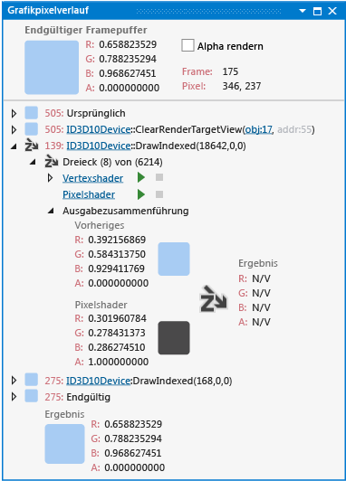

# Grafikpixelverlauf
[!INCLUDE[vs2017banner](../code-quality/includes/vs2017banner.md)]

Mit dem Fenster „Grafikpixelverlauf“ in der Visual Studio\-Grafikanalyse können Sie nachvollziehen, wie sich Direct3D\-Ereignisse, die während eines Frames Ihres Spiels oder Ihre App auftreten, auf ein bestimmtes Pixel auswirken.  
  
 Im Folgenden finden Sie das Pixelverlaufsfenster:  
  
   
  
## Grundlegendes zum Pixelverlaufsfenster  
 Mithilfe des Pixelverlaufs können Sie analysieren, wie sich Direct3D\-Ereignisse während eines Frames auf ein bestimmtes Pixel oder Renderziel auswirken.  Sie können ein Rendering\-Problem auf ein bestimmtes Ereignis für Direct3D zurückführen, selbst wenn die nachfolgenden Ereignisse – oder nachfolgende Primitive im selben Ereignis – weiterhin den endgültigen Farbwert des Pixel verändern.  Beispielsweise wird ein Pixel nicht ordnungsgemäß erzeugt und dann unleserlich durch ein anderes, halbtransparenten Pixel, dessen Farben in den Framebuffer\-Kontrastwerten auftreten.  Diese Art von Problem wäre nur schwer zu diagnostizieren, wenn Sie nur den endgültigen Inhalt des Renderingziels als Unterstützung zur Verfügung hätten.  
  
 Das Pixelverlaufsfenster zeigt den vollständigen Verlauf eines Pixels im Verlauf des ausgewählten Frames an.  Der **Letzte Framepuffer** am oberen Fensterrand zeigt die Farbe an, die am Framepuffer am Ende des Frames zusammen mit zusätzlichen Informationen über das Pixel geschrieben wird, wie z. B. der Frame, der davon abgeleitet wird, und dessen Bildschirmkoordinaten.  Dieser Bereich enthält auch das Kontrollkästchen **Alpha wiedergeben**.  Wenn dieses Kontrollkästchen aktiviert ist, werden die Farbe des **letzten Framepuffers** und die Zwischenfarbe transparent über einem Schachbrettmuster angezeigt.  Wenn das Kontrollkästchen deaktiviert ist, wird der Alphakanal der Farbwerte ignoriert.  
  
 Der untere Teil des Fensters zeigt die Ereignisse, die sich auf die Farbe des Pixels auswirken konnten, zusammen mit den **ersten** und **endgültigen** Pseudo\-Ereignissen an, die die ersten und endgültigen Farbwerte der Pixel im Framepuffer darstellen.  Der ursprüngliche Farbwert wird bestimmt durch das erste Ereignis, das die Farbe des Pixels änderte \(in der Regel ein `Clear`\-Ereignis\).  Eine Pixel hat immer diese beiden Pseudo\-Ereignisse in dessen Verlauf, auch wenn keine weiteren Ereignisse betroffen sind.  Wenn andere Ereignisse sich auf die Pixels auswirken konnten, werden sie zwischen den **ersten** und **letzten** Ereignissen angezeigt.  Die Ereignisse können erweitert werden, um ihre Details anzuzeigen.  Bei einfachen Ereignissen, wie der Deaktivierung eines Renderingziels, wirkt sich das Ereignis nur einen Farbwert aus.  Komplexere Ereignisse, wie Zeichnen\-Aufrufe, generieren mindestens eine Primitive, die zur Farbe des Pixels beitragen könnten.  
  
 Primitive, die vom Ereignis gezeichnet wurden, werden durch ihren Primitivtyp und Index zusammen mit der Gesamtzahl der Primitive für das Objekt angegeben.  Z. B. bedeutet ein Bezeichner wie **Dreieck \(1456\) von \(6214\)**, dass der Primitiv dem 1456. Dreieck in einem Objekt bestehend aus 6214 Dreiecken entspricht.  Auf der linken Seite jeder Primitiv\-ID befindet sich ein Symbol, das den Effekt des Primitivs auf das Pixel zusammenfasst.  Primitive, die Auswirkungen auf die Pixelfarbe haben, werden durch ein abgerundetes Rechteck dargestellt, die mit der Ergebnisfarbe gefüllt ist.  Primitive, die keine Auswirkungen auf die Pixelfarbe haben, werden durch Symbole dargestellt, die den Grund für den Ausschluss des Pixels angeben.  Diese Symbole werden im Abschnitt [Ausschluss eines Primitivs](../debugger/graphics-pixel-history.md#exclusion) weiter unten in diesem Artikel beschrieben.  
  
 Sie können jeden Primitiv erweitern, um zu untersuchen, wie die Pixel\-Shader\-Ausgabe mit der vorhandenen Pixelfarbe zusammengeführt wurde, um die Ergebnisfarbe zu erzeugen.  Von hier aus können Sie den Pixel Shader\-Code prüfen oder debuggen, der dem Primitiv\-Typ zugeordnet ist, und Sie können den Vertex\-Shader Knoten zum Überprüfen der Vertex\-Shaders\-Eingaben weiter ausbauen.  
  
###   Ausschluss eines Primitivs  
 Wenn ein Primitiv die Pixelfarbe nicht beeinflusst, kann der Ausschluss für eine Vielzahl von Gründen erfolgen.  Jeder Grund wird durch ein Symbol dargestellt, das in dieser Tabelle beschrieben wird:  
  
|Symbol|Grund für den Ausschluss|  
|------------|------------------------------|  
||Das Pixel wurde ausgeschlossen, weil der Tiefentest fehlgeschlagen ist.|  
||Das Pixel wurde ausgeschlossen, weil der Scherentest fehlgeschlagen ist.|  
||Das Pixel wurde ausgeschlossen, weil der Schablonentest fehlgeschlagen ist.|  
  
### Ausschluss des Zeichenaufrufs  
 Wenn alle Primitive in einem Zeichnen\-Aufruf von der Auswirkung auf das Renderingziel ausgeschlossen werden, da sie einen Test nicht bestehen, kann der Aufruf einer Zeichnung nicht erweitert werden, und ein Symbol, das dem Grund für den Ausschluss entspricht, wird daneben angezeigt.  Die Gründe für den Ausschluss des Aufrufs einer Zeichnung ähneln den Gründen für den Ausschluss von Primitiven, und die Symbole sind ähnlich.  
  
### Anzeigen und Debuggen des Shader\-Codes  
 Sie können mithilfe der Steuerelemente unter dem mit dem Shader verknüpften Primitiv Code für Vertex\-, Hull\-, Domain\-, Geometry\- und Pixel\-Shader überprüfen und debuggen.  
  
##### Um einen Shader\-Quellcode anzuzeigen  
  
1.  Suchen Sie im Fenster **Grafikpixelverlauf** nach dem Zeichnen\-Befehl, der dem zu überprüfenden Shader entspricht, und erweitern Sie ihn.  
  
2.  Wählen Sie unter dem von Ihnen soeben erweiterten Zeichnen\-Befehl ein Primitiv aus, welches das entsprechende Problem demonstriert, und erweitern Sie es.  
  
3.  Folgen sie unter dem entsprechenden Primitiv dem Shader\-Titellink \(folgen Sie beispielsweise dem Link **Vertex Shader obj:30**\), um den Quellcode des Vertex\-Shaders anzuzeigen.  
  
    > [!TIP]
    >  Die Objektnummer **obj:30** identifiziert diesen Shader über die gesamte Grafikanalyseoberfläche hinweg, beispielsweise in der Objekttabelle und im Pipelinestufenfenster.  
  
##### Um einen Shader zu debuggen  
  
1.  Suchen Sie im Fenster **Grafikpixelverlauf** nach dem Zeichnen\-Befehl, der dem zu überprüfenden Shader entspricht, und erweitern Sie ihn.  
  
2.  Wählen Sie dann unter dem von Ihnen soeben erweiterten Zeichnen\-Befehl ein Primitiv aus, welches das entsprechende Problem demonstriert, und erweitern Sie es.  
  
3.  Wählen Sie unter dem entsprechenden Primitiv **Debugging starten** aus.  Durch diesen Einstiegspunkt in den HLSL\-Debugger erfolgt die standardmäßige Festlegung auf den ersten Aufruf des Shaders für das entsprechende Primitiv, d. h. das erste Pixel oder Vertex, das bzw. der durch den Shader verarbeitet wird.  Es ist nur ein Pixel mit dem Primitiv verknüpft. Es liegen jedoch mehrere Vertex\-Shader\-Aufrufe für Linien und Dreiecke vor.  
  
     Erweitern Sie zum Debuggen des Vertex\-Shader\-Aufrufs für ein bestimmtes Vertex den VertexShader\-Titellink, und suchen Sie nach dem entsprechenden Vertex. Wählen Sie dann **Debugging starten** daneben aus.  
  
### Links zu Grafikobjekten  
 Um die Grafikereignisse im Pixelverlauf zu verstehen, benötigen Sie möglicherweise Informationen über den Gerätezustand zum Zeitpunkt des Ereignisses oder über die Direct3D\-Objekte, auf die das Ereignis verweist.  Für jedes Ereignis im Pixelverlauf liefert der **Grafikpixelverlauf** Links zum aktuellen Gerätestatus und zu verwandten Objekten.  
  
## Siehe auch  
 [Exemplarische Vorgehensweise: Fehlende Objekte durch Gerätestatus](../debugger/walkthrough-missing-objects-due-to-device-state.md)   
 [Exemplarische Vorgehensweise: Debuggen von Renderingfehlern, die durch Schattierungen entstanden sind](../debugger/walkthrough-debugging-rendering-errors-due-to-shading.md)