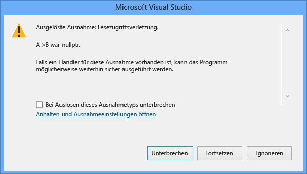

# <a name="how-can-i-debug-a-c-access-violation"></a>Wie kann eine C++-Zugriffsverletzung werden gedebuggt?
## <a name="problem-description"></a>Problembeschreibung  
 Das Programm generiert eine Zugriffsverletzung. Wie kann dieses Problem behoben werden?  
  
## <a name="solution"></a>Lösung  
 Wenn eine Zugriffsverletzung bei einer Codezeile auftritt, in der mehrere Zeiger dereferenziert werden, kann es schwierig sein, zu ermitteln, welcher Zeiger die Zugriffsverletzung verursacht hat. Ab Visual Studio 2015 Update 1 nennt das Ausnahmedialogfeld jetzt explizit den Zeiger, der die Zugriffsverletzung verursacht hat.  
  
 Beispielsweise sollte der folgende Code zu einer Zugriffsverletzung führen:  
  
```C++  
#include <iostream>  
using namespace std;  
  
class ClassB {  
public:  
        ClassC* C;  
        ClassB() {  
                C = new ClassC();  
        }  
     void printHello() {  
                cout << "hello world";  
        }  
};  
  
class ClassA {  
public:  
    ClassB* B;  
      ClassA() {  
                B = nullptr;  
        }  
};  
  
int main() {  
    ClassA* A = new ClassA();  
      A->B->printHello();  
}  
```  
  
 Wenn Sie diesen Code in Visual Studio 2015 Update 1 ausführen, sollte das folgende Ausnahmedialogfeld angezeigt werden:  
  
   
  
 Wenn Sie nicht bestimmen können, warum der Zeiger eine Zugriffsverletzung verursacht hat, überwachen Sie den Code mithilfe der Ablaufverfolgung, um sicherzustellen, dass der Zeiger, der das Problem verursacht, ordnungsgemäß zugewiesen wurde.  Wenn er als Parameter übergeben wird, stellen Sie sicher, dass die Übergabe ordnungsgemäß, und Sie werden nicht versehentlich erstellen eine [flache Kopie](http://stackoverflow.com/questions/184710/what-is-the-difference-between-a-deep-copy-and-a-shallow-copy). Dann stellen Sie sicher, dass die Werte nicht unbeabsichtigt an einer beliebigen Stelle geändert werden in der Anwendung durch das Erstellen eines Haltepunkts für den Zeiger fraglichen um sicherzustellen, dass es an anderer Stelle im Programm geändert wird. Weitere Informationen zu Datenhaltepunkten finden Sie im Abschnitt über Datenhaltepunkte in [Using Breakpoints](../debugger/using-breakpoints.md).  
  
## <a name="see-also"></a>Siehe auch  
 [FAQs zum Debuggen von nativem Code](../debugger/debugging-native-code-faqs.md)