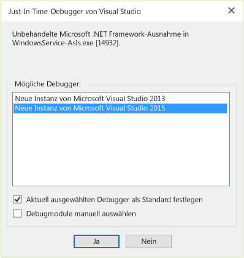

# <a name="how-to-debug-the-onstart-method"></a>Vorgehensweise: Debuggen der OnStart-Methode
Sie können einen Windows-Dienst debuggen, indem Sie den Dienst starten und den Debugger an den Dienstprozess anfügen. Weitere Informationen finden Sie unter [Vorgehensweise: Debuggen von Windows-Dienstanwendungen](/dotnet/framework/windows-services/how-to-debug-windows-service-applications). Zum Debuggen der <xref:System.ServiceProcess.ServiceBase.OnStart%2A?displayProperty=fullName> -Methode eines Windows-Diensts müssen Sie den Debugger allerdings aus der Methode starten.

1. Fügen Sie am Anfang der <xref:System.Diagnostics.Debugger.Launch%2A> -Methode einen Aufruf von `OnStart()`hinzu.

    ```csharp
    protected override void OnStart(string[] args)
    {
        System.Diagnostics.Debugger.Launch();
    }
    ```

2. Starten Sie den Dienst (dazu können Sie `net start`oder das Fenster **Dienste** verwenden).

    Ein Dialogfeld ähnlich dem folgenden sollte angezeigt werden:

    

3. Wählen Sie **Ja\<service name> aus.**

4. Wählen Sie im Fenster des Just-In-Time-Debuggers die Version von Visual Studio aus, die Sie zum Debuggen verwenden möchten.

    

5. Eine neue Instanz von Visual Studio wird gestartet, und die Ausführung wird beim Erreichen der `Debugger.Launch()` -Methode beendet.

## <a name="see-also"></a>Siehe auch
- [Debuggersicherheit](../debugger/debugger-security.md)
- [Debuggen von verwaltetem Code](../debugger/debugging-managed-code.md)
