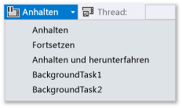
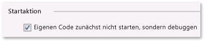
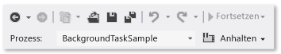

# Wie Sie auslösen, anhalten, fortsetzen und im Hintergrund von Ereignissen beim Debuggen von UWP-apps in Visual Studio
Wenn Sie nicht debuggen, steuert die Windows-PLM ( **Process Lifetime Management** , Prozessverwaltung für Lebensdauer) den Ausführungszustand der App, d. h. das Starten, Anhalten, Fortsetzen und Beenden der App als Reaktion auf Benutzeraktionen und den Gerätezustand. Wenn Sie debuggen, deaktiviert Windows diese Aktivierungsereignisse. In diesem Thema wird beschrieben, wie solche Ereignisse im Debugger ausgelöst werden.  
  
 Außerdem wird in diesem Thema das Debuggen von **Hintergrundaufgaben**beschrieben. Hintergrundaufgaben ermöglichen das Ausführen bestimmte Vorgänge in einem Hintergrundprozess, selbst wenn Ihre App nicht ausgeführt wird. Sie können den Debugger verwenden, um die App in den Debugmodus zu versetzen und die Hintergrundaufgabe anschließend zu debuggen, ohne die Benutzeroberfläche zu starten.  
  
 Weitere Informationen zu Prozesslebensdauer-Verwaltung und Hintergrundaufgaben finden Sie unter [Launching, resuming, and multitasking](/windows/uwp/launch-resume/index).  
  
##   Auslösen von Ereignissen der Prozesslebensdauer-Verwaltung  
 Windows kann die App anhalten, wenn der Benutzer zu einem anderen Element wechselt oder Windows ein einen Zustand mit geringem Energieverbrauch wechselt. Sie können auf das `Suspending` -Ereignis reagieren, um relevante App- und Benutzerdaten im permanenten Speicher zu speichern und Ressourcen freizugeben. Wenn eine Anwendung nach dem Zustand **Angehalten** fortgesetzt wird, wechselt sie in den Zustand **Aktiv** und wird an der Position fortgesetzt, an der sie angehalten wurde. Sie können auf das `Resuming` -Ereignis reagieren, um den Anwendungszustand zu aktualisieren oder wiederherzustellen und Ressourcen zurückzufordern.  
  
 Obwohl Windows versucht, so viele angehaltene Apps wie möglich im Arbeitsspeicher zu behalten, kann die App beendet werden, wenn die Ressourcen nicht ausreichen, um sie im Arbeitsspeicher zu behalten. Außerdem Ihre App auch durch einen Benutzer explizit geschlossen werden. Es gibt kein gesondertes Ereignis, um anzugeben, dass die App durch den Benutzer geschlossen wurde.  
  
 Im Visual Studio-Debugger können Sie Ihre Apps manuell anhalten, fortsetzen und beenden, um Prozesslebenszyklusereignisse zu debuggen. So debuggen Sie ein Prozesslebenszyklusereignis:  
  
1.  Legen Sie einen Haltepunkt im Handler des Ereignisses fest, das Sie debuggen möchten.  
  
2.  Drücken Sie die Taste **F5** , um mit dem Debuggen zu beginnen.  
  
3.  Wählen Sie auf der Symbolleiste **Debugspeicherort** das Ereignis aus, das Sie auslösen möchten:  
  
       
  
     Beachten Sie, dass **Anhalten und beenden** die App schließt und die Debugsitzung beendet.  
  
##   Auslösen von Hintergrundaufgaben  
 Jede App kann eine Hintergrundaufgabe registrieren, um auf bestimmte Systemereignisse zu reagieren, selbst wenn die App nicht ausgeführt wird. Hintergrundaufgaben können keinen Code ausführen, der die Benutzeroberfläche direkt aktualisiert. Stattdessen zeigen sie dem Benutzer Informationen mithilfe von mit Kachelupdates, Infoanzeigerupdates und Toastbenachrichtigungen an. Weitere Informationen finden Sie unter [Supporting your app with background tasks](https://msdn.microsoft.com/library/4c7bb148-eb1f-4640-865e-41f627a46e8e)  
  
 Sie können die Ereignisse, die Hintergrundaufgaben für die App starten, über den Debugger auslösen.  
  
> [!NOTE]
>  Der Debugger kann nur Ereignisse auslösen, die keine Daten enthalten, z. B. Ereignisse, die eine Zustandsänderung im Gerät angeben. Sie müssen Hintergrundaufgaben, die Benutzereingaben oder andere Daten benötigen, manuell auslösen.  
  
 Bei der realistischsten Methode, um ein Hintergrundaufgabenereignis auszulösen, sollte Ihre App nicht ausgeführt werden. Das Auslösen des Ereignisses in einer Standarddebugsitzung wird jedoch ebenfalls unterstützt.  
  
###   Auslösen eines Hintergrundaufgabenereignisses aus einer Standarddebugsitzung  
  
1.  Legen Sie einen Haltepunkt im Code der Hintergrundaufgabe fest, den Sie debuggen möchten.  
  
2.  Drücken Sie die Taste **F5** , um mit dem Debuggen zu beginnen.  
  
3.  Wählen Sie die Hintergrundaufgabe, die Sie starten möchten, aus der Ereignisliste auf der Symbolleiste **Debugspeicherort** aus.  
  
       
  
###   Auslösen einer Hintergrundaufgabe, wenn die App nicht ausgeführt wird  
  
1.  Legen Sie einen Haltepunkt im Code der Hintergrundaufgabe fest, den Sie debuggen möchten.  
  
2.  Öffnen Sie die Debugeigenschaftenseite für das Startprojekt. Wählen Sie im Projektmappen-Explorer das Projekt aus. Klicken Sie im Menü **Debuggen** auf **Eigenschaften**.  
  
     Erweitern Sie für C++ und JavaScript-Projekten **Konfigurationseigenschaften** und wählen Sie dann **Debuggen**.  
  
3.  Führen Sie einen der folgenden Schritte aus:  
  
    -   Wählen Sie für Visual C#- und Visual Basic-Projekte **Eigenen Code zunächst nicht starten sondern debuggen**aus.  
  
           
  
    -   Wählen Sie für JavaScript- und Visual C++-Projekte **Nein** aus der Liste **Anwendung starten** aus.  
  
           
  
4.  Drücken Sie **F5** , um die App in den Debugmodus zu versetzen. Beachten Sie, dass die Liste **Prozess** auf der Symbolleiste **Debugspeicherort** den Namen des Apppakets anzeigt, um zu signalisieren, dass der Debugmodus aktiv ist.  
  
       
  
5.  Wählen Sie die Hintergrundaufgabe, die Sie starten möchten, aus der Ereignisliste auf der Symbolleiste **Debugspeicherort** aus.  
  
       
  
##   Ereignisse zur Verwaltung der Prozesslebensdauer sowie Hintergrundaufgaben der installierten App auslösen bzw. aktivieren.  
 Verwenden der **Debuggen Installed App Package** Dialogfeld, um eine app zu starten, die bereits in den Debugger installiert ist. Sie können z. B. Debuggen einer app, die über Microsoft Store installiert wurde oder Debuggen einer app aus, wenn Sie die Quelldateien für die app, aber nicht Visual Studio-Projekt für die app verfügen. Die **Debuggen Installed App Package** Dialogfeld können Sie Starten einer app im Debugmodus auf dem Visual Studio-Computer oder auf einem Remotegerät, oder legen Sie die app im Debugmodus ausgeführt, aber nicht gestartet wird. Weitere Informationen finden Sie unter [Debuggen eines installierten app-Pakets](../debugger/debug-installed-app-package.md).
  
 Sobald die App in den Debugger geladen ist, können Sie die oben beschriebenen Prozeduren anwenden.  
  
##   Diagnostizieren von Hintergrundaufgaben-Aktivierungsfehlern  
 Die Diagnoseprotokolle in der Windows-Ereignisanzeige für die Hintergrundinfrastruktur enthalten ausführliche Informationen, die Sie zur Diagnose und Behebung von Hintergrundaufgabenfehlern verwenden können. So zeigen Sie das Protokoll an:  
  
1.  Öffnen Sie die Ereignisanzeige.  
  
2.  Wählen Sie im Bereich **Aktionen** die Option **Ansicht** aus, und stellen Sie sicher, dass **Show Analytic and Debug Logs** (Analytische Protokolle und Debugprotokolle einblenden) aktiviert ist.  
  
3.  Wählen Sie auf der Symbolleiste **Ereignisanzeige (Lokal)** die Knoten **Anwendungs- und Dienstprotokolle** > **Microsoft** > **Windows** > **BackgroundTasksInfrastructure**beschrieben.  
  
4.  Wählen Sie das **Diagnose** -Protokoll aus.  
  
## Siehe auch  
 [Testen von UWP-Apps mit Visual Studio](../test/testing-store-apps-with-visual-studio.md)   
 [Debug apps in Visual Studio](/visualstudio/debugger/debugging-windows-store-and-windows-universal-apps)   
 [Anwendungslebenszyklus](/windows/uwp/launch-resume/app-lifecycle)   
 [Launching, resuming, and multitasking](/windows/uwp/launch-resume/index)