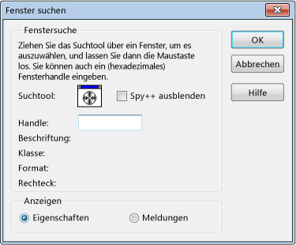

# Gewusst wie: Verwenden des Suchtools
Können Sie das Suchtool in der **"Fenster Suchen"** Dialogfeld zum Anzeigen von Fenstereigenschaften oder Nachrichten. Das Suchtool können auch deaktivierte untergeordnete Fenster Suchen und erkennen, welches Fenster zum Hervorheben, untergeordnete Fenster überlappen deaktiviert.  
  
   
Suchtools im Dialogfeld "Fenster Suchen"  
  
 Die vorstehende Abbildung zeigt das Dialogfeld "Fenster Suchen" nach Schritt 3 unten.  
  
### Zum Anzeigen von Fenstereigenschaften oder Nachrichten  
  
1.  Ordnen Sie die Fenster, sodass Spy++ und das Zielfenster angezeigt werden.  
  
2.  Aus der **Spy++** Menü wählen **"Fenster Suchen"**.  
  
     Die [Dialogfeld Fenster Suchen](../debugger/find-window-dialog-box.md) wird geöffnet.  
  
3.  Ziehen Sie die **Suchtools** über dem Zielfenster.  
  
     Wie Sie das Tool, ziehen Sie die **"Fenster Suchen"** Dialogfeld zeigt Details für das ausgewählte Fenster.  
  
     - ODER  
  
     Wenn Sie das Handle des Fensters Sie haben (z. B. aus dem Debugger kopiert) untersuchen möchten, geben Sie ihn in die **behandeln** Textfeld.  
  
    > [!TIP]
    >  Wählen Sie zum Bildschirm übersichtlicher gestalten möchten, die **Spy++ ausblenden** Option. Diese Option verbirgt Spy++-Hauptfenster nur verlassen der **"Fenster Suchen"** (Dialogfeld), die zusätzlich zu anderen Anwendungen sichtbar. Spy++-Hauptfenster wird wiederhergestellt, wenn Sie auf **OK** oder **"Abbrechen"**, oder wenn Sie deaktivieren die **Spy++ ausblenden** Option.  
  
4.  Klicken Sie unter **anzeigen**, wählen Sie entweder **Eigenschaften** oder **Nachrichten**.  
  
5.  Press **OK**.  
  
     Wenn Sie ausgewählt haben **Eigenschaften**, [Fenstereigenschaften (Dialogfeld)](../debugger/window-properties-dialog-box.md) wird geöffnet. Wenn Sie ausgewählt haben **Nachrichten**, [Ansicht "Nachrichten"](../debugger/messages-view.md) Fenster wird geöffnet.  
  
## Siehe auch  
 [Spy++-Ansichten](../debugger/spy-increment-views.md)   
 [Verwenden von Spy++](../debugger/using-spy-increment.md)   
 [Spy++-Referenz](../debugger/spy-increment-reference.md)