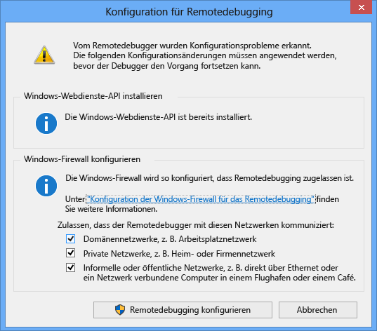

---
translation.priority.ht:
- cs-cz
- de-de
- es-es
- fr-fr
- it-it
- ja-jp
- ko-kr
- pl-pl
- pt-br
- ru-ru
- tr-tr
- zh-cn
- zh-tw
ms.openlocfilehash: 2e5782c49f26925d9eda81f04653b1a20666c6b1
ms.sourcegitcommit: 748d9cd7328a30f8c80ce42198a94a4b5e869f26
ms.translationtype: MT
ms.contentlocale: de-DE
ms.lasthandoff: 07/15/2019
ms.locfileid: "68149171"
---
1. Suchen Sie auf dem Remotecomputer, und Starten der **Remote Debugger** aus der **starten** Menü. 
   
   Wenn Sie nicht über die Administratorberechtigungen auf dem Remotecomputer verfügen, mit der rechten Maustaste die **Remotedebugger** app, und wählen **als Administrator ausführen**. Andernfalls starten Sie es normalerweise.

   Wenn Sie planen, fügen Sie einen Prozess, der als Administrator ausgeführt wird, oder unter einem anderen Benutzerkonto ausgeführt wird (z. B. IIS)-Konto, mit der rechten Maustaste die **Remotedebugger** app, und wählen **führen Sie als Administrator**. Weitere Informationen finden Sie unter [führen den Remotedebugger als Administrator](../remote-debugging-errors-and-troubleshooting.md#run-the-remote-debugger-as-an-administrator).
   
1. Beim ersten Verwenden Sie den Remotedebugger zu starten (oder bevor Sie sie konfiguriert haben), die **Konfiguration für Remotedebugging** Dialogfeld wird angezeigt.  
  
      
  
1. Wenn die Windows-Webdienste-API nicht dies nur bei Windows Server 2008 R2 der Fall installiert ist, wählen Sie die **installieren** Schaltfläche.  
  
1. Wählen Sie mindestens ein Netzwerktyp, die Sie auf die Remotetools verwenden möchten. Wenn die Computer über eine Domäne verbunden sind, müssen Sie das erste Element auswählen. Wenn der Computer über eine Arbeitsgruppe oder eine Heimnetzgruppe verbunden sind, wählen Sie das zweite bzw. dritte Element nach Bedarf.  
  
1. Wählen Sie **Konfigurieren des Remotedebuggings** zum Konfigurieren der Firewall und den Remotedebugger zu starten.  
  
1. Wenn die Konfiguration abgeschlossen ist, wird die **Remotedebugger** Fenster wird angezeigt.
  
    
  
    Der Remotedebugger wartet jetzt eine Verbindung. Verwenden Sie den Namen des Servers und die Portnummer, die angezeigt wird, legen Sie die Konfiguration des remote-Verbindung in Visual Studio.  
  
Wählen Sie zum Beenden des Remotedebuggers **Datei** > **beenden**. Sie können es von den Neustart der **starten** Menü oder über die Befehlszeile:  
  
```cmd
<Remote debugger installation directory>\msvsmon.exe
```
