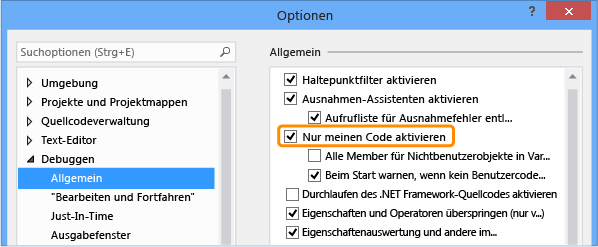

# <a name="debug-only-user-code-with-just-my-code"></a>Nur Benutzercode mit nur mein Code Debuggen 

*Nur mein Code* übersteigt eine Debugfunktion von Visual Studio, die automatisch Schritte Aufrufe System-, Framework- und andere nicht-benutzerseitigen Code. In der **Aufrufliste** Fenster nur mein Code reduziert diese Aufrufe in **[externer Code]** Frames. 

Nur mein Code funktioniert anders als in .NET Framework, C++ und JavaScript-Projekten.

##  <a name="BKMK_Enable_or_disable_Just_My_Code"></a> Aktivieren oder Deaktivieren von „Nur eigenen Code“  

Für die meisten Programmiersprachen wird nur mein Code standardmäßig aktiviert. 

- So aktivieren oder deaktivieren nur mein Code in Visual Studio unter **Tools** > **Optionen** (oder **Debuggen** > **Optionen**) > **Debuggen** > **allgemeine**aktivieren oder deaktivieren **nur meinen Code aktivieren**.
  
   
  
> [!NOTE]
> **Nur eigenen Code aktivieren** ist eine globale Einstellung, die für alle Visual Studio-Projekte in allen Sprachen angewendet wird.  
  
##  <a name="just-my-code-debugging"></a>Nur mein Code (Debugoption)

Während einer Debugsitzung die **Module** Fenster gibt an, welche die Codemodule der Debugger ist zum behandeln, als mein Code (Benutzercode), zusammen mit ihren Symbol Status wird geladen. Weitere Informationen finden Sie unter [mit, wie der Debugger an Ihre app angefügt vertrauter machen](../debugger/debugger-tips-and-tricks.md#modules_window).

 
  
In der **Aufrufliste** oder **Aufgaben** nur mein Code-Fenster wird nicht benutzerseitiger Code in einer kommentierten Code grau Frame mit der Bezeichnung reduziert `[External Code]`.

 
  
>[!TIP]
>Zum Öffnen der **Module**, **Aufrufliste**, **Aufgaben**, oder die meisten anderen debugging-Fenster, müssen Sie in einer Debugsitzung sein. Während des Debuggens unter **Debuggen** > **Windows**, aktivieren Sie das Fenster, das Sie öffnen möchten. 

<a name="BKMK_Override_call_stack_filtering"></a> Zum Anzeigen des Codes in einer reduzierten **[externer Code]** frame, mit der rechten Maustaste den **Aufrufliste** oder **Aufgabe** , und wählen **externen Code anzeigen**aus dem Kontextmenü. Ersetzen Sie die erweiterten externe Codezeilen die **[externer Code**] Frame. 

 
  
> [!NOTE]
> **Externen Code anzeigen** ein aktuellen Benutzer Profiler festlegen, gilt für alle Projekte in allen Sprachen, die vom Benutzer geöffnet werden.

Durch Doppelklicken auf eine erweiterte externen Code-Zeile in der **Aufrufliste** Fenster werden die aufrufende Codezeile im Quellcode grün hervorgehoben. Für DLLs oder andere Module wurde nicht gefunden oder geladen eine Symbol- oder Quelldateien wurde nicht gefunden Seite öffnen kann.

##  <a name="BKMK__NET_Framework_Just_My_Code"></a> „Nur eigenen Code“ in .NET Framework 

In .NET Framework-Projekten verwendet nur mein Code Symbol (*PDB*) Dateien und programmoptimierungen, um Benutzer-und Nichtbenutzercode zu klassifizieren. Der .NET Framework-Debugger berücksichtigt werden, optimiert der Binärdateien und nicht geladenen *PDB* Dateien nicht benutzerseitiger Code sein.
  
Drei Compilerattribute wirken sich auch der Debugger .NET Benutzercode erachtet:  

- <xref:System.Diagnostics.DebuggerNonUserCodeAttribute> teilt dem Debugger mit, dass der Code, dem es angewendet wird, vom Benutzercode nicht.  
- <xref:System.Diagnostics.DebuggerHiddenAttribute> blendet den Code für den Debugger aus, auch wenn Nur mein Code deaktiviert wird.  
- <xref:System.Diagnostics.DebuggerStepThroughAttribute> teilt dem Debugger den Code schrittweise durchlaufen, die sie auf, anstatt den Code schrittweise angewendet wird.  

Der .NET Framework-Debugger werden alle anderen Code Benutzercode berücksichtigt.  

Während der .NET Framework-Debuggen:

- **Debuggen von** > **Einzelschritt** (oder **F11**) auf Nichtbenutzercode überspringt den Code in die nächste Zeile des Benutzercodes. 
- **Debuggen von** > **Ausführen bis Rücksprung** (oder **UMSCHALT**+**F11**) für nicht-benutzerseitiger Code, die in die nächste Zeile des Benutzercodes ausgeführt wird. 

Wenn kein Benutzercode für weitere vorhanden ist, Debuggen wird fortgesetzt, bis es beendet, einen weiteren Haltepunkt erreicht oder löst einen Fehler aus. 

<a name="BKMK_NET_Breakpoint_behavior"></a> Wenn der Debugger im Nichtbenutzercode unterbricht (Sie verwenden, z. B. **Debuggen** > **alle unterbrechen** "und" Pause in nicht-benutzerseitigen Code), wird die **keine Quelle** Fenster wird angezeigt. Anschließend können Sie eine **Debuggen** > **Schritt** Befehl, um die nächste Zeile des Benutzercodes aufzurufen.

Wenn ein Ausnahmefehler im Nichtbenutzercode auftritt, unterbricht der Debugger, an die Benutzer-Codezeile, in dem die Ausnahme generiert wurde.  
  
Wenn Ausnahmen der ersten Chance für die Ausnahme aktiviert sind, wird der aufrufende benutzercodezeile Grün im Quellcode hervorgehoben. Die **Aufrufliste** Fenster wird angezeigt, den mit Anmerkungen versehenen Frame mit der Bezeichnung **[externer Code]**.  

##  <a name="BKMK_C___Just_My_Code"></a> „Nur eigenen Code“ in C++  
  
In C++ nur meinen Code aktivieren entspricht der Verwendung der [/JMC (nur mein Codedebuggen)](/cpp/build/reference/jmc) Compilerschalter.

<a name="BKMK_CPP_User_and_non_user_code"></a> Nur mein Code unterscheidet sich in C++ als in .NET Framework und JavaScript, da Sie nichtbenutzer-Dateien für Schrittverhalten separat angeben können und die **Aufrufliste** Fenster. 

Nur eigenen Code in C++ berücksichtigt nur diese Funktionen nicht benutzerseitiger Code sein:

- Für die **Aufrufliste** Fenster: 

  - Funktionen mit entfernten Quellinformationen in ihrer Symboldatei.  
  - Funktionen, bei denen die Symboldateien angeben, dass keine Quelldatei vorhanden ist, die dem Stapelrahmen entspricht.  
  - Funktionen, die im angegebenen  *\*natjmc* Dateien in die *%VsInstallDirectory%\Common7\Packages\Debugger\Visualizers* Ordner.  
  
- Für die schrittweise Ausführung Verhalten:
  
  - Funktionen, die im angegebenen  *\*natstepfilter* Dateien in die *%VsInstallDirectory%\Common7\Packages\Debugger\Visualizers* Ordner.  
  
Sie erstellen *natstepfilter* und *natjmc* Dateien Schrittverhalten nur mein Code anpassen und die **Aufrufliste** Fenster. Finden Sie unter [Anpassen von C++-Schrittverhalten](#BKMK_CPP_Customize_stepping_behavior) und [Anpassen von C++-aufruflistenverhaltens](#BKMK_CPP_Customize_call_stack_behavior). 

<a name="BKMK_CPP_Stepping_behavior"></a> Beim C++ Debuggen:

- **Debuggen von** > **Einzelschritt** (oder **F11**) auf Nichtbenutzercode überspringt den Code in die nächste Zeile des Benutzercodes. 
- **Debuggen von** > **Ausführen bis Rücksprung** (oder **UMSCHALT**+**F11**) für nicht-benutzerseitiger Code, die in die nächste Zeile des Benutzercodes ausgeführt wird. 

Wenn kein Benutzercode für weitere vorhanden ist, Debuggen wird fortgesetzt, bis es beendet, einen weiteren Haltepunkt erreicht oder löst einen Fehler aus. 

Wenn der Debugger im Nichtbenutzercode unterbricht (Sie verwenden, z. B. **Debuggen** > **alle unterbrechen** und im nicht-benutzerseitiger Code anhalten), wird nicht benutzerseitiger Code weiter schrittweise durchlaufen.

Wenn der Debugger eine Ausnahme trifft, wird es, ob es im Benutzer- oder nicht-benutzerseitiger Code ist auf die Ausnahme, beendet. **Vom Benutzercode unbehandelt** "Optionen" der **Ausnahmeeinstellungen** im Dialogfeld werden ignoriert.  

###  <a name="BKMK_CPP_Customize_stepping_behavior"></a> Anpassen des schrittverhaltens für C++  

 In C++-Projekten können Sie angeben, Funktionen überspringen sind, indem sie als Nichtbenutzercode in auflisten  *\*natstepfilter* Dateien.  
  
- Um Nichtbenutzercode für alle lokalen Visual Studio-Benutzer anzugeben, fügen die *natstepfilter* -Datei in die *%VsInstallDirectory%\Common7\Packages\Debugger\Visualizers* Ordner.  
- Fügen Sie dem Ordner *%USERPROFILE%\Eigene Dokumente\Visual Studio 2017\Visualizers* die *NATSTEPFILTER*-Datei hinzu, um Nichtbenutzercode für einen einzelnen Benutzer anzugeben.  
  
Ein *natstepfilter* Datei ist eine XML-Datei mit folgender Syntax:  
  
```xml  
<?xml version="1.0" encoding="utf-8"?>  
<StepFilter xmlns="http://schemas.microsoft.com/vstudio/debugger/natstepfilter/2010">  
    <Function>  
        <Name>FunctionSpec</Name>  
        <Action>StepAction</Action>  
    </Function>  
    <Function>  
        <Name>FunctionSpec</Name>  
        <Module>ModuleSpec</Module>  
        <Action>StepAction</Action>  
    </Function>  
</StepFilter>  
  
```  
  
|Element|Beschreibung|  
|-------------|-----------------|  
|`Function`|Erforderlich. Gibt eine oder mehreren Funktionen als Nichtbenutzerfunktionen an.|  
|`Name`|Erforderlich. Ein ECMA-262-formatierter regulärer Ausdruck, der den vollständigen Funktionsnamen angibt, der übereinstimmen muss. Beispiel:<br /><br /> `<Name>MyNS::MyClass.*</Name>`<br /><br /> teilt dem Debugger mit, dass alle Methoden in `MyNS::MyClass` als Nichtbenutzercode behandelt werden sollen. Bei der Übereinstimmung muss die Groß-/Kleinschreibung beachtet werden.|  
|`Module`|Dies ist optional. Ein ECMA-262-formatierter regulärer Ausdruck, der den vollständigen Pfad zu dem Modul angibt, das die Funktion enthält. Die Groß- und Kleinschreibung wird bei der Übereinstimmung nicht berücksichtigt.|  
|`Action`|Erforderlich. Einer dieser Werte, bei denen die Groß-/Kleinschreibung beachtet werden muss.<br /><br /> `NoStepInto`  – weist den Debugger an die Funktion zu überspringen.<br /> `StepInto`  – weist den Debugger an die Funktion in Einzelschritten, überschreiben Sie alle anderen `NoStepInto` für die übereinstimmende Funktion.|  
  
###  <a name="BKMK_CPP_Customize_call_stack_behavior"></a> Anpassen des aufruflistenverhaltens für C++  

Bei C++-Projekten können Sie angeben, die Module, Quelldateien und Funktionen der **Aufrufliste** Fenster als Nichtbenutzercode behandelt, durch Angabe im  *\*natjmc* Dateien.  
  
-   Fügen Sie dem Ordner *%VsInstallDirectory%\Common7\Packages\Debugger\Visualizers* die *NATJMC*-Datei hinzu, um Nichtbenutzercode aller Benutzer des Visual Studio-Computers anzugeben.  
-   Fügen Sie dem Ordner *%USERPROFILE%\Eigene Dokumente\Visual Studio 2017\Visualizers* die *NATJMC*-Datei hinzu, um Nichtbenutzercode für einen einzelnen Benutzer anzugeben.  

Ein *natjmc* Datei ist eine XML-Datei mit folgender Syntax:  
  
```xml  
<?xml version="1.0" encoding="utf-8"?>  
<NonUserCode xmlns="http://schemas.microsoft.com/vstudio/debugger/jmc/2015">  
  
  <!-- Modules -->  
  <Module Name="ModuleSpec" />  
  <Module Name="ModuleSpec" Company="CompanyName" />  
  
  <!-- Files -->  
  <File Name="FileSpec"/>  
  
  <!-- Functions -->  
  <Function Name="FunctionSpec" />  
  <Function Name="FunctionSpec" Module ="ModuleSpec" />  
  <Function Name="FunctionSpec" Module ="ModuleSpec" ExceptionImplementation="true" />  
  
</NonUserCode>  
  
```  
  
 **Modulelementattribute**  
  
|Attribut|Beschreibung|  
|---------------|-----------------|  
|`Name`|Erforderlich. Der vollständige Pfad des Moduls oder der Module. Sie können die Windows-Platzhalterzeichen `?` (kein oder ein Zeichen) und `*` (null oder mehr Zeichen). Ein auf ein Objekt angewendeter<br /><br /> `<Module Name="?:\3rdParty\UtilLibs\*" />`<br /><br /> weist den Debugger an, alle Module in *\3rdParty\UtilLibs* auf einem Laufwerk als externen Code zu behandeln.|  
|`Company`|Dies ist optional. Der Name des Unternehmens, das das Modul veröffentlicht, das in die ausführbare Datei eingebettet ist. Sie können dieses Attribut verwenden, um die Module zu unterscheiden.|  
  
 **Dateielementattribute**  
  
|Attribut|Beschreibung|  
|---------------|-----------------|  
|`Name`|Erforderlich. Der vollständige Pfad der Quelldatei oder -dateien, die als externer Code behandelt werden sollen. Sie können die Windows-Platzhalterzeichen `?` und `*` verwenden, wenn Sie den Pfad angeben.|  
  
 **Funktionselementattribute**  
  
|Attribut|Beschreibung|  
|---------------|-----------------|  
|`Name`|Erforderlich. Der vollqualifizierte Name der Funktion, die als externer Code behandelt werden soll.|  
|`Module`|Dies ist optional. Der Name oder der vollständige Pfad zu dem Modul, das die Funktion enthält. Sie können dieses Attribut verwenden, um Funktionen mit demselben Namen zu unterscheiden.|  
|`ExceptionImplementation`|Bei Festlegung auf `true` zeigt die Aufrufliste die Funktion an, die die Ausnahme und nicht diese Funktion ausgelöst hat.|  
  
##  <a name="BKMK_JavaScript_Just_My_Code"></a> „Nur eigenen Code“ in JavaScript  

<a name="BKMK_JS_User_and_non_user_code"></a> „Nur eigenen Code“ in JavaScript steuert die Einzelschrittausführung und die Aufruflistenanzeige durch Kategorisieren von Code in einer dieser Klassifizierungen:  

|||  
|-|-|  
|**MyCode**|Benutzercode, den Sie besitzen und steuern.|  
|**LibraryCode**|Nichtbenutzercode aus Bibliotheken, die Sie regelmäßig verwenden und Ihre app verwendet (z. B. WinJS oder jQuery) ordnungsgemäß funktionieren.|  
|**UnrelatedCode**|Nichtbenutzercode in Ihrer app, die Sie nicht besitzen und Ihre app verwenden nicht ordnungsgemäß. Beispielsweise könnte eine Advertising SDK, das Anzeigen anzeigt UnrelatedCode sein. In UWP-Projekten wird jeglicher Code, der in Ihrer app von einem HTTP- oder HTTPS-URI geladen wird, als UnrelatedCode.|  

Der JavaScript-Debugger klassifiziert Code als Benutzer oder Benutzer in dieser Reihenfolge:  
  
1. Die Standard-Klassifikationen.  
   -   Durch die Übergabe einer Zeichenfolge an der vom Host bereitgestellten ausgeführten Skripts `eval` Funktion **MyCode**.  
   -   Skript ausgeführt, indem eine Zeichenfolge übergeben, die `Function` Konstruktor ist **LibraryCode**.  
   -   Skript in einem frameworkverweis, wie z. B. WinJS oder das Azure SDK ist **LibraryCode**.  
   -   Skript ausgeführt, indem eine Zeichenfolge übergeben, die `setTimeout`, `setImmediate`, oder `setInterval` Functions **UnrelatedCode**.  
   
2. Klassifizierungen angegeben, die für alle Visual Studio-JavaScript-Projekte in der *%VSInstallDirectory%\JavaScript\JustMyCode\mycode.default.wwa.json* Datei.  
   
3. Klassifizierungen in der *mycode.json* -Datei des aktuellen Projekts.  
  
Jeder Klassifizierungsschritt überschreibt die vorherigen Schritte. 

Der restliche Code wird als **MyCode** klassifiziert.  

Sie können die standardklassifizierungen ändern und Klassifizieren von Dateien und URLs für als Benutzer oder eine nicht-benutzerseitiger Code durch Hinzufügen einer *JSON* Datei mit dem Namen *mycode.json* in den Stammordner, der ein JavaScript-Projekt. Finden Sie unter [JavaScript nur mein Code anpassen](#BKMK_JS_Customize_Just_My_Code). 

<a name="BKMK_JS_Stepping_behavior"></a> Bei der JavaScript-debugging: 

- Wenn eine Funktion nicht benutzerseitiger Code ist **Debuggen** > **Einzelschritt** (oder **F11**) verhält sich wie **Debuggen**  >  **Prozedurschritt** (oder **F10**).  
- Wenn ein Schritt im Nichtbenutzercode beginnt (**LibraryCode** oder **UnrelatedCode**) Code, schrittweise Ausführung kurzfristig verhält, als wenn nur mein Code nicht aktiviert ist. Wenn Sie wechseln zurück zum Benutzercode, nur mein Code schrittweise wieder aktiviert ist.  
- Wenn ein Benutzer Code Schritts Verlassen des aktuellen Ausführungskontexts, hält der Debugger, bei der nächsten Zeile des ausgeführten Benutzer-Code. Wenn beispielsweise ein Rückruf in **LibraryCode**-Code ausgeführt wird, fährt der Debugger fort, bis die nächste Zeile des Benutzercodes ausgeführt wird.
- **Ausführen bis Rücksprung** (oder **UMSCHALT**+**F11**) in der nächsten Zeile des Benutzercodes beendet. 

Wenn kein Benutzercode für weitere vorhanden ist, Debuggen wird fortgesetzt, bis es beendet, einen weiteren Haltepunkt erreicht oder löst einen Fehler aus. 

Legen Sie im Code Haltepunkte werden immer erreicht, aber der Code klassifiziert wird.  

- Wenn die `debugger` Schlüsselwort tritt in **LibraryCode**, unterbricht der Debugger immer.  
- Wenn die `debugger` Schlüsselwort tritt in **UnrelatedCode**, den Debugger nicht beenden.  
  
<a name="BKMK_JS_Exception_behavior"></a> Im Falle eine nicht behandelte Ausnahme **MyCode** oder **LibraryCode** Code, unterbricht der Debugger immer.  

Im Falle eine nicht behandelte Ausnahme **UnrelatedCode**, und **MyCode** oder **LibraryCode** in der Aufrufliste, unterbricht der Debugger ist.  
  
Wenn Ausnahmen für die Ausnahme aktiviert sind, und die Ausnahme tritt auf, **LibraryCode** oder **UnrelatedCode**:  
  
-   Wenn die Ausnahme behandelt wird, unterbricht der Debugger nicht.  
-   Wenn die Ausnahme nicht behandelt wird, unterbricht der Debugger.  
  
###  <a name="BKMK_JS_Customize_Just_My_Code"></a> Anpassen von JavaScript nur mein Code  

Um Benutzer- und Nichtbenutzercode für einen einzelnen JavaScript-Projekt zu kategorisieren, fügen Sie eine *JSON* Datei mit dem Namen *mycode.json* in den Stammordner des Projekts.  
  
Spezifikationen in dieser Datei überschreiben die standardklassifizierungen und *mycode.default.wwa.json* Datei. Die *mycode.json* Datei muss nicht alle Schlüsselwertpaare auflisten. Die **MyCode**, **Bibliotheken**, und **Unrelated** Werte können leere Arrays sein.  
  
*MyCode.JSON* Dateien mit der folgenden Syntax:  
  
```json  
{  
    "Eval" : "Classification",  
    "Function" : "Classification",  
    "ScriptBlock" : "Classification",  
    "MyCode" : [  
        "UrlOrFileSpec",  
        . . .  
        "UrlOrFileSpec"  
    ],  
    "Libraries" : [  
        "UrlOrFileSpec",  
        . .  
        "UrlOrFileSpec"  
    ],  
    "Unrelated" : [  
        "UrlOrFileSpec",  
        . . .  
        "UrlOrFileSpec"  
    ]  
}  
  
```  
  
 **Eval, Function und ScriptBlock**  
  
 Die Schlüsselwertpaare **Eval**, **Function** und **ScriptBlock** bestimmen, wie dynamisch erzeugter Code klassifiziert wird:  
  
|||  
|-|-|  
|**Eval**|Skript, das ausgeführt wird, indem eine Zeichenfolge an die vom Host bereitgestellte `eval`-Funktion übergeben wird. Standardmäßig wird ein Eval-Skript als **MyCode** klassifiziert.|  
|**Function**|Skript, das ausgeführt wird, indem eine Zeichenfolge an den `Function`-Konstruktor übergeben wird. Standardmäßig wird ein Function-Skript als **LibraryCode** klassifiziert.|  
|**ScriptBlock**|Skript, das ausgeführt wird, indem eine Zeichenfolge an die Funktionen `setTimeout`, `setImmediate` oder `setInterval` übergeben wird. Standardmäßig wird ein ScriptBlock-Skript als **UnrelatedCode** klassifiziert.|  
  
 Sie können den Wert auf eines dieser Schlüsselwörter ändern:  
  
-   `MyCode` klassifiziert das Skript als **MyCode**.  
-   `Library` klassifiziert das Skript als **LibraryCode**.  
-   `Unrelated` klassifiziert das Skript als **UnrelatedCode**.  
  
  **MyCode, Libraries und Unrelated**  
  
 Die Schlüsselwertpaare **MyCode**, **Libraries** und **Unrelated** geben die URLs oder Dateien an, die Sie in eine Klassifikation einschließen möchten:  
  
|||  
|-|-|  
|**MyCode**|Ein Array von URLs oder Dateien, die als **MyCode** klassifiziert werden.|  
|**Libraries**|Ein Array von URLs oder Dateien, die als **LibraryCode** klassifiziert werden.|  
|**Unrelated**|Ein Array von URLs oder Dateien, die als **UnrelatedCode** klassifiziert werden.|  
  
 Die URL-Zeichenfolge oder Zeichenfolge möglich, eine oder mehrere `*` Zeichen, die mit NULL oder mehr Zeichen übereinstimmen. `*` ist identisch mit dem regulären Ausdruck `.*`.
