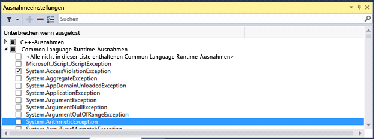
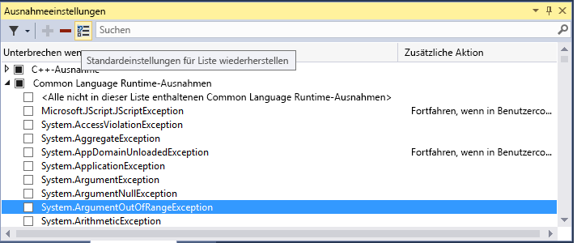
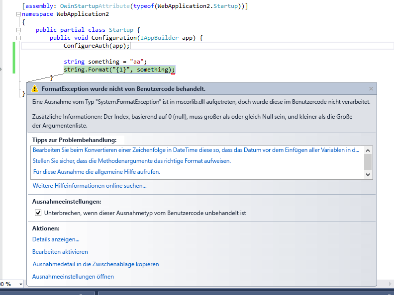
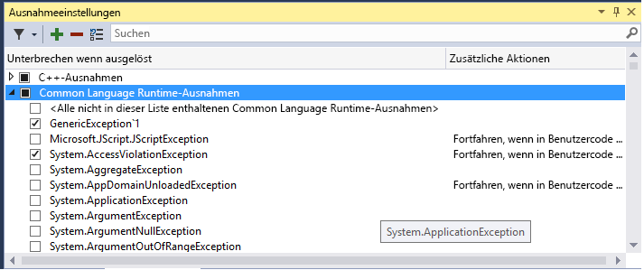

# <a name="manage-exceptions-with-the-debugger-in-visual-studio"></a>Verwalten von Ausnahmen mit dem Debugger in Visual Studio

Eine Ausnahme ist ein Hinweis auf einen Fehlerstatus, der auftritt, während ein Programm ausgeführt wird. Sie können dem Debugger mitteilen, welche Ausnahmen oder Sätze von Ausnahmen unterbrechen werden sollen und an welchem Punkt der Debugger unterbrochen werden soll (d. h. anhalten im Debugger). Wenn der Debugger unterbrochen wird, zeigt er an, wo die Ausnahme ausgelöst wurde. Sie können auch Ausnahmen hinzufügen oder löschen. Wenn eine Projekt Mappe in Visual Studio geöffnet ist, verwenden Sie **debug> Windows >-Ausnahme Einstellungen** , um das Fenster **Ausnahme Einstellungen** zu öffnen.

Bereitstellen von Handlern, die auf die wichtigsten Ausnahmen reagieren. Wenn Sie wissen möchten, wie Handler für Ausnahmen hinzugefügt werden, finden Sie weitere Informationen unter [beheben C# von Fehlern durch Schreiben von besseren Code](../debugger/write-better-code-with-visual-studio.md). Außerdem erfahren Sie, wie Sie den Debugger so konfigurieren, dass die Ausführung für einige Ausnahmen immer unterbricht.

Wenn eine Ausnahme ausgelöst wird, schreibt der Debugger eine Ausnahmemeldung an das Fenster **Ausgabe**. In den folgenden Fällen kann die Ausführung in den folgenden Fällen unterbricht werden:

- Es wird eine Ausnahme ausgelöst, die nicht behandelt wird.
- Der Debugger wird so konfiguriert, dass die Ausführung abgebrochen wird, bevor ein Handler aufgerufen wird.
- Sie haben [nur eigenen Code](../debugger/just-my-code.md)festgelegt, und der Debugger ist so konfiguriert, dass bei jeder Ausnahme, die nicht im Benutzer Code behandelt wird, unterbricht.

> [!NOTE]
> ASP.NET verfügt über einen Ausnahmehandler der obersten Ebene, der Fehlerseiten in einem Browser anzeigt. Die Ausführung wird nur unterbricht, wenn **nur eigenen Code** aktiviert ist. Ein Beispiel finden Sie unter anweisen [des Debuggers zum Fortfahren mit vom Benutzer nicht behandelten Ausnahmen weiter](#BKMK_UserUnhandled) unten.

<!-- Two consecutive notes are intentional here...-->

> [!NOTE]
> In Visual Basic-Anwendungen werden alle Fehler vom Debugger als Ausnahmen behandelt. Dies ist auch dann der Fall, wenn Sie Fehlerhandler des Typs On Error verwenden.

## <a name="tell-the-debugger-to-break-when-an-exception-is-thrown"></a>Den Debugger anweisen, zu unterbrechen, wenn eine Ausnahme ausgelöst wird

Der Debugger kann die Ausführung an dem Punkt unterbrechen, an dem eine Ausnahme ausgelöst wird. Sie können daher die Ausnahme untersuchen, bevor ein Handler aufgerufen wird.

Erweitern Sie im Fenster **Ausnahme Einstellungen** (**Debuggen > Windows >-Ausnahme Einstellungen**) den Knoten für eine Kategorie von Ausnahmen, z. b. **Common Language Runtime-Ausnahmen**. Aktivieren Sie dann das Kontrollkästchen für eine bestimmte Ausnahme innerhalb dieser Kategorie, z. b. **System. AccessViolationException**. Sie können auch eine ganze Kategorie von Ausnahmen auswählen.



> [!TIP]
> Sie können bestimmte Ausnahmen suchen, indem Sie das **Such** Fenster in der Symbolleiste **Ausnahme Einstellungen** verwenden oder suchen verwenden, um nach bestimmten Namespaces zu filtern (z. b. **System.IO**).

Wenn Sie im Fenster " **Ausnahme Einstellungen** " eine Ausnahme auswählen, wird die Ausführung des Debuggers unabhängig davon, ob die Ausnahme behandelt wird, unabhängig davon, ob Sie behandelt wird, unterbricht. Nun wird die Ausnahme als erste Chance bezeichnet. Im Folgenden einige Szenarios:

- In der folgenden C#-Konsolenanwendung löst die Main-Methode eine **AccessViolationException** in einem `try/catch`-Block aus.

  ```csharp
  static void Main(string[] args)
  {
      try
      {
          throw new AccessViolationException();
          Console.WriteLine("here");
      }
      catch (Exception e)
      {
          Console.WriteLine("caught exception");
      }
      Console.WriteLine("goodbye");
  }
  ```

  Wenn Sie **AccessViolationException** in den **Ausnahme Einstellungen**aktiviert haben, wird die Ausführung beim Ausführen dieses Codes im Debugger an der `throw` Zeile unterbrechen. Danach können Sie die Ausführung fortsetzen. In der Konsole sollten beide Zeilen angezeigt werden:

  ```cmd
  caught exception
  goodbye
  ```

  die `here` Zeile wird jedoch nicht angezeigt.

- Eine C# Konsolenanwendung verweist auf eine Klassenbibliothek mit einer Klasse, die über zwei Methoden verfügt. Eine Methode löst eine Ausnahme aus und behandelt Sie, während eine zweite Methode die gleiche Ausnahme auslöst, Sie aber nicht verarbeitet.

  ```csharp
  public class Class1
  {
      public void ThrowHandledException()
      {
          try
          {
              throw new AccessViolationException();
          }
          catch (AccessViolationException ave)
          {
              Console.WriteLine("caught exception" + ave.Message);
          }
      }

      public void ThrowUnhandledException()
      {
          throw new AccessViolationException();
      }
  }
  ```

  Dies ist die Hauptmethode der Konsolenanwendung:

  ```csharp
  static void Main(string[] args)
  {
      Class1 class1 = new Class1();
      class1.ThrowHandledException();
      class1.ThrowUnhandledException();
  }
  ```

  Wenn Sie **AccessViolationException** in den **Ausnahme Einstellungen**aktiviert haben, wird die Ausführung in der `throw` Zeile sowohl in **throwhandledexception ()** als auch in **throwunlenker dexception ()** unterbrechen, wenn Sie diesen Code im Debugger ausführen.

Um die Ausnahme Einstellungen auf die Standardeinstellungen wiederherzustellen, wählen Sie die Schaltfläche **Liste der Standardeinstellungen wiederherstellen** aus:



## <a name="BKMK_UserUnhandled"></a>Den Debugger anweisen, bei Ausnahmen, die vom Benutzer nicht behandelt werden, fortzufahren

Wenn Sie .net-oder JavaScript-Code mit [nur eigenen Code](../debugger/just-my-code.md)Debuggen, können Sie den Debugger anweisen, das Unterbrechen bei Ausnahmen zu verhindern, die nicht im Benutzercode behandelt, sondern an anderer Stelle verarbeitet werden.

1. Öffnen Sie im Fenster **Ausnahme Einstellungen das Kontext** Menü, indem Sie mit der rechten Maustaste auf eine Spalten Bezeichnung klicken, und wählen Sie dann **Spalten > zusätzliche Aktionen anzeigen**aus. (Wenn Sie **nur eigenen Code**deaktiviert haben, wird dieser Befehl nicht angezeigt.) Eine dritte Spalte mit dem Namen **zusätzliche Aktionen** wird angezeigt.

   

   Für eine Ausnahme, die "Continue" anzeigt, **Wenn in Benutzercode** in dieser Spalte nicht behandelt, wird der Debugger fortgesetzt, wenn diese Ausnahme nicht im Benutzercode behandelt, sondern extern verarbeitet wird.

2. Wenn Sie diese Einstellung für eine bestimmte Ausnahme ändern möchten, wählen Sie die Ausnahme aus, klicken Sie mit der rechten Maustaste, um das Kontextmenü anzuzeigen, und wählen Sie **weiter, wenn in Benutzer Code nicht behandelt**. Sie können auch die Einstellung für eine ganze Kategorie von Ausnahmen ändern, z. b. die gesamten Common Language Runtime-Ausnahmen).

   

ASP.NET-Webanwendungen behandeln Ausnahmen beispielsweise, indem Sie Sie in einen HTTP 500-Statuscode ([Ausnahmebehandlung in ASP.net-Web-API](/aspnet/web-api/overview/error-handling/exception-handling)) umwandelt, der Ihnen möglicherweise nicht hilft, die Quelle der Ausnahme zu bestimmen. Im folgenden Beispiel wird durch den Benutzercode `String.Format()` aufgerufen, wodurch eine <xref:System.FormatException>ausgelöst wird. Die Ausführung wird folgendermaßen unterbrochen:



## <a name="add-and-delete-exceptions"></a>Hinzufügen und Löschen von Ausnahmen

Sie können Ausnahmen hinzufügen und löschen. Wenn Sie einen Ausnahmetyp aus einer Kategorie löschen möchten, wählen Sie die Ausnahme aus, und wählen Sie auf der Symbolleiste **Ausnahme Einstellungen** die Schaltfläche **ausgewählte Ausnahme aus der Liste löschen** (das Minuszeichen) aus. Sie können auch mit der rechten Maustaste auf die Ausnahme klicken und im Kontextmenü die Option **Löschen** auswählen. Das Löschen einer Ausnahme hat denselben Effekt wie das Deaktivieren der Ausnahme, d. h., der Debugger wird nicht unterbrechen, wenn er ausgelöst wird.

So fügen Sie eine Ausnahme hinzu:

1. Wählen Sie im Fenster **Ausnahme Einstellungen** eine der Ausnahme Kategorien aus (z. b. **Common Language Runtime**).

2. Wählen Sie die Schaltfläche **eine Ausnahme zur ausgewählten Kategorie hinzufügen** (das Pluszeichen) aus.

   

3. Geben Sie den Namen der Ausnahme ein (z. b. **System. UriTemplateMatchException**).

   

   Die Ausnahme wird der Liste hinzugefügt (in alphabetischer Reihenfolge) und automatisch aktiviert.

Um eine Ausnahme zu den Ausnahmen für den GPU-Speicherzugriff, für JavaScript-Lauf Zeit Ausnahmen oder Win32-Ausnahme Kategorien hinzuzufügen, schließen Sie den Fehlercode und die Beschreibung ein.

> [!TIP]
> Überprüfen Sie die Rechtschreibung! Das Fenster **Ausnahmeeinstellungen** prüft nicht, ob eine hinzugefügte Ausnahme vorhanden ist. Bei Eingabe von **Sytem.UriTemplateMatchException** erhalten Sie daher einen Eintrag für diese Ausnahme und nicht für **System.UriTemplateMatchException**.

Ausnahmeeinstellungen werden in der SUO-Datei der Projektmappe beibehalten, sie gelten also für eine bestimmte Projektmappe. Sie können spezifische Ausnahmeeinstellungen nicht für andere Projektmappen wiederverwenden. Jetzt werden nur hinzugefügte Ausnahmen beibehalten. gelöschte Ausnahmen sind nicht. Sie können eine Ausnahme hinzufügen, die Projekt Mappe schließen und wieder öffnen, und die Ausnahme ist weiterhin vorhanden. Wenn Sie eine Ausnahme dagegen löschen und die Projektmappe anschließend schließen und wieder öffnen, wird die Ausnahme nicht mehr angezeigt.

Das Fenster **Ausnahmeeinstellungen** unterstützt generische Ausnahmetypen in C#, aber nicht in Visual Basic. Um bei Ausnahmen wie `MyNamespace.GenericException<T>`eine Unterbrechung vorzunehmen, müssen Sie die Ausnahme als **MyNamespace.GenericException`1**hinzufügen. Das heißt, wenn Sie eine Ausnahme wie diesen Code erstellt haben:

```csharp
public class GenericException<T> : Exception
{
    public GenericException() : base("This is a generic exception.")
    {
    }
}
```

Sie können die Ausnahme den **Ausnahme Einstellungen** mithilfe der vorherigen Prozedur hinzufügen:



## <a name="add-conditions-to-an-exception"></a>Hinzufügen von Bedingungen zu einer Ausnahme

Verwenden Sie das Fenster **Ausnahme Einstellungen** , um Bedingungen für Ausnahmen festzulegen. Zu den derzeit unterstützten Bedingungen gehören die Modulnamen, die für die Ausnahme eingeschlossen oder ausgeschlossen werden sollen. Durch Festlegen von Modulnamen als Bedingungen können Sie die Unterbrechung für die Ausnahme nur für bestimmte Code Module auswählen. Sie können auch eine Unterbrechung an bestimmten Modulen vermeiden.

> [!NOTE]
> Das Hinzufügen von Bedingungen zu einer Ausnahme wird ab [!include[vs_dev15](../misc/includes/vs_dev15_md.md)]unterstützt.

So fügen Sie bedingte Ausnahmen hinzu:

1. Wählen Sie im Fenster Ausnahme Einstellungen die Schaltfläche **Bedingungen bearbeiten** aus, oder klicken Sie mit der rechten Maustaste auf die Ausnahme, und wählen Sie **Bedingungen bearbeiten**.

   

2. Um der Ausnahme zusätzliche erforderliche Bedingungen hinzuzufügen, wählen Sie **Bedingung hinzufügen** für jede neue Bedingung aus. Weitere Bedingungs Zeilen werden angezeigt.

   

3. Geben Sie für jede Bedingungs Zeile den Namen des Moduls ein, und ändern Sie die Liste der Vergleichs Operatoren in " **gleich** " oder " **nicht gleich**". Sie können Platzhalter ( **\\\*** ) im Namen angeben, um mehr als ein Modul anzugeben.

4. Wenn Sie eine Bedingung löschen müssen, wählen Sie das **X** am Ende der Bedingungs Zeile aus.

## <a name="see-also"></a>Siehe auch

- [Fortfahren mit der Ausführung nach einer Ausnahme](../debugger/continuing-execution-after-an-exception.md)<br/>
- [Gewusst wie: Untersuchen von Systemcode nach einer Ausnahme](../debugger/how-to-examine-system-code-after-an-exception.md)<br/>
- [Gewusst wie: Verwenden von nativen Laufzeitprüfungen](../debugger/how-to-use-native-run-time-checks.md)<br/>
- [Use run-time checks without the C run-time library (Verwenden von Laufzeitüberprüfungen ohne die C-Laufzeitbibliothek)](../debugger/using-run-time-checks-without-the-c-run-time-library.md)<br/>
- [Erster Einblick in den Debugger](../debugger/debugger-feature-tour.md)
