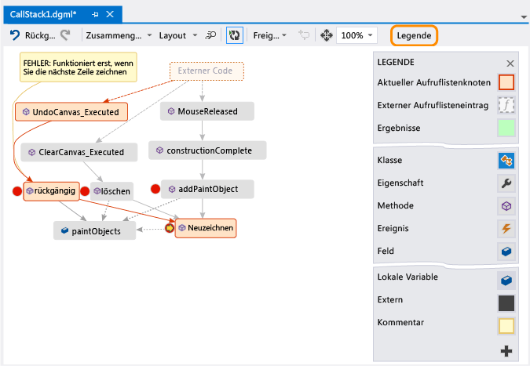

# Erstellen einer visuellen Zuordnung der Aufrufliste beim Debuggen (C#, Visual Basic, C++, JavaScript)

Erstellen Sie eine Code Map, um die Aufrufliste während des Debuggens visuell zu verfolgen. Sie können Notizen auf der Code Map vermerken, um das Verhalten des Codes zu verfolgen, sodass Sie sich auf das Suchen von Fehlern konzentrieren können.

In diesem Video wird eine exemplarische Vorgehensweise veranschaulicht: [Video: Visuelles Debuggen mit der Code Map-Debuggerintegration (Channel 9)](https://channel9.msdn.com/Series/Visual-Studio-2012-Premium-and-Ultimate-Overview/Visual-Studio-Ultimate-2012Debug-visually-with-Code-Map-debugger-integration)

Nähere Informationen zu Befehlen und Aktionen, die Sie für Code Maps verwenden können, finden Sie unter [Durchsuchen und Neuanordnen von Code Maps](../modeling/browse-and-rearrange-code-maps.md).

>[!IMPORTANT]
>Sie können Code Maps nur in [Visual Studio Enterprise](https://visualstudio.microsoft.com/downloads) erstellen.

Hier ist eine Code Map dargestellt:

 

##  Abbilden der Aufrufliste

1. Beginnen Sie in Visual Studio Enterprise in einem C#-, Visual Basic-, C++- oder JavaScript-Projekt mit dem Debuggen, indem Sie **Debuggen** > **Debuggen starten** auswählen oder **F5** drücken.

1. Gehen Sie wie folgt vor, nachdem Ihre App den Anhaltemodus erreicht hat oder Sie in eine Funktion gesprungen sind: Wählen Sie **Debuggen** > **Code Map** aus, oder drücken Sie **STRG**+**UMSCHALT**+ **`** .

   Die aktuelle Aufrufliste wird in einer neuen Code Map orange dargestellt:

   

Die Code Map wird automatisch aktualisiert, wenn Sie das Debuggen fortsetzen. Änderungen von Elementen oder des Layouts der Code Map haben keinerlei Auswirkung auf den Code. Sie können beliebigen Code in der Zuordnung gerne umbenennen, verschieben oder entfernen.

Bewegen Sie den Mauszeiger auf ein Element, und sehen Sie sich die QuickInfo an, um weitere Informationen zu einem Element zu erhalten. Sie können auch in der Symbolleiste die Option **Legende** auswählen, um Informationen zu den einzelnen Symbolen zu erhalten.

>[!NOTE]
>Die Meldung **Das Diagramm basiert möglicherweise auf einer älteren Version des Codes** oben in der Code Map bedeutet, dass sich der Code seit der letzten Aktualisierung der Code Map ggf. geändert hat. Zum Beispiel befindet sich möglicherweise ein Aufruf für die Zuordnung nicht mehr im Code. Schließen Sie die Meldung, und versuchen Sie dann, die Projektmappe vor der erneuten Aktualisierung der Zuordnung neu zu erstellen.

## Code Map: Externer Code

Standardmäßig wird nur Ihr eigener Code in der Code Map angezeigt. Zeigen Sie externen Code in der Code Map wie folgt an:

- Klicken Sie mit der rechten Maustaste in das Fenster **Aufrufliste**, und wählen Sie **Externen Code anzeigen** aus:

  
- Alternativ können Sie in Visual Studio unter **Tools** (oder **Debuggen**) > **Optionen** > **Debuggen** die Option **Nur meinen Code aktivieren** deaktivieren:

  

## Steuern des Layouts der Code Map

Wenn Sie das Layout der Code Map ändern, hat dies keinerlei Auswirkung auf den Code.

Wählen Sie zum Steuern des Layouts der Code Map in der Symbolleiste das Menü **Layout** aus.

Im Menü **Layout** können Sie Folgendes durchführen:

- Ändern Sie das Standardlayout.
- Beenden Sie das Verhalten, bei dem die Elemente der Code Map automatisch neu angeordnet werden, indem Sie die Option **Automatisches Layout beim Debugging** deaktivieren.
- Legen Sie fest, dass die Elemente in der Code Map beim Hinzufügen von neuen Elementen so wenig wie möglich neu angeordnet werden sollen, indem Sie die Option **Inkrementelles Layout** deaktivieren.

##  Erstellen von Notizen zum Code

Sie können Kommentare hinzufügen, um nachzuverfolgen, was im Code geschieht.

Klicken Sie zum Hinzufügen eines Kommentars mit der rechten Maustaste in die Code Map, wählen Sie **Bearbeiten** > **Neuer Kommentar** aus, und geben Sie dann den Kommentar ein.

Drücken Sie **UMSCHALT**+**EINGABE**, um in einem Kommentar eine neue Zeile hinzuzufügen.

 

##  Aktualisieren der Code Map mit der nächsten Aufrufliste

Wenn Sie Ihre App bis zum nächsten Breakpoint ausführen oder in eine Funktion springen, werden der Code Map automatisch neue Aufruflisten hinzugefügt.

Wählen Sie in der Code Map-Symbolleiste die Option  aus, um zu verhindern, dass in der Code Map automatisch neue Aufruflisten hinzugefügt werden. Aufruflisten, die in der Code Map bereits vorhanden sind, werden weiterhin hervorgehoben. Drücken Sie **STRG**+**UMSCHALT**+ **`** , um die aktuelle Aufrufliste der Code Map manuell hinzuzufügen.

##  Hinzufügen von zugehörigem Code zur Code Map

Nachdem Sie nun über eine Code Map verfügen, können Sie in C# oder Visual Basic Elemente hinzufügen, z. B. Felder, Eigenschaften und andere Methoden, um nachzuverfolgen, was im Code geschieht.

Sie können auf die Definition einer Methode im Code zugreifen, indem Sie in der Code Map auf die Methode doppelklicken oder diese auswählen und **F12** drücken. Alternativ können Sie auch mit der rechten Maustaste darauf klicken und dann **Zu Definition wechseln** auswählen.

Klicken Sie mit der rechten Maustaste auf eine Methode, und wählen Sie die nachzuverfolgenden Elemente aus, um diese der Code Map hinzuzufügen. Die zuletzt hinzugefügten Elemente werden grün dargestellt.

>[!NOTE]
>Standardmäßig werden beim Hinzufügen von Elementen zur Zuordnung auch die übergeordnete Gruppenknoten, wie Klasse, Namespace und Assembly, hinzugefügt. Sie können dieses Feature ein- und ausschalten, indem Sie in der Code Map-Symbolleiste die Schaltfläche **Übergeordnete Elemente einschließen** auswählen oder beim Hinzufügen von Elementen **STRG** drücken.

Setzen Sie das Erstellen der Zuordnung fort, um weiteren Code anzuzeigen.

 

 

##  Suchen von Fehlern mithilfe der Code Map
 Durch die Visualisierung des Codes können Sie Fehler schneller finden. Angenommen, Sie untersuchen einen Fehler in einer App zum Erstellen von Zeichnungen. Wenn Sie eine Linie zeichnen und versuchen, sie rückgängig zu machen, geschieht nichts, bis Sie eine andere Zeile zeichnen.

 Legen Sie die Haltepunkte `clear`, `undo` und `Repaint` fest, starten Sie das Debugging, und erstellen Sie eine Zuordnung wie die folgende:

 

 Sie stellen fest, dass alle Benutzergesten in der Zuordnung die `Repaint`-Funktion aufrufen, außer `undo`. Dies erklärt möglicherweise, warum `undo` nicht sofort funktioniert.

 Wenn Sie den Fehler korrigiert haben und die Ausführung der App fortsetzen, fügt die Code Map den neuen Aufruf von `undo` der Funktion `Repaint` hinzu:

 

## Freigeben der Code Map für andere Benutzer

Sie können eine Code Map exportieren, per Microsoft Outlook an andere Benutzer senden, in Ihrer Lösung speichern und in die Versionskontrolle einchecken.

Verwenden Sie in der Code Map-Symbolleiste die Option **Freigeben**, um die Code Map freizugeben oder zu speichern.

## Siehe auch
[Projektmappenübergreifendes Zuordnen von Abhängigkeiten](../modeling/map-dependencies-across-your-solutions.md)

[Verwenden von Code Maps zum Debuggen von Anwendungen](../modeling/use-code-maps-to-debug-your-applications.md)

[Ermitteln potenzieller Probleme mithilfe von Code Map-Analyzern](../modeling/find-potential-problems-using-code-map-analyzers.md)

[Durchsuchen und Neuanordnen von Code Maps](../modeling/browse-and-rearrange-code-maps.md)
