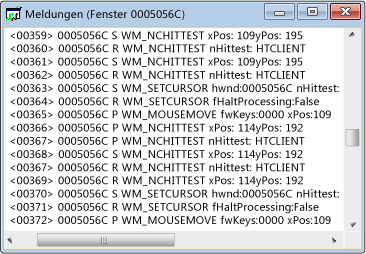

# Meldungsansicht
Jedes Fenster verfügt über einen Stream zugeordnete Meldung. Ansichtsfenster Nachrichten wird Meldungsstream. Das Fensterhandle, Message Authentication Code und Meldung werden angezeigt. Sie können eine Ansicht "Nachrichten" für einen Thread oder Prozess sowie erstellen. Dadurch können Sie zum Anzeigen von Nachrichten an alle Fenster, die im Besitz von einem bestimmten Prozess oder Thread, der besonders nützlich für das Erfassen von fenstermeldungen für die Initialisierung ist.

 Eine typische Ansicht Meldungsfenster wird unten angezeigt. Beachten Sie, dass die erste Spalte das Fensterhandle enthält, und die zweite Spalte einen Message Authentication Code enthält (beschrieben [Meldungscodes](../debugger/message-codes.md)). Decodierte Nachrichtenparameter und Rückgabewerte werden auf der rechten Seite.

  Spy++-Meldungsansicht

## Verfahren

#### Um eine Ansicht "Nachrichten" für ein Fenster, Prozess oder Thread zu öffnen.

1.  Verschieben des Fokus um eine [Windows-Ansicht](../debugger/windows-view.md), [Prozessansicht](../debugger/processes-view.md), oder [Ansicht "Threads"](../debugger/threads-view.md) Fenster.

2.  Suchen Sie den Knoten für das Element, dessen Nachrichten, die Sie untersuchen möchten, und wählen Sie ihn.

3.  Von der **Spy** Menü wählen **Protokollmeldungen**.

     Die [im Dialogfeld "Optionen" Nachricht](../debugger/message-options-dialog-box.md) wird geöffnet.

4.  Wählen Sie die Optionen für die Nachricht, die Sie anzeigen möchten.

5.  Drücken Sie **OK** zum Protokollieren von Nachrichten beginnen.

     Ein Nachrichten, die Fenster "Berichtsansicht" geöffnet wird, sowie einen **Nachrichten** Menü zur Spy++-Symbolleiste hinzugefügt wird. Abhängig von den ausgewählten Optionen, Nachrichten mit dem streamen beginnen in das aktive Fenster des Nachrichten-Ansicht.

6.  Wenn Sie über genügend Nachrichten verfügen, wählen Sie **Protokollierung beenden** aus der **Nachrichten** Menü.

## In diesem Abschnitt
 [Steuern der Meldungsansicht](../debugger/how-to-control-messages-view.md) wird erläutert, wie zum Verwalten der Ansicht "Nachrichten".

 [Öffnen der Meldungsansicht aus "Fenster Suchen"](../debugger/how-to-open-messages-view-from-find-window.md) wird erläutert, wie im Dialogfeld "Fenster Suchen" Ansicht "Nachrichten" zu öffnen.

 [Suchen nach einer Nachricht in der Meldungsansicht](../debugger/how-to-search-for-a-message-in-messages-view.md) wird erläutert, wie Sie eine bestimmte Nachricht in der Ansicht "Nachrichten".

 [Starten und Beenden der Meldungsprotokollanzeige](../debugger/how-to-start-and-stop-the-message-log-display.md) wird erläutert, wie zum Starten und beenden die nachrichtenprotokollierung.

 [Nachricht Codes](../debugger/message-codes.md) definiert, die die Codes für Nachrichten in der Meldungsansicht aufgeführt.

 [Anzeigen von Meldungseigenschaften](../debugger/how-to-display-message-properties.md) wie Weitere Informationen zu einer Meldung angezeigt.

## Verwandte Abschnitte
 [Spy++-Ansichten](../debugger/spy-increment-views.md) wird erläutert, die Spy++-Strukturansichten von Windows, Nachrichten, Prozesse und Threads.

 [Verwenden von Spy++](../debugger/using-spy-increment.md) stellt die Spy++-Tools vor und erläutert, wie sie verwendet werden kann.

 [Optionen (Dialogfeld) Nachricht](../debugger/message-options-dialog-box.md) verwendet, um auszuwählen, welche Nachrichten in der aktiven Ansicht "Nachrichten" aufgeführt sind.

 [Meldungssuche (Dialogfeld) Nachricht](../debugger/message-search-dialog-box.md) verwendet, um den Knoten für eine bestimmte Nachricht in der Ansicht "Nachrichten" suchen.

 [Im Dialogfeld Eigenschaften von Nachrichten](../debugger/message-properties-dialog-box.md) verwendet, um die Eigenschaften einer Nachricht, die ausgewählten Meldung anzuzeigen.

 [Spy++-Referenz](../debugger/spy-increment-reference.md) enthält Abschnitte, die jedes Spy++ Menü- und Dialogfeldressourcen Feld beschreibt.