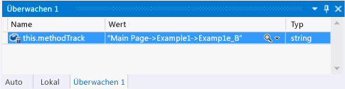
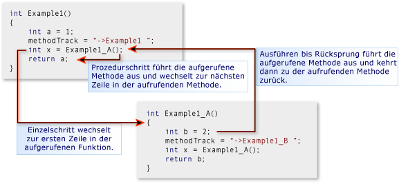
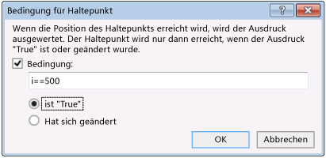
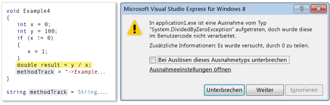
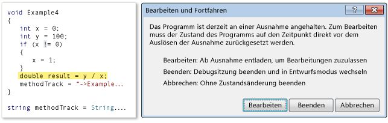
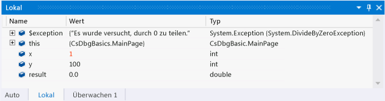

# Navigieren in einer Debugsitzung in Visual Studio (Xaml und C#)
[!INCLUDE[vs2017banner](../code-quality/includes/vs2017banner.md)]

Mit diesem Schnellstart wird veranschaulicht, wie in Debugsitzungen in Visual Studio navigiert und wie der Programmzustand einer Sitzung angezeigt und geändert wird.  
  
 Dieser Schnellstart richtet sich an Entwickler, die mit dem Debuggen in Visual Studio nicht vertraut sind, sowie an Entwickler, die mehr zum Navigieren in einer Debugsitzung in Visual Studio erfahren möchten. Das Debuggen selbst wird in diesem Schnellstart nicht erläutert. Anhand der Methoden des Beispielcodes sollen lediglich die in diesem Thema beschriebenen Debuggingsprozeduren aufgezeigt werden. Die Methoden stellen keine bewährte Methoden für das Entwerfen von Apps oder Funktionen dar. Tatsächlich werden Sie rasch feststellen, dass die Methoden und die App selbst nicht besonders viele Aufgaben erfüllen.  
  
 Die Abschnitte dieses Schnellstarts wurden so unabhängig voneinander wie möglich konzipiert, sodass Sie einzelne Abschnitte überspringen können, die Ihnen bereits vertraute Informationen enthalten. Sie müssen auch keine Beispiel\-App erstellen. Es wird jedoch empfohlen, und wir haben den entsprechenden Prozess so einfach wie möglich gestaltet.  
  
 **Debugger\-Tastenkombinationen.** Die Navigation im Visual Studio\-Debugger ist für Maus und Tastatur optimiert. Für viele Schritte in diesem Thema werden die Zugriffstasten oder Tastenkombinationen in Klammern angeführt. So weist beispielsweise \(Tastatur: F5\) darauf hin, dass mit der F5\-TASTE die Ausführung des Debuggers gestartet oder fortgesetzt wird.  
  
## In diesem Thema  
 Sie lernen Folgendes:  
  
-   [Erstellen der Beispiel-App](#BKMK_CreateTheApplication)  
  
-   [Festlegen eines Haltepunkts und Ausführen bis zu diesem Haltepunkt, Durchlaufen einer Methode in Einzelschritten und Untersuchen von Programmdaten](#BKMK_StepInto)  
  
-   [Einzel- und Prozedurschritte für Methoden](#BKMK_StepIntoOverOut)  
  
-   [Festlegen eines bedingten Haltepunkts, Ausführen bis zum Cursor und Visualisieren einer Variablen](#BKMK_ConditionCursorVisualize)  
  
-   [Bearbeiten und Fortfahren, Wiederherstellung nach einer Ausnahme](#BKMK_EditContinueRecoverExceptions)  
  
##   Erstellen der Beispiel\-App  
 Beim Debuggen geht es um den Code. Daher wird für die Beispiel\-App das Framework der Windows Store\-App nur verwendet, um eine Quelldatei zu erstellen, mit der Sie erkennen können, wie das Navigieren in einer Debugsitzung funktioniert, und wie Sie den Programmzustand prüfen und ändern können. Der gesamte aufgerufene Code wird vom Konstruktor der Hauptseite aufgerufen. Es werden keine Steuerelemente hinzugefügt und keine Ereignisse behandelt.  
  
 **Erstellen Sie eine standardmäßige C\#\-Windows Store\-App.** Öffnen Sie Visual Studio. Wählen Sie auf der Homepage den Link **Neues Projekt**. Wählen Sie im Dialogfeld "Neues Projekt" in der Liste **Installiert** die Option **Visual C\#** und anschließend **Windows Store** aus. Wählen Sie in der Liste der Projektvorlagen **Anwendung** aus. In Visual Studio werden eine neue Projektmappe und ein Projekt erstellt sowie der MainPage.xaml\-Designer und der XAML\-Code\-Editor angezeigt.  
  
 **Öffnen Sie die Quelldatei "MainPage.xaml.cs".** Klicken Sie mit der rechten Maustaste an einer beliebigen Stelle im XAML\-Editor, und wählen Sie **Code anzeigen** aus. Die Code\-Behind\-Datei "MainPage.xaml.cs" wird angezeigt. Beachten Sie, dass in der Datei nur eine Methode, der `MainPage()`\-Konstruktor, aufgeführt wird.  
  
 **Ersetzen Sie den MainPage\-Konstruktor durch den Beispielcode.** Löschen Sie die MainPage\(\)\-Methode. Folgen Sie diesem Link: [Beispielcode für die Navigation im Debugger \(Xaml und C\#\)](../debugger/debugger-navigation-sample-code-xaml-and-csharp.md), und kopieren Sie dann den im C\#\-Abschnitt aufgelisteten  Code in die Zwischenablage. \(Wählen Sie im Browser oder in der Hilfeansicht **Zurück** aus, um zu dieser Schnellstartseite zurückzukehren.\) Fügen Sie im Visual Studio\-Editor den Code im `partial class MainPage`\-Block ein. Wählen Sie STRG \+ S, um die Datei zu speichern.  
  
 Sie können nun den Beispielen in diesem Thema folgen.  
  
##   Festlegen eines Haltepunkts und Ausführen bis zu diesem Haltepunkt, Durchlaufen einer Methode in Einzelschritten und Untersuchen von Programmdaten  
 Die gängigste Methode, eine Debugsitzung zu starten, ist die Auswahl von **Debuggen starten** im Menü **Debuggen** \(Tastatur: F5\). Die Ausführung wird gestartet und fortgeführt, bis ein Haltepunkt erreicht wird, bis Sie sie manuell anhalten, bis eine Ausnahme auftritt, oder bis die App beendet ist.  
  
 Wenn die Ausführung im Debugger angehalten wird, können Sie den Wert einer aktiven Variablen in einem Datentipp anzeigen, indem Sie die Maus über die Variable bewegen. Sie können auch die Fenster "Lokal" und "Auto" öffnen, um Listen der aktiven Variablen und ihrer aktuellen Werte anzuzeigen. Durch das Hinzufügen einer oder mehrerer Variablen zu einem Überwachungsfenster können Sie sich auf den Wert der Variablen konzentrieren, während die App die Ausführung fortsetzt.  
  
 Nach dem Abbrechen der App\-Ausführung \(das auch als Debuggerunterbrechung bezeichnet wird\) können Sie steuern, wie der Rest des Programmcodes ausgeführt wird. Sie können zeilenweise fortsetzen, vom Methodenaufruf zur Methode selbst wechseln oder eine aufgerufene Methode in einem einzigen Schritt ausführen. Diese Prozeduren werden als Durchlaufen der App  in Einzelschritten bezeichnet. Sie können zudem die Standardausführung der App fortsetzen und bis zum nächsten festgelegten Haltepunkt oder der Codezeile ausführen, in der sich der Cursor befindet. Sie können die Debugsitzung jederzeit beenden. Der Debugger wurde entworfen, um die erforderlichen Aufräumarbeiten durchzuführen und die Ausführung zu beenden.  
  
### Beispiel 1  
 In diesem Beispiel legen Sie einen Haltepunkt im MainPage\-Konstruktor der Datei "MainPage.xaml.cs" fest, führen einen Einzelschritt in die erste Methode durch, zeigen Variablenwerte an, und beenden anschließend das Debuggen.  
  
 **Festlegen eines Haltepunkts.** Legen Sie im MainPage\-Konstruktor einen Haltepunkt in der `methodTrack = "Main Page";`\-Anweisung fest. Wählen Sie die Zeile im schattierten Bundsteg des Quellcode\-Editors aus \(Tastatur: Positionieren Sie den Cursor in der Zeile, und drücken Sie F9\).  
  
   
  
 Das Haltepunktsymbol wird im Bundsteg angezeigt.  
  
 **Ausführen bis zum Haltepunkt.** Starten Sie die Debugsitzung, indem Sie im Menü **Debuggen** die Option **Debuggen starten** auswählen \(Tastatur: F5\).  
  
 Die App wird ausgeführt und hält die Ausführung direkt vor der Anweisung an, in der der Haltepunkt gesetzt wurde.  Das Symbol der aktuellen Zeile im Bundsteg weist auf die aktuelle Position hin, und die aktuelle Anweisung ist hervorgehoben.  
  
   
  
 Sie können die Ausführung der App nun steuern. Zudem können Sie den Programmzustand überprüfen, während Sie die Programmanweisungen durchlaufen.  
  
 **Einzelschritt in die Methode.** Wählen Sie im Menü **Debuggen** die Option **Einzelschritt** aus \(Tastatur: F11\).  
  
   
  
 Beachten Sie, dass der Debugger zur nächsten Zeile bewegt wird. Hierbei handelt es sich um einen Aufruf der Methode "Example1". Wählen Sie erneut "Einzelschritt" aus. Der Debugger wechselt zum Einstiegspunkt der Methode "Example1". Dies weist darauf hin, dass die Methode in der Aufrufliste geladen wurde und dass der Arbeitsspeicher für lokale Variablen zugeordnet wurde.  
  
 Wenn Sie einen Einzelschritt in eine Codezeile durchführen, führt der Debugger eine der folgenden Aktionen aus:  
  
-   Wenn die folgende Anweisung kein Aufruf einer Funktion Ihrer Projektmappe ist, führt der Debugger die Anweisung aus, wechselt zur folgenden Anweisung und hält dann die Ausführung an.  
  
-   Wenn es sich bei der Anweisung um den Aufruf einer Funktion in der Projektmappe handelt, wechselt der Debugger in den Einstiegspunkt der aufgerufenen Funktion und hält dann die Ausführung an.  
  
 Fahren Sie mit den Einzelschritten der Anweisungen von "Example1" fort, bis Sie den Endpunkt erreicht haben. Der Debugger hebt die schließende geschweifte Klammer der Methode hervor.  
  
 **Überprüfen der Variablenwerte in den Datentipps.** Wenn Sie die Maus auf einen Variablennamen bewegen, werden der Name, der Wert und der Typ der Variablen in einem Datentipp angezeigt.  
  
   
  
 Bewegen Sie die Maus auf die Variable `a`. Beachten Sie den Namen, den Wert und den Datentyp. Bewegen Sie die Maus auf die Variable `methodTrack`. Beachten Sie erneut den Namen, den Wert und den Datentyp.  
  
 **Überprüfen der Variablenwerte im Lokalfenster.** Zeigen Sie im Menü **Debuggen** auf **Fenster**, und wählen Sie **Lokale** aus. \(Tastatur: Alt\+4\).  
  
   
  
 Das Lokalfenster ist eine Strukturansicht der Parameter und Variablen der Funktion. Die Eigenschaften einer Objektvariablen sind untergeordnete Knoten des Objekts selbst. Die `this`\-Variable ist ein ausgeblendeter Parameter in den einzelnen Objektmethoden, der das Objekt selbst darstellt. In diesem Fall entspricht die Variable der MainPage\-Klasse. Da `methodTrack` ein Member der MainPage\-Klasse ist, werden der Wert und Datentyp in einer Zeile unterhalb von `this` aufgeführt. Erweitern Sie den Knoten `this`, um die `methodTrack`\-Informationen anzuzeigen.  
  
 **Hinzufügen einer Überwachung für die "methodTrack"\-Variable.** Die `methodWatch`\-Variable wird in diesem Schnellstart verwendet, um die in den Beispielen aufgerufenen Methoden aufzuzeigen. Um das Anzeigen des Variablenwerts zu vereinfachen, fügen Sie diesen einem Überwachungsfenster hinzu. Klicken Sie im Lokalfenster mit der rechten Maustaste auf den Variablennamen, und wählen Sie dann **Überwachung hinzufügen** aus.  
  
   
  
 In einem Überwachungsfenster können mehrere Variablen überwacht werden. Die Werte der überwachten Variablen werden wie die Werte in den Lokal\- und Datentippfenstern aktualisiert, wenn die Ausführung angehalten wird. Sie können dem Überwachungsfenster zudem Variablen vom Code\-Editor aus hinzufügen. Wählen Sie die zu überwachende Variable aus, klicken Sie mit der rechten Maustaste, und wählen Sie **Überwachung hinzufügen** aus.  
  
##   Einzel\- und Prozedurschritte für Methoden  
 Im Gegensatz zu einem von einer übergeordneten Methode aufgerufenen Einzelschritt einer Methode wird bei einem Prozedurschritt die untergeordnete Methode ausgeführt und anschließend beim Fortsetzen der übergeordneten Methode die Ausführung in der aufrufenden Methode abgebrochen. Sie können für eine Methode einen Prozedurschritt ausführen, wenn Sie mit der Funktionsweise der Methode vertraut und sicher sind, dass dessen Ausführung das zu untersuchende Problem nicht beeinflusst.  
  
 Bei einem Prozedurschritt für eine Codezeile, die keinen Methodenaufruf enthält, wird die Zeile wie bei einem Einzelschritt ausgeführt.  
  
 Beim Ausführen von einer untergeordneten Methode aus wird die Ausführung der Methode fortgesetzt und dann angehalten, wenn die Methode zu ihrer aufrufenden Methode zurückkehrt. Sie können einen Prozedurschritt aus einer langen Funktion durchführen, wenn Sie erkannt haben, dass der Rest der Funktion nicht relevant ist.  
  
 Bei Prozedurschritten aus einer Funktion wird diese ausgeführt.  
  
   
  
### Beispiel 2  
 In diesem Beispiel führen Sie Einzel\- und Prozedurschritte für Methoden aus.  
  
 **Aufrufen der Methode "Example2" im MainPage\-Konstruktor.** Bearbeiten Sie den MainPage\-Konstruktor, und ersetzen Sie die Zeile nach `methodTrack = String.Empty;` durch `Example2();`.  
  
   
  
 **Ausführen bis zum Haltepunkt.** Starten Sie die Debugsitzung, indem Sie im Menü **Debuggen** die Option **Debuggen starten** auswählen \(Tastatur: F5\). Der Debugger unterbricht die Ausführung am Haltepunkt.  
  
 **Prozedurschritt für die Codezeile.** Wählen Sie im Menü **Debuggen** die Option **Prozedurschritt** aus \(Tastatur: F10\). Der Debugger führt die `methodTrack = "MainPage";`\-Anweisung auf die gleiche Weise wie den Einzelschritt in die Anweisung aus.  
  
 **Einzelschritt in "Example2" und "Example2\_A".** Wählen Sie die F11\-Taste, um einen Einzelschritt in die Methode von "Example 2" durchzuführen. Fahren Sie mit den Einzelschritten in die "Example2"\-Anweisungen fort, bis Sie die Zeile `int x = Example2_A();` erreichen. Führen Sie erneut für diese Zeile einen Einzelschritt durch, um zum Einstiegspunkt von "Example2\_A" zu gelangen. Fahren Sie mit den Einzelschritten in den einzelnen Anweisungen von "Example2\_A" fort, bis Sie zu "Example2" zurückkehren.  
  
   
  
 **Prozedurschritt für eine Funktion.** Beachten Sie, dass die nächste Zeile in "Example2" \(`int y = Example2_A();`\) im Wesentlichen der vorherigen Zeile entspricht. Sie können problemlos einen Prozedurschritt für diese Zeile durchführen. Drücken Sie die Taste F10, um von der Fortsetzung von "Example2" zu diesem zweiten Aufruf von "Example2\_A" zu wechseln. Drücken Sie F10, um einen Prozedurschritt für diese Methode durchzuführen. Beachten Sie, dass die Zeichenfolge `methodTrack` darauf hinweist, dass die Methode "Example2\_A" zweimal ausgeführt wurde. Beachten Sie auch, dass der Debugger sofort zur nächsten Zeile wechselt. Die Ausführung wird nicht an dem Punkt unterbrochen, an dem "Example2" fortgesetzt wird.  
  
 **Prozedurschritt aus einer Funktion.** Wählen Sie die F11\-Taste, um einen Einzelschritt in die Methode "Example2\_B" durchzuführen. Beachten Sie, dass sich "Example2\_B" kaum von "Example2\_A" unterscheidet. Um einen Prozedurschritt aus der Methode durchzuführen, wählen Sie im Menü **Debuggen** die Option **Prozedurschritt** aus \(Tastatur: UMSCHALT\+F11\). Beachten Sie, dass die Variable `methodTrack` angibt, dass "Example2\_B" ausgeführt wurde, und dass der Debugger zu dem Punkt zurückgekehrt ist, an dem "Example2" fortgesetzt wird.  
  
 **Beenden des Debuggens.** Wählen Sie im Menü "Debuggen" die Option "Debuggen beenden" aus \(Tastatur: UMSCHALT\+F5\). Damit wird die Debugsitzung beendet.  
  
##   Festlegen eines bedingten Haltepunkts, Ausführen bis zum Cursor und Visualisieren einer Variablen  
 Ein bedingter Haltepunkt legt eine Bedingung fest, unter der der Debugger die Ausführung unterbricht. Die Bedingung kann mit beliebigen Codeausdrücken angegeben werden, die als "true" oder "false" ausgewertet werden können. So können Sie beispielsweise einen bedingten Haltepunkt nur dann zum Prüfen des Programmzustands einer häufig aufgerufenen Methode verwenden, wenn eine Variable einen bestimmten Wert erreicht.  
  
 Das Ausführen bis zum Cursor entspricht dem Festlegen eines einmaligen Haltepunkts. Wenn die Ausführung angehalten wird, können Sie eine Zeile in der Quelle auswählen und die Ausführung fortsetzen, bis die ausgewählte Zeile erreicht ist.  So können Sie beispielsweise die Einzelschritte einer Schleife in einer Methode durchlaufen und feststellen, dass der Code in der Schleife ordnungsgemäß ausgeführt wird. Anstatt alle Iterationen der Schleife zu durchlaufen, können Sie bis zum Cursor ausführen, der nach dem Ausführen der Schleife positioniert wird.  
  
 Mitunter ist es schwierig, einen Variablenwert in der Zeile eines Datentipp\- oder Variablenfensters anzuzeigen. Der Debugger kann Zeichenfolgen, HTML und XML in einer Text\-Schnellansicht anzeigen, die eine formatierte Ansicht des Werts in einem bildlauffähigen Fenster darstellt.  
  
### Beispiel 3  
 In diesem Beispiel legen Sie einen bedingten Haltepunkt fest, um an einer bestimmten Iteration einer Schleife zu unterbrechen und anschließend bis zum nach der Schleife positionierten Cursor auszuführen. Zudem wird der Wert der Variablen in einer Text\-Schnellansicht angezeigt.  
  
 **Aufrufen der Methode "Example3" im MainPage\-Konstruktor.** Bearbeiten Sie den MainPage\-Konstruktor, und ersetzen Sie die Zeile nach `methodTrack = String.Empty;` durch die Zeile `Example3();`.  
  
   
  
 **Ausführen bis zum Haltepunkt.** Starten Sie die Debugsitzung, indem Sie im Menü **Debuggen** die Option **Debuggen starten** auswählen \(Tastatur: F5\). Der Debugger unterbricht die Ausführung am Haltepunkt in der MainPage\-Methode.  
  
 **Einzelschritt in die Methode "Example3".** Wählen Sie im Menü **Debuggen** die Option **Einzelschritt** aus \(Tastatur: F11\), um zum Einstiegspunkt der Methode "Example3" zu wechseln. Führen Sie weitere Einzelschritte durch, bis Sie ein oder zwei Schleifen des `for`\-Blocks durchlaufen haben. Beachten Sie, dass es sehr lange dauern würde, alle 1000 Iterationen zu durchlaufen.  
  
 **Festlegen eines bedingten Haltepunkts.** Klicken Sie im linken Bundsteg des Codefensters mit der rechten Maustaste auf die Zeile `x += i;`, und wählen Sie dann **Bedingung** aus. Aktivieren Sie das Kontrollkästchen **Bedingung**, und geben Sie dann im Textfeld `i == 500;` ein. Wählen Sie die Option **Ist "True"** und anschließend **OK** aus. Mithilfe des Haltepunkts können Sie den Wert an der 500. Iteration der `for`\-Schleife überprüfen.  
  
   
  
 Sie erkennen das Symbol eines bedingten Haltepunkts am weißen Kreuz.  
  
   
  
 **Ausführen bis zum Haltepunkt.** Wählen Sie im Menü "Debuggen" die Option "Weiter" aus \(Tastatur: F5\). Stellen Sie im Lokalfenster sicher, dass der aktuelle Wert von `i` 500 ist. Beachten Sie, dass die Variable `s` als einzelne Zeile dargestellt wird und wesentlich länger als das Fenster ist.  
  
 **Visualisieren einer Zeichenfolgenvariablen.** Klicken Sie in der Spalte **Wert** von `s` auf das Lupensymbol.  
  
 Das Text\-Schnellansichtsfenster wird angezeigt, in dem der Wert der Zeichenfolge als mehrzeilige Zeichenfolge dargestellt wird.  
  
 **Ausführen bis zum Cursor.** Klicken Sie mit der rechten Maustaste auf die Zeile `methodTrack += "->Example3";`, und wählen Sie dann **Ausführen bis Cursor** aus \(Tastatur: Bewegen Sie den Cursor in die Zeile; STRG\+F10\). Der Debugger schließt die Schleifeniterationen ab und hält anschließend die Ausführung an der Zeile an.  
  
 **Beenden des Debuggens.** Wählen Sie im Menü "Debuggen" die Option "Debuggen beenden" aus \(Tastatur: UMSCHALT\+F5\). Damit wird die Debugsitzung beendet.  
  
##   Bearbeiten und Fortfahren, Wiederherstellung nach einer Ausnahme  
 Unter bestimmten Umständen können Sie beim Unterbrechen von Code im Visual Studio\-Debugger den Wert von Variablen und sogar die Logik von Anweisungen ändern. Diese Funktionalität wird als Bearbeiten und Fortfahren bezeichnet.  
  
 Das Bearbeiten und Fortfahren kann besonders hilfreich sein, wenn Sie an einer Ausnahme unterbrechen. Anstatt das Debuggen einer langen und komplexen Prozedur zum Vermeiden der Ausnahme beenden und neu starten zu müssen, kann die Ausnahme "abgewickelt" werden, um mit der Ausführung an einen Punkt unmittelbar vor dem Auftreten der Ausnahme zu wechseln. Dort kann die zu beanstandende Variable oder Anweisung geändert und mit der aktuellen Debugsitzung in einem Zustand fortgefahren werden, der keine Ausnahme auslöst.  
  
 Obwohl Sie das Bearbeiten und Fortfahren in einer Vielzahl von Situationen verwenden können, sind die jeweiligen Bedingungen, unter denen dies nicht unterstützt wird, nur schwer festzumachen, da die Zustände abhängig sind von der Programmiersprache, vom aktuellen Zustand des Programmstapels und von der Fähigkeit des Debuggers, den Zustand zu ändern, ohne den Prozess zu beeinträchtigen. Die beste Methode zum Ermitteln, ob eine Bearbeitungsänderung unterstützt wird, sind letztlich entsprechende Versuche. Der Debugger informiert Sie sofort, wenn die Änderung nicht unterstützt wird.  
  
### Beispiel 4  
 In diesem Beispiel führen Sie den Debugger bis zu einer Ausnahme aus, kehren in der Ausnahme zurück, korrigieren die Logik der Methode und ändern dann den Wert einer Variablen, damit die Ausführung der Methode fortgesetzt werden kann.  
  
 **Aufrufen der Methode "Example4" im MainPage\-Konstruktor.** Bearbeiten Sie den MainPage\(\)\-Konstruktor, und ersetzen Sie die Zeile nach `methodTrack = String.Empty;` durch die Zeile `Example4();`.  
  
   
  
 **Ausführen bis zur Ausnahme.** Starten Sie die Debugsitzung, indem Sie im Menü **Debuggen** die Option **Debuggen starten** auswählen \(Tastatur: F5\). Drücken Sie erneut F5, um die Ausführung fortzusetzen. Der Debugger unterbricht die Ausführung an der Ausnahme in der "Example4"\-Methode und zeigt ein Ausnahmedialogfeld an.  
  
   
  
 **Ändern der Programmlogik.** Es ist offensichtlich, dass der Fehler in der `if`\-Bedingung liegt: Der Wert von `x` sollte geändert werden, wenn `x` gleich "0", nicht jedoch wenn `x` nicht gleich null ist. Wählen Sie **Unterbrechen**, um die Logik der Methode zu korrigieren. Beim Versuch, die Zeile zu bearbeiten, wird ein weiteres Dialogfeld angezeigt.  
  
   
  
 Wählen Sie **Bearbeiten** aus, und ändern Sie dann die Zeile `if (x != 0)` in `if (x == 0)`. Der Debugger übernimmt die Änderungen an der Programmlogik in die Quelldatei.  
  
 **Ändern des Variablenwerts.** Überprüfen Sie den Wert von `x` im Datentipp\- oder Lokalfenster. Er ist weiterhin "0" \(null\). Wenn Sie versuchen, die Anweisung auszuführen, die die ursprüngliche Ausnahme verursacht hat, wird diese erneut ausgelöst. Sie können den Wert von `x` ändern. Doppelklicken Sie im Lokalfenster auf die Spalte **Wert** der Zeile **x**. Ändern Sie den Wert von "0" in "1".  
  
   
  
 Drücken Sie die Taste F11, um zu der Anweisung zu wechseln, die zuvor eine Ausnahme ausgelöst hat. Beachten Sie, dass die Zeile ohne Fehler ausgeführt wird. Drücken Sie erneut F11.  
  
 **Beenden des Debuggens.** Wählen Sie im Menü **Debuggen** die Option **Debuggen beenden** aus \(Tastatur: UMSCHALT\+F5\). Damit wird die Debugsitzung beendet.  
  
## Siehe auch  
 [Starten einer Debugsitzung \(VB, C\#, C\+\+ und XAML\)](../debugger/start-a-debugging-session-for-a-store-app-in-visual-studio-vb-csharp-cpp-and-xaml.md)   
 [Auslösen von Anhalte\-, Fortsetzungs\- und Hintergrundereignissen für Windows Store](../debugger/how-to-trigger-suspend-resume-and-background-events-for-windows-store-apps-in-visual-studio.md)   
 [Debuggen von Apps in Visual Studio](../debugger/debug-store-apps-in-visual-studio.md)