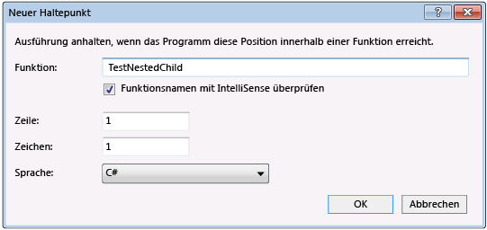
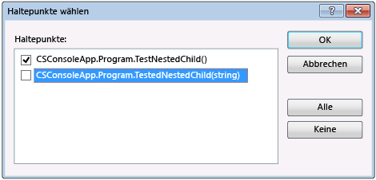

# <a name="navigate-through-code-with-the-visual-studio-debugger"></a>Navigieren Sie im Code mit Visual Studio-debugger

Visual Studio-Debugger können Sie das Navigieren im Code, untersuchen Sie den Status einer App und der Ausführungsablauf anzeigen. Sie können die Tastenkombinationen in Visual Studio, Debug-Befehle, Haltepunkte und andere Funktionen verwenden, um schnell auf den Code zu erhalten, die Sie untersuchen möchten. Vertrautheit mit dem Debugger-Navigation-Befehle und Verknüpfungen können sie schneller und einfacher zu finden und Lösung von Anwendungsproblemen.  Wenn dies das erste Mal, die Sie versucht haben ist, um Code zu debuggen, sollten Sie lesen [Debuggen für absolute Anfänger](../debugger/debugging-absolute-beginners.md) und [Debuggen, Techniken und Tools](../debugger/write-better-code-with-visual-studio.md) , bevor Sie diesen Artikel durchgehen.
  
## <a name="basic-debugging"></a>Debuggen – Grundlagen  

Um Ihre app mit dem angefügten Debugger zu starten, drücken Sie die **F5**Option **Debuggen** > **Debuggen starten**, oder wählen Sie den grünen Pfeil in der Visual Studio-Symbolleiste.  
  
   
  
Während des Debuggens, zeigt eine gelbe Hervorhebung die Codezeile, die weiter ausgeführt wird.  
  
   
  
Die meisten Debuggerfenster, z. B. die **Module** und **Watch** Windows stehen nur während der Ausführung des Debuggers. Einige Debuggerfunktionen, z. B. Anzeigen der Variablenwerte in den **"lokal"** Fenster oder Auswerten von Ausdrücken in der **sehen Sie sich** Fenster, stehen zur Verfügung, nur während der Debugger an einem Haltepunkt, so genannte angehalten wird *Unterbrechungsmodus*. 

Klicken Sie im Unterbrechungsmodus befindet app-Ausführung wird angehalten, während die Funktionen, Variablen, und Objekte im Speicher verbleiben. Sie können der Elemente-Positionen und Zustände, Suchen nach Verstößen oder Fehlern überprüfen. Bei einigen Projekttypen können Sie auch die app im Unterbrechungsmodus Anpassungen vornehmen. Video mit diese Funktionen, finden Sie unter [erste Schritte mit dem Debugger](https://www.youtube.com/watch?v=FtGCi5j30YU&list=PLReL099Y5nRfw6VNvzMkv0sabT2crbSpK&index=6).

Wenn die im Code unterbrochen wird, das keine Quell- oder Symboldateien (*PDB*) Dateien, die geladen werden, zeigt der Debugger eine **Quelle wurde nicht gefunden** oder **keine Symbole gefunden** Seite, die Ihnen helfen kann Suchen Sie und Laden Sie die Dateien. Weitere Informationen finden Sie unter [Angeben von Symbol- und Quelldateien](../debugger/specify-symbol-dot-pdb-and-source-files-in-the-visual-studio-debugger.md). Wenn Sie die Dateien Symbol- oder Quelldateien nicht laden können, können Sie immer noch Debuggen die Assemblyanweisungen in die **Disassembly** Fenster. 

Sie haben keine immer zum Starten des Debuggings, indem Sie eine app am Anfang starten. Drücken Sie **F11** zu [Einzelschritte in Code](#BKMK_Step_into__over__or_out_of_the_code), drücken Sie die **F10** zu [überspringen](#BKMK_Step_over_Step_out), oder [führen Sie an einem bestimmten Speicherort oder Funktion](#BKMK_Break_into_code_by_using_breakpoints_or_Break_All).    

##  <a name="step-through-code"></a>Schritt-für-Schritt-Ausführung des Codes

Debuggerbefehle aus Schritt können Sie den app-Status zu überprüfen, oder erfahren Sie mehr über die Ausführungsablauf. 

Wenn Sie den Einstiegspunkt in Ihrer app finden möchten, beginnen Sie mit **F10** oder **F11**.  

### <a name="BKMK_Step_into__over__or_out_of_the_code"></a> Einzelschritt in den Code Zeile für Zeile  

Verwenden Sie zum Beenden in jeder Zeile des Codes oder der Anweisung, die während des Debuggens **Debuggen** > **Einzelschritt**, oder drücken Sie **F11**.  

Der Debugger nacheinander codeanweisungen, nicht physische Zeilen. Beispielsweise kann eine `if`-Klausel in eine Zeile geschrieben werden:  
  
  ```csharp  
  int x = 42;  
  string s = "Not answered";  
  if( int x == 42) s = "Answered!";  
  ```  
  
  ```vb  
  Dim x As Integer = 42  
  Dim s As String = "Not answered"  
  If x = 42 Then s = "Answered!"  
  ```  

Wenn Sie in diese Zeile ausführen, behandelt der Debugger die Bedingung jedoch als einen Schritt aus, und das Ergebnis als anderen. Im vorherigen Beispiel ist die Bedingung "true".  
  
Bei einem geschachtelten Funktionsaufruf führt **Einzelschritt** die am tiefsten geschachtelte Funktion in Einzelschritten aus. Wenn Sie verwenden, z. B. **Einzelschritt** für einen Aufruf wie `Func1(Func2())`, der Debugger durchläuft, an die Funktion `Func2`.  

>[!TIP]
>Wie Sie jede Codezeile ausführen, können Sie Variablen, deren Werte angezeigt werden soll, oder verwenden Sie zeigen die ["lokal"](autos-and-locals-windows.md) und [Überwachen](watch-and-quickwatch-windows.md) Windows überwachen Sie die Werte ändern. Sie können die Aufrufliste visuell verfolgen, während der schrittweisen. Finden Sie unter [Zuordnen von Methoden in der Aufrufliste beim Debuggen](../debugger/map-methods-on-the-call-stack-while-debugging-in-visual-studio.md). 

###  <a name="BKMK_Step_over_Step_out"></a> Code schrittweise durchzugehen und einige Funktionen zu überspringen  

Sie möglicherweise nicht über eine Funktion wichtig, beim Debuggen aus, oder Sie wissen es funktioniert, wie gut getestete Bibliothekscode. Sie können die folgenden Befehle verwenden, mithilfe von Code zu überspringen. Die Funktionen weiterhin auszuführen, aber der Debugger überspringt sie.  
  
|Tastenkombination|Kontextmenübefehl von "" Debuggen|Beschreibung|  
|----------------------|------------------|-----------------|  
|**F10**|**Prozedurschritt**|Wenn die aktuelle Zeile einen Funktionsaufruf enthält **Prozedurschritt** führt den Code, und klicken Sie dann in der ersten Zeile des Codes angehalten, wenn die aufgerufene Funktion zurückkehrt.|  
|**UMSCHALT**+**F11**|**Ausführen bis Rücksprung**|**Ausführen bis Rücksprung** setzt die Ausführung von Code und hält bei Rückgabe der aktuelle Funktion. Der Debugger überspringt über die aktuelle Funktion.|  
  
##  <a name="BKMK_Break_into_code_by_using_breakpoints_or_Break_All"></a> Führen Sie bis zu einer bestimmten Position oder Funktion aus  

Sie können aber auch direkt in einer bestimmten Position oder Funktion ausgeführt werden, wenn man genau, welchen Code Sie überprüfen möchten, oder Sie wissen, in dem Sie debuggen möchten.  
  
### <a name="run-to-a-breakpoint-in-code"></a>Führen Sie bis zu einem Breakpoint im code  
  
Um einen einfachen Haltepunkt im Code festzulegen, klicken Sie auf den äußeren linken Rand neben der Codezeile, in dem Ausführung angehalten werden soll. Sie können auch auswählen, die Zeile, und drücken Sie **F9**Option **Debuggen** > **Haltepunkt ein/aus**, oder mit der rechten Maustaste, und wählen Sie **Haltepunkt**  >  **Haltepunkt einfügen**. Der Haltepunkt wird als ein roter Punkt am linken Rand neben der Codezeile angezeigt. Der Debugger hält die Ausführung, kurz bevor die Zeile ausgeführt wird.
  
  
  
Haltepunkte in Visual Studio bieten einen umfangreichen Satz von zusätzlichen Funktionen, wie z. B. bedingte Haltepunkte und Ablaufverfolgungspunkte. Weitere Informationen finden Sie unter [Verwenden von Haltepunkten](../debugger/using-breakpoints.md).  
  
### <a name="run-to-a-function-breakpoint"></a>Führen Sie auf einen Funktionshaltepunkt  

Sie können feststellen, dass den Debugger ausgeführt, bis er eine bestimmte Funktion erreicht. Sie können die Funktion anhand ihres Namens angeben oder in der Aufrufliste auswählen.  
  
**Nach dem Namen eines Funktions-Haltepunkts an**

1. Wählen Sie **Debuggen** > **Neuer Haltepunkt** > **Funktionshaltepunkt**
   
1. In der **neue Funktions-Haltepunkts** Dialogfeld Geben Sie den Namen der Funktion, und wählen Sie die Sprache.
   
     
   
1. Klicken Sie auf **OK**. 

Wenn die Funktion überladen ist, oder in mehreren Namespaces Sie, die Methode, die Sie möchten wählen können, in der **Haltepunkte** Fenster.  

  
  
**Eine Funktions-Haltepunkts in der Aufrufliste auswählen.** 
  
1. Öffnen Sie während des Debuggens die **Aufrufliste** Fenster durch Auswahl **Debuggen** > **Windows** > **Aufrufliste**. 
   
1. In der **Aufrufliste** mit der rechten Maustaste auf eine Funktion, und wählen Sie **Ausführen bis Cursor**, oder drücken Sie **STRG**+**F10**.  

Um die Aufrufliste visuell zu verfolgen, finden Sie unter [Zuordnen von Methoden in der Aufrufliste beim Debuggen](../debugger/map-methods-on-the-call-stack-while-debugging-in-visual-studio.md).  
  
### <a name="run-to-a-cursor-location"></a>Führen Sie bis zu einer Cursorposition aus  

Ausführen bis zur Cursorposition, im Quellcode oder die **Aufrufliste** Fenster, wählen Sie die Zeile, die Sie verwenden möchten, halten, mit der rechten Maustaste, und wählen Sie **Ausführen bis Cursor**, oder drücken Sie **STRG** + **F10**. Auswählen von **Ausführen bis Cursor** entspricht dem Festlegen als temporären Haltepunkts.

### <a name="run-to-click"></a>Ausführung bis Klick 

Während im Debugger angehalten wird, können Sie eine Anweisung im Quellcode zeigen oder **Disassembly** , und wählen die **Ausführung bis hier ausführen** grünen Pfeil. Mithilfe von **Ausführung bis Klick** entfällt die Notwendigkeit, einen temporären Haltepunkt festlegen.

 

> [!NOTE]
> **Ausführung bis Klick** ist neu in [!include[vs_dev15](../misc/includes/vs_dev15_md.md)].
  
### <a name="manually-break-into-code"></a>Manuelles Unterbrechen im Code  
  
Um in den nächsten verfügbaren Codezeile in einer ausgeführten app zu unterbrechen, wählen Sie **Debuggen** > **alle unterbrechen**, oder drücken Sie **STRG**+**Alt**  + **Unterbrechen**. 
  
##  <a name="BKMK_Set_the_next_statement_to_execute"></a> Bewegen Sie den Mauszeiger, um den Ausführungsfluss zu ändern.  

Während der Debugger angehalten wird, eine gelbe Pfeilspitze am Rand des Quellcodes oder **Disassembly** Fenster markiert die Position der nächsten Anweisung ausgeführt werden. Sie können die nächste Anweisung ausgeführt wird, durch das Verschieben dieser Pfeilspitze ändern. Sie können einen Teil des Codes überspringen oder zu einer vorherigen Zeile zurückgegeben. Bewegen des Mauszeigers eignet sich für Situationen wie etwa dem auslassen eines Abschnitts eines Codes, die einen bekannten Fehler enthält.  

 
  
Um die nächste auszuführende Anweisung zu ändern, muss der Debugger im Unterbrechungsmodus befinden. Im Quellcode oder **Disassembly** Fenster, ziehen Sie die gelbe Pfeilspitze zu einer anderen Zeile, oder klicken Sie auf die Zeile, die Sie als Nächstes ausführen, und wählen möchten **Festlegen der nächsten Anweisung**. 

Der Programmzähler springt direkt an den neuen Speicherort und die Anweisungen zwischen den alten und neuen Ausführungen, die Punkte ausgeführt werden nicht angezeigt. Wenn Sie den Ausführungspunkt rückwärts verschieben, nicht jedoch die dazwischenliegenden Anweisungen rückgängig gemacht werden.  

>[!CAUTION]
>- Wenn Sie die nächste Anweisung in eine andere Funktion oder in einen anderen Gültigkeitsbereich verschieben, wird i. d. R. die Aufrufliste beeinträchtigt, wodurch ein Laufzeitfehler oder eine Ausnahme ausgelöst wird. Wenn Sie versuchen, die nächste Anweisung in einen anderen Gültigkeitsbereich zu verschieben, wird ein Dialogfenster mit einer Warnung geöffnet, in dem Sie den Vorgang abbrechen können. 
>- In Visual Basic können Sie die nächste Anweisung nicht in einen anderen Bereich oder in eine andere Funktion verlegen.  
>- In systemeigenem C++-Code kann das Festlegen der nächsten Anweisung bei aktivierter Laufzeitprüfung dazu führen, dass am Ende der Methode eine Ausnahme ausgelöst wird.  
>- Wenn die Funktion "Bearbeiten und Fortfahren" aktiviert ist, schlägt das Ausführen der Option **Nächste Anweisung festlegen** fehl, wenn Sie Änderungen vorgenommen haben, die von "Bearbeiten und Fortfahren" nicht sofort neu zugeordnet werden können. Dies kann auftreten, wenn Sie z. B. Code in einem catch-Block bearbeitet haben. In diesem Fall weist eine Fehlermeldung angezeigt, dass der Vorgang wird nicht unterstützt.  
>- In verwaltetem Code können Sie nicht die nächste Anweisung Wenn verschieben:  
>   - Die nächste Anweisung und die aktuelle Anweisung befinden sich in verschiedenen Methoden.  
>   - Debuggen gestartet wurde, durch den Just-In-Time-Debuggen.  
>   - Eine stapelentladung Aufruf wird ausgeführt.  
>   - Eine System.StackOverflowException oder eine System.Threading.ThreadAbortException wurden ausgelöst.  
  
## <a name="BKMK_Restrict_stepping_to_Just_My_Code"></a>Debuggen von nicht-benutzerseitiger code  

Der Debugger versucht standardmäßig, nur Ihr app-Code zu debuggen, eine Einstellung namens aktivieren *nur mein Code*. Weitere Informationen zur Funktionsweise dieses Features für verschiedene Projekttypen und Sprachen, und wie Sie sie anpassen können, finden Sie unter [nur mein Code](../debugger/just-my-code.md). 

Um die Framework-Code, Code für Bibliotheken von Drittanbietern oder Systemaufrufe während des Debuggens betrachten, können Sie nur mein Code deaktivieren. In **Tools** (oder **Debuggen**) > **Optionen** > **Debuggen**Deaktivieren der **nur meinen Code aktivieren** Kontrollkästchen. Wenn nur mein Code deaktiviert ist, nicht benutzerseitiger Code, die in den Debuggerfenstern angezeigt wird, und der Debugger einen Einzelschritt in den nicht-benutzerseitiger Code.  

> [!NOTE]
> Nur mein Code wird in Geräteprojekten nicht unterstützt.  
  
### <a name="debug-system-code"></a>Systemcode Debuggen

Wenn Sie geladen, Symbole für Microsoft System-Code Debuggen, und nur mein Code deaktiviert, können Sie einen Systemaufruf ebenso wie jeden anderen Aufruf schrittweise.  
  
Um Microsoft-Symbole laden zu können, finden Sie unter [Orte für Symboldateien konfigurieren, und Laden Sie die Optionen](specify-symbol-dot-pdb-and-source-files-in-the-visual-studio-debugger.md#configure-symbol-locations-and-loading-options).  
  
**So laden Sie Symbole für eine bestimmte Systemkomponente:**

1. Öffnen Sie während des Debuggens, die **Module** Fenster durch Auswahl **Debuggen** > **Windows** > **Module**, oder drücken Sie **STRG**+**Alt**+**U**.  
  
1. In der **Module** Fenster, Sie können feststellen, die Module sind Symbole geladen, der **Symbolstatus** Spalte. Mit der rechten Maustaste in des Moduls, das Sie verwenden möchten, Laden von Symbolen für, und wählen Sie **Symbole laden**.  
  
##  <a name="BKMK_Step_into_properties_and_operators_in_managed_code"></a> Schrittweise Ausführung von Eigenschaften und Operatoren in verwaltetem Code  
 Standardmäßig überspringt der Debugger die Eigenschaften und Operatoren in verwaltetem Code. In den meisten Fällen sorgt dies für einen besseren Debugvorgang. Wählen Sie zum Aktivieren von Eigenschaften oder Operatoren schrittweise **Debuggen** > **Optionen**. Deaktivieren Sie auf der Seite **Debuggen** > **Allgemein** das Kontrollkästchen **Eigenschaften und Operatoren überspringen (nur verwaltet)**.

## <a name="see-also"></a>Siehe auch
 [Was bedeutet „Debuggen“?](../debugger/what-is-debugging.md)  
 [Debugging techniques and tools (Debugverfahren und -tools)](../debugger/write-better-code-with-visual-studio.md)  
 [Ein erster Blick auf das Debuggen](../debugger/debugger-feature-tour.md) 
